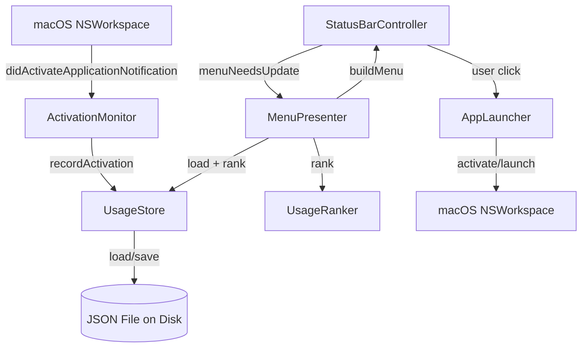

# Design Document — iTip macOS Menu Bar App

## Overview

iTip 是一个轻量级 macOS 菜单栏应用，自动追踪用户的应用切换行为，按最近使用时间和使用频率排序，在菜单栏下拉菜单中展示前 10 个最常用的应用，并支持一键激活或启动目标应用。

设计遵循以下核心原则：
- **关注点分离**：事件捕获、持久化存储、排名逻辑和 UI 展示各自独立，排名和存储逻辑不依赖 AppKit，便于单元测试
- **纯 AppKit 实现**：不使用 SwiftUI，通过 `NSStatusBar`、`NSMenu`、`NSMenuItem` 构建菜单栏 UI
- **Xcode 项目结构**：使用 `.xcodeproj` 管理构建，不使用 Swift Package Manager
- **Accessory 模式**：应用以 `NSApplication.ActivationPolicy.accessory` 运行，不显示 Dock 图标

## Architecture

系统采用分层架构，将职责划分为四个核心层：



**数据流：**
1. 用户在 macOS 中切换应用 → `ActivationMonitor` 通过 `NSWorkspace.didActivateApplicationNotification` 捕获事件
2. `ActivationMonitor` 从事件中提取 `bundleIdentifier` 和 `localizedName`，更新 `UsageStore`
3. 用户点击菜单栏图标 → `MenuPresenter` 从 `UsageStore` 加载记录，通过 `UsageRanker` 排序，构建 `NSMenu`
4. 用户点击菜单项 → `AppLauncher` 激活或启动目标应用

## Components and Interfaces

### 1. AppDelegate

应用入口，负责初始化和协调各组件。

```swift
final class AppDelegate: NSObject, NSApplicationDelegate {
    private(set) var statusBarController: StatusBarController?
    
    func applicationDidFinishLaunching(_ notification: Notification)
}
```

### 2. StatusBarController

管理菜单栏状态项（`NSStatusItem`）的生命周期和显示。

```swift
final class StatusBarController {
    static let defaultTitle: String
    let statusItem: NSStatusItem?
    
    init(statusBar: NSStatusBar = .system)
    init(applyTitle: @escaping (String) -> Void, removeStatusItem: @escaping () -> Void = {})
}
```

### 3. UsageRecord

单条应用使用记录的值类型。

```swift
struct UsageRecord: Codable, Equatable {
    let bundleIdentifier: String
    let displayName: String
    let lastActivatedAt: Date
    let activationCount: Int
}
```

### 4. UsageStoreProtocol & UsageStore

持久化存储层的协议和文件系统实现。协议抽象便于测试时注入 in-memory 实现。

```swift
protocol UsageStoreProtocol {
    func load() throws -> [UsageRecord]
    func save(_ records: [UsageRecord]) throws
}

final class UsageStore: UsageStoreProtocol {
    init(storageURL: URL)
    func load() throws -> [UsageRecord]   // JSON 反序列化，文件不存在返回空数组
    func save(_ records: [UsageRecord]) throws  // JSON 序列化，原子写入
}
```

**设计决策**：使用 `Data.WritingOptions.atomic` 原子写入，防止部分写入导致数据损坏。存储路径默认为 `~/Library/Application Support/iTip/usage.json`。

### 5. UsageRanker

纯函数排名引擎，不依赖 AppKit。

```swift
struct UsageRanker {
    func rank(_ records: [UsageRecord]) -> [UsageRecord]
}
```

排序规则：
1. 主排序：`lastActivatedAt` 降序（最近的在前）
2. 次排序：`activationCount` 降序（使用次数多的在前）
3. 输出限制：最多返回前 10 条

**设计决策**：排名逻辑为纯函数（输入 `[UsageRecord]`，输出 `[UsageRecord]`），不接受 `now` 参数（直接比较时间戳即可），便于测试和推理。

### 6. ActivationMonitor

监听 macOS 应用激活事件，更新使用记录。

```swift
final class ActivationMonitor {
    init(store: UsageStoreProtocol, 
         notificationCenter: NotificationCenter = NSWorkspace.shared.notificationCenter,
         dateProvider: @escaping () -> Date = Date.init,
         selfBundleIdentifier: String = Bundle.main.bundleIdentifier ?? "")
    
    func startMonitoring()
    func stopMonitoring()
    func recordActivation(bundleIdentifier: String, displayName: String)
}
```

**设计决策**：
- 通过 `selfBundleIdentifier` 参数过滤自身激活事件，避免 iTip 自己出现在列表中
- `dateProvider` 注入便于测试时控制时间
- `notificationCenter` 注入便于测试时替换为 mock

### 7. MenuPresenter

将排序后的应用列表渲染为 `NSMenu`。

```swift
final class MenuPresenter {
    init(store: UsageStoreProtocol, ranker: UsageRanker = UsageRanker())
    
    func buildMenu() -> NSMenu
}
```

菜单结构：
- 有记录时：最多 10 个应用条目（图标 + 名称），分隔线，"Quit iTip" 项
- 无记录时：禁用的 "No recent apps" 提示项，分隔线，"Quit iTip" 项
- 已卸载应用（`bundleIdentifier` 无法解析）自动跳过，并从存储中清理

### 8. AppLauncher

负责激活或启动目标应用。

```swift
struct AppLauncher {
    func activate(bundleIdentifier: String) -> Result<Void, AppLaunchError>
}

enum AppLaunchError: Error {
    case applicationNotFound(bundleIdentifier: String)
    case launchFailed(bundleIdentifier: String, underlyingError: Error)
}
```

**设计决策**：
- 优先检查 `NSRunningApplication`，如果目标应用已运行则直接 `activate()`
- 如果未运行，使用 `NSWorkspace.shared.openApplication(at:configuration:)` 启动
- 返回 `Result` 类型，让调用方决定如何展示错误

## Data Models

### UsageRecord

| 字段 | 类型 | 说明 |
|------|------|------|
| `bundleIdentifier` | `String` | macOS 应用唯一标识符，如 `com.apple.Safari` |
| `displayName` | `String` | 应用显示名称，如 `Safari` |
| `lastActivatedAt` | `Date` | 最后一次激活的时间戳 |
| `activationCount` | `Int` | 累计激活次数 |

### 存储格式

使用 JSON 文件存储，通过 Swift `Codable` 协议序列化/反序列化：

```json
[
  {
    "bundleIdentifier": "com.apple.Safari",
    "displayName": "Safari",
    "lastActivatedAt": 704067200.0,
    "activationCount": 42
  }
]
```

存储路径：`~/Library/Application Support/iTip/usage.json`

### 存储行为

- **写入**：使用 `JSONEncoder` 编码后通过 `Data.write(to:options:.atomic)` 原子写入
- **读取**：使用 `JSONDecoder` 解码，文件不存在时返回空数组，数据损坏时返回空数组并记录错误日志
- **清理**：`MenuPresenter` 构建菜单时检测到无法解析的 `bundleIdentifier`，触发从存储中移除对应记录


## Correctness Properties

*A property is a characteristic or behavior that should hold true across all valid executions of a system — essentially, a formal statement about what the system should do. Properties serve as the bridge between human-readable specifications and machine-verifiable correctness guarantees.*

### Property 1: UsageRecord 序列化 round-trip

*For any* valid `[UsageRecord]` list, using `JSONEncoder` 序列化后再用 `JSONDecoder` 反序列化，SHALL produce an equivalent list（所有字段值相同）。

**Validates: Requirements 3.1, 3.3, 9.1, 9.2, 9.3**

### Property 2: recordActivation 更新已有记录

*For any* existing `UsageRecord` in the store (with any `activationCount` >= 1 and any `lastActivatedAt`), when `ActivationMonitor.recordActivation` is called with the same `bundleIdentifier`, the resulting record SHALL have `activationCount` incremented by exactly 1 and `lastActivatedAt` updated to the current timestamp.

**Validates: Requirements 2.3**

### Property 3: recordActivation 创建新记录

*For any* `bundleIdentifier` that does not exist in the current store, when `ActivationMonitor.recordActivation` is called with that identifier, the store SHALL contain a new `UsageRecord` with `activationCount == 1` and `lastActivatedAt` equal to the current timestamp, and all previously existing records SHALL remain unchanged.

**Validates: Requirements 2.4**

### Property 4: Ranking 排序正确性

*For any* `[UsageRecord]` list, `UsageRanker.rank()` 的输出 SHALL be sorted in descending order by `lastActivatedAt`, with `activationCount` descending as the secondary sort key for records with equal timestamps.

**Validates: Requirements 4.1, 4.2**

### Property 5: Ranking 幂等性

*For any* `[UsageRecord]` list, calling `UsageRanker.rank()` twice on the same input SHALL produce identical output（排序结果确定且可重复）。

**Validates: Requirements 4.3**

### Property 6: Ranking 输出数量限制

*For any* `[UsageRecord]` list of size N, `UsageRanker.rank()` 的输出长度 SHALL equal `min(N, 10)`.

**Validates: Requirements 4.4**

## Error Handling

### 存储层错误处理

| 场景 | 处理策略 |
|------|----------|
| 存储文件不存在 | `UsageStore.load()` 返回空数组，不抛出错误 |
| 存储文件数据损坏（JSON 解析失败） | `UsageStore.load()` 返回空数组，通过 `os_log` 记录错误 |
| 写入失败（磁盘满、权限不足） | `UsageStore.save()` 抛出错误，调用方捕获后静默处理，不中断应用运行 |
| 存储目录不存在 | `UsageStore.save()` 首次写入时自动创建 `~/Library/Application Support/iTip/` 目录 |

### 应用激活错误处理

| 场景 | 处理策略 |
|------|----------|
| 目标应用未安装（`bundleIdentifier` 无法解析） | `AppLauncher` 返回 `.applicationNotFound` 错误，`MenuPresenter` 展示提示信息 |
| 目标应用启动失败 | `AppLauncher` 返回 `.launchFailed` 错误，包含底层错误信息 |
| macOS 拒绝激活权限 | 展示用户可读的权限说明消息 |

### 事件监听错误处理

| 场景 | 处理策略 |
|------|----------|
| `NSWorkspace` 通知中缺少 `bundleIdentifier` | `ActivationMonitor` 忽略该事件，不记录 |
| `NSWorkspace` 通知中缺少 `localizedName` | 使用 `bundleIdentifier` 作为 fallback 显示名称 |
| iTip 自身被激活 | `ActivationMonitor` 通过 `selfBundleIdentifier` 过滤，不记录 |

## Testing Strategy

### 测试框架

- **单元测试**：XCTest（Xcode 内置）
- **Property-Based Testing**：[SwiftCheck](https://github.com/typelift/SwiftCheck)，通过 Swift Package Manager 作为测试依赖引入
- **最低迭代次数**：每个 property test 至少 100 次迭代

### 测试分层

#### Property-Based Tests（验证通用正确性）

每个 property test 对应设计文档中的一个 Correctness Property，使用 SwiftCheck 生成随机输入：

| Property | 测试目标 | Generator 策略 |
|----------|----------|----------------|
| Property 1 | UsageRecord round-trip | 生成随机 `[UsageRecord]`（随机字符串、日期、正整数） |
| Property 2 | recordActivation 更新 | 生成随机已有记录 + 匹配的 bundleIdentifier |
| Property 3 | recordActivation 创建 | 生成随机 store 状态 + 不在 store 中的 bundleIdentifier |
| Property 4 | Ranking 排序 | 生成随机 `[UsageRecord]` 列表（含重复时间戳） |
| Property 5 | Ranking 幂等性 | 生成随机 `[UsageRecord]` 列表 |
| Property 6 | Ranking 输出限制 | 生成 0-20 条随机 `[UsageRecord]` |

Tag 格式：`Feature: macos-menu-bar-app, Property {number}: {property_text}`

#### Unit Tests（验证具体行为和边界条件）

| 测试场景 | 验证内容 |
|----------|----------|
| StatusBarController 初始化 | 创建 NSStatusItem，设置默认标题 |
| StatusBarController deinit | 从状态栏移除 status item |
| UsageStore 文件不存在 | load() 返回空数组 |
| UsageStore 数据损坏 | load() 返回空数组 |
| MenuPresenter 空状态 | 菜单包含 "No recent apps" 禁用项 |
| MenuPresenter 有记录 | 菜单项数量和顺序正确 |
| MenuPresenter 已卸载应用 | 跳过无法解析的 bundleIdentifier |
| AppLauncher 应用未找到 | 返回 .applicationNotFound 错误 |
| ActivationMonitor 过滤自身 | 不记录 iTip 自身的激活事件 |

#### Integration Tests（验证端到端流程）

| 测试场景 | 验证内容 |
|----------|----------|
| 记录 → 存储 → 排名 → 菜单 | 完整数据流从事件捕获到菜单展示 |
| 应用激活 → 存储更新 → 菜单刷新 | 激活事件正确反映在下次菜单构建中 |

### 测试依赖注入策略

- `UsageStoreProtocol`：测试时使用 `InMemoryUsageStore` 替代文件系统实现
- `dateProvider: () -> Date`：测试时注入固定时间
- `notificationCenter`：测试时注入独立的 `NotificationCenter` 实例
- `selfBundleIdentifier`：测试时注入已知值
- `StatusBarController` 的双初始化器：测试时使用闭包注入版本，避免依赖真实 `NSStatusBar`
