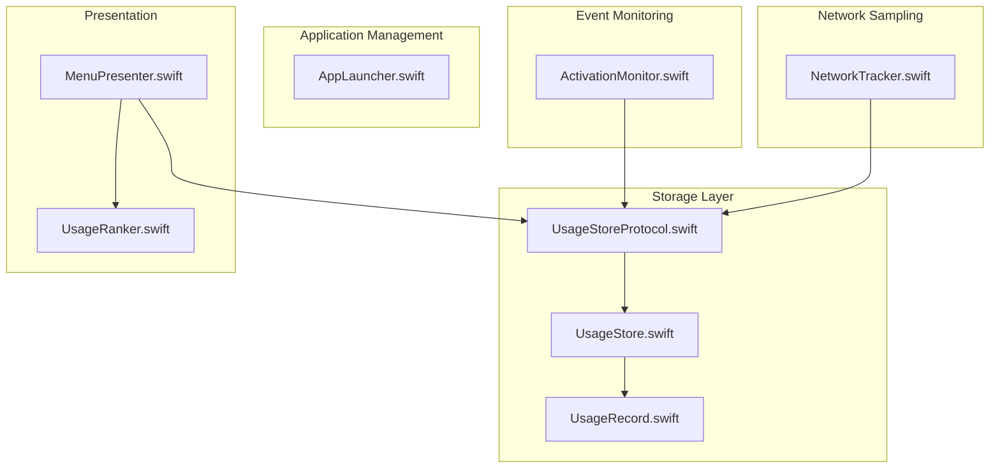
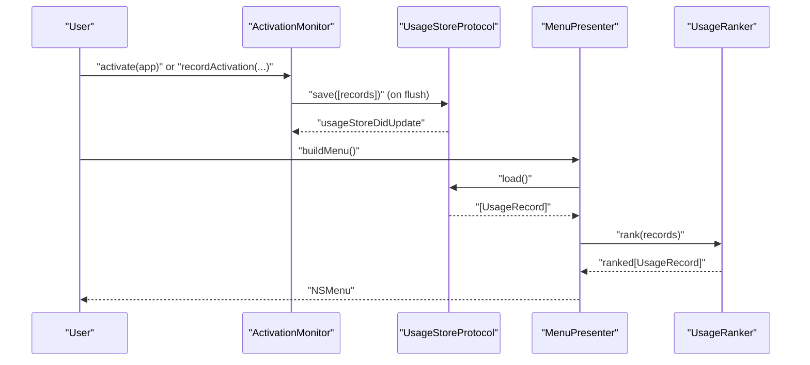
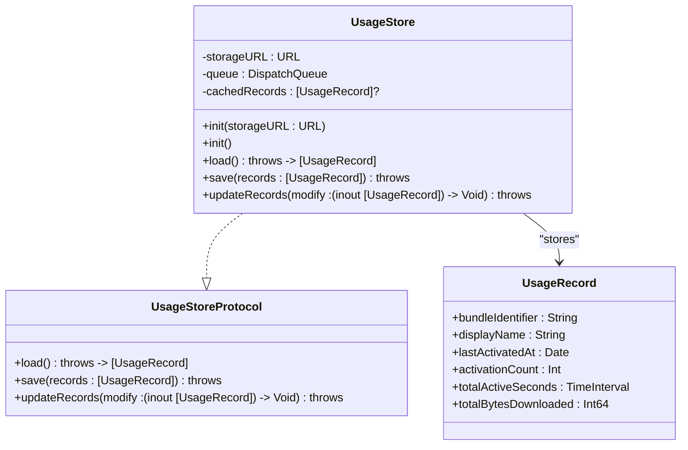
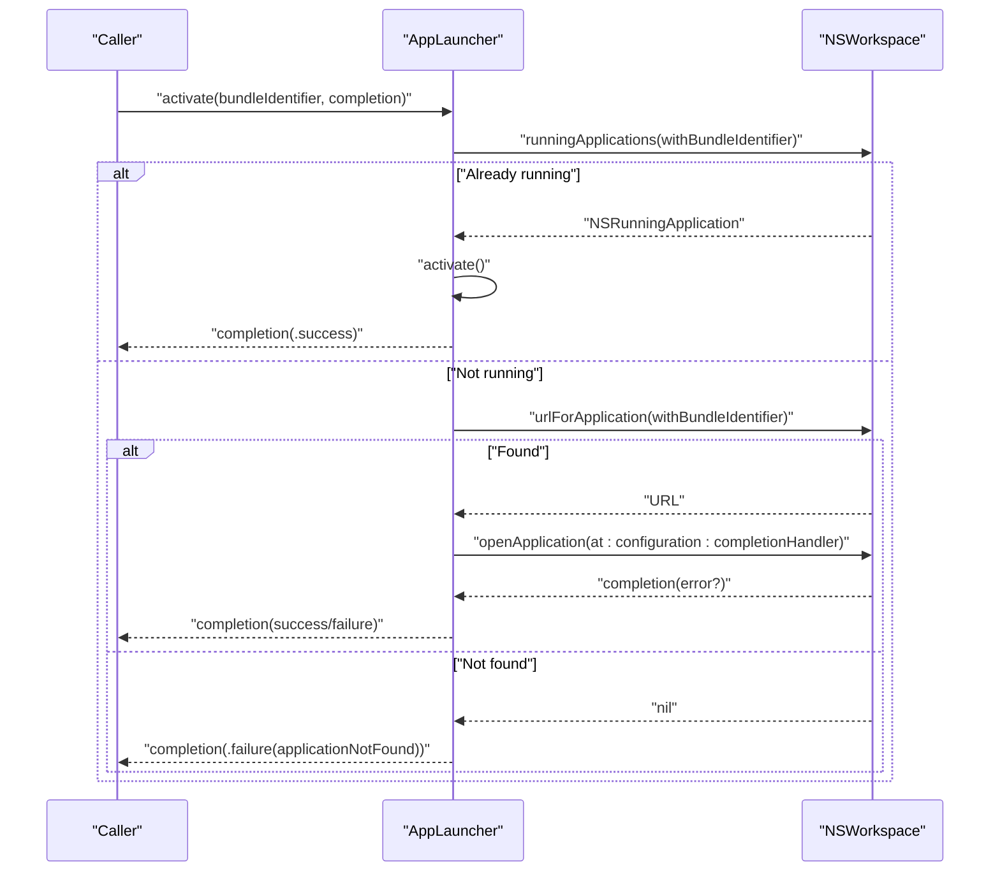
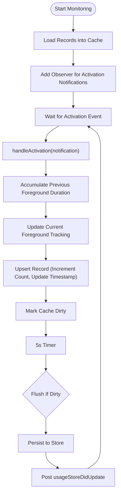
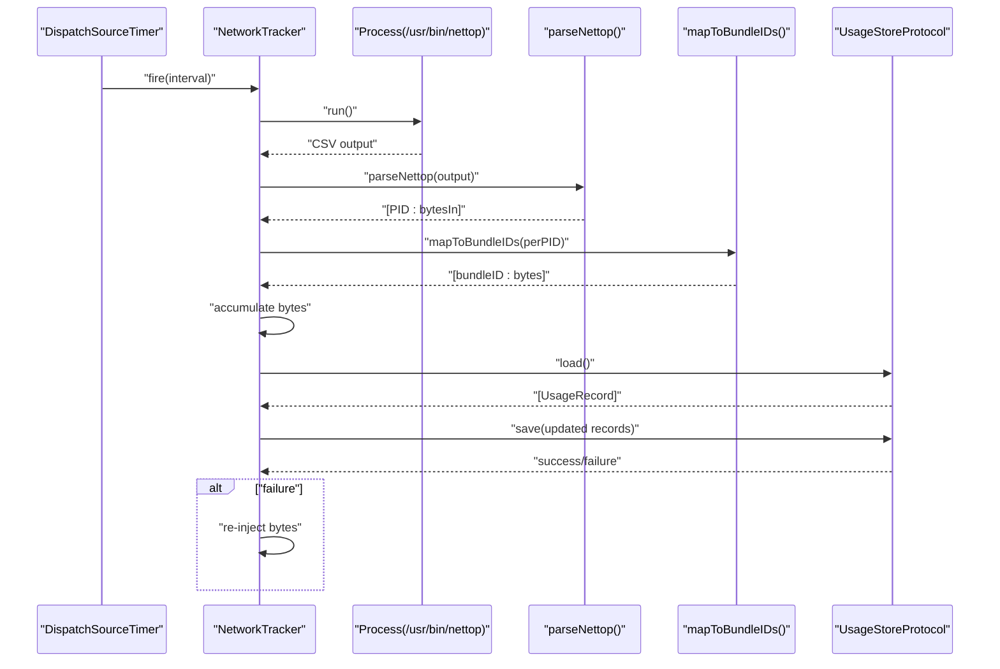
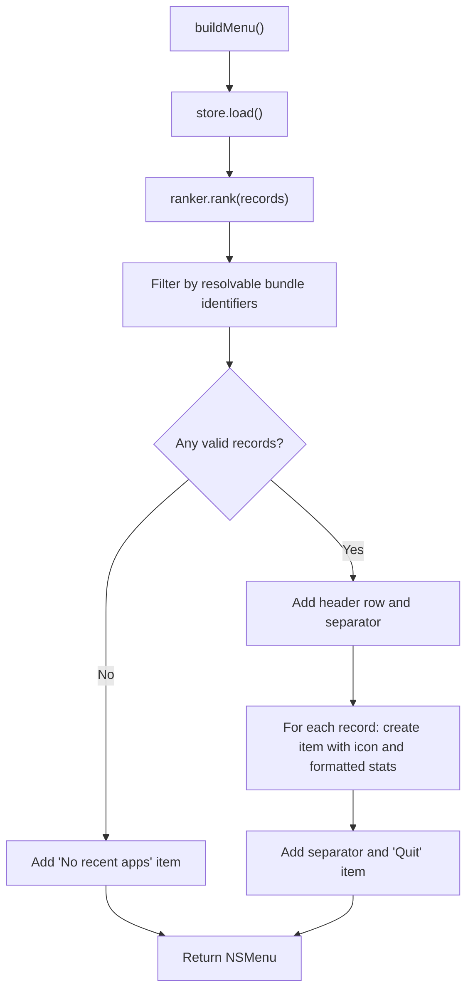
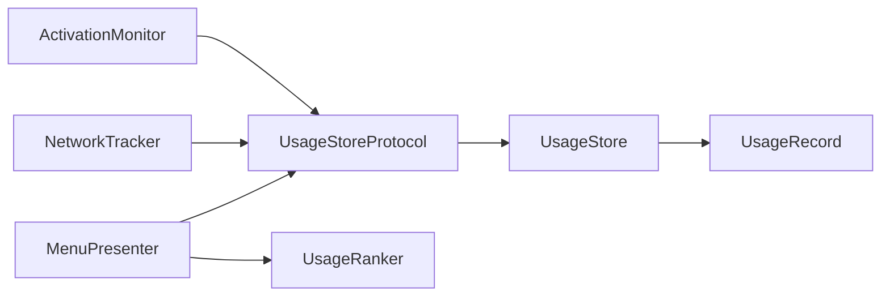

# API Reference

<cite>
**Referenced Files in This Document**
- [UsageStoreProtocol.swift](file://iTip/UsageStoreProtocol.swift)
- [UsageStore.swift](file://iTip/UsageStore.swift)
- [UsageRecord.swift](file://iTip/UsageRecord.swift)
- [AppLauncher.swift](file://iTip/AppLauncher.swift)
- [ActivationMonitor.swift](file://iTip/ActivationMonitor.swift)
- [NetworkTracker.swift](file://iTip/NetworkTracker.swift)
- [MenuPresenter.swift](file://iTip/MenuPresenter.swift)
- [UsageRanker.swift](file://iTip/UsageRanker.swift)
- [InMemoryUsageStore.swift](file://iTipTests/InMemoryUsageStore.swift)
- [IntegrationTests.swift](file://iTipTests/IntegrationTests.swift)
- [ActivationMonitorTests.swift](file://iTipTests/ActivationMonitorTests.swift)
- [AppLauncherTests.swift](file://iTipTests/AppLauncherTests.swift)
- [main.swift](file://iTip/main.swift)
</cite>

## Table of Contents
1. [Introduction](#introduction)
2. [Project Structure](#project-structure)
3. [Core Components](#core-components)
4. [Architecture Overview](#architecture-overview)
5. [Detailed Component Analysis](#detailed-component-analysis)
6. [Dependency Analysis](#dependency-analysis)
7. [Performance Considerations](#performance-considerations)
8. [Troubleshooting Guide](#troubleshooting-guide)
9. [Conclusion](#conclusion)
10. [Appendices](#appendices)

## Introduction
This document provides a comprehensive API reference for iTip’s public interfaces and protocols. It focuses on:
- UsageStoreProtocol: the contract for storage implementations, including method signatures, parameters, return values, error handling, and notifications.
- AppLauncher: the public interface for launching and activating applications, including error types and configuration options.
- ActivationMonitor: event handling APIs, callback mechanisms, subscription patterns, and internal caching and debouncing behavior.
- NetworkTracker: sampling configuration, data retrieval methods, and performance characteristics.
- Integration patterns with MenuPresenter and UsageRanker for building the application menu and ranking usage records.

The guide also covers thread-safety guarantees, resource management, and practical usage examples derived from tests and component implementations.

## Project Structure
The relevant modules are organized around a small set of cohesive components:
- Storage protocol and implementation
- Application launch and activation monitoring
- Network sampling and aggregation
- Presentation and ranking utilities

**Diagram sources**
- [UsageStoreProtocol.swift:1-14](file://iTip/UsageStoreProtocol.swift#L1-L14)
- [UsageStore.swift:1-107](file://iTip/UsageStore.swift#L1-L107)
- [UsageRecord.swift:1-33](file://iTip/UsageRecord.swift#L1-L33)
- [AppLauncher.swift:1-40](file://iTip/AppLauncher.swift#L1-L40)
- [ActivationMonitor.swift:1-141](file://iTip/ActivationMonitor.swift#L1-L141)
- [NetworkTracker.swift:1-143](file://iTip/NetworkTracker.swift#L1-L143)
- [MenuPresenter.swift:1-233](file://iTip/MenuPresenter.swift#L1-L233)
- [UsageRanker.swift:1-16](file://iTip/UsageRanker.swift#L1-L16)

**Section sources**
- [main.swift:1-8](file://iTip/main.swift#L1-L8)

## Core Components
This section documents the primary public APIs and protocols.

### UsageStoreProtocol
Defines the contract for loading, saving, and transactionally updating usage records. It also exposes a notification posted after successful persistence.

- Method: load()
  - Purpose: Retrieve all usage records.
  - Returns: Array of UsageRecord.
  - Throws: Errors encountered during decoding or I/O.
  - Thread Safety: Not guaranteed by the protocol; implementations may serialize access.
- Method: save(records: [UsageRecord])
  - Purpose: Persist the provided records.
  - Returns: Void.
  - Throws: Errors encountered during encoding or writing.
  - Side Effects: Posts a notification upon success.
- Method: updateRecords(modify: (inout [UsageRecord]) -> Void)
  - Purpose: Atomically load, modify, and save records within a single synchronous block.
  - Returns: Void.
  - Throws: Errors encountered during decoding, modification, encoding, or writing.
  - Notes: Ensures atomicity by performing all operations under a synchronization barrier.

- Notification: usageStoreDidUpdate
  - Posted by implementations after successful save/update.
  - Use Case: Observe to refresh UI or trigger downstream processing.

**Section sources**
- [UsageStoreProtocol.swift:1-14](file://iTip/UsageStoreProtocol.swift#L1-L14)

### UsageStore (Implementation)
A concrete implementation of UsageStoreProtocol backed by JSON on disk with an in-memory cache and serialized access.

- Initialization
  - Convenience initializer: Uses a default path under Application Support.
  - Direct initializer: Accepts a storage URL.
- Methods
  - load(): Synchronously reads and decodes records; caches on success.
  - save(records): Encodes and writes atomically; updates cache; posts usageStoreDidUpdate.
  - updateRecords(modify): Loads current state (cache or disk), applies mutation, encodes and writes atomically; updates cache; posts usageStoreDidUpdate.
- Thread Safety: Uses a serial dispatch queue to serialize all operations; safe for concurrent callers.
- Error Handling: Propagates decoding and I/O errors; logs decoding failures for diagnostics.
- Caching: Maintains an in-memory cache to reduce disk I/O.

**Section sources**
- [UsageStore.swift:1-107](file://iTip/UsageStore.swift#L1-L107)

### UsageRecord
A Codable model representing a single application’s usage statistics.

- Properties
  - bundleIdentifier: String
  - displayName: String
  - lastActivatedAt: Date
  - activationCount: Int
  - totalActiveSeconds: TimeInterval
  - totalBytesDownloaded: Int64
- Behavior
  - Backward-compatible decoding: New fields default to zero if absent.
  - Initialization supports both explicit construction and decoding.

**Section sources**
- [UsageRecord.swift:1-33](file://iTip/UsageRecord.swift#L1-L33)

### AppLauncher
Provides application activation and launch capabilities with robust error reporting.

- Public Type: AppLaunchError
  - Cases
    - applicationNotFound(bundleIdentifier: String)
    - launchFailed(bundleIdentifier: String, underlyingError: Error)
- Public API
  - Function: activate(bundleIdentifier: String, completion: (Result<Void, AppLaunchError>) -> Void)
    - Behavior: If the app is already running, activates it; otherwise resolves the app URL and launches it with activation enabled.
    - Completion: Always delivered on the main thread.
    - Parameters:
      - bundleIdentifier: The target app’s bundle identifier.
      - completion: Callback receiving either success or a specific AppLaunchError.
    - Returns: Void (completion indicates result).
- Thread Safety: The function itself is thread-safe; completion is dispatched to the main queue.
- Error Handling: Distinguishes between “not found” and “launch failed” scenarios.

**Section sources**
- [AppLauncher.swift:1-40](file://iTip/AppLauncher.swift#L1-L40)

### ActivationMonitor
Monitors application activation events, maintains an in-memory cache, and persists changes with periodic flushing.

- Initialization
  - Requires a UsageStoreProtocol instance.
  - Optional dependencies: NotificationCenter, date provider, and self bundle identifier.
- Public API
  - startMonitoring(): Starts observation of activation notifications, loads cached records, and schedules periodic flushes.
  - stopMonitoring(): Removes observers, invalidates timers, and flushes pending changes.
  - recordActivation(bundleIdentifier: String, displayName: String): Updates the in-memory cache and marks it dirty; does not persist immediately.
- Internal Behavior
  - In-memory cache avoids frequent disk reads/writes.
  - Debounced flush every 5 seconds if dirty.
  - Ignores activations from self (based on self bundle identifier).
  - Computes foreground duration for the previously active app and accumulates totalActiveSeconds.
- Thread Safety: Observers are attached to the main queue; internal state is mutated on main-thread callbacks. Serial persistence via store ensures safe writes.
- Notifications: Emits usageStoreDidUpdate when persisted.

**Section sources**
- [ActivationMonitor.swift:1-141](file://iTip/ActivationMonitor.swift#L1-L141)

### NetworkTracker
Periodically samples per-process network usage via nettop and aggregates download bytes per bundle identifier into the UsageStore.

- Initialization
  - Requires a UsageStoreProtocol instance.
- Public API
  - start(interval: TimeInterval = 10.0): Starts a periodic timer to sample nettop output at the specified interval.
  - stop(): Cancels the timer and flushes remaining aggregated bytes.
- Internal Behavior
  - Runs nettop with arguments to capture live per-process traffic.
  - Parses CSV output to map PIDs to bytes_in.
  - Maps PIDs to bundle identifiers using NSRunningApplication.
  - Aggregates bytes per bundle identifier in memory and flushes to store.
  - On save failure, re-injects bytes into the accumulator to prevent data loss.
- Performance Characteristics
  - Uses a utility dispatch queue for sampling.
  - Flushes periodically to balance accuracy and I/O overhead.
- Thread Safety: Sampling and flushing occur on a dedicated queue; store operations are serialized by the store.

**Section sources**
- [NetworkTracker.swift:1-143](file://iTip/NetworkTracker.swift#L1-L143)

### MenuPresenter and UsageRanker
Utilities for presenting ranked usage records in a native menu.

- UsageRanker.rank(_:) ranks records by lastActivatedAt (descending), then by activationCount (descending), and limits to top 10.
- MenuPresenter.buildMenu():
  - Loads records from the store.
  - Ranks them.
  - Filters out records whose bundle identifiers cannot be resolved to app URLs.
  - Builds a styled menu with icons, counts, durations, traffic, and relative timestamps.
  - Provides a Quit item and optional monitoring availability warning.
  - Caches icons and URL resolutions to minimize repeated work.

**Section sources**
- [UsageRanker.swift:1-16](file://iTip/UsageRanker.swift#L1-L16)
- [MenuPresenter.swift:1-233](file://iTip/MenuPresenter.swift#L1-L233)

## Architecture Overview
The system integrates monitoring, storage, presentation, and ranking into a cohesive pipeline.

**Diagram sources**
- [ActivationMonitor.swift:36-64](file://iTip/ActivationMonitor.swift#L36-L64)
- [UsageStoreProtocol.swift:10-13](file://iTip/UsageStoreProtocol.swift#L10-L13)
- [MenuPresenter.swift:36-112](file://iTip/MenuPresenter.swift#L36-L112)
- [UsageRanker.swift:3-15](file://iTip/UsageRanker.swift#L3-L15)

## Detailed Component Analysis

### UsageStoreProtocol and UsageStore
- Protocol Contract
  - Defines three methods: load(), save(_:), and updateRecords(_:).
  - Exposes a notification for post-save updates.
- Implementation Details
  - Uses a serial queue to serialize all operations.
  - Maintains an in-memory cache to reduce disk I/O.
  - Encodes/decodes records as JSON; logs decoding errors for diagnostics.
  - updateRecords performs a full load-modify-save cycle atomically.

**Diagram sources**
- [UsageStoreProtocol.swift:3-8](file://iTip/UsageStoreProtocol.swift#L3-L8)
- [UsageStore.swift:4-106](file://iTip/UsageStore.swift#L4-L106)
- [UsageRecord.swift:3-32](file://iTip/UsageRecord.swift#L3-L32)

**Section sources**
- [UsageStoreProtocol.swift:1-14](file://iTip/UsageStoreProtocol.swift#L1-L14)
- [UsageStore.swift:1-107](file://iTip/UsageStore.swift#L1-L107)
- [UsageRecord.swift:1-33](file://iTip/UsageRecord.swift#L1-L33)

### AppLauncher
- Error Types
  - applicationNotFound(bundleIdentifier: String)
  - launchFailed(bundleIdentifier: String, underlyingError: Error)
- Launch Flow
  - If already running: activate directly.
  - Else: resolve app URL and launch with activation enabled.
  - Deliver completion on main thread.

**Diagram sources**
- [AppLauncher.swift:11-38](file://iTip/AppLauncher.swift#L11-L38)

**Section sources**
- [AppLauncher.swift:1-40](file://iTip/AppLauncher.swift#L1-L40)

### ActivationMonitor
- Event Handling
  - Subscribes to activation notifications on the main queue.
  - Handles activation events to update foreground tracking and accumulate active seconds.
- Persistence Strategy
  - Maintains an in-memory cache and flushes every 5 seconds if dirty.
  - Ignores self activations and handles missing localizedName gracefully.
- Thread Safety
  - Observers and timers operate on the main queue; store writes are serialized by the store.

**Diagram sources**
- [ActivationMonitor.swift:36-64](file://iTip/ActivationMonitor.swift#L36-L64)
- [ActivationMonitor.swift:122-126](file://iTip/ActivationMonitor.swift#L122-L126)
- [ActivationMonitor.swift:128-139](file://iTip/ActivationMonitor.swift#L128-L139)

**Section sources**
- [ActivationMonitor.swift:1-141](file://iTip/ActivationMonitor.swift#L1-L141)

### NetworkTracker
- Sampling and Aggregation
  - Periodically runs nettop, parses CSV, maps PIDs to bundle identifiers, and aggregates bytes per bundle.
  - Flushes aggregated bytes to the store and handles rollback on failure.
- Performance
  - Dedicated utility queue for sampling; flushes periodically to balance accuracy and I/O cost.

**Diagram sources**
- [NetworkTracker.swift:20-28](file://iTip/NetworkTracker.swift#L20-L28)
- [NetworkTracker.swift:38-48](file://iTip/NetworkTracker.swift#L38-L48)
- [NetworkTracker.swift:80-97](file://iTip/NetworkTracker.swift#L80-L97)
- [NetworkTracker.swift:99-141](file://iTip/NetworkTracker.swift#L99-L141)

**Section sources**
- [NetworkTracker.swift:1-143](file://iTip/NetworkTracker.swift#L1-L143)

### MenuPresenter and UsageRanker
- Ranking
  - Sorts by lastActivatedAt descending; ties broken by activationCount descending; caps at 10.
- Menu Construction
  - Loads records, filters by resolvability, builds a styled menu with icons and formatted stats, and adds a Quit item.
  - Caches icons and URL lookups to improve performance.

**Diagram sources**
- [MenuPresenter.swift:36-112](file://iTip/MenuPresenter.swift#L36-L112)
- [UsageRanker.swift:4-14](file://iTip/UsageRanker.swift#L4-L14)

**Section sources**
- [MenuPresenter.swift:1-233](file://iTip/MenuPresenter.swift#L1-L233)
- [UsageRanker.swift:1-16](file://iTip/UsageRanker.swift#L1-L16)

## Dependency Analysis
- Protocol-Driven Design
  - UsageStoreProtocol decouples monitoring and sampling from persistence, enabling test doubles and alternative stores.
- Component Coupling
  - ActivationMonitor depends on UsageStoreProtocol and NSWorkspace notifications.
  - NetworkTracker depends on UsageStoreProtocol and external process execution.
  - MenuPresenter depends on UsageStoreProtocol and NSWorkspace for app metadata.
- Cohesion
  - Each component encapsulates a single responsibility: monitoring, sampling, storage, presentation, or ranking.

**Diagram sources**
- [ActivationMonitor.swift:26-34](file://iTip/ActivationMonitor.swift#L26-L34)
- [NetworkTracker.swift:8-17](file://iTip/NetworkTracker.swift#L8-L17)
- [MenuPresenter.swift:3-34](file://iTip/MenuPresenter.swift#L3-L34)
- [UsageStore.swift:4-13](file://iTip/UsageStore.swift#L4-L13)
- [UsageRecord.swift:3-11](file://iTip/UsageRecord.swift#L3-L11)

**Section sources**
- [ActivationMonitor.swift:1-141](file://iTip/ActivationMonitor.swift#L1-L141)
- [NetworkTracker.swift:1-143](file://iTip/NetworkTracker.swift#L1-L143)
- [MenuPresenter.swift:1-233](file://iTip/MenuPresenter.swift#L1-L233)
- [UsageStore.swift:1-107](file://iTip/UsageStore.swift#L1-L107)

## Performance Considerations
- Disk I/O Reduction
  - UsageStore caches records in memory; ActivationMonitor and MenuPresenter rely on store.load() to fetch fresh data on demand.
- Throttled Writes
  - ActivationMonitor flushes every 5 seconds when dirty, balancing responsiveness with I/O cost.
- Queue Isolation
  - NetworkTracker uses a utility queue for sampling; store operations remain serialized.
- UI Responsiveness
  - AppLauncher delivers completions on the main thread; MenuPresenter performs filtering and formatting efficiently with caches.

[No sources needed since this section provides general guidance]

## Troubleshooting Guide
- AppLauncher.launchFailed
  - Symptom: Launch attempts fail with an underlying error.
  - Resolution: Inspect the underlying error payload and verify app availability and permissions.
- AppLauncher.applicationNotFound
  - Symptom: Unknown bundle identifier reported.
  - Resolution: Confirm the bundle identifier and ensure the app is installed.
- NetworkTracker.flush failures
  - Symptom: Bytes not persisted; observed via re-injection on failure.
  - Resolution: Check store accessibility and retry; consider increasing sampling intervals.
- MenuPresenter filtering
  - Symptom: Some apps do not appear in the menu.
  - Resolution: Verify bundle identifiers resolve to valid app URLs; outdated records are automatically pruned asynchronously.

**Section sources**
- [AppLauncher.swift:3-6](file://iTip/AppLauncher.swift#L3-L6)
- [NetworkTracker.swift:72-77](file://iTip/NetworkTracker.swift#L72-L77)
- [MenuPresenter.swift:74-79](file://iTip/MenuPresenter.swift#L74-L79)

## Conclusion
iTip’s architecture centers on a clean protocol-driven storage layer, robust application launch and monitoring utilities, efficient network sampling, and a performant presentation pipeline. The APIs emphasize thread safety, resource management, and extensibility, enabling straightforward customization and testing.

[No sources needed since this section summarizes without analyzing specific files]

## Appendices

### Practical Usage Examples and Integration Patterns
- Launch an Application
  - Use AppLauncher.activate with a bundle identifier; handle AppLaunchError appropriately.
  - Example pattern: See [AppLauncherTests.swift:12-31](file://iTipTests/AppLauncherTests.swift#L12-L31).
- Monitor Activations and Persist Changes
  - Initialize ActivationMonitor with a store; call startMonitoring; rely on automatic flushes.
  - Example pattern: See [ActivationMonitorTests.swift:19-28](file://iTipTests/ActivationMonitorTests.swift#L19-L28).
- Aggregate Network Usage
  - Initialize NetworkTracker with a store; call start(interval:); call stop on teardown.
  - Example pattern: See [NetworkTracker.swift:20-34](file://iTip/NetworkTracker.swift#L20-L34).
- Build the Application Menu
  - Initialize MenuPresenter with a store and optional ranker; call buildMenu; wire up target/action.
  - Example pattern: See [IntegrationTests.swift:36-50](file://iTipTests/IntegrationTests.swift#L36-L50).
- Extend Storage
  - Implement UsageStoreProtocol to support alternative backends; see [InMemoryUsageStore.swift:4-22](file://iTipTests/InMemoryUsageStore.swift#L4-L22).

**Section sources**
- [AppLauncherTests.swift:1-33](file://iTipTests/AppLauncherTests.swift#L1-L33)
- [ActivationMonitorTests.swift:1-102](file://iTipTests/ActivationMonitorTests.swift#L1-L102)
- [IntegrationTests.swift:1-129](file://iTipTests/IntegrationTests.swift#L1-L129)
- [InMemoryUsageStore.swift:1-23](file://iTipTests/InMemoryUsageStore.swift#L1-L23)
- [NetworkTracker.swift:1-143](file://iTip/NetworkTracker.swift#L1-L143)
- [MenuPresenter.swift:1-233](file://iTip/MenuPresenter.swift#L1-L233)