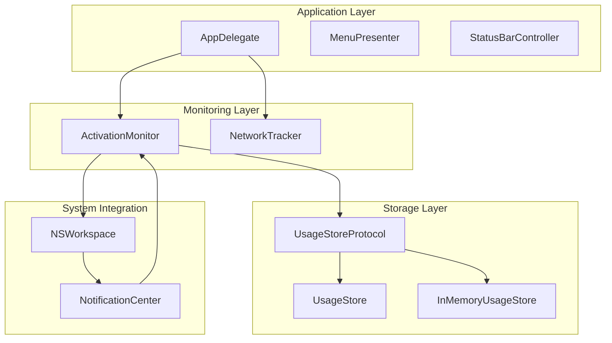
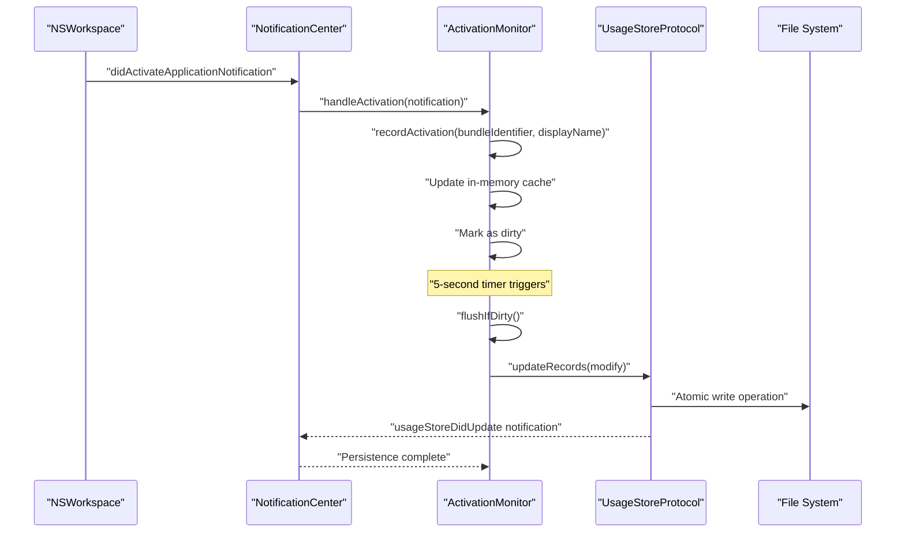
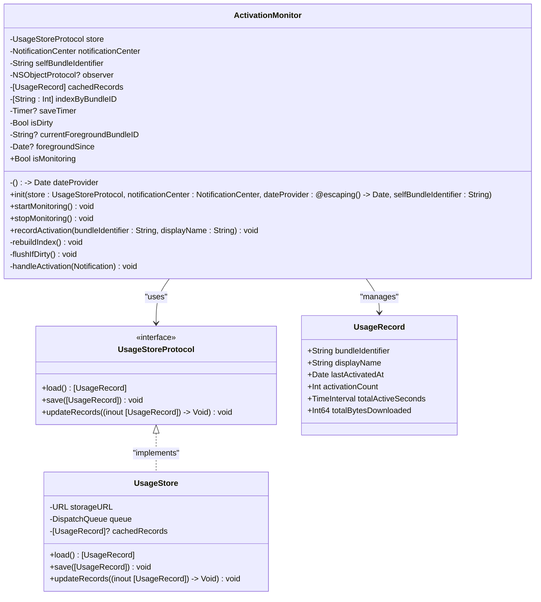
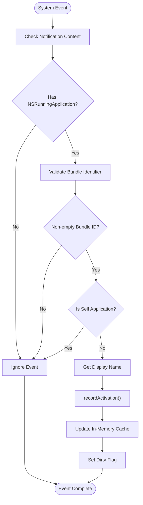
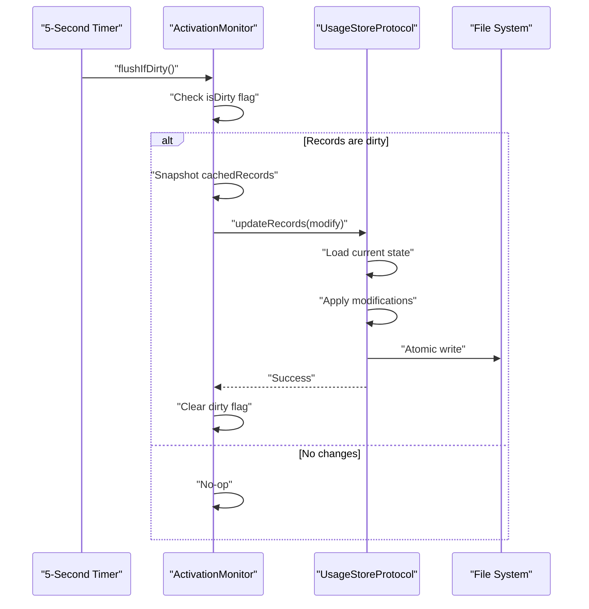
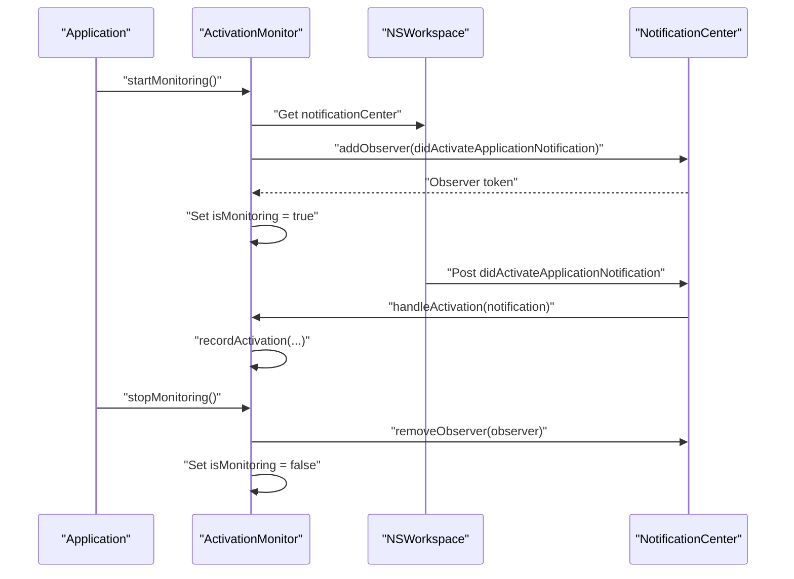
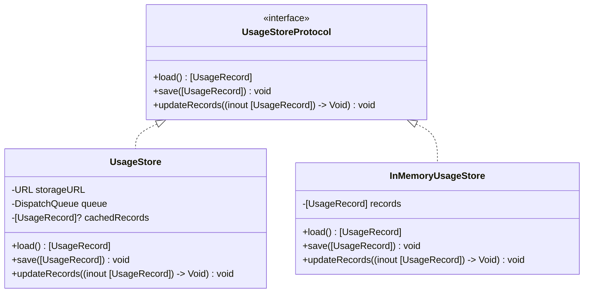
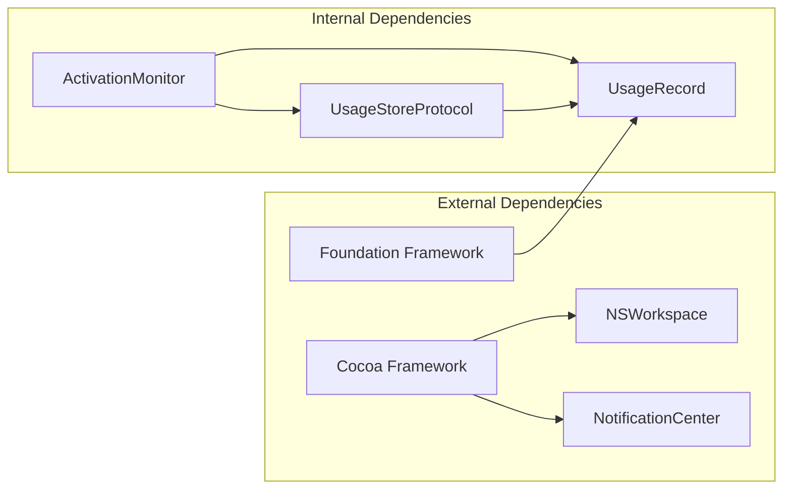

# ActivationMonitor API

<cite>
**Referenced Files in This Document**
- [ActivationMonitor.swift](file://iTip/ActivationMonitor.swift)
- [AppDelegate.swift](file://iTip/AppDelegate.swift)
- [UsageRecord.swift](file://iTip/UsageRecord.swift)
- [UsageStoreProtocol.swift](file://iTip/UsageStoreProtocol.swift)
- [UsageStore.swift](file://iTip/UsageStore.swift)
- [main.swift](file://iTip/main.swift)
- [ActivationMonitorTests.swift](file://iTipTests/ActivationMonitorTests.swift)
- [ActivationMonitorPropertyTests.swift](file://iTipTests/ActivationMonitorPropertyTests.swift)
- [IntegrationTests.swift](file://iTipTests/IntegrationTests.swift)
- [InMemoryUsageStore.swift](file://iTipTests/InMemoryUsageStore.swift)
</cite>

## Table of Contents
1. [Introduction](#introduction)
2. [Project Structure](#project-structure)
3. [Core Components](#core-components)
4. [Architecture Overview](#architecture-overview)
5. [Detailed Component Analysis](#detailed-component-analysis)
6. [Dependency Analysis](#dependency-analysis)
7. [Performance Considerations](#performance-considerations)
8. [Troubleshooting Guide](#troubleshooting-guide)
9. [Conclusion](#conclusion)

## Introduction
This document provides comprehensive API documentation for the ActivationMonitor component responsible for tracking macOS application activation events. It covers the event handling interface, callback registration patterns, event subscription mechanisms, and the complete event lifecycle from activation detection to cleanup. The documentation includes method signatures, integration examples with NSWorkspace, thread safety considerations, asynchronous event handling patterns, and best practices for long-running monitoring sessions.

## Project Structure
The ActivationMonitor is part of a macOS menu bar application that tracks application usage patterns. The component integrates with the system's NSWorkspace to receive application activation notifications and persists usage data through a pluggable storage layer.

**Diagram sources**
- [AppDelegate.swift:9-34](file://iTip/AppDelegate.swift#L9-L34)
- [ActivationMonitor.swift:3-36](file://iTip/ActivationMonitor.swift#L3-L36)
- [UsageStoreProtocol.swift:3-8](file://iTip/UsageStoreProtocol.swift#L3-L8)
- [UsageStore.swift:4-22](file://iTip/UsageStore.swift#L4-L22)

**Section sources**
- [main.swift:1-8](file://iTip/main.swift#L1-L8)
- [AppDelegate.swift:3-34](file://iTip/AppDelegate.swift#L3-L34)

## Core Components
The ActivationMonitor component consists of several key elements that work together to provide robust application activation monitoring:

### Primary Classes and Interfaces
- **ActivationMonitor**: Main monitoring class that handles application activation events
- **UsageStoreProtocol**: Storage abstraction interface for persisting usage data
- **UsageStore**: Concrete implementation for file-based storage
- **UsageRecord**: Data model representing application usage statistics

### Key Dependencies
- **NSWorkspace**: Provides system-wide application activation notifications
- **NotificationCenter**: Centralized event distribution mechanism
- **DateProvider**: Injectable time source for deterministic testing
- **UsageStoreProtocol**: Pluggable storage backend

**Section sources**
- [ActivationMonitor.swift:3-36](file://iTip/ActivationMonitor.swift#L3-L36)
- [UsageStoreProtocol.swift:3-8](file://iTip/UsageStoreProtocol.swift#L3-L8)
- [UsageRecord.swift:3-32](file://iTip/UsageRecord.swift#L3-L32)

## Architecture Overview
The ActivationMonitor implements a layered architecture with clear separation of concerns:

**Diagram sources**
- [ActivationMonitor.swift:38-67](file://iTip/ActivationMonitor.swift#L38-L67)
- [ActivationMonitor.swift:116-142](file://iTip/ActivationMonitor.swift#L116-L142)
- [UsageStore.swift:69-105](file://iTip/UsageStore.swift#L69-L105)

The architecture follows these design principles:
- **Event-Driven**: Uses NSWorkspace notifications for real-time activation detection
- **Debounced Persistence**: Batch writes every 5 seconds to minimize disk I/O
- **In-Memory Caching**: Maintains hot cache for frequent read/write operations
- **Thread-Safe**: Uses weak references and serial queues for safe concurrent access

## Detailed Component Analysis

### ActivationMonitor Class API

#### Initialization and Configuration
The ActivationMonitor requires a storage backend and provides sensible defaults for system integration:

**Diagram sources**
- [ActivationMonitor.swift:3-36](file://iTip/ActivationMonitor.swift#L3-L36)
- [UsageStoreProtocol.swift:3-8](file://iTip/UsageStoreProtocol.swift#L3-L8)
- [UsageStore.swift:4-22](file://iTip/UsageStore.swift#L4-L22)
- [UsageRecord.swift:3-32](file://iTip/UsageRecord.swift#L3-L32)

#### Event Lifecycle Management

##### Activation Detection Flow
The system monitors NSWorkspace for application activation events:

**Diagram sources**
- [ActivationMonitor.swift:144-155](file://iTip/ActivationMonitor.swift#L144-L155)
- [ActivationMonitor.swift:69-105](file://iTip/ActivationMonitor.swift#L69-L105)

##### Persistence and Caching Strategy
The component implements a sophisticated caching and persistence mechanism:

**Diagram sources**
- [ActivationMonitor.swift:116-142](file://iTip/ActivationMonitor.swift#L116-L142)
- [UsageStore.swift:69-105](file://iTip/UsageStore.swift#L69-L105)

#### Method Signatures and Parameters

##### Core Monitoring Methods
- `startMonitoring()`: Initiates event subscription and loads cached data
- `stopMonitoring()`: Removes observers, invalidates timers, and flushes pending changes
- `recordActivation(bundleIdentifier: String, displayName: String)`: Processes activation events and updates internal state

##### Configuration Parameters
- `store: UsageStoreProtocol`: Storage backend for persistence
- `notificationCenter: NotificationCenter`: Event source (defaults to NSWorkspace)
- `dateProvider: () -> Date`: Time source for deterministic testing
- `selfBundleIdentifier: String`: Application's own bundle identifier for filtering

##### Internal State Management
- `isMonitoring: Bool`: Current monitoring status
- `cachedRecords: [UsageRecord]`: In-memory cache of usage data
- `indexByBundleID: [String: Int]`: O(1) lookup for bundle identifiers
- `isDirty: Bool`: Indicates pending changes requiring persistence

**Section sources**
- [ActivationMonitor.swift:38-67](file://iTip/ActivationMonitor.swift#L38-L67)
- [ActivationMonitor.swift:69-105](file://iTip/ActivationMonitor.swift#L69-L105)
- [ActivationMonitor.swift:109-142](file://iTip/ActivationMonitor.swift#L109-L142)

### Integration with NSWorkspace and Application Lifecycle

#### NSWorkspace Integration Pattern
The ActivationMonitor registers for system-wide application activation notifications:

**Diagram sources**
- [ActivationMonitor.swift:38-67](file://iTip/ActivationMonitor.swift#L38-L67)
- [ActivationMonitor.swift:144-155](file://iTip/ActivationMonitor.swift#L144-L155)

#### Application Lifecycle Integration
The monitoring integrates seamlessly with the application lifecycle through AppDelegate:

**Section sources**
- [AppDelegate.swift:9-34](file://iTip/AppDelegate.swift#L9-L34)
- [AppDelegate.swift:36-39](file://iTip/AppDelegate.swift#L36-L39)

### Event Handling and Callback Patterns

#### Observer Registration Mechanism
The component uses NotificationCenter's observer pattern for event subscription:

- **Registration**: `addObserver(forName: NSWorkspace.didActivateApplicationNotification, object: nil, queue: .main)`
- **Callback**: Weak self capture prevents retain cycles
- **Deregistration**: Manual removal during cleanup

#### Asynchronous Event Processing
Events are processed asynchronously on the main thread:
- Immediate in-memory updates for responsive UI
- Debounced disk writes to optimize performance
- Thread-safe operations through serial dispatch queues

**Section sources**
- [ActivationMonitor.swift:43-49](file://iTip/ActivationMonitor.swift#L43-L49)
- [ActivationMonitor.swift:144-155](file://iTip/ActivationMonitor.swift#L144-L155)

### Data Model and Storage Integration

#### UsageRecord Structure
Each application activation is represented by a comprehensive data model:

| Field | Type | Description |
|-------|------|-------------|
| `bundleIdentifier` | String | Unique application identifier |
| `displayName` | String | Human-readable application name |
| `lastActivatedAt` | Date | Timestamp of most recent activation |
| `activationCount` | Int | Total number of activations |
| `totalActiveSeconds` | TimeInterval | Cumulative foreground time |
| `totalBytesDownloaded` | Int64 | Network usage data |

#### Storage Abstraction
The component uses a protocol-based storage layer for flexibility:

**Diagram sources**
- [UsageStoreProtocol.swift:3-8](file://iTip/UsageStoreProtocol.swift#L3-L8)
- [UsageStore.swift:4-22](file://iTip/UsageStore.swift#L4-L22)
- [InMemoryUsageStore.swift:4-22](file://iTipTests/InMemoryUsageStore.swift#L4-L22)

**Section sources**
- [UsageRecord.swift:3-32](file://iTip/UsageRecord.swift#L3-L32)
- [UsageStoreProtocol.swift:3-8](file://iTip/UsageStoreProtocol.swift#L3-L8)
- [UsageStore.swift:69-105](file://iTip/UsageStore.swift#L69-L105)

## Dependency Analysis

### Component Relationships
The ActivationMonitor has minimal external dependencies, focusing on core system integration:

**Diagram sources**
- [ActivationMonitor.swift:1](file://iTip/ActivationMonitor.swift#L1)
- [UsageRecord.swift:1](file://iTip/UsageRecord.swift#L1)

### Coupling and Cohesion
- **Low External Coupling**: Only depends on Cocoa frameworks for system integration
- **High Internal Cohesion**: All activation monitoring logic is contained within a single class
- **Interface-Based Design**: Storage backend is abstracted through protocols

### Potential Circular Dependencies
No circular dependencies exist in the current implementation. The component maintains unidirectional dependencies toward system frameworks and storage abstractions.

**Section sources**
- [ActivationMonitor.swift:1-157](file://iTip/ActivationMonitor.swift#L1-L157)
- [UsageStoreProtocol.swift:1-14](file://iTip/UsageStoreProtocol.swift#L1-L14)

## Performance Considerations

### Memory Management
- **In-Memory Caching**: Reduces disk I/O by keeping frequently accessed records in RAM
- **Weak References**: Prevents retain cycles in closures and observers
- **Index Building**: O(n) rebuild cost occurs only when loading from disk

### Disk I/O Optimization
- **Debounced Writes**: 5-second intervals prevent excessive file system writes
- **Atomic Operations**: All writes use atomic file replacement for data safety
- **Merge Strategy**: Preserves network tracker data while updating activation metrics

### Thread Safety
- **Serial Queues**: Storage operations execute on dedicated queues
- **Main Thread Notifications**: UI-related callbacks occur on the main thread
- **Weak Self Capture**: Prevents crashes during deallocation

### Scalability Considerations
- **O(1) Lookups**: Hash map provides constant-time bundle identifier resolution
- **Batch Updates**: Multiple changes are consolidated before persistence
- **Lazy Loading**: Records are loaded only when needed

## Troubleshooting Guide

### Common Issues and Solutions

#### Monitoring Not Starting
- **Symptom**: `isMonitoring` remains false after `startMonitoring()`
- **Cause**: Observer registration failure or notification center issues
- **Solution**: Verify system permissions and check for observer token validity

#### Empty Bundle Identifiers
- **Symptom**: Activations with empty bundle identifiers are ignored
- **Cause**: System restrictions on certain applications
- **Solution**: Applications without bundle identifiers cannot be tracked

#### Memory Leaks
- **Symptom**: Persistent references to observers or timers
- **Cause**: Retain cycles in closure captures
- **Solution**: Ensure weak self capture and proper cleanup in `stopMonitoring()`

#### Data Loss During Crashes
- **Symptom**: Unsaved changes lost when application terminates unexpectedly
- **Cause**: Pending dirty state not flushed
- **Solution**: Call `stopMonitoring()` to force immediate flush

### Testing and Validation
The component includes comprehensive test coverage validating:

- **Requirement 2.1**: Empty bundle identifiers are ignored
- **Requirement 2.2**: Missing localizedName falls back to bundleIdentifier  
- **Requirement 2.3**: Existing app increments count by 1
- **Requirement 2.4**: New app creates record with count 1
- **Requirement 2.5**: Self-filtering prevents tracking of the monitoring application itself

**Section sources**
- [ActivationMonitorTests.swift:17-97](file://iTipTests/ActivationMonitorTests.swift#L17-L97)
- [ActivationMonitorPropertyTests.swift:9-94](file://iTipTests/ActivationMonitorPropertyTests.swift#L9-L94)

## Conclusion
The ActivationMonitor provides a robust, efficient solution for tracking macOS application activation events. Its design emphasizes performance through intelligent caching and debounced persistence, while maintaining thread safety and memory efficiency. The component's clean API and comprehensive test coverage make it suitable for production use in long-running applications.

Key strengths include:
- Minimal system dependencies with clean integration patterns
- Efficient memory usage through in-memory caching
- Reliable persistence with atomic file operations
- Comprehensive test coverage validating core requirements
- Thread-safe implementation preventing common concurrency issues

The component serves as an excellent foundation for building application usage analytics and can be easily integrated into larger systems requiring reliable activation event tracking.