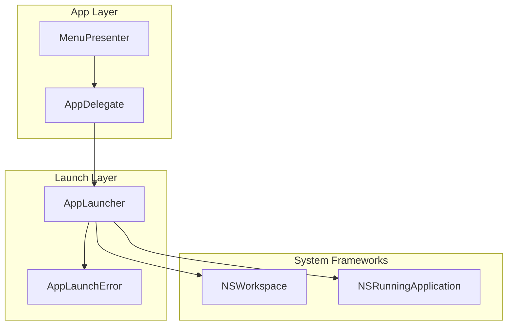
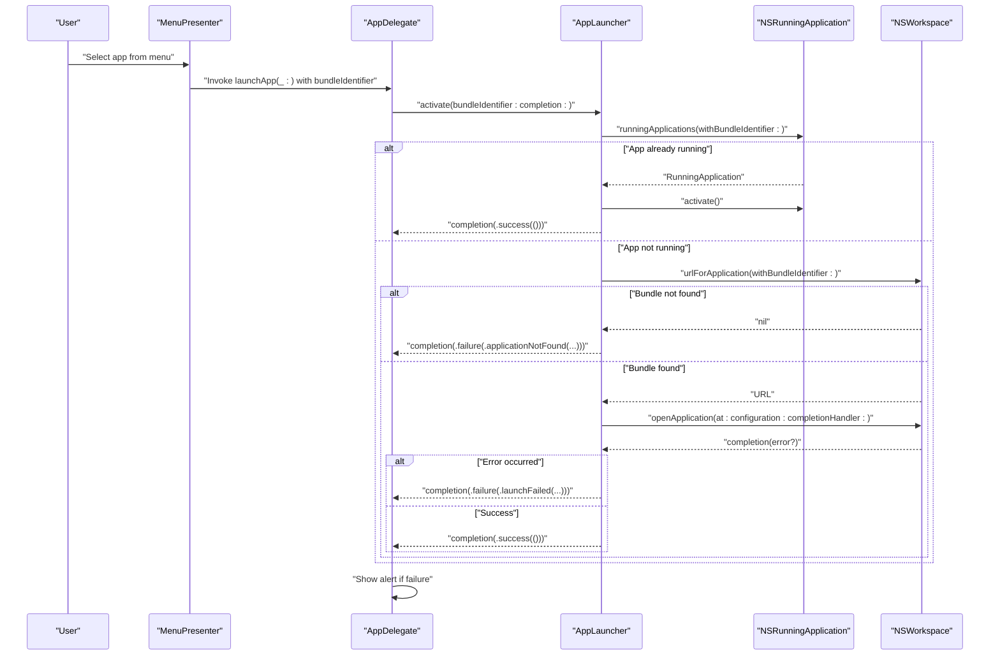
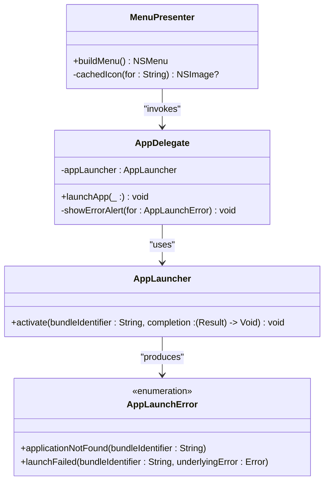

# AppLauncher API

<cite>
**Referenced Files in This Document**
- [AppLauncher.swift](file://iTip/AppLauncher.swift)
- [AppDelegate.swift](file://iTip/AppDelegate.swift)
- [MenuPresenter.swift](file://iTip/MenuPresenter.swift)
- [AppLauncherTests.swift](file://iTipTests/AppLauncherTests.swift)
- [main.swift](file://iTip/main.swift)
- [UsageRecord.swift](file://iTip/UsageRecord.swift)
- [UsageStoreProtocol.swift](file://iTip/UsageStoreProtocol.swift)
</cite>

## Table of Contents
1. [Introduction](#introduction)
2. [Project Structure](#project-structure)
3. [Core Components](#core-components)
4. [Architecture Overview](#architecture-overview)
5. [Detailed Component Analysis](#detailed-component-analysis)
6. [Dependency Analysis](#dependency-analysis)
7. [Performance Considerations](#performance-considerations)
8. [Troubleshooting Guide](#troubleshooting-guide)
9. [Conclusion](#conclusion)

## Introduction
This document provides comprehensive API documentation for the AppLauncher component, focusing on the public interface for launching macOS applications. It explains the launch method, configuration options, execution parameters, error handling, and integration patterns with NSWorkspace and NSRunningApplication. Practical examples demonstrate launching by bundle identifier, along with best practices for robust application launching and user experience considerations.

## Project Structure
The AppLauncher resides in the macOS menu bar application iTip. It is used by the application’s delegate to handle user-triggered application launches from the menu. The component integrates with NSWorkspace and NSRunningApplication to resolve and launch applications, and it reports outcomes via a completion handler.

**Diagram sources**
- [AppDelegate.swift:36-80](file://iTip/AppDelegate.swift#L36-L80)
- [AppLauncher.swift:1-40](file://iTip/AppLauncher.swift#L1-L40)
- [MenuPresenter.swift:40-147](file://iTip/MenuPresenter.swift#L40-L147)

**Section sources**
- [main.swift:1-8](file://iTip/main.swift#L1-L8)
- [AppDelegate.swift:36-80](file://iTip/AppDelegate.swift#L36-L80)
- [MenuPresenter.swift:40-147](file://iTip/MenuPresenter.swift#L40-L147)

## Core Components
- AppLauncher: Provides a single public method to activate or launch an application by its bundle identifier. It ensures the completion callback runs on the main thread.
- AppLaunchError: Defines two error cases indicating either the application was not found or the launch failed with an underlying error.
- Integration points:
  - NSRunningApplication: Detects if an application is already running and activates it.
  - NSWorkspace: Resolves the application path from the bundle identifier and opens the application with configured options.
  - MenuPresenter and AppDelegate: Provide the user-triggered launch flow and error presentation.

Key API surface:
- Method: activate(bundleIdentifier:completion:)
- Parameters:
  - bundleIdentifier: String identifying the target application.
  - completion: Result<Void, AppLaunchError> callback executed on the main thread.
- Return: Void; completion indicates success or failure.

**Section sources**
- [AppLauncher.swift:8-39](file://iTip/AppLauncher.swift#L8-L39)
- [AppLauncher.swift:3-6](file://iTip/AppLauncher.swift#L3-L6)
- [AppDelegate.swift:43-54](file://iTip/AppDelegate.swift#L43-L54)

## Architecture Overview
The AppLauncher orchestrates application activation or launch using macOS system APIs. It first checks if the app is already running; if so, it activates it. Otherwise, it resolves the app path via NSWorkspace and launches it with OpenConfiguration.activates set to true. The completion handler is dispatched on the main thread to safely update UI or present alerts.

**Diagram sources**
- [AppDelegate.swift:43-54](file://iTip/AppDelegate.swift#L43-L54)
- [AppLauncher.swift:11-38](file://iTip/AppLauncher.swift#L11-L38)
- [MenuPresenter.swift:131-138](file://iTip/MenuPresenter.swift#L131-L138)

## Detailed Component Analysis

### AppLauncher.activate(bundleIdentifier:completion:)
Purpose:
- Activate or launch an application by its bundle identifier.
- Always call the completion on the main thread.

Behavior:
- If the app is already running, activate it immediately and succeed.
- If not running, resolve the app path via NSWorkspace and launch with OpenConfiguration.activates = true.
- Dispatch completion on the main thread regardless of outcome.

Parameters:
- bundleIdentifier: String. The target application’s bundle identifier.
- completion: Result<Void, AppLaunchError> -> Void. Called on the main thread.

Returns:
- Void. The result is delivered asynchronously via completion.

Completion semantics:
- Success: completion(.success(())) indicates the app is activated or launched.
- Failure: completion(.failure(error)) with AppLaunchError.

Error cases:
- applicationNotFound(bundleIdentifier): Emitted when NSWorkspace cannot resolve the app path for the given bundle identifier.
- launchFailed(bundleIdentifier, underlyingError): Emitted when NSWorkspace.openApplication returns an error.

Thread safety:
- The completion is guaranteed to run on the main thread.

Integration with NSWorkspace and NSRunningApplication:
- Uses NSRunningApplication.runningApplications(withBundleIdentifier:) to detect existing instances.
- Uses NSWorkspace.shared.urlForApplication(withBundleIdentifier:) to locate the app.
- Uses NSWorkspace.shared.openApplication(at:configuration:completionHandler:) to launch the app.

Practical examples:
- Launch by bundle identifier: Pass a known bundle identifier string to activate(bundleIdentifier:completion:).
- Launch by path/name: The component resolves the app path from the bundle identifier; it does not accept arbitrary paths or names directly. If you need to launch by path, resolve the bundle identifier first or use NSWorkspace directly.

Retry and fallback:
- The component does not implement retries or fallbacks internally. If a launch fails, the caller should decide whether to retry or present an error.

**Section sources**
- [AppLauncher.swift:8-39](file://iTip/AppLauncher.swift#L8-L39)
- [AppLauncher.swift:3-6](file://iTip/AppLauncher.swift#L3-L6)
- [AppDelegate.swift:43-54](file://iTip/AppDelegate.swift#L43-L54)

### AppLaunchError Enumeration
Cases:
- applicationNotFound(bundleIdentifier: String)
  - When NSWorkspace cannot resolve the app path for the given bundle identifier.
  - Occurs when the bundle identifier is invalid or the app is not installed.
- launchFailed(bundleIdentifier: String, underlyingError: Error)
  - When NSWorkspace.openApplication returns an error during launch.
  - underlyingError contains the system-provided error description.

Usage:
- The error is surfaced to the UI layer (AppDelegate) for user feedback.

**Section sources**
- [AppLauncher.swift:3-6](file://iTip/AppLauncher.swift#L3-L6)
- [AppDelegate.swift:58-79](file://iTip/AppDelegate.swift#L58-L79)

### Integration with NSWorkspace and NSRunningApplication
- NSRunningApplication:
  - Detects if an app is already running using bundle identifiers.
  - Activates the app if found.
- NSWorkspace:
  - Resolves the app path from the bundle identifier.
  - Launches the app with OpenConfiguration.activates = true to bring it to the foreground.

Best practices:
- Always pass a valid bundle identifier.
- Ensure the app is installed and accessible to the current user.
- Handle errors gracefully and inform the user.

**Section sources**
- [AppLauncher.swift:11-38](file://iTip/AppLauncher.swift#L11-L38)

### UI Integration and Error Presentation
- MenuPresenter builds the menu items and attaches the bundle identifier to each item via representedObject.
- AppDelegate receives the selection, invokes AppLauncher, and presents an alert on failure.
- Alerts are non-blocking and attached to the key window if available.

**Section sources**
- [MenuPresenter.swift:131-138](file://iTip/MenuPresenter.swift#L131-L138)
- [AppDelegate.swift:43-54](file://iTip/AppDelegate.swift#L43-L54)
- [AppDelegate.swift:58-79](file://iTip/AppDelegate.swift#L58-L79)

## Dependency Analysis
- AppLauncher depends on:
  - AppKit (NSWorkspace, NSRunningApplication)
  - AppLaunchError (enumeration)
- AppDelegate depends on:
  - AppLauncher
  - AppLaunchError for UI feedback
- MenuPresenter depends on:
  - NSWorkspace for URL resolution and icon caching
  - NSRunningApplication indirectly through AppLauncher’s behavior

**Diagram sources**
- [AppLauncher.swift:8-39](file://iTip/AppLauncher.swift#L8-L39)
- [AppLauncher.swift:3-6](file://iTip/AppLauncher.swift#L3-L6)
- [AppDelegate.swift:7,43-54](file://iTip/AppDelegate.swift#L7,L43-L54)
- [MenuPresenter.swift:68-147](file://iTip/MenuPresenter.swift#L68-L147)

**Section sources**
- [AppLauncher.swift:1-40](file://iTip/AppLauncher.swift#L1-L40)
- [AppDelegate.swift:36-80](file://iTip/AppDelegate.swift#L36-L80)
- [MenuPresenter.swift:40-147](file://iTip/MenuPresenter.swift#L40-L147)

## Performance Considerations
- Main-thread dispatch: The completion is dispatched on the main thread, minimizing UI-related race conditions.
- Early exit: If the app is already running, activation occurs synchronously without filesystem or network overhead.
- Resolution caching: While AppLauncher itself does not cache URLs, MenuPresenter caches app URLs and icons to reduce repeated lookups.

Recommendations:
- Avoid frequent launches in tight loops; batch or debounce user actions.
- Prefer bundle identifiers over repeated path resolution.
- Consider caching bundle-to-path mappings at higher layers if needed.

**Section sources**
- [AppLauncher.swift:11-38](file://iTip/AppLauncher.swift#L11-L38)
- [MenuPresenter.swift:92-162](file://iTip/MenuPresenter.swift#L92-L162)

## Troubleshooting Guide
Common failure scenarios:
- Application not found:
  - Cause: Invalid or missing bundle identifier, or the app is not installed.
  - Behavior: applicationNotFound error is returned.
  - Action: Verify the bundle identifier and ensure the app is installed.
- Launch failed:
  - Cause: System-level error during launch (permissions, quarantine, sandboxing).
  - Behavior: launchFailed error with underlyingError.
  - Action: Inspect underlyingError.localizedDescription for details; address permissions or quarantine status.

User-facing error handling:
- The UI presents a warning alert with contextual messages and an OK button.
- If a visible window exists, the alert is presented modally; otherwise, it runs as a floating panel.

Testing coverage:
- A unit test verifies that unknown bundle identifiers trigger applicationNotFound.

Operational tips:
- Ensure the app is moved to /Applications and quarantine attributes are cleared before opening.
- Confirm the app is signed and not blocked by macOS security policies.

**Section sources**
- [AppLauncher.swift:3-6](file://iTip/AppLauncher.swift#L3-L6)
- [AppDelegate.swift:58-79](file://iTip/AppDelegate.swift#L58-L79)
- [AppLauncherTests.swift:12-31](file://iTipTests/AppLauncherTests.swift#L12-L31)
- [README.md:14-48](file://README.md#L14-L48)

## Conclusion
AppLauncher provides a focused, reliable mechanism to activate or launch macOS applications by bundle identifier. Its design emphasizes simplicity, immediate feedback, and safe main-thread callbacks. By integrating with NSWorkspace and NSRunningApplication, it leverages system capabilities to resolve and launch apps efficiently. Proper error handling and user feedback ensure a smooth user experience, while best practices around permissions and bundle identifiers prevent common pitfalls.