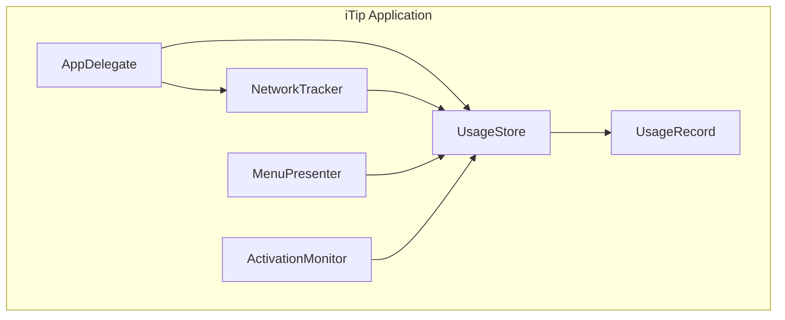
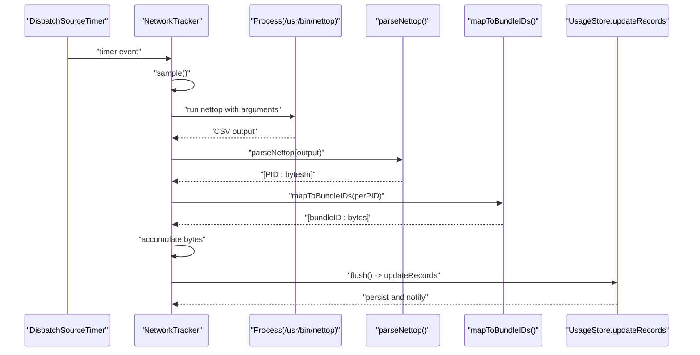
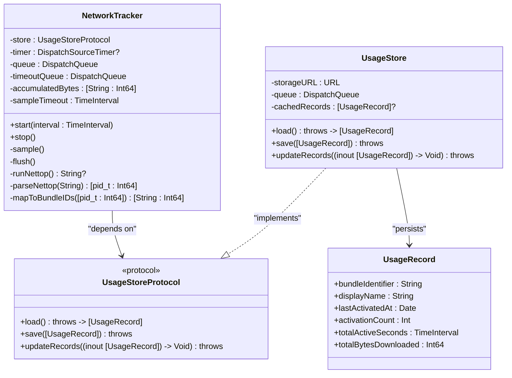
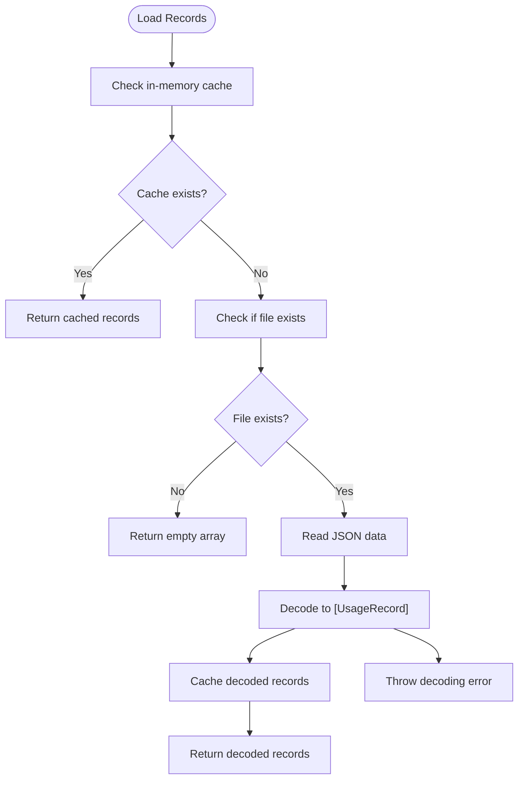
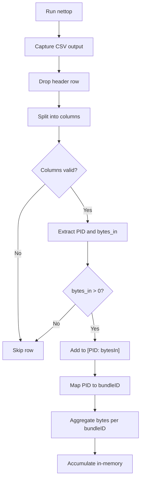
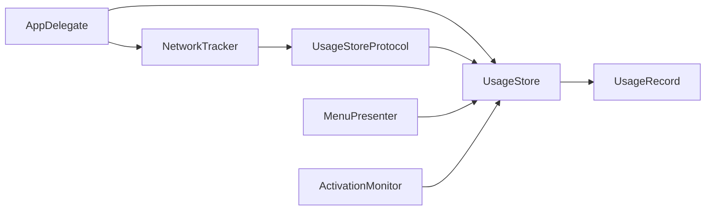

# NetworkTracker API

<cite>
**Referenced Files in This Document**
- [NetworkTracker.swift](file://iTip/NetworkTracker.swift)
- [UsageStore.swift](file://iTip/UsageStore.swift)
- [UsageStoreProtocol.swift](file://iTip/UsageStoreProtocol.swift)
- [UsageRecord.swift](file://iTip/UsageRecord.swift)
- [AppDelegate.swift](file://iTip/AppDelegate.swift)
- [MenuPresenter.swift](file://iTip/MenuPresenter.swift)
- [ActivationMonitor.swift](file://iTip/ActivationMonitor.swift)
- [main.swift](file://iTip/main.swift)
- [README.md](file://README.md)
</cite>

## Table of Contents
1. [Introduction](#introduction)
2. [Project Structure](#project-structure)
3. [Core Components](#core-components)
4. [Architecture Overview](#architecture-overview)
5. [Detailed Component Analysis](#detailed-component-analysis)
6. [Dependency Analysis](#dependency-analysis)
7. [Performance Considerations](#performance-considerations)
8. [Troubleshooting Guide](#troubleshooting-guide)
9. [Conclusion](#conclusion)
10. [Appendices](#appendices)

## Introduction
This document provides comprehensive API documentation for the NetworkTracker component responsible for network monitoring on macOS. It explains how the component samples per-process network usage via the system tool nettop, aggregates download bytes per application bundle identifier, and persists the data into the shared UsageStore. The documentation covers method signatures for starting and stopping sampling, configuring sampling intervals, accessing collected data, and integrating with system networking tools. It also details the data structures used for network usage tracking, error handling, and performance considerations.

## Project Structure
The NetworkTracker resides within the iTip macOS menu bar application. It integrates with the UsageStore to persist usage records and is orchestrated by the AppDelegate. The MenuPresenter listens for store updates to refresh the application menu.

**Diagram sources**
- [AppDelegate.swift:9-34](file://iTip/AppDelegate.swift#L9-L34)
- [NetworkTracker.swift:6-23](file://iTip/NetworkTracker.swift#L6-L23)
- [UsageStore.swift:4-22](file://iTip/UsageStore.swift#L4-L22)
- [UsageRecord.swift:3-32](file://iTip/UsageRecord.swift#L3-L32)
- [MenuPresenter.swift:48-60](file://iTip/MenuPresenter.swift#L48-L60)
- [ActivationMonitor.swift:28-36](file://iTip/ActivationMonitor.swift#L28-L36)

**Section sources**
- [AppDelegate.swift:9-34](file://iTip/AppDelegate.swift#L9-L34)
- [README.md:1-48](file://README.md#L1-L48)

## Core Components
- NetworkTracker: Periodically samples per-process network usage via nettop, aggregates bytes per bundle identifier, and flushes updates to the UsageStore.
- UsageStoreProtocol: Defines the contract for loading, saving, and atomically updating usage records.
- UsageStore: Implements persistent storage for UsageRecord instances with thread-safe operations and change notifications.
- UsageRecord: Encapsulates per-application usage metrics including cumulative downloaded bytes.
- MenuPresenter: Observes store updates to invalidate caches and refresh the application menu.
- ActivationMonitor: Manages foreground application activation tracking and merges data with network usage during persistence.

**Section sources**
- [NetworkTracker.swift:6-23](file://iTip/NetworkTracker.swift#L6-L23)
- [UsageStoreProtocol.swift:3-8](file://iTip/UsageStoreProtocol.swift#L3-L8)
- [UsageStore.swift:4-22](file://iTip/UsageStore.swift#L4-L22)
- [UsageRecord.swift:3-32](file://iTip/UsageRecord.swift#L3-L32)
- [MenuPresenter.swift:48-60](file://iTip/MenuPresenter.swift#L48-L60)
- [ActivationMonitor.swift:28-36](file://iTip/ActivationMonitor.swift#L28-L36)

## Architecture Overview
NetworkTracker runs on a timer-driven sampling loop. Each cycle invokes nettop, parses its CSV output, maps PIDs to bundle identifiers, accumulates bytes in memory, and flushes to the UsageStore. The UsageStore persists records atomically and posts a notification that MenuPresenter listens to refresh the UI.

**Diagram sources**
- [NetworkTracker.swift:26-54](file://iTip/NetworkTracker.swift#L26-L54)
- [NetworkTracker.swift:78-106](file://iTip/NetworkTracker.swift#L78-L106)
- [NetworkTracker.swift:109-129](file://iTip/NetworkTracker.swift#L109-L129)
- [NetworkTracker.swift:132-149](file://iTip/NetworkTracker.swift#L132-L149)
- [NetworkTracker.swift:56-76](file://iTip/NetworkTracker.swift#L56-L76)
- [UsageStore.swift:69-105](file://iTip/UsageStore.swift#L69-L105)

## Detailed Component Analysis

### NetworkTracker API
- Purpose: Periodically sample per-process network usage and accumulate download bytes per bundle identifier into the UsageStore.
- Initialization: Requires a UsageStoreProtocol instance.
- Sampling Loop: Uses a timer to schedule periodic sampling at a configurable interval.
- Data Aggregation: Maintains an in-memory dictionary of bundleID to accumulated bytes and flushes to disk on each cycle.
- Safety Mechanisms: Spawns a timeout queue to terminate long-running nettop processes.

Key methods and behaviors:
- start(interval:): Starts the sampling timer with the given interval in seconds.
- stop(): Cancels the timer and flushes remaining accumulated bytes.
- sample(): Executes a single sampling cycle.
- flush(): Persists accumulated bytes to the UsageStore and restores bytes on failure.
- runNettop(): Launches nettop with arguments and captures output with a timeout.
- parseNettop(_:): Parses nettop CSV output into a PID-to-bytes map.
- mapToBundleIDs(_:): Maps PIDs to bundle identifiers using running applications.

**Diagram sources**
- [NetworkTracker.swift:6-23](file://iTip/NetworkTracker.swift#L6-L23)
- [NetworkTracker.swift:26-54](file://iTip/NetworkTracker.swift#L26-L54)
- [NetworkTracker.swift:56-76](file://iTip/NetworkTracker.swift#L56-L76)
- [NetworkTracker.swift:78-106](file://iTip/NetworkTracker.swift#L78-L106)
- [NetworkTracker.swift:109-149](file://iTip/NetworkTracker.swift#L109-L149)
- [UsageStoreProtocol.swift:3-8](file://iTip/UsageStoreProtocol.swift#L3-L8)
- [UsageStore.swift:4-22](file://iTip/UsageStore.swift#L4-L22)
- [UsageStore.swift:69-105](file://iTip/UsageStore.swift#L69-L105)
- [UsageRecord.swift:3-32](file://iTip/UsageRecord.swift#L3-L32)

Method signatures and behaviors:
- start(interval: TimeInterval = 10.0): Initializes and resumes a timer to trigger sampling every interval seconds.
- stop(): Cancels the timer and flushes pending bytes to disk.
- sample(): Runs a single sampling cycle, parses output, aggregates bytes, and flushes.
- flush(): Persists aggregated bytes to the UsageStore; on failure, restores bytes to memory.
- runNettop(): Launches nettop with arguments and enforces a timeout; returns parsed output or nil on failure.
- parseNettop(_:): Converts CSV rows into a PID-to-bytes map, skipping invalid rows.
- mapToBundleIDs(_:): Builds a PID-to-bundleID lookup from running applications and aggregates bytes per bundle.

Data structures:
- Per-cycle accumulation: [bundleID: Int64] stored in memory until flush.
- Persistence: UsageStore.updateRecords merges network deltas into existing records without creating new ones.

Integration points:
- UsageStore.updateRecords: Merges network deltas into existing UsageRecord entries.
- MenuPresenter: Observes store updates to invalidate caches and refresh menus.

**Section sources**
- [NetworkTracker.swift:26-54](file://iTip/NetworkTracker.swift#L26-L54)
- [NetworkTracker.swift:56-76](file://iTip/NetworkTracker.swift#L56-L76)
- [NetworkTracker.swift:78-106](file://iTip/NetworkTracker.swift#L78-L106)
- [NetworkTracker.swift:109-149](file://iTip/NetworkTracker.swift#L109-L149)
- [UsageStore.swift:69-105](file://iTip/UsageStore.swift#L69-L105)
- [MenuPresenter.swift:52-59](file://iTip/MenuPresenter.swift#L52-L59)

### UsageStore and UsageRecord
- UsageRecord: Holds bundleIdentifier, displayName, lastActivatedAt, activationCount, totalActiveSeconds, and totalBytesDownloaded. Includes backward-compatible decoding for new fields.
- UsageStore: Provides thread-safe load/save/updateRecords operations, ensures directory creation, and posts a notification upon persistence.

**Diagram sources**
- [UsageStore.swift:24-49](file://iTip/UsageStore.swift#L24-L49)
- [UsageStore.swift:52-67](file://iTip/UsageStore.swift#L52-L67)
- [UsageStore.swift:69-105](file://iTip/UsageStore.swift#L69-L105)
- [UsageRecord.swift:14-22](file://iTip/UsageRecord.swift#L14-L22)

**Section sources**
- [UsageRecord.swift:3-32](file://iTip/UsageRecord.swift#L3-L32)
- [UsageStore.swift:24-49](file://iTip/UsageStore.swift#L24-L49)
- [UsageStore.swift:52-67](file://iTip/UsageStore.swift#L52-L67)
- [UsageStore.swift:69-105](file://iTip/UsageStore.swift#L69-L105)

### Integration with System Networking Tools
- nettop invocation: NetworkTracker launches nettop with arguments to produce a single-line CSV of per-process network statistics.
- Output parsing: parseNettop converts CSV rows into a PID-to-bytes map, filtering out invalid rows.
- Bundle mapping: mapToBundleIDs correlates PIDs to bundle identifiers using NSWorkspace’s running applications.

**Diagram sources**
- [NetworkTracker.swift:78-106](file://iTip/NetworkTracker.swift#L78-L106)
- [NetworkTracker.swift:109-129](file://iTip/NetworkTracker.swift#L109-L129)
- [NetworkTracker.swift:132-149](file://iTip/NetworkTracker.swift#L132-L149)

**Section sources**
- [NetworkTracker.swift:78-106](file://iTip/NetworkTracker.swift#L78-L106)
- [NetworkTracker.swift:109-149](file://iTip/NetworkTracker.swift#L109-L149)

### Example Workflows

- Starting Network Monitoring
  - Initialize UsageStore and inject it into NetworkTracker.
  - Call start(interval:) with desired sampling interval in seconds.
  - Stop monitoring by calling stop().

- Accessing Collected Data
  - Load records from UsageStore to inspect totalBytesDownloaded per bundle identifier.
  - Use MenuPresenter to observe updates and refresh the application menu.

- Performance Analysis
  - Monitor totalBytesDownloaded growth over time to identify heavy-download applications.
  - Combine with activation metrics from ActivationMonitor for usage attribution.

**Section sources**
- [AppDelegate.swift:16-17](file://iTip/AppDelegate.swift#L16-L17)
- [UsageStore.swift:24-49](file://iTip/UsageStore.swift#L24-L49)
- [MenuPresenter.swift:52-59](file://iTip/MenuPresenter.swift#L52-L59)

## Dependency Analysis
NetworkTracker depends on UsageStoreProtocol for persistence and uses NSWorkspace to resolve bundle identifiers. The AppDelegate orchestrates initialization and lifecycle management. MenuPresenter listens for store updates to keep the UI fresh.

**Diagram sources**
- [AppDelegate.swift:16-17](file://iTip/AppDelegate.swift#L16-L17)
- [NetworkTracker.swift:8-23](file://iTip/NetworkTracker.swift#L8-L23)
- [UsageStoreProtocol.swift:3-8](file://iTip/UsageStoreProtocol.swift#L3-L8)
- [UsageStore.swift:4-22](file://iTip/UsageStore.swift#L4-L22)
- [UsageRecord.swift:3-32](file://iTip/UsageRecord.swift#L3-L32)
- [MenuPresenter.swift:52-59](file://iTip/MenuPresenter.swift#L52-L59)
- [ActivationMonitor.swift:122-137](file://iTip/ActivationMonitor.swift#L122-L137)

**Section sources**
- [AppDelegate.swift:16-17](file://iTip/AppDelegate.swift#L16-L17)
- [NetworkTracker.swift:8-23](file://iTip/NetworkTracker.swift#L8-L23)
- [UsageStoreProtocol.swift:3-8](file://iTip/UsageStoreProtocol.swift#L3-L8)
- [UsageStore.swift:4-22](file://iTip/UsageStore.swift#L4-L22)
- [UsageRecord.swift:3-32](file://iTip/UsageRecord.swift#L3-L32)
- [MenuPresenter.swift:52-59](file://iTip/MenuPresenter.swift#L52-L59)
- [ActivationMonitor.swift:122-137](file://iTip/ActivationMonitor.swift#L122-L137)

## Performance Considerations
- Sampling Interval: Configure start(interval:) to balance responsiveness and overhead. Shorter intervals increase CPU usage and disk I/O.
- Memory Usage: NetworkTracker maintains an in-memory dictionary of bundleID to accumulated bytes. Flush occurs on each sampling cycle; ensure intervals are tuned to prevent excessive memory growth.
- Real-time Processing: The flush operation performs an atomic updateRecords transaction. Keep intervals reasonable to avoid long-running disk writes.
- Timeout Safety: A separate timeout queue ensures nettop termination if it hangs, preventing deadlocks on the sampling queue.
- Concurrency: Sampling and timeout queues operate independently to avoid blocking the main UI thread.

[No sources needed since this section provides general guidance]

## Troubleshooting Guide
Common issues and mitigations:
- Permission Issues
  - nettop requires appropriate privileges to access per-process network statistics. If runNettop returns nil, verify system permissions and accessibility settings.
  - Symptoms: No network data updates despite active sampling.

- System Resource Limitations
  - If nettop does not exit within the timeout threshold, the timeout queue terminates the process. This prevents indefinite hangs.
  - Adjust sampling interval to reduce contention on system resources.

- Parsing Failures
  - parseNettop skips rows with insufficient columns or invalid numeric values. Ensure nettop output format remains consistent across macOS versions.
  - Symptoms: Unexpected gaps in per-process byte counts.

- Persistence Errors
  - flush() restores bytes to memory if updateRecords fails. Check disk availability and file permissions for the storage location.
  - Symptoms: Temporary loss of network deltas during write failures.

- UI Refresh Delays
  - MenuPresenter invalidates its cache upon receiving the usageStoreDidUpdate notification. Ensure observers are registered correctly to reflect updates promptly.

**Section sources**
- [NetworkTracker.swift:78-106](file://iTip/NetworkTracker.swift#L78-L106)
- [NetworkTracker.swift:56-76](file://iTip/NetworkTracker.swift#L56-L76)
- [UsageStore.swift:69-105](file://iTip/UsageStore.swift#L69-L105)
- [MenuPresenter.swift:52-59](file://iTip/MenuPresenter.swift#L52-L59)

## Conclusion
NetworkTracker provides a robust mechanism for collecting per-application download bytes via nettop, aggregating them by bundle identifier, and persisting the results through UsageStore. Its design emphasizes safety with timeouts, concurrency with dedicated queues, and resilience with in-memory accumulation and rollback on persistence failures. Integration with MenuPresenter and ActivationMonitor enables a cohesive usage analytics pipeline within the iTip application.

[No sources needed since this section summarizes without analyzing specific files]

## Appendices

### API Reference Summary
- NetworkTracker
  - start(interval:): Begins periodic sampling.
  - stop(): Stops sampling and flushes pending data.
  - Internal helpers: sample(), flush(), runNettop(), parseNettop(), mapToBundleIDs().
- UsageStoreProtocol
  - load(), save(), updateRecords(_:) for atomic persistence.
- UsageStore
  - load(), save(), updateRecords(_:) with thread-safety and notifications.
- UsageRecord
  - Fields: bundleIdentifier, displayName, lastActivatedAt, activationCount, totalActiveSeconds, totalBytesDownloaded.

**Section sources**
- [NetworkTracker.swift:26-54](file://iTip/NetworkTracker.swift#L26-L54)
- [NetworkTracker.swift:56-76](file://iTip/NetworkTracker.swift#L56-L76)
- [NetworkTracker.swift:78-106](file://iTip/NetworkTracker.swift#L78-L106)
- [NetworkTracker.swift:109-149](file://iTip/NetworkTracker.swift#L109-L149)
- [UsageStoreProtocol.swift:3-8](file://iTip/UsageStoreProtocol.swift#L3-L8)
- [UsageStore.swift:24-49](file://iTip/UsageStore.swift#L24-L49)
- [UsageStore.swift:52-67](file://iTip/UsageStore.swift#L52-L67)
- [UsageStore.swift:69-105](file://iTip/UsageStore.swift#L69-L105)
- [UsageRecord.swift:3-32](file://iTip/UsageRecord.swift#L3-L32)