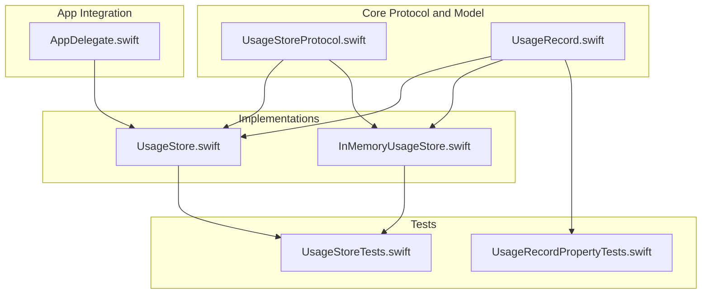
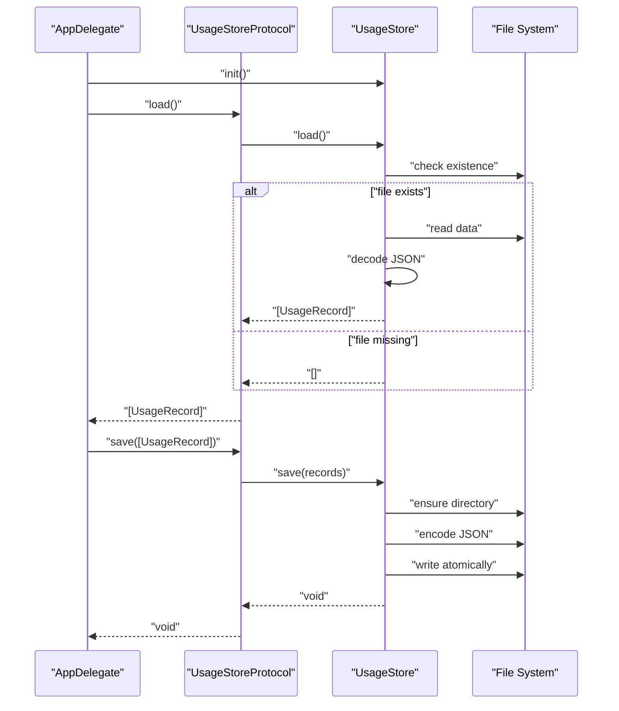
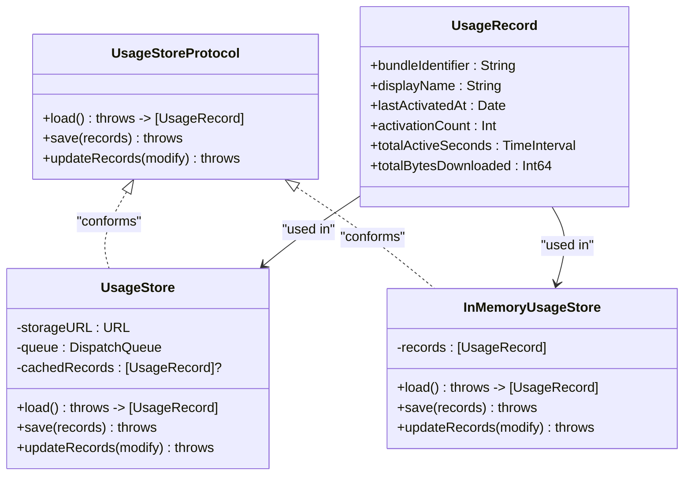

# UsageStoreProtocol

<cite>
**Referenced Files in This Document**
- [UsageStoreProtocol.swift](file://iTip/UsageStoreProtocol.swift)
- [UsageRecord.swift](file://iTip/UsageRecord.swift)
- [UsageStore.swift](file://iTip/UsageStore.swift)
- [InMemoryUsageStore.swift](file://iTipTests/InMemoryUsageStore.swift)
- [UsageStoreTests.swift](file://iTipTests/UsageStoreTests.swift)
- [UsageRecordPropertyTests.swift](file://iTipTests/UsageRecordPropertyTests.swift)
- [AppDelegate.swift](file://iTip/AppDelegate.swift)
</cite>

## Table of Contents
1. [Introduction](#introduction)
2. [Project Structure](#project-structure)
3. [Core Components](#core-components)
4. [Architecture Overview](#architecture-overview)
5. [Detailed Component Analysis](#detailed-component-analysis)
6. [Dependency Analysis](#dependency-analysis)
7. [Performance Considerations](#performance-considerations)
8. [Troubleshooting Guide](#troubleshooting-guide)
9. [Conclusion](#conclusion)

## Introduction
This document provides detailed API documentation for the UsageStoreProtocol interface and its associated UsageRecord data model. It explains the protocol contract, method semantics, parameter and return types, error handling, and threading guarantees. It also documents the concrete implementations UsageStore and InMemoryUsageStore, along with usage scenarios, performance considerations, and best practices for building custom storage backends.

## Project Structure
The relevant components for this documentation are organized as follows:
- Protocol definition and notification extension: UsageStoreProtocol.swift
- Data model for usage records: UsageRecord.swift
- Disk-backed implementation: UsageStore.swift
- In-memory test implementation: InMemoryUsageStore.swift
- Tests validating behavior and serialization: UsageStoreTests.swift, UsageRecordPropertyTests.swift
- Example usage in the application: AppDelegate.swift

**Diagram sources**
- [UsageStoreProtocol.swift:1-14](file://iTip/UsageStoreProtocol.swift#L1-L14)
- [UsageRecord.swift:1-33](file://iTip/UsageRecord.swift#L1-L33)
- [UsageStore.swift:1-107](file://iTip/UsageStore.swift#L1-L107)
- [InMemoryUsageStore.swift:1-23](file://iTipTests/InMemoryUsageStore.swift#L1-L23)
- [UsageStoreTests.swift:1-91](file://iTipTests/UsageStoreTests.swift#L1-L91)
- [UsageRecordPropertyTests.swift:1-52](file://iTipTests/UsageRecordPropertyTests.swift#L1-L52)
- [AppDelegate.swift:1-75](file://iTip/AppDelegate.swift#L1-L75)

**Section sources**
- [UsageStoreProtocol.swift:1-14](file://iTip/UsageStoreProtocol.swift#L1-L14)
- [UsageRecord.swift:1-33](file://iTip/UsageRecord.swift#L1-L33)
- [UsageStore.swift:1-107](file://iTip/UsageStore.swift#L1-L107)
- [InMemoryUsageStore.swift:1-23](file://iTipTests/InMemoryUsageStore.swift#L1-L23)
- [UsageStoreTests.swift:1-91](file://iTipTests/UsageStoreTests.swift#L1-L91)
- [UsageRecordPropertyTests.swift:1-52](file://iTipTests/UsageRecordPropertyTests.swift#L1-L52)
- [AppDelegate.swift:1-75](file://iTip/AppDelegate.swift#L1-L75)

## Core Components
- UsageStoreProtocol: Defines the contract for loading, saving, and atomic record updates.
- UsageRecord: The data model representing a single usage record with backward-compatible decoding.
- UsageStore: A thread-safe, disk-backed implementation using a serial dispatch queue and atomic writes.
- InMemoryUsageStore: A simple in-memory implementation used for testing and dependency injection.

Key responsibilities:
- Protocol: Declares method signatures and error propagation semantics.
- UsageRecord: Encodes/decodes to/from JSON with graceful handling for missing fields.
- UsageStore: Provides caching, atomic writes, and notifications upon successful persistence.
- InMemoryUsageStore: Minimal implementation enabling deterministic tests.

**Section sources**
- [UsageStoreProtocol.swift:3-8](file://iTip/UsageStoreProtocol.swift#L3-L8)
- [UsageRecord.swift:3-32](file://iTip/UsageRecord.swift#L3-L32)
- [UsageStore.swift:4-106](file://iTip/UsageStore.swift#L4-L106)
- [InMemoryUsageStore.swift:4-22](file://iTipTests/InMemoryUsageStore.swift#L4-L22)

## Architecture Overview
The protocol enables dependency injection across the application. The main application constructs a concrete store (typically UsageStore) and passes it to components that need to read or write usage data.

**Diagram sources**
- [AppDelegate.swift:9-34](file://iTip/AppDelegate.swift#L9-L34)
- [UsageStore.swift:24-67](file://iTip/UsageStore.swift#L24-L67)

## Detailed Component Analysis

### UsageStoreProtocol Contract
The protocol defines three methods with explicit error propagation and a notification extension.

- Method: load()
  - Purpose: Retrieve all usage records.
  - Signature: func load() throws -> [UsageRecord]
  - Behavior: Returns an array of records. Throws on decoding failures.
  - Thread safety: Not guaranteed by the protocol; implementations may enforce synchronization.

- Method: save(_ records:)
  - Purpose: Persist the given records to storage.
  - Signature: func save(_ records: [UsageRecord]) throws
  - Behavior: Writes records to backing storage. Throws on write failures.
  - Side effects: Implementations may post a notification upon successful persistence.

- Method: updateRecords(_ modify:)
  - Purpose: Atomically load, modify, and save records within a single synchronized block.
  - Signature: func updateRecords(_ modify: (inout [UsageRecord]) -> Void) throws
  - Behavior: Loads current state (from cache or disk), applies the mutation closure, persists atomically, and posts a notification on success.
  - Guarantees: Single-threaded mutation within the closure; atomic write to disk.

- Notification: usageStoreDidUpdate
  - Posted by implementations after successful persistence.
  - Used to signal observers that the store has been updated.

Implementation notes:
- The protocol does not define thread-safety; it is up to implementations to provide concurrency guarantees.
- Implementations should propagate errors from underlying storage operations.

**Section sources**
- [UsageStoreProtocol.swift:3-8](file://iTip/UsageStoreProtocol.swift#L3-L8)
- [UsageStoreProtocol.swift:10-13](file://iTip/UsageStoreProtocol.swift#L10-L13)

### UsageRecord Data Model
UsageRecord is a Codable struct with the following fields:

- bundleIdentifier: String
  - Description: Unique identifier for the application.
  - Encoding: Required during decoding.

- displayName: String
  - Description: Human-readable application name.
  - Encoding: Required during decoding.

- lastActivatedAt: Date
  - Description: Timestamp of the most recent activation.
  - Encoding: Required during decoding.

- activationCount: Int
  - Description: Number of activations.
  - Encoding: Required during decoding.

- totalActiveSeconds: TimeInterval
  - Description: Cumulative foreground active time in seconds.
  - Encoding: Optional during decoding; defaults to 0 if missing.

- totalBytesDownloaded: Int64
  - Description: Cumulative downloaded bytes.
  - Encoding: Optional during decoding; defaults to 0 if missing.

Backward compatibility:
- The initializer handles missing optional fields by falling back to zero values, enabling seamless upgrades.

Initialization:
- A convenience initializer allows constructing records with default values for optional fields.

**Section sources**
- [UsageRecord.swift:3-32](file://iTip/UsageRecord.swift#L3-L32)

### UsageStore Implementation
UsageStore conforms to UsageStoreProtocol and provides a thread-safe, disk-backed storage solution.

Key characteristics:
- Concurrency: Uses a dedicated serial dispatch queue to serialize all operations.
- Caching: Maintains an in-memory cache of records to avoid repeated disk reads.
- Persistence: Writes are performed atomically to prevent corruption.
- Notifications: Posts a notification after successful save/update.

Method behaviors:
- load()
  - Returns cached records if present.
  - Otherwise checks for file existence; returns an empty array if absent.
  - Attempts to decode JSON; logs and rethrows decoding errors to avoid caching invalid data.
- save(_:)
  - Ensures the target directory exists; encodes records to JSON; writes atomically; updates cache; posts notification.
- updateRecords(_:)
  - Loads current state (cache or disk), applies the provided mutation closure, ensures directory exists, encodes and writes atomically, updates cache, posts notification.

Error handling:
- Decoding failures are logged and rethrown.
- Write failures propagate as thrown errors.
- On decoding failure inside updateRecords, falls back to an empty array to continue safely.

Thread safety:
- All operations are executed synchronously on a dedicated queue, ensuring mutual exclusion.

Notifications:
- A notification is posted after successful persistence to inform observers.

**Section sources**
- [UsageStore.swift:4-106](file://iTip/UsageStore.swift#L4-L106)

### InMemoryUsageStore Implementation
InMemoryUsageStore is a minimal, test-friendly implementation of UsageStoreProtocol.

Behavior:
- load(): Returns the in-memory array of records.
- save(_): Replaces the in-memory array with the provided records.
- updateRecords(_): Applies the mutation closure to the in-memory array.

Use cases:
- Enables deterministic unit tests without filesystem dependencies.
- Demonstrates how to satisfy the protocol contract with minimal overhead.

**Section sources**
- [InMemoryUsageStore.swift:4-22](file://iTipTests/InMemoryUsageStore.swift#L4-L22)

### Usage Scenarios and Examples

#### Loading Existing Data
- Typical flow: Call load() on the store to retrieve all records.
- Expected outcomes:
  - If the storage file exists and decodes successfully, returns the records.
  - If the file does not exist, returns an empty array.
  - If the file exists but contains invalid JSON, throws an error (implementation-dependent behavior).

Example reference:
- [UsageStoreTests.swift:24-28](file://iTipTests/UsageStoreTests.swift#L24-L28)
- [UsageStoreTests.swift:53-60](file://iTipTests/UsageStoreTests.swift#L53-L60)

#### Saving New Records
- Typical flow: Prepare an array of UsageRecord and call save(_:) to persist.
- Expected outcomes:
  - Successful write creates/updates the storage file atomically.
  - On success, implementations post a notification indicating the store has been updated.

Example reference:
- [UsageStoreTests.swift:32-49](file://iTipTests/UsageStoreTests.swift#L32-L49)
- [UsageStoreTests.swift:64-89](file://iTipTests/UsageStoreTests.swift#L64-L89)

#### Handling Persistence Errors
- Decoding failures: Implementations log and rethrow errors to allow callers to decide how to handle corrupted data.
- Write failures: Implementations propagate errors from the write operation.
- Recovery patterns:
  - Retry after fixing the underlying issue (e.g., correcting JSON).
  - Fallback to an empty dataset when appropriate.

Example reference:
- [UsageStore.swift:43-48](file://iTip/UsageStore.swift#L43-L48)
- [UsageStore.swift:82-85](file://iTip/UsageStore.swift#L82-L85)

#### Atomic Updates
- Use updateRecords(_:) to ensure load-modify-write happens atomically within a single synchronized block.
- This prevents race conditions and ensures consistent state.

Example reference:
- [UsageStore.swift:69-105](file://iTip/UsageStore.swift#L69-L105)

#### Thread Safety Considerations
- UsageStore executes all operations on a dedicated serial queue, providing mutual exclusion.
- When implementing custom backends, ensure that:
  - Reads and writes are serialized.
  - Atomic writes are used to avoid partial writes.
  - Caching is coordinated with persistence to prevent stale reads.

Example reference:
- [UsageStore.swift:7-106](file://iTip/UsageStore.swift#L7-L106)

#### Relationship Between Protocol and Implementations
- UsageStoreProtocol defines the contract; UsageStore and InMemoryUsageStore conform to it.
- Dependency injection allows swapping implementations for testing or alternate backends.

Example reference:
- [AppDelegate.swift:9-34](file://iTip/AppDelegate.swift#L9-L34)

## Dependency Analysis
The protocol enables loose coupling between consumers and storage implementations. The application constructs a concrete store and injects it into components that require usage data.

**Diagram sources**
- [UsageStoreProtocol.swift:3-8](file://iTip/UsageStoreProtocol.swift#L3-L8)
- [UsageRecord.swift:3-32](file://iTip/UsageRecord.swift#L3-L32)
- [UsageStore.swift:4-106](file://iTip/UsageStore.swift#L4-L106)
- [InMemoryUsageStore.swift:4-22](file://iTipTests/InMemoryUsageStore.swift#L4-L22)

**Section sources**
- [UsageStoreProtocol.swift:3-8](file://iTip/UsageStoreProtocol.swift#L3-L8)
- [UsageRecord.swift:3-32](file://iTip/UsageRecord.swift#L3-L32)
- [UsageStore.swift:4-106](file://iTip/UsageStore.swift#L4-L106)
- [InMemoryUsageStore.swift:4-22](file://iTipTests/InMemoryUsageStore.swift#L4-L22)

## Performance Considerations
- Caching: UsageStore caches records in memory to reduce disk reads. This improves performance for frequent reads but requires careful invalidation when external changes occur.
- Atomic writes: Using atomic writes avoids partial writes and reduces the risk of corruption, but may incur additional I/O overhead.
- Serialization: JSON encoding/decoding is straightforward and efficient for moderate-sized datasets. For very large datasets, consider binary formats or streaming.
- Concurrency: The serial queue ensures thread safety but can become a bottleneck under heavy contention. Consider batching operations or using asynchronous APIs if needed.
- Notifications: Posting notifications after persistence is lightweight but should be considered when many updates occur in quick succession.

Best practices for custom backends:
- Provide a serialized execution model to guarantee consistency.
- Use atomic writes to protect against partial writes.
- Implement caching judiciously and invalidate when necessary.
- Log and propagate errors to enable robust error handling by callers.

[No sources needed since this section provides general guidance]

## Troubleshooting Guide
Common issues and resolutions:
- Empty array returned on load:
  - Cause: Storage file does not exist or is unreadable.
  - Resolution: Verify the storage path and permissions; ensure the file exists before reading.
  - Reference: [UsageStoreTests.swift:24-28](file://iTipTests/UsageStoreTests.swift#L24-L28)

- Corrupted JSON decoding:
  - Cause: Storage file contains invalid JSON.
  - Resolution: Fix the JSON or delete the file to reset to defaults; implement retry logic if applicable.
  - Reference: [UsageStore.swift:43-48](file://iTip/UsageStore.swift#L43-L48)

- Atomic write failures:
  - Cause: Insufficient disk space or permission issues.
  - Resolution: Ensure sufficient disk space and correct permissions; handle thrown errors gracefully.
  - Reference: [UsageStore.swift:63-65](file://iTip/UsageStore.swift#L63-L65)

- Stale cache after external changes:
  - Cause: Another process modified the storage file.
  - Resolution: Invalidate the cache or reload records before subsequent reads.
  - Reference: [UsageStore.swift:25-28](file://iTip/UsageStore.swift#L25-L28)

- Serialization round-trip failures:
  - Cause: Unexpected field values or schema mismatches.
  - Resolution: Validate data generation and ensure all fields are correctly encoded/decoded.
  - Reference: [UsageRecordPropertyTests.swift:35-50](file://iTipTests/UsageRecordPropertyTests.swift#L35-L50)

**Section sources**
- [UsageStoreTests.swift:24-89](file://iTipTests/UsageStoreTests.swift#L24-L89)
- [UsageStore.swift:24-67](file://iTip/UsageStore.swift#L24-L67)
- [UsageRecordPropertyTests.swift:35-50](file://iTipTests/UsageRecordPropertyTests.swift#L35-L50)

## Conclusion
UsageStoreProtocol defines a clean, testable contract for managing usage records. UsageStore provides a robust, thread-safe, and atomic disk-backed implementation suitable for production, while InMemoryUsageStore demonstrates how to satisfy the protocol for testing. Together with UsageRecord’s backward-compatible decoding, the system offers reliable persistence, predictable error handling, and clear extension points for custom backends.

[No sources needed since this section summarizes without analyzing specific files]