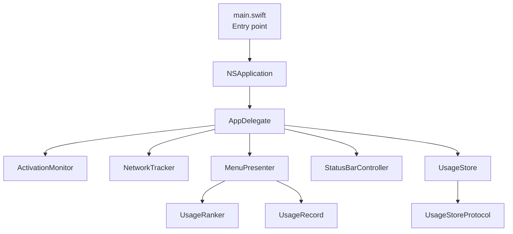
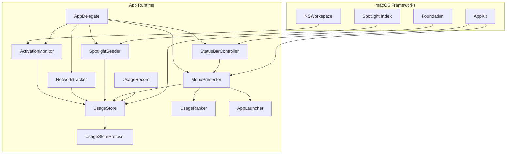
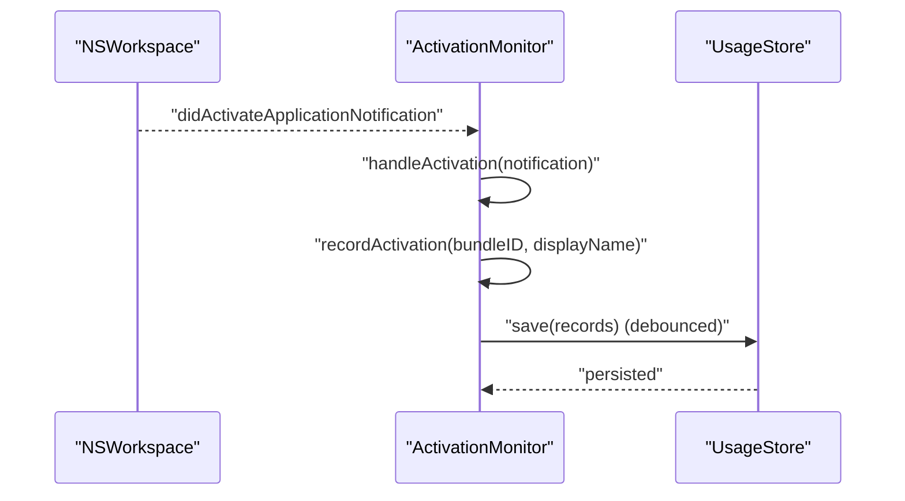
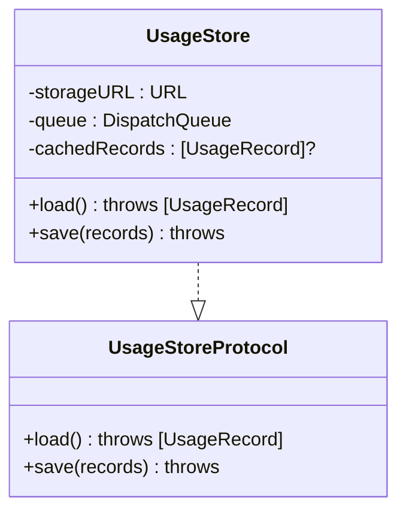
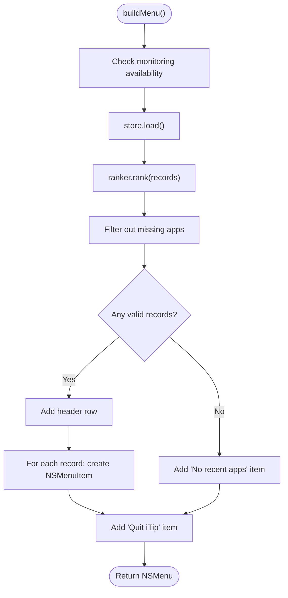
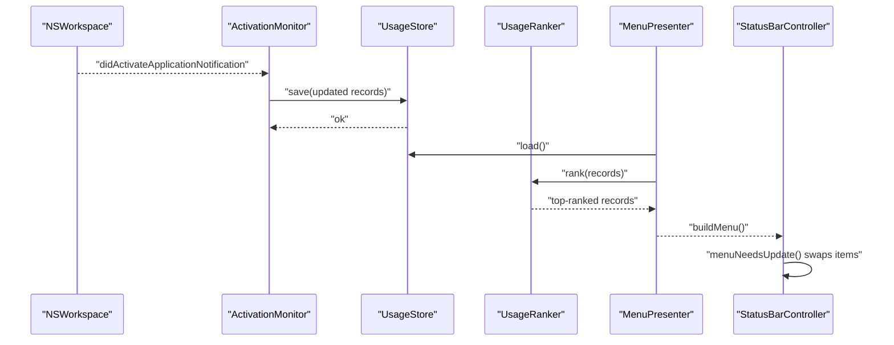
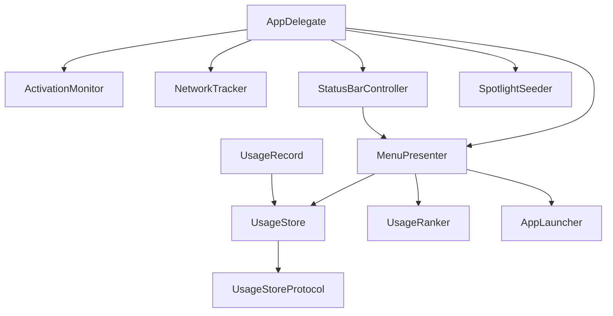
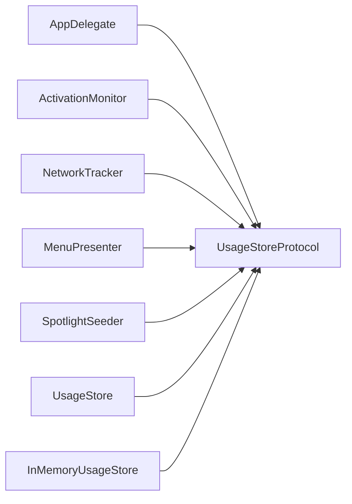

# Architecture & Design

<cite>
**Referenced Files in This Document**
- [main.swift](file://iTip/main.swift)
- [AppDelegate.swift](file://iTip/AppDelegate.swift)
- [ActivationMonitor.swift](file://iTip/ActivationMonitor.swift)
- [NetworkTracker.swift](file://iTip/NetworkTracker.swift)
- [SpotlightSeeder.swift](file://iTip/SpotlightSeeder.swift)
- [UsageStore.swift](file://iTip/UsageStore.swift)
- [UsageStoreProtocol.swift](file://iTip/UsageStoreProtocol.swift)
- [UsageRanker.swift](file://iTip/UsageRanker.swift)
- [MenuPresenter.swift](file://iTip/MenuPresenter.swift)
- [StatusBarController.swift](file://iTip/StatusBarController.swift)
- [AppLauncher.swift](file://iTip/AppLauncher.swift)
- [UsageRecord.swift](file://iTip/UsageRecord.swift)
- [IntegrationTests.swift](file://iTipTests/IntegrationTests.swift)
- [InMemoryUsageStore.swift](file://iTipTests/InMemoryUsageStore.swift)
</cite>

## Table of Contents
1. [Introduction](#introduction)
2. [Project Structure](#project-structure)
3. [Core Components](#core-components)
4. [Architecture Overview](#architecture-overview)
5. [Detailed Component Analysis](#detailed-component-analysis)
6. [Dependency Analysis](#dependency-analysis)
7. [Performance Considerations](#performance-considerations)
8. [Troubleshooting Guide](#troubleshooting-guide)
9. [Conclusion](#conclusion)

## Introduction
This document describes the architecture and design of iTip’s macOS application. The system centers on AppDelegate as the central orchestrator that initializes and coordinates subsystems for monitoring application activations, sampling network usage, seeding historical data, and rendering a dynamic menu bar UI. It leverages macOS frameworks including AppKit for UI and NSWorkspace for application lifecycle events, Foundation for core utilities and serialization, and Spotlight for initial seeding. The design emphasizes modularity and testability through protocols, strategies, observers, factories, and singletons.

## Project Structure
The application follows a thin entry-point design:
- Entry point sets up the NSApplication, assigns AppDelegate as delegate, and runs the app loop.
- AppDelegate wires together the runtime subsystems and performs lifecycle management.
- Modular components encapsulate responsibilities: monitoring, ranking, storage, presentation, and launching.

**Diagram sources**
- [main.swift:1-8](file://iTip/main.swift#L1-L8)
- [AppDelegate.swift:9-34](file://iTip/AppDelegate.swift#L9-L34)
- [ActivationMonitor.swift:36-53](file://iTip/ActivationMonitor.swift#L36-L53)
- [NetworkTracker.swift:20-28](file://iTip/NetworkTracker.swift#L20-L28)
- [MenuPresenter.swift:31-34](file://iTip/MenuPresenter.swift#L31-L34)
- [StatusBarController.swift:12-36](file://iTip/StatusBarController.swift#L12-L36)
- [UsageStore.swift:4-22](file://iTip/UsageStore.swift#L4-L22)
- [UsageStoreProtocol.swift:3-6](file://iTip/UsageStoreProtocol.swift#L3-L6)
- [UsageRanker.swift:3-15](file://iTip/UsageRanker.swift#L3-L15)
- [UsageRecord.swift:3-32](file://iTip/UsageRecord.swift#L3-L32)

**Section sources**
- [main.swift:1-8](file://iTip/main.swift#L1-L8)
- [AppDelegate.swift:9-34](file://iTip/AppDelegate.swift#L9-L34)

## Core Components
- AppDelegate: Central orchestrator. Initializes store, ranker, monitors, presenter, and status bar. Starts Spotlight seeding asynchronously after UI readiness. Handles termination cleanup and menu actions.
- ActivationMonitor: Observes NSWorkspace application activation notifications, maintains an in-memory cache, debounces writes, and updates UsageStore.
- NetworkTracker: Periodically samples per-process network traffic using a system tool, aggregates bytes per bundle, and updates stored records atomically.
- SpotlightSeeder: On cold start, seeds UsageStore with recent apps from Spotlight metadata when the store is empty.
- UsageStore: Thread-safe JSON-backed persistence for UsageRecord with caching and atomic writes.
- UsageStoreProtocol: Abstraction enabling test doubles and dependency injection.
- UsageRanker: Sorts and truncates records for display.
- MenuPresenter: Builds the dynamic menu, caches icons and URLs, formats metrics, and delegates app launch actions.
- StatusBarController: Manages the NSStatusItem, applies SF Symbol icon, and refreshes menus on demand.
- AppLauncher: Encapsulates launching/activating apps via NSWorkspace with robust error reporting.
- UsageRecord: Codable model with backward-compatible decoding for new fields.

**Section sources**
- [AppDelegate.swift:3-39](file://iTip/AppDelegate.swift#L3-L39)
- [ActivationMonitor.swift:3-140](file://iTip/ActivationMonitor.swift#L3-L140)
- [NetworkTracker.swift:6-142](file://iTip/NetworkTracker.swift#L6-L142)
- [SpotlightSeeder.swift:6-79](file://iTip/SpotlightSeeder.swift#L6-L79)
- [UsageStore.swift:4-66](file://iTip/UsageStore.swift#L4-L66)
- [UsageStoreProtocol.swift:3-6](file://iTip/UsageStoreProtocol.swift#L3-L6)
- [UsageRanker.swift:3-15](file://iTip/UsageRanker.swift#L3-L15)
- [MenuPresenter.swift:3-232](file://iTip/MenuPresenter.swift#L3-L232)
- [StatusBarController.swift:3-67](file://iTip/StatusBarController.swift#L3-L67)
- [AppLauncher.swift:8-39](file://iTip/AppLauncher.swift#L8-L39)
- [UsageRecord.swift:3-32](file://iTip/UsageRecord.swift#L3-L32)

## Architecture Overview
The system is event-driven and modular:
- NSWorkspace triggers activation events handled by ActivationMonitor.
- ActivationMonitor updates in-memory records and persists periodically.
- NetworkTracker periodically updates download metrics.
- MenuPresenter reads from UsageStore, ranks via UsageRanker, and renders a dynamic menu.
- StatusBarController hosts the menu and refreshes it on demand.
- SpotlightSeeder pre-seeds data on cold start.

**Diagram sources**
- [AppDelegate.swift:9-34](file://iTip/AppDelegate.swift#L9-L34)
- [ActivationMonitor.swift:40-47](file://iTip/ActivationMonitor.swift#L40-L47)
- [NetworkTracker.swift:20-28](file://iTip/NetworkTracker.swift#L20-L28)
- [SpotlightSeeder.swift:16-28](file://iTip/SpotlightSeeder.swift#L16-L28)
- [MenuPresenter.swift:31-34](file://iTip/MenuPresenter.swift#L31-L34)
- [StatusBarController.swift:12-36](file://iTip/StatusBarController.swift#L12-L36)
- [UsageStore.swift:4-22](file://iTip/UsageStore.swift#L4-L22)
- [UsageStoreProtocol.swift:3-6](file://iTip/UsageStoreProtocol.swift#L3-L6)
- [UsageRanker.swift:3-15](file://iTip/UsageRanker.swift#L3-L15)
- [UsageRecord.swift:3-32](file://iTip/UsageRecord.swift#L3-L32)

## Detailed Component Analysis

### Observer Pattern: Activation Monitoring
ActivationMonitor observes NSWorkspace activation notifications and updates UsageStore. It uses a main-queue observer and a periodic timer to flush changes, minimizing disk I/O.

**Diagram sources**
- [ActivationMonitor.swift:40-47](file://iTip/ActivationMonitor.swift#L40-L47)
- [ActivationMonitor.swift:128-139](file://iTip/ActivationMonitor.swift#L128-L139)
- [UsageStore.swift:51-65](file://iTip/UsageStore.swift#L51-L65)

**Section sources**
- [ActivationMonitor.swift:36-64](file://iTip/ActivationMonitor.swift#L36-L64)
- [ActivationMonitor.swift:122-126](file://iTip/ActivationMonitor.swift#L122-L126)

### Strategy Pattern: Storage Abstraction
UsageStore implements UsageStoreProtocol, enabling swapping storage mechanisms (e.g., in-memory for tests). The protocol decouples consumers from concrete persistence.

**Diagram sources**
- [UsageStoreProtocol.swift:3-6](file://iTip/UsageStoreProtocol.swift#L3-L6)
- [UsageStore.swift:4-66](file://iTip/UsageStore.swift#L4-L66)

**Section sources**
- [UsageStoreProtocol.swift:3-6](file://iTip/UsageStoreProtocol.swift#L3-L6)
- [UsageStore.swift:4-22](file://iTip/UsageStore.swift#L4-L22)

### Factory Pattern: Menu Item Creation
MenuPresenter constructs NSMenuItem instances dynamically, setting targets, represented objects, attributed titles, and icons. This is a factory-style composition of UI elements.

**Diagram sources**
- [MenuPresenter.swift:36-112](file://iTip/MenuPresenter.swift#L36-L112)

**Section sources**
- [MenuPresenter.swift:31-34](file://iTip/MenuPresenter.swift#L31-L34)
- [MenuPresenter.swift:36-112](file://iTip/MenuPresenter.swift#L36-L112)

### Singleton Pattern: Shared Resources
- NSApplication.shared is used as the global application instance.
- NSStatusBar provides the shared status item container.
- OSLog instances are scoped per class for logging.

**Section sources**
- [main.swift:3-7](file://iTip/main.swift#L3-L7)
- [StatusBarController.swift:12-18](file://iTip/StatusBarController.swift#L12-L18)
- [UsageStore.swift:9](file://iTip/UsageStore.swift#L9)

### Data Flow: Activation to UI
End-to-end flow from NSWorkspace activation to UI refresh:

**Diagram sources**
- [ActivationMonitor.swift:40-47](file://iTip/ActivationMonitor.swift#L40-L47)
- [UsageStore.swift:24-49](file://iTip/UsageStore.swift#L24-L49)
- [UsageRanker.swift:4-14](file://iTip/UsageRanker.swift#L4-L14)
- [MenuPresenter.swift:36-112](file://iTip/MenuPresenter.swift#L36-L112)
- [StatusBarController.swift:55-66](file://iTip/StatusBarController.swift#L55-L66)

**Section sources**
- [IntegrationTests.swift:9-50](file://iTipTests/IntegrationTests.swift#L9-L50)

### Component Interaction Diagrams
High-level component relationships and UI integration:

**Diagram sources**
- [AppDelegate.swift:9-34](file://iTip/AppDelegate.swift#L9-L34)
- [MenuPresenter.swift:31-34](file://iTip/MenuPresenter.swift#L31-L34)
- [StatusBarController.swift:12-36](file://iTip/StatusBarController.swift#L12-L36)
- [SpotlightSeeder.swift:16-28](file://iTip/SpotlightSeeder.swift#L16-L28)
- [UsageStoreProtocol.swift:3-6](file://iTip/UsageStoreProtocol.swift#L3-L6)
- [UsageRecord.swift:3-32](file://iTip/UsageRecord.swift#L3-L32)

## Dependency Analysis
- Coupling: Components depend on UsageStoreProtocol rather than concrete implementations, reducing tight coupling.
- Cohesion: Each component has a focused responsibility (monitoring, ranking, storage, presentation).
- External Dependencies: NSWorkspace, AppKit, Foundation, Spotlight (MDQuery), and system tools (nettop).
- Test Doubles: InMemoryUsageStore implements UsageStoreProtocol for deterministic tests.

**Diagram sources**
- [AppDelegate.swift:10-11](file://iTip/AppDelegate.swift#L10-L11)
- [ActivationMonitor.swift:5](file://iTip/ActivationMonitor.swift#L5)
- [NetworkTracker.swift:8](file://iTip/NetworkTracker.swift#L8)
- [MenuPresenter.swift:4](file://iTip/MenuPresenter.swift#L4)
- [SpotlightSeeder.swift:8](file://iTip/SpotlightSeeder.swift#L8)
- [UsageStore.swift:4](file://iTip/UsageStore.swift#L4)
- [InMemoryUsageStore.swift:4](file://iTipTests/InMemoryUsageStore.swift#L4)

**Section sources**
- [IntegrationTests.swift:11-18](file://iTipTests/IntegrationTests.swift#L11-L18)
- [InMemoryUsageStore.swift:4-18](file://iTipTests/InMemoryUsageStore.swift#L4-L18)

## Performance Considerations
- Threading:
  - ActivationMonitor uses a main-queue observer to keep UI-related updates on the main thread.
  - UsageStore and NetworkTracker use serial queues to serialize disk and system calls.
  - UI refresh occurs on-demand via NSMenuDelegate to avoid unnecessary rebuilds.
- Caching:
  - ActivationMonitor caches records in memory and flushes periodically to reduce I/O.
  - MenuPresenter caches app icons and URL resolutions to minimize repeated disk lookups.
- I/O:
  - UsageStore writes are atomic and serialized; writes are debounced to balance responsiveness and durability.
- Sampling:
  - NetworkTracker samples at intervals and flushes snapshots to avoid continuous heavy work.

[No sources needed since this section provides general guidance]

## Troubleshooting Guide
- Application Launch Failures:
  - AppLauncher reports “application not found” or “launch failed” with underlying error details. The UI surfaces a modal alert with actionable messages.
- Monitoring Unavailable:
  - MenuPresenter displays a warning when activation monitoring is inactive and disables further actions until monitoring resumes.
- Persistence Errors:
  - UsageStore logs decoding failures and falls back to empty state; callers should handle empty arrays gracefully.
- Network Sampling:
  - NetworkTracker swallows transient errors and retries; if saving fails, bytes are re-added to the accumulator to prevent data loss.

**Section sources**
- [AppLauncher.swift:3-6](file://iTip/AppLauncher.swift#L3-L6)
- [AppLauncher.swift:29-38](file://iTip/AppLauncher.swift#L29-L38)
- [MenuPresenter.swift:39-44](file://iTip/MenuPresenter.swift#L39-L44)
- [UsageStore.swift:44](file://iTip/UsageStore.swift#L44)
- [NetworkTracker.swift:72-78](file://iTip/NetworkTracker.swift#L72-L78)

## Conclusion
iTip’s architecture centers on AppDelegate orchestrating modular subsystems that integrate tightly with macOS frameworks. The design leverages observer, strategy, factory, and singleton patterns to achieve separation of concerns, testability, and maintainability. Data flows predictably from NSWorkspace activation through ActivationMonitor to UsageStore, then to UsageRanker and MenuPresenter for UI rendering. Robust error handling, caching, and asynchronous initialization ensure a responsive and resilient user experience.