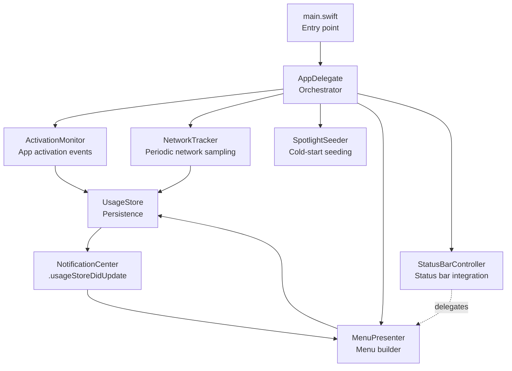
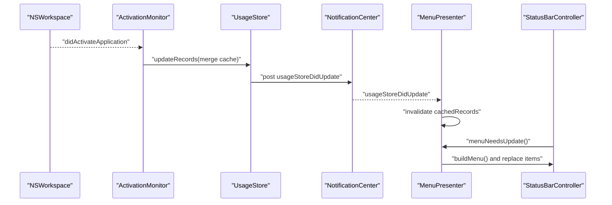
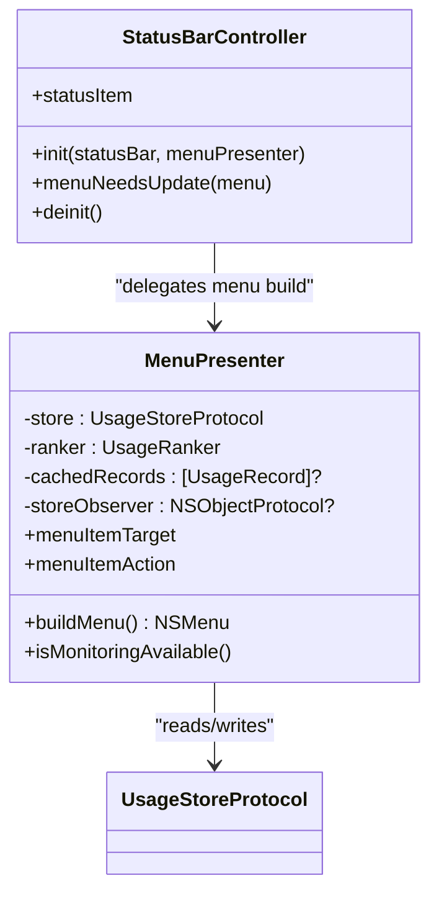
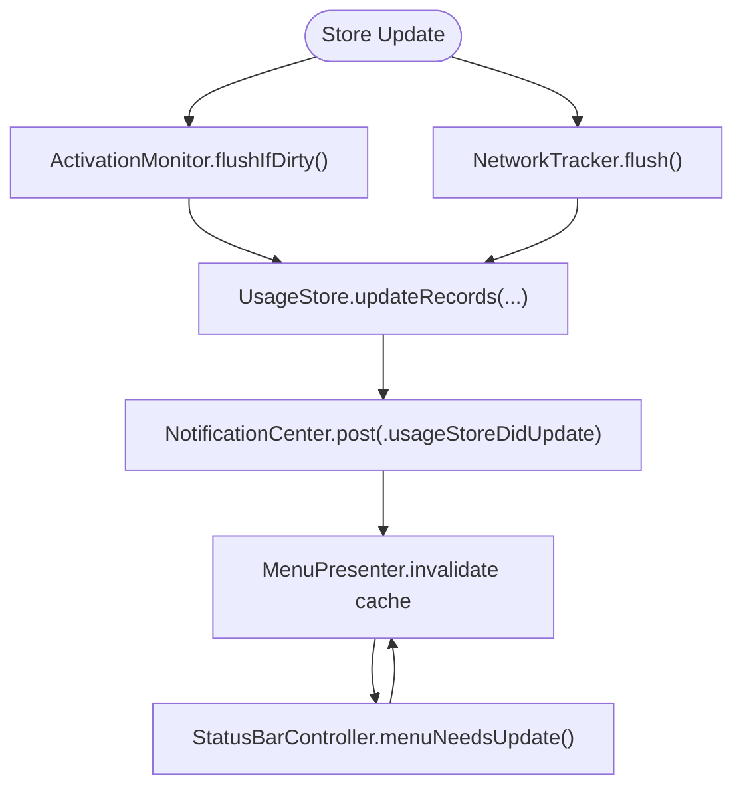
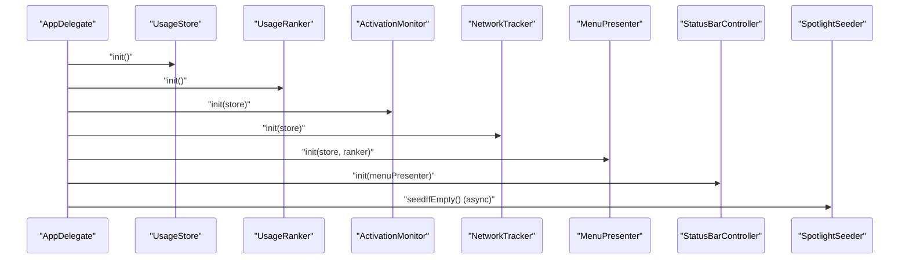
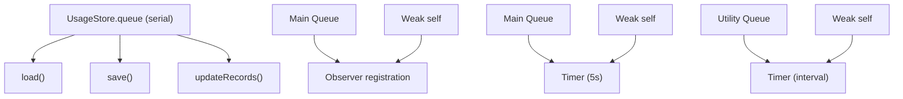
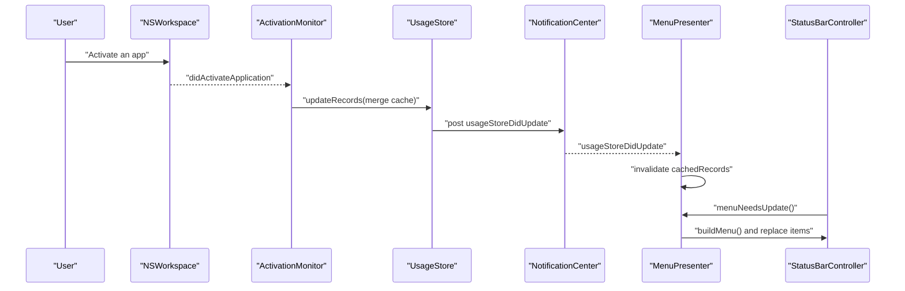
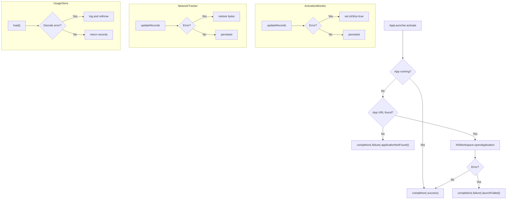
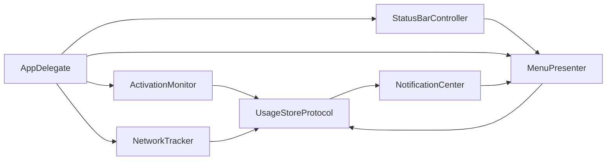

# Component Interactions

<cite>
**Referenced Files in This Document**
- [AppDelegate.swift](file://iTip/AppDelegate.swift)
- [main.swift](file://iTip/main.swift)
- [StatusBarController.swift](file://iTip/StatusBarController.swift)
- [MenuPresenter.swift](file://iTip/MenuPresenter.swift)
- [ActivationMonitor.swift](file://iTip/ActivationMonitor.swift)
- [NetworkTracker.swift](file://iTip/NetworkTracker.swift)
- [UsageStore.swift](file://iTip/UsageStore.swift)
- [UsageStoreProtocol.swift](file://iTip/UsageStoreProtocol.swift)
- [UsageRecord.swift](file://iTip/UsageRecord.swift)
- [UsageRanker.swift](file://iTip/UsageRanker.swift)
- [SpotlightSeeder.swift](file://iTip/SpotlightSeeder.swift)
- [AppLauncher.swift](file://iTip/AppLauncher.swift)
- [IntegrationTests.swift](file://iTipTests/IntegrationTests.swift)
</cite>

## Table of Contents
1. [Introduction](#introduction)
2. [Project Structure](#project-structure)
3. [Core Components](#core-components)
4. [Architecture Overview](#architecture-overview)
5. [Detailed Component Analysis](#detailed-component-analysis)
6. [Dependency Analysis](#dependency-analysis)
7. [Performance Considerations](#performance-considerations)
8. [Troubleshooting Guide](#troubleshooting-guide)
9. [Conclusion](#conclusion)

## Introduction
This document explains the component interaction patterns in iTip’s architecture. It focuses on:
- Delegation between StatusBarController and MenuPresenter
- Observer relationships in the data collection layer (ActivationMonitor, NetworkTracker, UsageStore)
- Dependency injection orchestrated by AppDelegate
- Thread-safe communication using Grand Central Dispatch (GCD) and weak references
- Event-driven lifecycle where NSWorkspace triggers ActivationMonitor, which updates UsageStore, triggering MenuPresenter to refresh the status bar menu
- Sequence diagrams for typical user workflows and error propagation/recovery across component boundaries

## Project Structure
The application is a macOS menu bar accessory built with AppKit. The runtime entry point configures the NSApplication delegate and runs the app. AppDelegate orchestrates component creation and wiring. Data collection is handled by ActivationMonitor and NetworkTracker, persisted via UsageStore, and presented via MenuPresenter integrated with StatusBarController.

**Diagram sources**
- [main.swift:1-8](file://iTip/main.swift#L1-L8)
- [AppDelegate.swift:9-34](file://iTip/AppDelegate.swift#L9-L34)
- [ActivationMonitor.swift:38-56](file://iTip/ActivationMonitor.swift#L38-L56)
- [NetworkTracker.swift:26-34](file://iTip/NetworkTracker.swift#L26-L34)
- [SpotlightSeeder.swift:16-28](file://iTip/SpotlightSeeder.swift#L16-L28)
- [MenuPresenter.swift:48-60](file://iTip/MenuPresenter.swift#L48-L60)
- [StatusBarController.swift:31-36](file://iTip/StatusBarController.swift#L31-L36)
- [UsageStore.swift:66-105](file://iTip/UsageStore.swift#L66-L105)

**Section sources**
- [main.swift:1-8](file://iTip/main.swift#L1-L8)
- [AppDelegate.swift:9-34](file://iTip/AppDelegate.swift#L9-L34)

## Core Components
- AppDelegate: Creates and wires UsageStore, UsageRanker, ActivationMonitor, NetworkTracker, MenuPresenter, and StatusBarController. Provides menu item action handlers and error presentation.
- StatusBarController: Integrates with NSStatusBar, sets up the status item icon/title, and delegates menu updates to MenuPresenter.
- MenuPresenter: Builds the dynamic status bar menu, caches data and assets, observes store updates, and handles app launch actions.
- ActivationMonitor: Listens to NSWorkspace activation notifications, maintains an in-memory cache, debounces writes, and merges updates into UsageStore.
- NetworkTracker: Periodically samples per-process network traffic via nettop, aggregates bytes per bundle, and updates UsageStore atomically.
- UsageStore: Thread-safe JSON persistence with a dedicated serial queue, caching, and a store-update notification.
- UsageStoreProtocol: Abstraction for store operations and the store-update notification name.
- UsageRecord: Codable model for usage metrics with backward compatibility.
- UsageRanker: Sorts and truncates records for display.
- SpotlightSeeder: Seeds the store on cold start using Spotlight metadata.
- AppLauncher: Launches or activates applications and reports errors via a completion handler.

**Section sources**
- [AppDelegate.swift:3-34](file://iTip/AppDelegate.swift#L3-L34)
- [StatusBarController.swift:3-36](file://iTip/StatusBarController.swift#L3-L36)
- [MenuPresenter.swift:3-60](file://iTip/MenuPresenter.swift#L3-L60)
- [ActivationMonitor.swift:3-36](file://iTip/ActivationMonitor.swift#L3-L36)
- [NetworkTracker.swift:6-23](file://iTip/NetworkTracker.swift#L6-L23)
- [UsageStore.swift:4-22](file://iTip/UsageStore.swift#L4-L22)
- [UsageStoreProtocol.swift:3-13](file://iTip/UsageStoreProtocol.swift#L3-L13)
- [UsageRecord.swift:3-32](file://iTip/UsageRecord.swift#L3-L32)
- [UsageRanker.swift:3-14](file://iTip/UsageRanker.swift#L3-L14)
- [SpotlightSeeder.swift:6-28](file://iTip/SpotlightSeeder.swift#L6-L28)
- [AppLauncher.swift:8-39](file://iTip/AppLauncher.swift#L8-L39)

## Architecture Overview
The system follows an event-driven architecture:
- NSWorkspace posts activation notifications that ActivationMonitor receives and processes.
- ActivationMonitor updates an in-memory cache and periodically persists merged changes to UsageStore.
- NetworkTracker periodically updates UsageStore with network metrics.
- UsageStore emits a store-update notification on successful persistence.
- MenuPresenter listens for the store-update notification to invalidate caches and refresh the menu.
- StatusBarController delegates menu updates to MenuPresenter and displays the menu.

**Diagram sources**
- [ActivationMonitor.swift:43-56](file://iTip/ActivationMonitor.swift#L43-L56)
- [ActivationMonitor.swift:122-142](file://iTip/ActivationMonitor.swift#L122-L142)
- [UsageStore.swift:66-105](file://iTip/UsageStore.swift#L66-L105)
- [MenuPresenter.swift:53-59](file://iTip/MenuPresenter.swift#L53-L59)
- [StatusBarController.swift:55-66](file://iTip/StatusBarController.swift#L55-L66)

## Detailed Component Analysis

### Delegation Pattern: StatusBarController ↔ MenuPresenter
- StatusBarController constructs a menu from MenuPresenter and acts as the NSMenuDelegate to refresh the menu on demand.
- MenuPresenter caches records and icons to avoid repeated store access and expensive icon resolution.
- MenuPresenter registers a store-update observer on the main queue to invalidate caches promptly.

**Diagram sources**
- [StatusBarController.swift:3-67](file://iTip/StatusBarController.swift#L3-L67)
- [MenuPresenter.swift:3-60](file://iTip/MenuPresenter.swift#L3-L60)

**Section sources**
- [StatusBarController.swift:31-36](file://iTip/StatusBarController.swift#L31-L36)
- [StatusBarController.swift:55-66](file://iTip/StatusBarController.swift#L55-L66)
- [MenuPresenter.swift:53-59](file://iTip/MenuPresenter.swift#L53-L59)

### Observer Relationships in the Data Collection Layer
- ActivationMonitor subscribes to NSWorkspace activation notifications on the main queue and maintains an in-memory cache with an index for O(1) lookups. It flushes changes every 5 seconds if dirty.
- NetworkTracker subscribes to a GCD timer on a utility queue and periodically samples nettop, aggregating bytes per bundle and flushing to UsageStore atomically.
- UsageStore exposes a thread-safe serial queue and posts a store-update notification upon successful save/update.
- MenuPresenter observes the store-update notification on the main queue to invalidate caches and trigger UI refresh.

**Diagram sources**
- [ActivationMonitor.swift:116-142](file://iTip/ActivationMonitor.swift#L116-L142)
- [NetworkTracker.swift:56-76](file://iTip/NetworkTracker.swift#L56-L76)
- [UsageStore.swift:69-105](file://iTip/UsageStore.swift#L69-L105)
- [MenuPresenter.swift:53-59](file://iTip/MenuPresenter.swift#L53-L59)
- [StatusBarController.swift:55-66](file://iTip/StatusBarController.swift#L55-L66)

**Section sources**
- [ActivationMonitor.swift:43-56](file://iTip/ActivationMonitor.swift#L43-L56)
- [ActivationMonitor.swift:116-142](file://iTip/ActivationMonitor.swift#L116-L142)
- [NetworkTracker.swift:26-40](file://iTip/NetworkTracker.swift#L26-L40)
- [NetworkTracker.swift:56-76](file://iTip/NetworkTracker.swift#L56-L76)
- [UsageStore.swift:69-105](file://iTip/UsageStore.swift#L69-L105)
- [MenuPresenter.swift:53-59](file://iTip/MenuPresenter.swift#L53-L59)

### Dependency Injection via AppDelegate
- AppDelegate constructs UsageStore and UsageRanker, then injects them into ActivationMonitor, NetworkTracker, and MenuPresenter.
- AppDelegate wires MenuPresenter to StatusBarController and configures menu item target/action and monitoring availability closure.
- Cold-start seeding is performed asynchronously on a global utility queue after UI readiness.

**Diagram sources**
- [AppDelegate.swift:9-34](file://iTip/AppDelegate.swift#L9-L34)
- [SpotlightSeeder.swift:16-28](file://iTip/SpotlightSeeder.swift#L16-L28)

**Section sources**
- [AppDelegate.swift:9-34](file://iTip/AppDelegate.swift#L9-L34)

### Thread-Safe Communication Patterns
- UsageStore uses a dedicated serial queue for all load/save/update operations, ensuring atomicity and preventing race conditions.
- Observers for store updates are registered on the main queue to keep UI-related callbacks on the main thread.
- GCD timers and queues are used for periodic tasks (ActivationMonitor flush, NetworkTracker sampling) with utility QoS to avoid UI stalls.
- Weak references prevent retain cycles:
  - ActivationMonitor holds observers with [weak self] in closures.
  - NetworkTracker holds observers with [weak self] and schedules a timeout work item on a separate queue.
  - MenuPresenter holds a weak reference to menuItemTarget and uses [weak self] in notification handlers.
  - AppLauncher completion is dispatched to the main queue to safely update UI.

**Diagram sources**
- [UsageStore.swift:7](file://iTip/UsageStore.swift#L7)
- [UsageStore.swift:24-50](file://iTip/UsageStore.swift#L24-L50)
- [UsageStore.swift:52-67](file://iTip/UsageStore.swift#L52-L67)
- [UsageStore.swift:69-105](file://iTip/UsageStore.swift#L69-L105)
- [MenuPresenter.swift:53-59](file://iTip/MenuPresenter.swift#L53-L59)
- [ActivationMonitor.swift:53-55](file://iTip/ActivationMonitor.swift#L53-L55)
- [NetworkTracker.swift:27-33](file://iTip/NetworkTracker.swift#L27-L33)

**Section sources**
- [UsageStore.swift:7](file://iTip/UsageStore.swift#L7)
- [MenuPresenter.swift:53-59](file://iTip/MenuPresenter.swift#L53-L59)
- [ActivationMonitor.swift:53-55](file://iTip/ActivationMonitor.swift#L53-L55)
- [NetworkTracker.swift:27-33](file://iTip/NetworkTracker.swift#L27-L33)

### Event-Driven Workflow: Activation to Menu Refresh
This sequence illustrates a typical user workflow from application activation to menu updates.

**Diagram sources**
- [ActivationMonitor.swift:43-56](file://iTip/ActivationMonitor.swift#L43-L56)
- [ActivationMonitor.swift:122-142](file://iTip/ActivationMonitor.swift#L122-L142)
- [UsageStore.swift:66-105](file://iTip/UsageStore.swift#L66-L105)
- [MenuPresenter.swift:53-59](file://iTip/MenuPresenter.swift#L53-L59)
- [StatusBarController.swift:55-66](file://iTip/StatusBarController.swift#L55-L66)

**Section sources**
- [IntegrationTests.swift:9-50](file://iTipTests/IntegrationTests.swift#L9-L50)

### Error Propagation and Recovery
- AppLauncher reports structured errors (not found, launch failure) and dispatches completion on the main thread for UI updates.
- ActivationMonitor and NetworkTracker wrap persistence operations in do-catch; failures mark the cache as dirty or restore accumulated bytes respectively, deferring retries.
- UsageStore logs decoding errors and rethrows to callers, allowing higher-level components to decide recovery.
- SpotlightSeeder gracefully handles errors during cold-start seeding without crashing.

**Diagram sources**
- [AppLauncher.swift:11-38](file://iTip/AppLauncher.swift#L11-L38)
- [ActivationMonitor.swift:138-141](file://iTip/ActivationMonitor.swift#L138-L141)
- [NetworkTracker.swift:70-75](file://iTip/NetworkTracker.swift#L70-L75)
- [UsageStore.swift:43-48](file://iTip/UsageStore.swift#L43-L48)

**Section sources**
- [AppLauncher.swift:3-6](file://iTip/AppLauncher.swift#L3-L6)
- [AppLauncher.swift:29-37](file://iTip/AppLauncher.swift#L29-L37)
- [ActivationMonitor.swift:138-141](file://iTip/ActivationMonitor.swift#L138-L141)
- [NetworkTracker.swift:70-75](file://iTip/NetworkTracker.swift#L70-L75)
- [UsageStore.swift:43-48](file://iTip/UsageStore.swift#L43-L48)

## Dependency Analysis
- Coupling: Components depend on the UsageStoreProtocol abstraction, enabling test doubles and decoupling from concrete persistence.
- Cohesion: Each component encapsulates a single responsibility—monitoring, ranking, presentation, persistence, launching.
- External dependencies: NSWorkspace for activation events, Spotlight for seeding, nettop for network sampling.
- Notifications: A centralized notification name signals store updates to MenuPresenter.

**Diagram sources**
- [UsageStoreProtocol.swift:3-13](file://iTip/UsageStoreProtocol.swift#L3-L13)
- [MenuPresenter.swift:53-59](file://iTip/MenuPresenter.swift#L53-L59)
- [AppDelegate.swift:13-26](file://iTip/AppDelegate.swift#L13-L26)

**Section sources**
- [UsageStoreProtocol.swift:3-13](file://iTip/UsageStoreProtocol.swift#L3-L13)
- [MenuPresenter.swift:53-59](file://iTip/MenuPresenter.swift#L53-L59)
- [AppDelegate.swift:13-26](file://iTip/AppDelegate.swift#L13-L26)

## Performance Considerations
- In-memory caching: ActivationMonitor and MenuPresenter cache records and assets to minimize disk I/O and icon lookups.
- Debounced writes: ActivationMonitor flushes every 5 seconds to balance responsiveness and write frequency.
- Utility QoS: NetworkTracker and SpotlightSeeder use utility queues to avoid blocking the main thread.
- Atomic writes: UsageStore persists with atomic options to prevent corruption.
- UI refresh: StatusBarController replaces menu items efficiently by moving items from a freshly built menu.

[No sources needed since this section provides general guidance]

## Troubleshooting Guide
- Menu does not update after app activation:
  - Verify ActivationMonitor is started and receiving notifications.
  - Confirm UsageStore.save/update succeeded and posted the store-update notification.
  - Ensure MenuPresenter’s observer is registered on the main queue.
- Network statistics missing:
  - Check NetworkTracker timer is running and nettop output parsing succeeds.
  - Validate that bytes are being accumulated and flushed.
- Launch failures:
  - Inspect AppLauncher error cases and confirm the bundle identifier exists.
- Cold start empty:
  - Ensure SpotlightSeeder ran and found recent apps; verify store is empty before seeding.

**Section sources**
- [ActivationMonitor.swift:38-56](file://iTip/ActivationMonitor.swift#L38-L56)
- [UsageStore.swift:66-105](file://iTip/UsageStore.swift#L66-L105)
- [MenuPresenter.swift:53-59](file://iTip/MenuPresenter.swift#L53-L59)
- [NetworkTracker.swift:26-40](file://iTip/NetworkTracker.swift#L26-L40)
- [AppLauncher.swift:11-38](file://iTip/AppLauncher.swift#L11-L38)
- [SpotlightSeeder.swift:16-28](file://iTip/SpotlightSeeder.swift#L16-L28)

## Conclusion
iTip’s architecture cleanly separates concerns across monitoring, persistence, ranking, presentation, and launching. AppDelegate orchestrates dependency injection and lifecycle, while GCD and notifications enable thread-safe, event-driven updates. Weak references and serial queues mitigate retain cycles and race conditions. The design supports robust error handling and graceful recovery, ensuring a responsive and reliable menu bar experience.