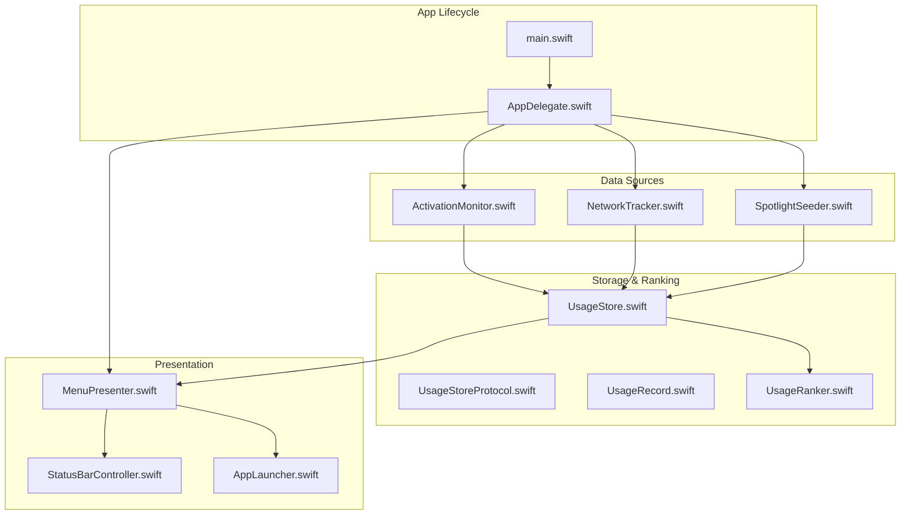
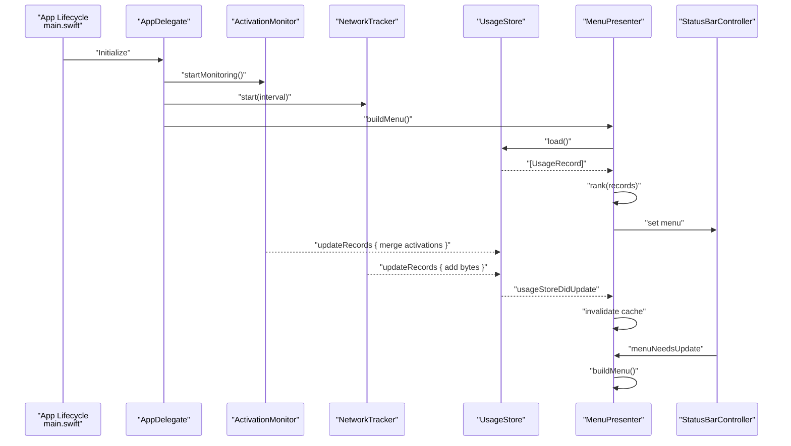
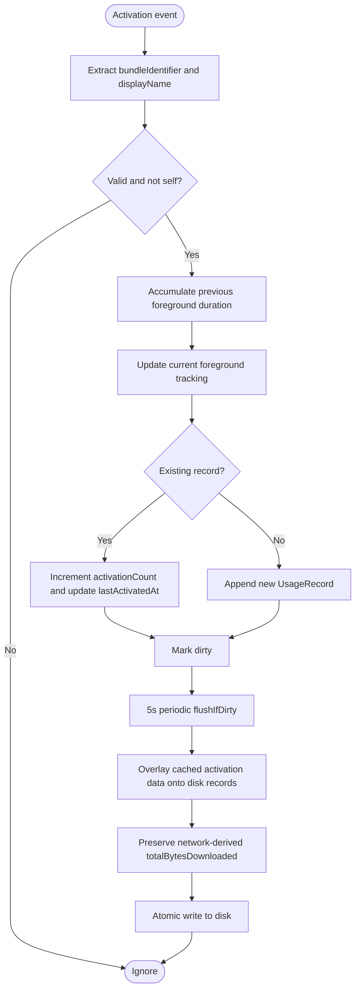
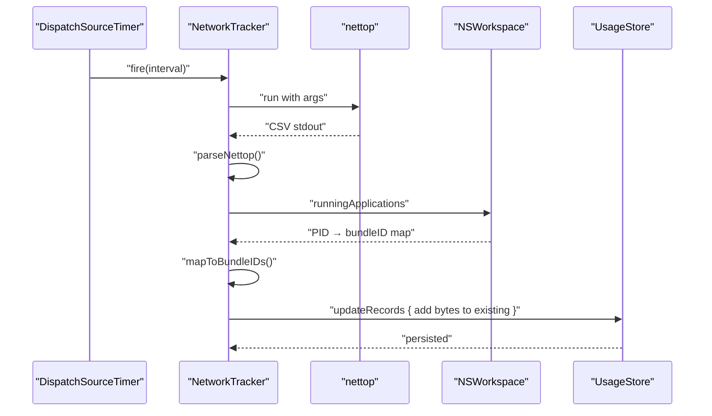
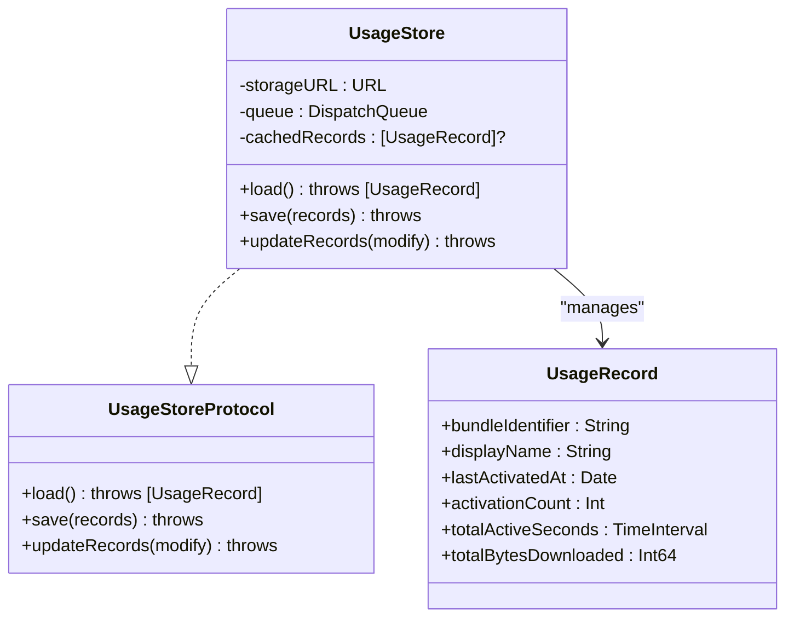
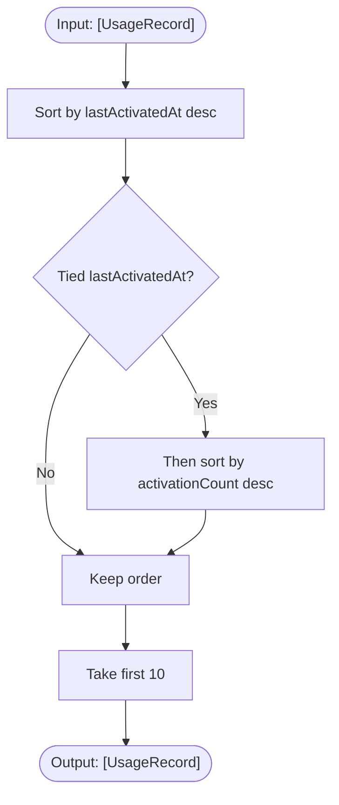
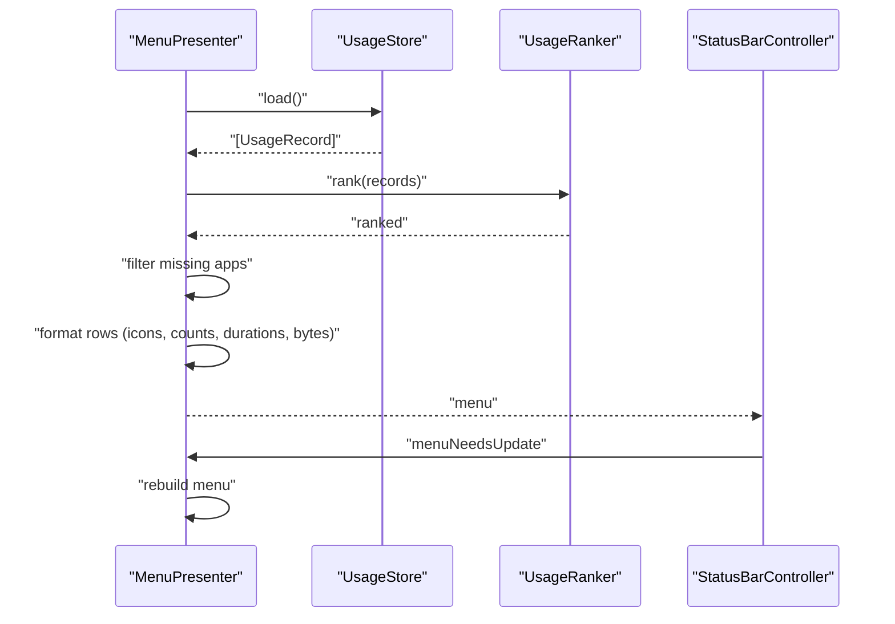
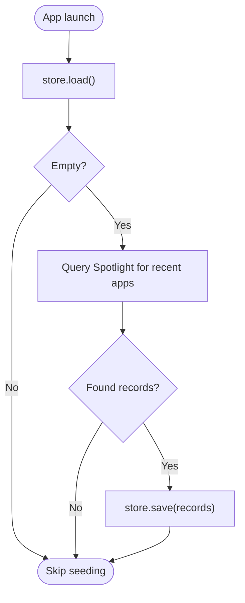
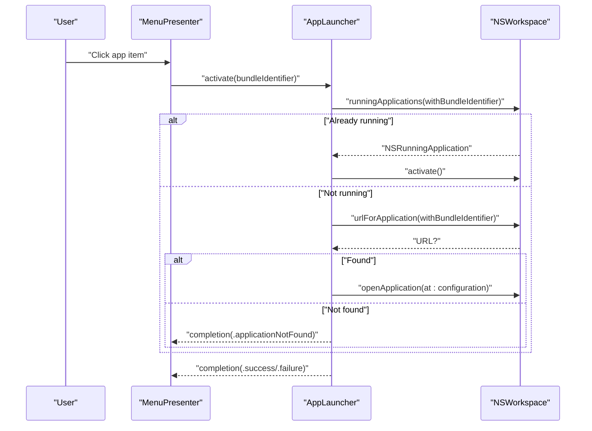
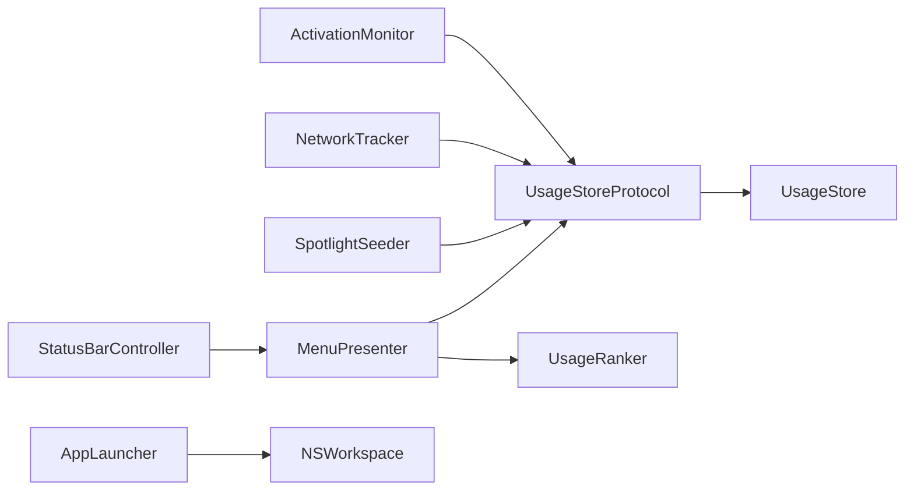

# Data Flow Design

<cite>
**Referenced Files in This Document**
- [main.swift](file://iTip/main.swift)
- [AppDelegate.swift](file://iTip/AppDelegate.swift)
- [ActivationMonitor.swift](file://iTip/ActivationMonitor.swift)
- [NetworkTracker.swift](file://iTip/NetworkTracker.swift)
- [UsageStore.swift](file://iTip/UsageStore.swift)
- [UsageStoreProtocol.swift](file://iTip/UsageStoreProtocol.swift)
- [UsageRecord.swift](file://iTip/UsageRecord.swift)
- [UsageRanker.swift](file://iTip/UsageRanker.swift)
- [MenuPresenter.swift](file://iTip/MenuPresenter.swift)
- [StatusBarController.swift](file://iTip/StatusBarController.swift)
- [SpotlightSeeder.swift](file://iTip/SpotlightSeeder.swift)
- [AppLauncher.swift](file://iTip/AppLauncher.swift)
</cite>

## Table of Contents
1. [Introduction](#introduction)
2. [Project Structure](#project-structure)
3. [Core Components](#core-components)
4. [Architecture Overview](#architecture-overview)
5. [Detailed Component Analysis](#detailed-component-analysis)
6. [Dependency Analysis](#dependency-analysis)
7. [Performance Considerations](#performance-considerations)
8. [Troubleshooting Guide](#troubleshooting-guide)
9. [Conclusion](#conclusion)

## Introduction
This document explains iTip’s data flow architecture from multi-source telemetry to UI presentation. It covers:
- Multi-source data collection: NSWorkspace activation events via ActivationMonitor and periodic network sampling via NetworkTracker
- Data transformation and persistence through UsageStore with thread-safe operations, JSON serialization/deserialization, and caching
- Ranking algorithm in UsageRanker that produces display-ready application rankings
- End-to-end flow diagrams from system events to UI updates
- Data consistency guarantees, conflict resolution, and temporal aspects of collection and presentation

## Project Structure
The application is a macOS menu bar accessory built with AppKit. The core runtime lifecycle is initialized in the application entry point and orchestrated by the AppDelegate. Data sources feed UsageStore, which emits change notifications consumed by MenuPresenter to render the status bar menu.

**Diagram sources**
- [main.swift:1-8](file://iTip/main.swift#L1-L8)
- [AppDelegate.swift:1-81](file://iTip/AppDelegate.swift#L1-L81)
- [ActivationMonitor.swift:1-157](file://iTip/ActivationMonitor.swift#L1-L157)
- [NetworkTracker.swift:1-152](file://iTip/NetworkTracker.swift#L1-L152)
- [SpotlightSeeder.swift:1-80](file://iTip/SpotlightSeeder.swift#L1-L80)
- [UsageStore.swift:1-107](file://iTip/UsageStore.swift#L1-L107)
- [UsageStoreProtocol.swift:1-14](file://iTip/UsageStoreProtocol.swift#L1-L14)
- [UsageRecord.swift:1-33](file://iTip/UsageRecord.swift#L1-L33)
- [UsageRanker.swift:1-15](file://iTip/UsageRanker.swift#L1-L15)
- [MenuPresenter.swift:1-253](file://iTip/MenuPresenter.swift#L1-L253)
- [StatusBarController.swift:1-68](file://iTip/StatusBarController.swift#L1-L68)
- [AppLauncher.swift:1-40](file://iTip/AppLauncher.swift#L1-L40)

**Section sources**
- [main.swift:1-8](file://iTip/main.swift#L1-L8)
- [AppDelegate.swift:1-81](file://iTip/AppDelegate.swift#L1-L81)

## Core Components
- ActivationMonitor: Listens to NSWorkspace activation notifications, maintains an in-memory cache, debounces writes, and merges activation metrics with network-derived metrics from disk.
- NetworkTracker: Periodically samples per-process network traffic via nettop, aggregates bytes per bundle identifier, and persists only to existing records.
- UsageStore: Thread-safe JSON-backed storage with caching, atomic updateRecords, and change notifications.
- UsageRecord: Codable model with backward-compatible decoding for cumulative metrics.
- UsageRanker: Sorts records by recency and frequency, returning top-N results.
- MenuPresenter: Builds the status bar menu, caches records/icons, listens for store updates, and formats display strings.
- StatusBarController: Manages the menu bar item and swaps menu content on demand.
- SpotlightSeeder: Pre-seeds the store on cold start using Spotlight metadata when the store is empty.
- AppLauncher: Launches or activates applications by bundle identifier.

**Section sources**
- [ActivationMonitor.swift:1-157](file://iTip/ActivationMonitor.swift#L1-L157)
- [NetworkTracker.swift:1-152](file://iTip/NetworkTracker.swift#L1-L152)
- [UsageStore.swift:1-107](file://iTip/UsageStore.swift#L1-L107)
- [UsageRecord.swift:1-33](file://iTip/UsageRecord.swift#L1-L33)
- [UsageRanker.swift:1-15](file://iTip/UsageRanker.swift#L1-L15)
- [MenuPresenter.swift:1-253](file://iTip/MenuPresenter.swift#L1-L253)
- [StatusBarController.swift:1-68](file://iTip/StatusBarController.swift#L1-L68)
- [SpotlightSeeder.swift:1-80](file://iTip/SpotlightSeeder.swift#L1-L80)
- [AppLauncher.swift:1-40](file://iTip/AppLauncher.swift#L1-L40)

## Architecture Overview
The system follows a publish-subscribe pattern around UsageStore. ActivationMonitor and NetworkTracker push updates into the store. MenuPresenter subscribes to store updates and renders the menu. SpotlightSeeder seeds initial data when the store is empty.

**Diagram sources**
- [main.swift:1-8](file://iTip/main.swift#L1-L8)
- [AppDelegate.swift:1-81](file://iTip/AppDelegate.swift#L1-L81)
- [ActivationMonitor.swift:38-156](file://iTip/ActivationMonitor.swift#L38-L156)
- [NetworkTracker.swift:26-76](file://iTip/NetworkTracker.swift#L26-L76)
- [UsageStore.swift:69-106](file://iTip/UsageStore.swift#L69-L106)
- [MenuPresenter.swift:48-147](file://iTip/MenuPresenter.swift#L48-L147)
- [StatusBarController.swift:55-66](file://iTip/StatusBarController.swift#L55-L66)

## Detailed Component Analysis

### ActivationMonitor: Foreground Activity Telemetry
- Loads records into an in-memory cache and builds an O(1) lookup index for fast updates.
- Subscribes to NSWorkspace didActivateApplication notifications on the main queue.
- Tracks foreground duration accumulation and increments activation counts.
- Debounces disk writes with a periodic timer and marks dirty state to batch writes.
- On flush, merges cached activation metrics with disk-stored network metrics to preserve bandwidth data.

**Diagram sources**
- [ActivationMonitor.swift:38-156](file://iTip/ActivationMonitor.swift#L38-L156)

**Section sources**
- [ActivationMonitor.swift:1-157](file://iTip/ActivationMonitor.swift#L1-L157)

### NetworkTracker: Periodic Network Sampling
- Schedules a periodic timer to sample nettop output at a fixed interval.
- Parses CSV to map PIDs to bytes_in, then maps PIDs to bundle identifiers using NSWorkspace.
- Aggregates bytes per bundle in memory and flushes to store by updating existing records only.
- Implements a timeout safety net to terminate long-running nettop processes.

**Diagram sources**
- [NetworkTracker.swift:26-151](file://iTip/NetworkTracker.swift#L26-L151)

**Section sources**
- [NetworkTracker.swift:1-152](file://iTip/NetworkTracker.swift#L1-L152)

### UsageStore: Thread-Safe Persistence and Caching
- Provides three operations: load, save, and updateRecords.
- updateRecords atomically loads current state (from cache or disk), applies a mutation closure, encodes to JSON, and writes atomically to disk.
- Maintains an in-memory cache and posts a usageStoreDidUpdate notification upon successful persistence.
- load returns cached records if present; otherwise decodes from disk or returns an empty array.

**Diagram sources**
- [UsageStoreProtocol.swift:1-14](file://iTip/UsageStoreProtocol.swift#L1-L14)
- [UsageStore.swift:1-107](file://iTip/UsageStore.swift#L1-L107)
- [UsageRecord.swift:1-33](file://iTip/UsageRecord.swift#L1-L33)

**Section sources**
- [UsageStore.swift:1-107](file://iTip/UsageStore.swift#L1-L107)
- [UsageStoreProtocol.swift:1-14](file://iTip/UsageStoreProtocol.swift#L1-L14)
- [UsageRecord.swift:1-33](file://iTip/UsageRecord.swift#L1-L33)

### UsageRanker: Ranking Algorithm
- Sorts records by lastActivatedAt descending, then by activationCount descending.
- Returns the top 10 records suitable for menu presentation.

**Diagram sources**
- [UsageRanker.swift:1-15](file://iTip/UsageRanker.swift#L1-L15)

**Section sources**
- [UsageRanker.swift:1-15](file://iTip/UsageRanker.swift#L1-L15)

### MenuPresenter: Presentation Pipeline
- Subscribes to usageStoreDidUpdate to invalidate local caches.
- Builds the menu by loading records, ranking them, filtering out missing apps, and formatting rows with icons and monospaced stats.
- Emits menu items with representedObject set to bundleIdentifier for launching.

**Diagram sources**
- [MenuPresenter.swift:48-147](file://iTip/MenuPresenter.swift#L48-L147)
- [UsageRanker.swift:1-15](file://iTip/UsageRanker.swift#L1-L15)
- [UsageStore.swift:24-50](file://iTip/UsageStore.swift#L24-L50)
- [StatusBarController.swift:55-66](file://iTip/StatusBarController.swift#L55-L66)

**Section sources**
- [MenuPresenter.swift:1-253](file://iTip/MenuPresenter.swift#L1-L253)

### SpotlightSeeder: Cold Start Seeding
- On cold start, checks if the store is empty; if so, queries Spotlight for recent apps and seeds the store with UsageRecord entries.

**Diagram sources**
- [SpotlightSeeder.swift:14-28](file://iTip/SpotlightSeeder.swift#L14-L28)
- [SpotlightSeeder.swift:32-78](file://iTip/SpotlightSeeder.swift#L32-L78)

**Section sources**
- [SpotlightSeeder.swift:1-80](file://iTip/SpotlightSeeder.swift#L1-L80)

### AppLauncher: Application Activation
- If the app is running, activates it directly.
- Otherwise resolves the app URL and launches it, ensuring completion is delivered on the main thread.

**Diagram sources**
- [AppLauncher.swift:11-38](file://iTip/AppLauncher.swift#L11-L38)
- [MenuPresenter.swift:43-54](file://iTip/MenuPresenter.swift#L43-L54)

**Section sources**
- [AppLauncher.swift:1-40](file://iTip/AppLauncher.swift#L1-L40)

## Dependency Analysis
- ActivationMonitor and NetworkTracker both depend on UsageStoreProtocol, enabling loose coupling and testability.
- MenuPresenter depends on UsageStoreProtocol and UsageRanker to render the menu.
- SpotlightSeeder depends on UsageStoreProtocol to seed initial data.
- StatusBarController depends on MenuPresenter to supply the menu and refresh it on demand.
- AppLauncher depends on NSWorkspace to resolve and launch applications.

**Diagram sources**
- [ActivationMonitor.swift:5-36](file://iTip/ActivationMonitor.swift#L5-L36)
- [NetworkTracker.swift:8-23](file://iTip/NetworkTracker.swift#L8-L23)
- [SpotlightSeeder.swift:8-12](file://iTip/SpotlightSeeder.swift#L8-L12)
- [MenuPresenter.swift:4-50](file://iTip/MenuPresenter.swift#L4-L50)
- [StatusBarController.swift:10-35](file://iTip/StatusBarController.swift#L10-L35)
- [AppLauncher.swift:13-28](file://iTip/AppLauncher.swift#L13-L28)
- [UsageStoreProtocol.swift:3-8](file://iTip/UsageStoreProtocol.swift#L3-L8)
- [UsageStore.swift:4-22](file://iTip/UsageStore.swift#L4-L22)

**Section sources**
- [UsageStoreProtocol.swift:1-14](file://iTip/UsageStoreProtocol.swift#L1-L14)
- [UsageStore.swift:1-107](file://iTip/UsageStore.swift#L1-L107)

## Performance Considerations
- In-memory caching: ActivationMonitor and MenuPresenter cache records to minimize disk I/O and JSON parsing overhead.
- Debounced writes: ActivationMonitor flushes every 5 seconds to batch writes and reduce filesystem churn.
- Atomic writes: UsageStore persists with atomic write options to prevent partial writes.
- Background timers: NetworkTracker uses a dedicated utility queue and a separate timeout queue to keep sampling responsive even if a subprocess blocks.
- Monospaced formatting: MenuPresenter uses precomputed tab stops to avoid layout thrashing during menu rendering.
- Spotlight seeding: Runs asynchronously to avoid blocking app launch.

[No sources needed since this section provides general guidance]

## Troubleshooting Guide
- Activation monitoring inactive: The menu indicates “Monitoring unavailable” when ActivationMonitor is not observing. Verify permissions and ensure startMonitoring was called.
- No recent apps shown: MenuPresenter filters out missing apps and may persist a cleaned dataset asynchronously. Check that applications still exist on disk.
- Launch failures: AppLauncher reports specific errors for missing apps or launch failures. The delegate displays a non-blocking alert.
- Decode errors: UsageStore logs decoding failures and rethrows to allow callers to handle corrupted files gracefully.
- Network sampling timeouts: NetworkTracker terminates long-running nettop processes after a timeout to prevent hangs.

**Section sources**
- [MenuPresenter.swift:71-114](file://iTip/MenuPresenter.swift#L71-L114)
- [AppLauncher.swift:58-79](file://iTip/AppLauncher.swift#L58-L79)
- [UsageStore.swift:44-48](file://iTip/UsageStore.swift#L44-L48)
- [NetworkTracker.swift:91-98](file://iTip/NetworkTracker.swift#L91-L98)

## Conclusion
iTip’s data flow integrates real-time foreground activity telemetry with periodic network sampling through a thread-safe, cache-aware storage layer. The presentation pipeline is reactive, updating menus in response to store changes. Consistency is ensured by merging activation metrics while preserving network-derived metrics, and by atomic writes. Temporal aspects are handled via debounced flushing and background timers, delivering responsive UI updates without compromising data integrity.