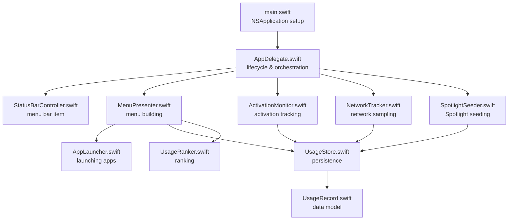
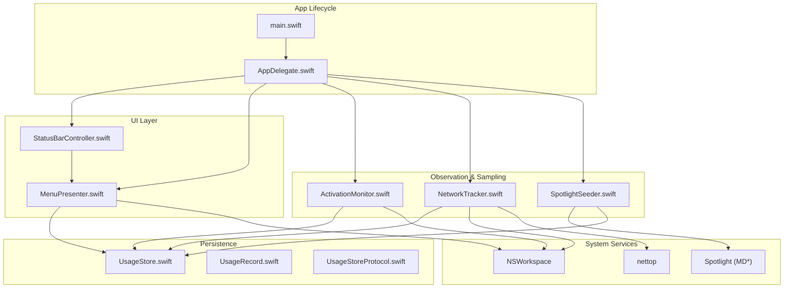
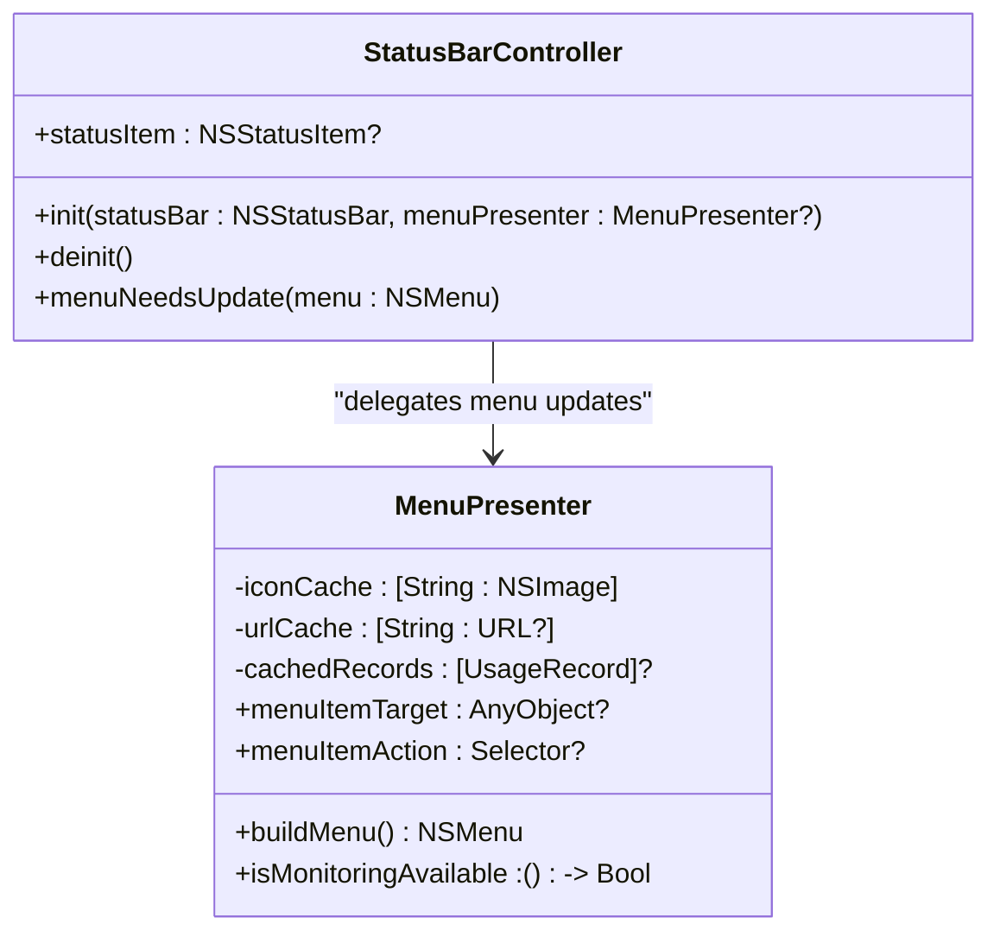
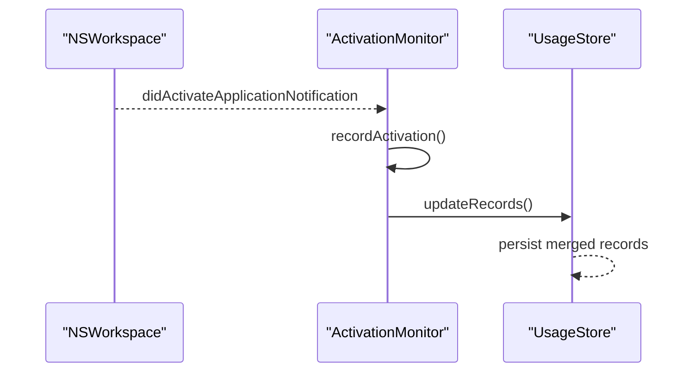
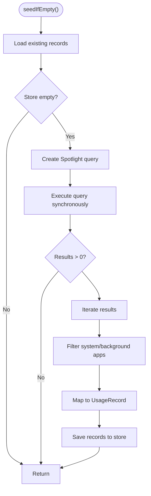
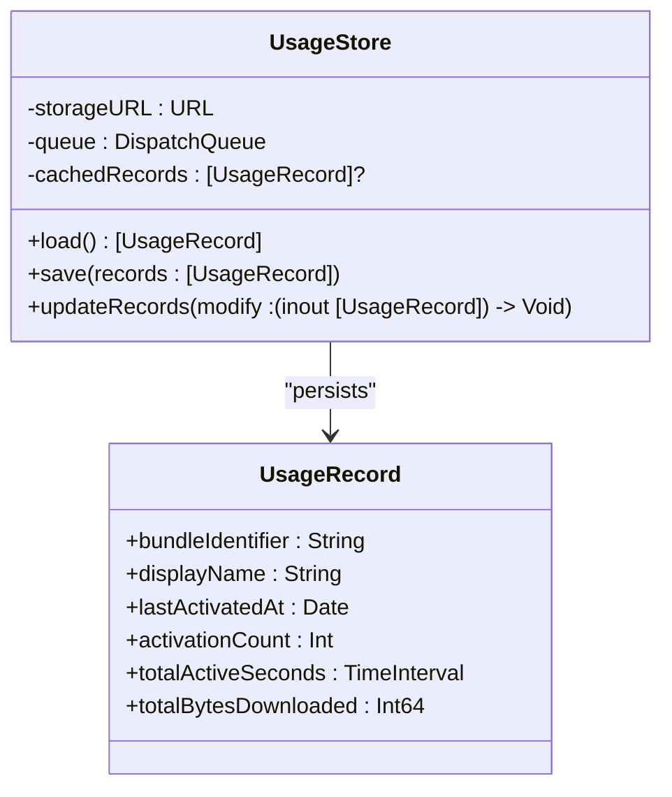
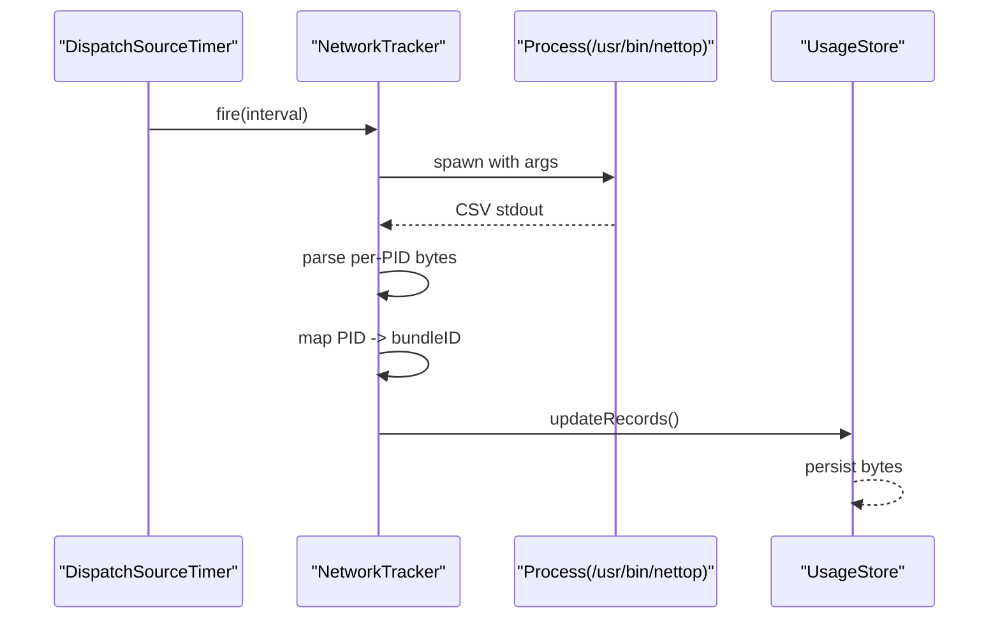
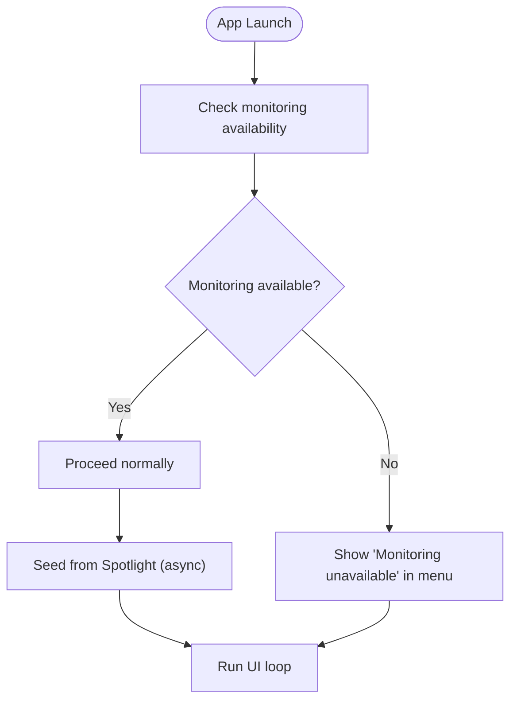
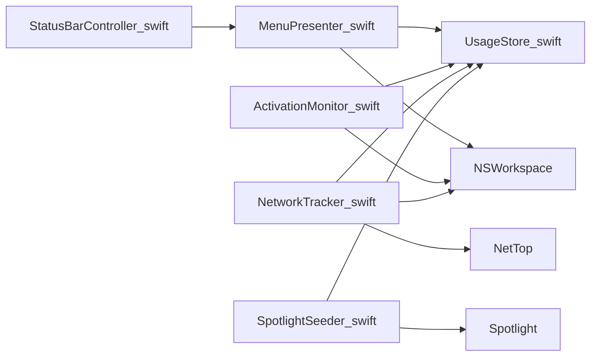

# Framework Integration

<cite>
**Referenced Files in This Document**
- [Info.plist](file://iTip/Info.plist)
- [main.swift](file://iTip/main.swift)
- [AppDelegate.swift](file://iTip/AppDelegate.swift)
- [StatusBarController.swift](file://iTip/StatusBarController.swift)
- [MenuPresenter.swift](file://iTip/MenuPresenter.swift)
- [ActivationMonitor.swift](file://iTip/ActivationMonitor.swift)
- [NetworkTracker.swift](file://iTip/NetworkTracker.swift)
- [SpotlightSeeder.swift](file://iTip/SpotlightSeeder.swift)
- [AppLauncher.swift](file://iTip/AppLauncher.swift)
- [UsageStore.swift](file://iTip/UsageStore.swift)
- [UsageRecord.swift](file://iTip/UsageRecord.swift)
- [UsageRanker.swift](file://iTip/UsageRanker.swift)
- [UsageStoreProtocol.swift](file://iTip/UsageStoreProtocol.swift)
</cite>

## Table of Contents
1. [Introduction](#introduction)
2. [Project Structure](#project-structure)
3. [Core Components](#core-components)
4. [Architecture Overview](#architecture-overview)
5. [Detailed Component Analysis](#detailed-component-analysis)
6. [Dependency Analysis](#dependency-analysis)
7. [Performance Considerations](#performance-considerations)
8. [Troubleshooting Guide](#troubleshooting-guide)
9. [Conclusion](#conclusion)

## Introduction
This document explains how iTip integrates with macOS frameworks and system services. It focuses on AppKit integration for menu bar functionality via StatusBarController, Foundation framework usage for core utilities and JSON serialization, NSWorkspace integration for application monitoring and launching, Spotlight framework integration for initial data seeding and metadata queries, system permission requirements defined in Info.plist, runtime handling of permission changes, and integration with system commands like nettop for network sampling. It also covers framework-specific considerations such as memory management patterns, background task handling, and system resource constraints.

## Project Structure
The application is a macOS menu bar accessory built with Swift and AppKit. The main entry point configures the NSApplication activation policy and delegates lifecycle to AppDelegate. Core responsibilities are distributed across components:
- StatusBarController: creates and manages the NSStatusItem and its menu.
- MenuPresenter: builds dynamic menus and displays usage metrics.
- ActivationMonitor: observes NSWorkspace notifications to track app activations.
- NetworkTracker: periodically samples per-process network usage via nettop.
- SpotlightSeeder: seeds usage data from Spotlight metadata on cold start.
- AppLauncher: activates or launches applications using NSWorkspace APIs.
- UsageStore: persists and updates usage records using Foundation JSON serialization.
- UsageRecord: serializable model for usage metrics.
- UsageRanker: ranks records for display.
- UsageStoreProtocol: abstraction for persistence.

**Diagram sources**
- [main.swift:1-8](file://iTip/main.swift#L1-L8)
- [AppDelegate.swift:1-81](file://iTip/AppDelegate.swift#L1-L81)
- [StatusBarController.swift:1-68](file://iTip/StatusBarController.swift#L1-L68)
- [MenuPresenter.swift:1-253](file://iTip/MenuPresenter.swift#L1-L253)
- [ActivationMonitor.swift:1-157](file://iTip/ActivationMonitor.swift#L1-L157)
- [NetworkTracker.swift:1-152](file://iTip/NetworkTracker.swift#L1-L152)
- [SpotlightSeeder.swift:1-80](file://iTip/SpotlightSeeder.swift#L1-L80)
- [AppLauncher.swift:1-40](file://iTip/AppLauncher.swift#L1-L40)
- [UsageStore.swift:1-107](file://iTip/UsageStore.swift#L1-L107)
- [UsageRecord.swift:1-33](file://iTip/UsageRecord.swift#L1-L33)
- [UsageRanker.swift:1-15](file://iTip/UsageRanker.swift#L1-L15)

**Section sources**
- [main.swift:1-8](file://iTip/main.swift#L1-L8)
- [AppDelegate.swift:1-81](file://iTip/AppDelegate.swift#L1-L81)

## Core Components
- AppKit integration (menu bar): StatusBarController constructs an NSStatusItem, sets a template image, and binds a dynamic menu via MenuPresenter. It implements NSMenuDelegate to refresh menu contents on demand.
- Foundation framework usage: UsageStore uses JSONSerialization via JSONEncoder/JSONDecoder for persistence, wraps file I/O in a serial dispatch queue, and posts a custom notification upon updates. UsageRecord conforms to Codable with backward-compatibility defaults.
- NSWorkspace integration: ActivationMonitor subscribes to NSWorkspace.didActivateApplicationNotification to capture foreground app changes. AppLauncher uses NSWorkspace APIs to resolve and launch applications. MenuPresenter caches app URLs and icons for performance.
- Spotlight integration: SpotlightSeeder queries the Spotlight index for application bundles with recent usage metadata and seeds the store when empty.
- System command integration: NetworkTracker executes nettop with arguments to sample per-process network traffic, parses CSV output, maps PIDs to bundle identifiers, and accumulates bytes into the store.

**Section sources**
- [StatusBarController.swift:1-68](file://iTip/StatusBarController.swift#L1-L68)
- [MenuPresenter.swift:1-253](file://iTip/MenuPresenter.swift#L1-L253)
- [ActivationMonitor.swift:1-157](file://iTip/ActivationMonitor.swift#L1-L157)
- [AppLauncher.swift:1-40](file://iTip/AppLauncher.swift#L1-L40)
- [SpotlightSeeder.swift:1-80](file://iTip/SpotlightSeeder.swift#L1-L80)
- [NetworkTracker.swift:1-152](file://iTip/NetworkTracker.swift#L1-L152)
- [UsageStore.swift:1-107](file://iTip/UsageStore.swift#L1-L107)
- [UsageRecord.swift:1-33](file://iTip/UsageRecord.swift#L1-L33)

## Architecture Overview
The application follows a modular architecture with clear separation of concerns:
- AppDelegate orchestrates initialization, starts monitors, and seeds data.
- StatusBarController and MenuPresenter collaborate to render the menu bar UI and dynamic menu items.
- ActivationMonitor and NetworkTracker independently update the store on separate cadences.
- SpotlightSeeder runs asynchronously after UI readiness to seed historical data.
- AppLauncher encapsulates launching logic and error handling.

**Diagram sources**
- [main.swift:1-8](file://iTip/main.swift#L1-L8)
- [AppDelegate.swift:1-81](file://iTip/AppDelegate.swift#L1-L81)
- [StatusBarController.swift:1-68](file://iTip/StatusBarController.swift#L1-L68)
- [MenuPresenter.swift:1-253](file://iTip/MenuPresenter.swift#L1-L253)
- [ActivationMonitor.swift:1-157](file://iTip/ActivationMonitor.swift#L1-L157)
- [NetworkTracker.swift:1-152](file://iTip/NetworkTracker.swift#L1-L152)
- [SpotlightSeeder.swift:1-80](file://iTip/SpotlightSeeder.swift#L1-L80)
- [UsageStore.swift:1-107](file://iTip/UsageStore.swift#L1-L107)
- [UsageRecord.swift:1-33](file://iTip/UsageRecord.swift#L1-L33)
- [UsageStoreProtocol.swift:1-14](file://iTip/UsageStoreProtocol.swift#L1-L14)

## Detailed Component Analysis

### AppKit Integration: StatusBarController and MenuPresenter
- StatusBarController
  - Creates an NSStatusItem and assigns a template image using a system symbol.
  - Delegates menu updates to MenuPresenter and removes itself from the status bar in deinit.
- MenuPresenter
  - Builds a monospaced, tab-styled menu with counts, durations, traffic, and relative timestamps.
  - Caches icons and app URLs to minimize repeated filesystem lookups.
  - Observes store updates to invalidate caches and refresh the menu.
  - Provides a monitoring availability indicator and a Quit action wired to NSApplication termination.

**Diagram sources**
- [StatusBarController.swift:1-68](file://iTip/StatusBarController.swift#L1-L68)
- [MenuPresenter.swift:1-253](file://iTip/MenuPresenter.swift#L1-L253)

**Section sources**
- [StatusBarController.swift:1-68](file://iTip/StatusBarController.swift#L1-L68)
- [MenuPresenter.swift:1-253](file://iTip/MenuPresenter.swift#L1-L253)

### NSWorkspace Integration: Application Monitoring and Launching
- ActivationMonitor
  - Subscribes to NSWorkspace.didActivateApplicationNotification on the main queue.
  - Maintains an in-memory cache of UsageRecord entries and debounces writes with a periodic timer.
  - Merges activation data into the persistent store while preserving network-derived bytes.
- AppLauncher
  - Checks for already running apps and activates them.
  - Resolves app URL via NSWorkspace and launches with OpenConfiguration, ensuring activation.
  - Returns structured errors for missing apps or launch failures.

**Diagram sources**
- [ActivationMonitor.swift:38-67](file://iTip/ActivationMonitor.swift#L38-L67)
- [ActivationMonitor.swift:144-155](file://iTip/ActivationMonitor.swift#L144-L155)
- [UsageStore.swift:69-105](file://iTip/UsageStore.swift#L69-L105)

**Section sources**
- [ActivationMonitor.swift:1-157](file://iTip/ActivationMonitor.swift#L1-L157)
- [AppLauncher.swift:1-40](file://iTip/AppLauncher.swift#L1-L40)

### Spotlight Integration: Initial Data Seeding and Metadata Queries
- SpotlightSeeder
  - Executes a Spotlight query for application bundles with recent usage within a time window.
  - Limits query results and filters out system/background processes.
  - Converts Spotlight metadata into UsageRecord entries and saves them when the store is empty.

**Diagram sources**
- [SpotlightSeeder.swift:14-28](file://iTip/SpotlightSeeder.swift#L14-L28)
- [SpotlightSeeder.swift:32-78](file://iTip/SpotlightSeeder.swift#L32-L78)

**Section sources**
- [SpotlightSeeder.swift:1-80](file://iTip/SpotlightSeeder.swift#L1-L80)

### Foundation Integration: Persistence and JSON Serialization
- UsageStore
  - Serializes UsageRecord arrays using JSONEncoder/JSONDecoder.
  - Ensures atomic writes and posts a custom notification on updates.
  - Provides a transaction-like updateRecords method that loads, mutates, and saves atomically.
- UsageRecord
  - Codable with backward-compatible defaults for new fields.

**Diagram sources**
- [UsageStore.swift:1-107](file://iTip/UsageStore.swift#L1-L107)
- [UsageRecord.swift:1-33](file://iTip/UsageRecord.swift#L1-L33)

**Section sources**
- [UsageStore.swift:1-107](file://iTip/UsageStore.swift#L1-L107)
- [UsageRecord.swift:1-33](file://iTip/UsageRecord.swift#L1-L33)

### Network Sampling: Integration with nettop
- NetworkTracker
  - Schedules periodic sampling using DispatchSourceTimer on a utility queue.
  - Spawns nettop with arguments to produce CSV output, reads stdout, and parses per-PID bytes.
  - Maps PIDs to bundle identifiers using NSWorkspace.runningApplications and accumulates bytes per bundle.
  - Flushes aggregated bytes to the store and implements a timeout safety net to prevent hangs.

**Diagram sources**
- [NetworkTracker.swift:25-40](file://iTip/NetworkTracker.swift#L25-L40)
- [NetworkTracker.swift:78-106](file://iTip/NetworkTracker.swift#L78-L106)
- [NetworkTracker.swift:131-150](file://iTip/NetworkTracker.swift#L131-L150)
- [UsageStore.swift:69-105](file://iTip/UsageStore.swift#L69-L105)

**Section sources**
- [NetworkTracker.swift:1-152](file://iTip/NetworkTracker.swift#L1-L152)

### Permission Requirements and Runtime Handling
- Info.plist configuration
  - LSUIElement is enabled, making the app a menu bar accessory.
  - NSPrincipalClass is set to NSApplication.
  - LSMinimumSystemVersion defines the minimum macOS version.
- Permission handling
  - MenuPresenter displays a monitoring-unavailable warning when activation monitoring is inactive.
  - AppLauncher surfaces structured errors for missing apps or launch failures.
  - ActivationMonitor guards against self-launch and empty identifiers and debounces writes to disk.

**Diagram sources**
- [AppDelegate.swift:28-33](file://iTip/AppDelegate.swift#L28-L33)
- [MenuPresenter.swift:71-76](file://iTip/MenuPresenter.swift#L71-L76)
- [ActivationMonitor.swift:69-71](file://iTip/ActivationMonitor.swift#L69-L71)

**Section sources**
- [Info.plist:1-31](file://iTip/Info.plist#L1-L31)
- [AppDelegate.swift:1-81](file://iTip/AppDelegate.swift#L1-L81)
- [MenuPresenter.swift:1-253](file://iTip/MenuPresenter.swift#L1-L253)
- [ActivationMonitor.swift:1-157](file://iTip/ActivationMonitor.swift#L1-L157)

## Dependency Analysis
- Coupling and cohesion
  - StatusBarController and MenuPresenter are tightly coupled to AppKit and cooperate to render the menu.
  - ActivationMonitor and NetworkTracker independently write to UsageStore, which centralizes persistence.
  - SpotlightSeeder depends on the store being empty and performs a one-time operation.
- External dependencies
  - NSWorkspace for app activation notifications, app resolution, and icons.
  - Spotlight (MD*) for metadata queries.
  - nettop for per-process network sampling.
- Notifications
  - UsageStore posts a custom notification after updates, allowing MenuPresenter to refresh.

**Diagram sources**
- [StatusBarController.swift:1-68](file://iTip/StatusBarController.swift#L1-L68)
- [MenuPresenter.swift:1-253](file://iTip/MenuPresenter.swift#L1-L253)
- [ActivationMonitor.swift:1-157](file://iTip/ActivationMonitor.swift#L1-L157)
- [NetworkTracker.swift:1-152](file://iTip/NetworkTracker.swift#L1-L152)
- [SpotlightSeeder.swift:1-80](file://iTip/SpotlightSeeder.swift#L1-L80)
- [UsageStore.swift:1-107](file://iTip/UsageStore.swift#L1-L107)

**Section sources**
- [UsageStoreProtocol.swift:1-14](file://iTip/UsageStoreProtocol.swift#L1-L14)

## Performance Considerations
- Memory management
  - Strong references to store and ranker are held by AppDelegate; observers and timers are retained until stopped.
  - Weak references are used in closures to avoid retain cycles (e.g., in StatusBarController menu delegate and timers).
- Background task handling
  - Spotlight seeding runs on a global utility queue to avoid blocking the UI.
  - Network sampling uses a dedicated utility queue and a separate timeout queue to ensure nettop can be terminated if needed.
- System resource constraints
  - Spotlight query limits results to reduce overhead.
  - Debounced writes in ActivationMonitor reduce disk I/O frequency.
  - MenuPresenter caches icons and URLs to minimize repeated filesystem and workspace calls.

[No sources needed since this section provides general guidance]

## Troubleshooting Guide
- Monitoring unavailable warning
  - Indicates activation monitoring is inactive; check permissions and ensure the app is allowed to receive activation notifications.
- Launch failures
  - AppLauncher returns structured errors indicating missing bundle identifiers or underlying launch errors; present a non-blocking alert to the user.
- Persistence errors
  - UsageStore logs decoding failures and rethrows to let callers decide how to handle corrupted data.
- Network sampling timeouts
  - NetworkTracker terminates nettop if it does not exit within the timeout to prevent hangs.

**Section sources**
- [MenuPresenter.swift:71-76](file://iTip/MenuPresenter.swift#L71-L76)
- [AppLauncher.swift:3-6](file://iTip/AppLauncher.swift#L3-L6)
- [AppLauncher.swift:58-79](file://iTip/AppLauncher.swift#L58-L79)
- [UsageStore.swift:44](file://iTip/UsageStore.swift#L44)
- [NetworkTracker.swift:18-19](file://iTip/NetworkTracker.swift#L18-L19)
- [NetworkTracker.swift:90-98](file://iTip/NetworkTracker.swift#L90-L98)

## Conclusion
iTip integrates deeply with macOS frameworks to deliver a lightweight, menu bar-focused application. AppKit provides the UI foundation, NSWorkspace enables system-wide app monitoring and launching, Spotlight enriches initial datasets, and Foundation powers robust persistence. System command integration via nettop supplies network telemetry. The design emphasizes resilience, performance, and user feedback, with careful attention to memory management, background task scheduling, and graceful error handling.