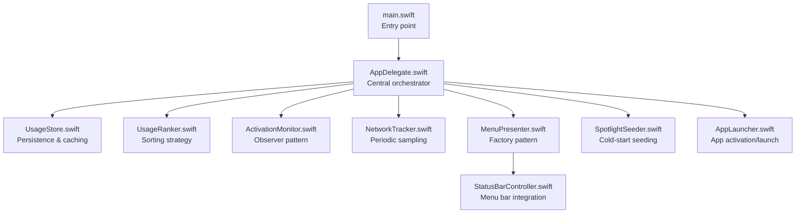
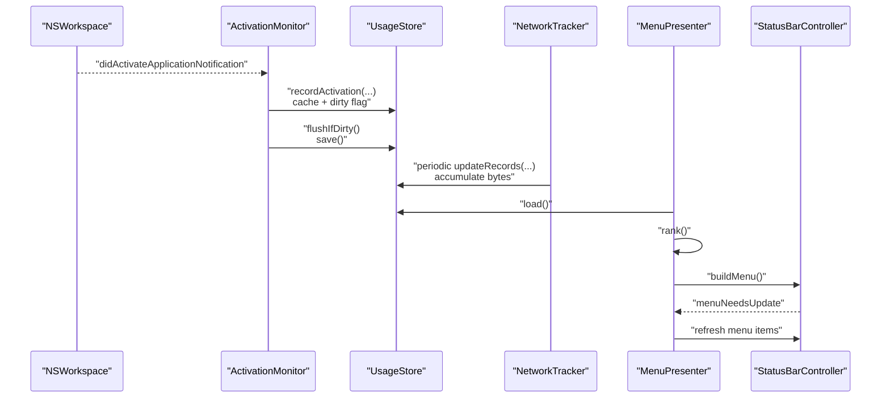
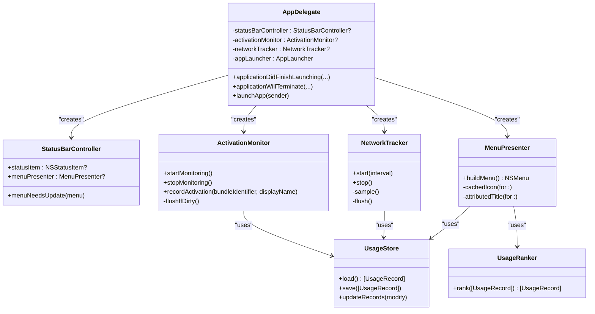
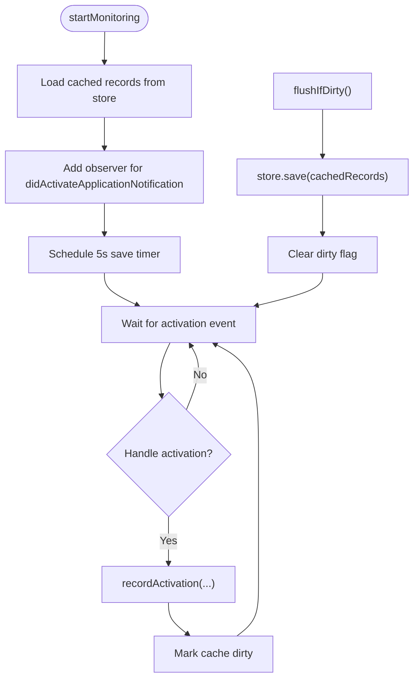
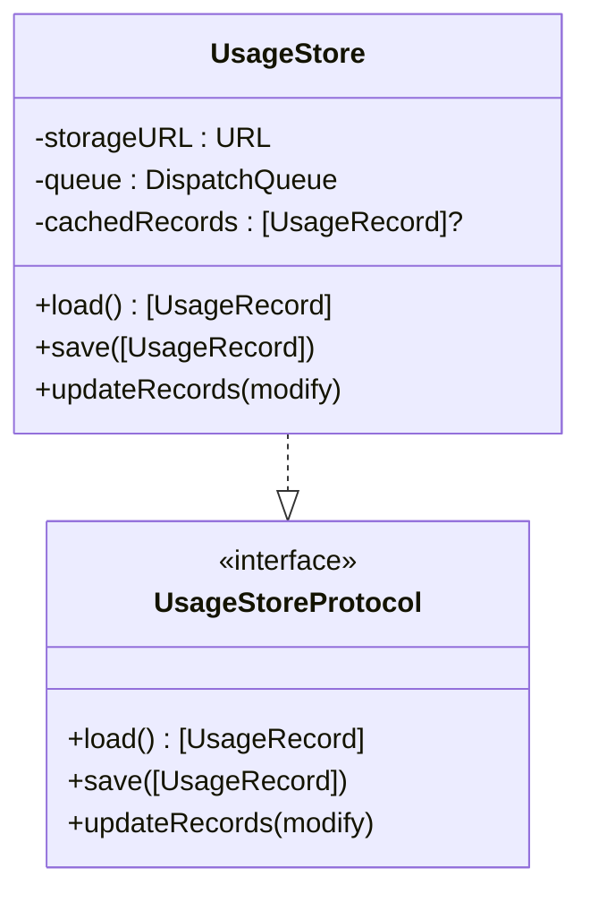
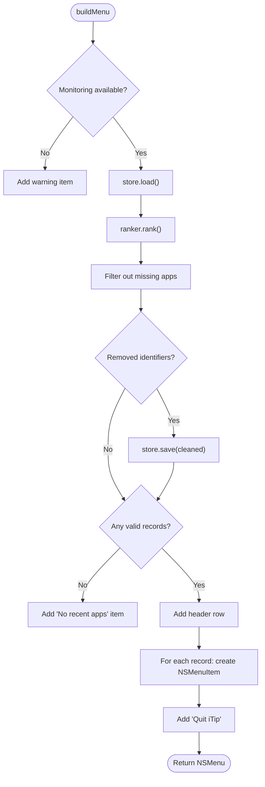
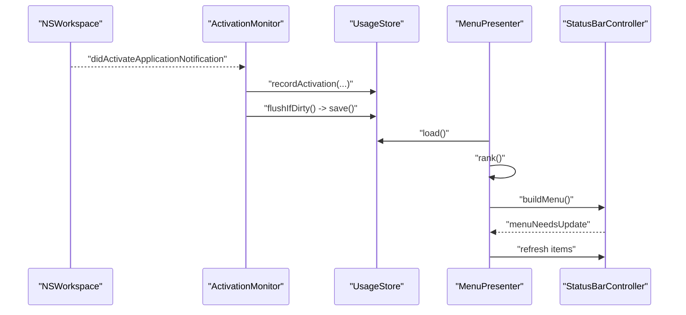
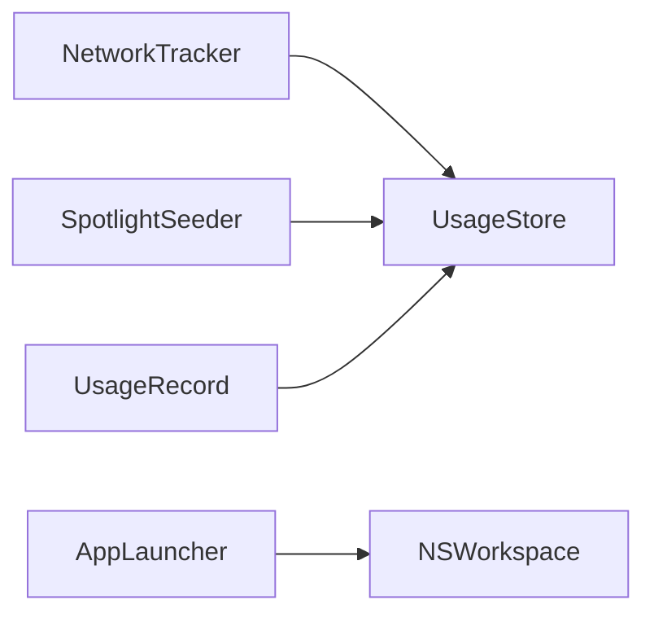
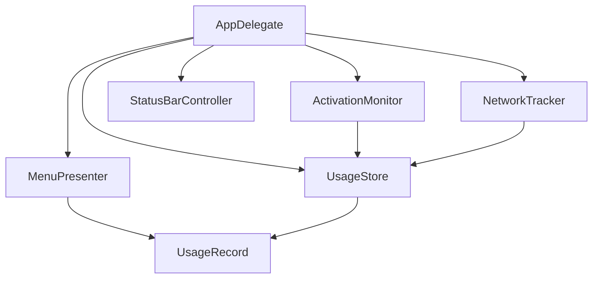

# System Overview

<cite>
**Referenced Files in This Document**
- [main.swift](file://iTip/main.swift)
- [AppDelegate.swift](file://iTip/AppDelegate.swift)
- [ActivationMonitor.swift](file://iTip/ActivationMonitor.swift)
- [UsageStore.swift](file://iTip/UsageStore.swift)
- [UsageStoreProtocol.swift](file://iTip/UsageStoreProtocol.swift)
- [UsageRanker.swift](file://iTip/UsageRanker.swift)
- [MenuPresenter.swift](file://iTip/MenuPresenter.swift)
- [StatusBarController.swift](file://iTip/StatusBarController.swift)
- [AppLauncher.swift](file://iTip/AppLauncher.swift)
- [NetworkTracker.swift](file://iTip/NetworkTracker.swift)
- [UsageRecord.swift](file://iTip/UsageRecord.swift)
- [SpotlightSeeder.swift](file://iTip/SpotlightSeeder.swift)
- [IntegrationTests.swift](file://iTipTests/IntegrationTests.swift)
</cite>

## Table of Contents
1. [Introduction](#introduction)
2. [Project Structure](#project-structure)
3. [Core Components](#core-components)
4. [Architecture Overview](#architecture-overview)
5. [Detailed Component Analysis](#detailed-component-analysis)
6. [Dependency Analysis](#dependency-analysis)
7. [Performance Considerations](#performance-considerations)
8. [Troubleshooting Guide](#troubleshooting-guide)
9. [Conclusion](#conclusion)

## Introduction
This document presents a comprehensive system overview of iTip’s macOS architecture. The application follows a modular design centered on the AppDelegate as the central orchestrator. It separates concerns across four layers:
- Data collection: ActivationMonitor and NetworkTracker gather usage signals.
- Storage: UsageStore persists and caches usage data conforming to UsageStoreProtocol.
- Presentation: MenuPresenter renders ranked usage data into a dynamic menu.
- Application management: StatusBarController integrates the menu into the menu bar; AppLauncher handles launching or activating applications; SpotlightSeeder seeds historical data on cold start.

The system leverages design patterns:
- Observer pattern for system event monitoring (NSWorkspace notifications).
- Strategy pattern for storage abstraction via UsageStoreProtocol.
- Factory pattern for menu item creation (MenuPresenter builds NSMenuItem instances).
- Singleton-like shared resources (NSApplication, NSWorkspace, NSStatusBar).

## Project Structure
The macOS app is structured around a small set of focused Swift modules. The entry point initializes the application and delegates lifecycle to AppDelegate. Subsystems are wired together in applicationDidFinishLaunching to form a cohesive pipeline from event capture to UI rendering.

**Diagram sources**
- [main.swift:1-8](file://iTip/main.swift#L1-L8)
- [AppDelegate.swift:9-34](file://iTip/AppDelegate.swift#L9-L34)
- [UsageStore.swift:4-22](file://iTip/UsageStore.swift#L4-L22)
- [UsageRanker.swift:3-15](file://iTip/UsageRanker.swift#L3-L15)
- [ActivationMonitor.swift:36-53](file://iTip/ActivationMonitor.swift#L36-L53)
- [NetworkTracker.swift:20-28](file://iTip/NetworkTracker.swift#L20-L28)
- [MenuPresenter.swift:36-112](file://iTip/MenuPresenter.swift#L36-L112)
- [StatusBarController.swift:12-36](file://iTip/StatusBarController.swift#L12-L36)
- [SpotlightSeeder.swift:16-28](file://iTip/SpotlightSeeder.swift#L16-L28)
- [AppLauncher.swift:11-38](file://iTip/AppLauncher.swift#L11-L38)

**Section sources**
- [main.swift:1-8](file://iTip/main.swift#L1-L8)
- [AppDelegate.swift:9-34](file://iTip/AppDelegate.swift#L9-L34)

## Core Components
- AppDelegate: Initializes and wires all subsystems, manages lifecycle, and exposes menu actions.
- ActivationMonitor: Observes NSWorkspace application activation events and updates UsageStore with in-memory caching and periodic flushing.
- UsageStoreProtocol: Defines the storage contract for loading, saving, and atomic updates.
- UsageStore: Implements persistent storage with JSON serialization, caching, and thread-safe queues; posts notifications on updates.
- UsageRanker: Provides ranking logic for usage records.
- MenuPresenter: Builds the dynamic menu, caches icons and URLs, and formats usage statistics.
- StatusBarController: Integrates the menu into the macOS menu bar and refreshes the menu on demand.
- NetworkTracker: Periodically samples per-process network usage and accumulates bytes into existing records.
- AppLauncher: Activates or launches applications by bundle identifier.
- SpotlightSeeder: Seeds the store with recent app usage data from Spotlight on cold start.
- UsageRecord: Data model representing app usage metrics.

**Section sources**
- [AppDelegate.swift:3-39](file://iTip/AppDelegate.swift#L3-L39)
- [ActivationMonitor.swift:3-64](file://iTip/ActivationMonitor.swift#L3-L64)
- [UsageStoreProtocol.swift:3-13](file://iTip/UsageStoreProtocol.swift#L3-L13)
- [UsageStore.swift:4-107](file://iTip/UsageStore.swift#L4-L107)
- [UsageRanker.swift:3-15](file://iTip/UsageRanker.swift#L3-L15)
- [MenuPresenter.swift:3-112](file://iTip/MenuPresenter.swift#L3-L112)
- [StatusBarController.swift:3-67](file://iTip/StatusBarController.swift#L3-L67)
- [NetworkTracker.swift:6-78](file://iTip/NetworkTracker.swift#L6-L78)
- [AppLauncher.swift:8-39](file://iTip/AppLauncher.swift#L8-L39)
- [SpotlightSeeder.swift:6-28](file://iTip/SpotlightSeeder.swift#L6-L28)
- [UsageRecord.swift:3-32](file://iTip/UsageRecord.swift#L3-L32)

## Architecture Overview
The system is event-driven and layered. At runtime:
- NSWorkspace notifications trigger ActivationMonitor to update in-memory records and schedule periodic disk writes.
- NetworkTracker periodically samples network traffic and updates existing records atomically.
- MenuPresenter reads from UsageStore, ranks records, and constructs a menu with NSMenuItem instances.
- StatusBarController attaches the menu to the menu bar and refreshes it when needed.
- AppLauncher handles user-triggered activation/launch actions.

**Diagram sources**
- [ActivationMonitor.swift:36-64](file://iTip/ActivationMonitor.swift#L36-L64)
- [UsageStore.swift:24-67](file://iTip/UsageStore.swift#L24-L67)
- [NetworkTracker.swift:20-78](file://iTip/NetworkTracker.swift#L20-L78)
- [MenuPresenter.swift:36-112](file://iTip/MenuPresenter.swift#L36-L112)
- [StatusBarController.swift:55-66](file://iTip/StatusBarController.swift#L55-L66)

## Detailed Component Analysis

### AppDelegate: Central Orchestrator
- Responsibilities:
  - Initialize store and ranker.
  - Start ActivationMonitor and NetworkTracker.
  - Wire MenuPresenter with store and ranker, and attach it to StatusBarController.
  - Seed store with Spotlight data asynchronously after UI readiness.
  - Handle termination by stopping monitors.
  - Expose menu actions to launch apps.
- Design highlights:
  - Composition over inheritance; all collaborators are injected.
  - Weak references to avoid retain cycles.
  - Asynchronous seeding to keep startup snappy.

**Diagram sources**
- [AppDelegate.swift:3-39](file://iTip/AppDelegate.swift#L3-L39)
- [StatusBarController.swift:3-36](file://iTip/StatusBarController.swift#L3-L36)
- [ActivationMonitor.swift:3-64](file://iTip/ActivationMonitor.swift#L3-L64)
- [NetworkTracker.swift:6-78](file://iTip/NetworkTracker.swift#L6-L78)
- [MenuPresenter.swift:3-112](file://iTip/MenuPresenter.swift#L3-L112)
- [UsageStore.swift:4-107](file://iTip/UsageStore.swift#L4-L107)
- [UsageRanker.swift:3-15](file://iTip/UsageRanker.swift#L3-L15)

**Section sources**
- [AppDelegate.swift:9-39](file://iTip/AppDelegate.swift#L9-L39)

### Observer Pattern: ActivationMonitor
- Observes NSWorkspace.didActivateApplicationNotification.
- Maintains in-memory cache and a debounced save timer.
- Updates UsageStore with new or existing records and accumulates foreground durations.

**Diagram sources**
- [ActivationMonitor.swift:36-64](file://iTip/ActivationMonitor.swift#L36-L64)
- [ActivationMonitor.swift:122-126](file://iTip/ActivationMonitor.swift#L122-L126)

**Section sources**
- [ActivationMonitor.swift:36-64](file://iTip/ActivationMonitor.swift#L36-L64)
- [ActivationMonitor.swift:122-126](file://iTip/ActivationMonitor.swift#L122-L126)

### Strategy Pattern: UsageStoreProtocol and UsageStore
- UsageStoreProtocol defines the contract for storage operations.
- UsageStore implements the strategy with JSON serialization, caching, and thread-safe queues.
- Notifications are posted after successful saves to decouple observers.

**Diagram sources**
- [UsageStoreProtocol.swift:3-13](file://iTip/UsageStoreProtocol.swift#L3-L13)
- [UsageStore.swift:4-107](file://iTip/UsageStore.swift#L4-L107)

**Section sources**
- [UsageStoreProtocol.swift:3-13](file://iTip/UsageStoreProtocol.swift#L3-L13)
- [UsageStore.swift:24-105](file://iTip/UsageStore.swift#L24-L105)

### Factory Pattern: MenuPresenter
- Creates NSMenuItem instances for each ranked app.
- Uses attributed strings and icons to render usage statistics.
- Caches icons and URL resolutions to minimize I/O.

**Diagram sources**
- [MenuPresenter.swift:36-112](file://iTip/MenuPresenter.swift#L36-L112)

**Section sources**
- [MenuPresenter.swift:36-112](file://iTip/MenuPresenter.swift#L36-L112)

### Data Flow: From NSWorkspace Activation to Menu Display
This sequence illustrates the end-to-end flow from an application activation event to UI refresh.

**Diagram sources**
- [ActivationMonitor.swift:36-64](file://iTip/ActivationMonitor.swift#L36-L64)
- [UsageStore.swift:24-67](file://iTip/UsageStore.swift#L24-L67)
- [MenuPresenter.swift:36-112](file://iTip/MenuPresenter.swift#L36-L112)
- [StatusBarController.swift:55-66](file://iTip/StatusBarController.swift#L55-L66)

**Section sources**
- [IntegrationTests.swift:9-50](file://iTipTests/IntegrationTests.swift#L9-L50)

### Additional Subsystems
- NetworkTracker: Periodically samples per-process network usage via a system utility, aggregates bytes per bundle identifier, and updates existing records atomically.
- AppLauncher: Handles activation of already-running apps or launches missing apps using NSWorkspace.
- SpotlightSeeder: On cold start, seeds the store with recent app usage data from Spotlight metadata when the store is empty.
- UsageRecord: Encodable struct capturing app usage metrics with backward-compatible decoding.

**Diagram sources**
- [NetworkTracker.swift:20-78](file://iTip/NetworkTracker.swift#L20-L78)
- [AppLauncher.swift:11-38](file://iTip/AppLauncher.swift#L11-L38)
- [SpotlightSeeder.swift:16-28](file://iTip/SpotlightSeeder.swift#L16-L28)
- [UsageRecord.swift:3-32](file://iTip/UsageRecord.swift#L3-L32)

**Section sources**
- [NetworkTracker.swift:20-78](file://iTip/NetworkTracker.swift#L20-L78)
- [AppLauncher.swift:11-38](file://iTip/AppLauncher.swift#L11-L38)
- [SpotlightSeeder.swift:16-28](file://iTip/SpotlightSeeder.swift#L16-L28)
- [UsageRecord.swift:3-32](file://iTip/UsageRecord.swift#L3-L32)

## Dependency Analysis
- Coupling:
  - AppDelegate depends on concrete implementations but delegates to protocols where possible (e.g., UsageStoreProtocol).
  - MenuPresenter depends on UsageStoreProtocol and UsageRanker, enabling testability and substitution.
  - ActivationMonitor and NetworkTracker depend on UsageStoreProtocol, reducing coupling to concrete storage.
- Cohesion:
  - Each module encapsulates a single responsibility: collecting, persisting, ranking, presenting, or launching.
- External dependencies:
  - NSWorkspace for app activation and URL resolution.
  - NSStatusBar for menu bar integration.
  - NSRunningApplication for app state.
  - Spotlight metadata for seeding.
  - System utility for network sampling.

**Diagram sources**
- [AppDelegate.swift:9-39](file://iTip/AppDelegate.swift#L9-L39)
- [ActivationMonitor.swift:3-64](file://iTip/ActivationMonitor.swift#L3-L64)
- [NetworkTracker.swift:6-78](file://iTip/NetworkTracker.swift#L6-L78)
- [MenuPresenter.swift:3-112](file://iTip/MenuPresenter.swift#L3-L112)
- [StatusBarController.swift:3-36](file://iTip/StatusBarController.swift#L3-L36)
- [UsageStore.swift:4-107](file://iTip/UsageStore.swift#L4-L107)
- [UsageRecord.swift:3-32](file://iTip/UsageRecord.swift#L3-L32)

**Section sources**
- [AppDelegate.swift:9-39](file://iTip/AppDelegate.swift#L9-L39)
- [UsageStoreProtocol.swift:3-13](file://iTip/UsageStoreProtocol.swift#L3-L13)

## Performance Considerations
- In-memory caching:
  - ActivationMonitor caches records and marks dirty to reduce disk I/O frequency.
  - UsageStore caches loaded records and serializes writes on a dedicated queue.
- Debouncing:
  - ActivationMonitor flushes every 5 seconds to batch writes.
  - NetworkTracker batches per-interval samples and flushes periodically.
- UI responsiveness:
  - Spotlight seeding runs on a utility queue to avoid blocking launch.
  - MenuPresenter caches icons and URL lookups to minimize repeated disk and framework calls.
- Serialization:
  - JSON encoder/decoder used for compact persistence; errors are logged and rethrown to callers for robust handling.

[No sources needed since this section provides general guidance]

## Troubleshooting Guide
- Monitoring unavailable:
  - MenuPresenter displays a warning when monitoring is inactive; verify permissions and ensure ActivationMonitor is started.
- Launch failures:
  - AppLauncher reports specific errors when an app cannot be found or fails to launch; the delegate shows an alert with actionable messages.
- Store corruption:
  - UsageStore logs decoding errors and rethrows them; ensure the JSON file is valid or delete it to reset.
- Network sampling:
  - NetworkTracker relies on a system utility; if unavailable, sampling will silently skip and accumulate bytes until the next interval.

**Section sources**
- [MenuPresenter.swift:39-44](file://iTip/MenuPresenter.swift#L39-L44)
- [AppLauncher.swift:3-6](file://iTip/AppLauncher.swift#L3-L6)
- [AppLauncher.swift:58-73](file://iTip/AppLauncher.swift#L58-L73)
- [UsageStore.swift:44-47](file://iTip/UsageStore.swift#L44-L47)
- [NetworkTracker.swift:80-97](file://iTip/NetworkTracker.swift#L80-L97)

## Conclusion
iTip’s architecture centers on a clean separation of concerns and strong design patterns:
- AppDelegate orchestrates subsystems and manages lifecycle.
- Observer pattern captures system events; Strategy pattern abstracts storage; Factory pattern constructs UI elements.
- The system emphasizes modularity, testability, and resilience, with asynchronous operations ensuring a responsive user experience.

[No sources needed since this section summarizes without analyzing specific files]