# Application Lifecycle Management

<cite>
**Referenced Files in This Document**
- [main.swift](file://iTip/main.swift)
- [AppDelegate.swift](file://iTip/AppDelegate.swift)
- [AppLauncher.swift](file://iTip/AppLauncher.swift)
- [StatusBarController.swift](file://iTip/StatusBarController.swift)
- [MenuPresenter.swift](file://iTip/MenuPresenter.swift)
- [UsageStore.swift](file://iTip/UsageStore.swift)
- [UsageStoreProtocol.swift](file://iTip/UsageStoreProtocol.swift)
- [UsageRanker.swift](file://iTip/UsageRanker.swift)
- [ActivationMonitor.swift](file://iTip/ActivationMonitor.swift)
- [NetworkTracker.swift](file://iTip/NetworkTracker.swift)
- [SpotlightSeeder.swift](file://iTip/SpotlightSeeder.swift)
- [UsageRecord.swift](file://iTip/UsageRecord.swift)
- [Info.plist](file://iTip/Info.plist)
</cite>

## Table of Contents
1. [Introduction](#introduction)
2. [Project Structure](#project-structure)
3. [Core Components](#core-components)
4. [Architecture Overview](#architecture-overview)
5. [Detailed Component Analysis](#detailed-component-analysis)
6. [Dependency Analysis](#dependency-analysis)
7. [Performance Considerations](#performance-considerations)
8. [Troubleshooting Guide](#troubleshooting-guide)
9. [Conclusion](#conclusion)

## Introduction
This document explains iTip’s application lifecycle management system with a focus on the AppDelegate as the central orchestrator. It covers the main.swift entry point, component initialization sequence, application startup and shutdown procedures, dependency wiring, state management, background processing, and system integration points. It also provides guidance on error handling during startup, graceful shutdown, memory management, and resource cleanup.

## Project Structure
The macOS menu bar application consists of a small set of focused Swift modules:
- Entry point: main.swift initializes the NSApplication, sets the accessory activation policy, assigns AppDelegate, and starts the run loop.
- Lifecycle coordinator: AppDelegate wires core subsystems, manages UI integration, and handles termination.
- UI integration: StatusBarController integrates with the system menu bar; MenuPresenter builds dynamic menus from usage data.
- Data and analytics: UsageStore persists and updates usage records; ActivationMonitor tracks foreground app activations; NetworkTracker periodically samples per-process network traffic; SpotlightSeeder seeds initial data on cold start.
- Utilities: AppLauncher encapsulates launching other applications by bundle identifier.

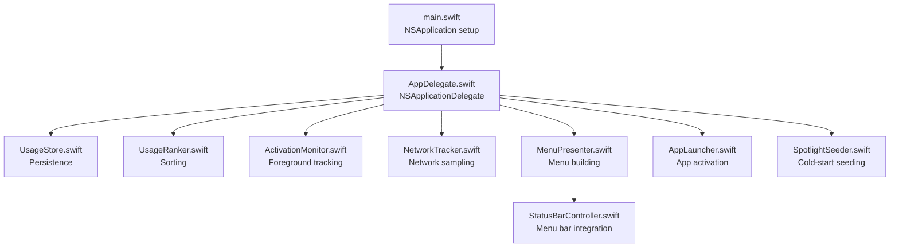

**Diagram sources**
- [main.swift](file://iTip/main.swift)
- [AppDelegate.swift](file://iTip/AppDelegate.swift)
- [UsageStore.swift](file://iTip/UsageStore.swift)
- [UsageRanker.swift](file://iTip/UsageRanker.swift)
- [ActivationMonitor.swift](file://iTip/ActivationMonitor.swift)
- [NetworkTracker.swift](file://iTip/NetworkTracker.swift)
- [MenuPresenter.swift](file://iTip/MenuPresenter.swift)
- [StatusBarController.swift](file://iTip/StatusBarController.swift)
- [AppLauncher.swift](file://iTip/AppLauncher.swift)
- [SpotlightSeeder.swift](file://iTip/SpotlightSeeder.swift)

**Section sources**
- [main.swift](file://iTip/main.swift)
- [Info.plist](file://iTip/Info.plist)

## Core Components
- main.swift: Creates NSApplication, instantiates AppDelegate, sets activation policy to accessory, assigns delegate, and runs the application.
- AppDelegate: Implements NSApplicationDelegate; constructs and wires components on launch; handles termination; exposes status bar controller; routes menu actions to AppLauncher.
- StatusBarController: Manages the NSStatusItem, applies icon/title, binds menu, and cleans up on deinit.
- MenuPresenter: Builds dynamic menus from UsageStore and UsageRanker; caches icons and URLs; exposes “Quit” action.
- UsageStore: Thread-safe JSON persistence for UsageRecord with atomic updates and change notifications.
- UsageRanker: Ranks records by recency and frequency.
- ActivationMonitor: Observes foreground app activation, maintains an in-memory cache, and periodically flushes to disk.
- NetworkTracker: Periodically samples per-process network usage via nettop and merges byte counts into existing records.
- SpotlightSeeder: Seeds UsageStore with recent apps from Spotlight on cold start.
- AppLauncher: Launches or activates another app by bundle identifier and reports results on the main thread.
- UsageRecord: Codable model for usage metrics; supports backward-compatible decoding.
- UsageStoreProtocol: Protocol abstraction for persistence operations.

**Section sources**
- [main.swift](file://iTip/main.swift)
- [AppDelegate.swift](file://iTip/AppDelegate.swift)
- [StatusBarController.swift](file://iTip/StatusBarController.swift)
- [MenuPresenter.swift](file://iTip/MenuPresenter.swift)
- [UsageStore.swift](file://iTip/UsageStore.swift)
- [UsageRanker.swift](file://iTip/UsageRanker.swift)
- [ActivationMonitor.swift](file://iTip/ActivationMonitor.swift)
- [NetworkTracker.swift](file://iTip/NetworkTracker.swift)
- [SpotlightSeeder.swift](file://iTip/SpotlightSeeder.swift)
- [AppLauncher.swift](file://iTip/AppLauncher.swift)
- [UsageRecord.swift](file://iTip/UsageRecord.swift)
- [UsageStoreProtocol.swift](file://iTip/UsageStoreProtocol.swift)

## Architecture Overview
The AppDelegate coordinates a small ecosystem of collaborators:
- On launch, it creates the store and ranker, starts activation and network monitors, builds the menu presenter, and attaches it to the status bar controller.
- It schedules Spotlight seeding asynchronously after UI readiness to avoid blocking launch.
- On termination, it stops monitors to flush pending writes and release resources.
- MenuPresenter delegates app launch actions to AppLauncher, which uses NSWorkspace APIs.

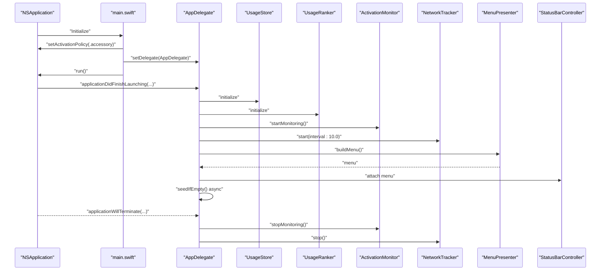

**Diagram sources**
- [main.swift](file://iTip/main.swift)
- [AppDelegate.swift](file://iTip/AppDelegate.swift)
- [UsageStore.swift](file://iTip/UsageStore.swift)
- [UsageRanker.swift](file://iTip/UsageRanker.swift)
- [ActivationMonitor.swift](file://iTip/ActivationMonitor.swift)
- [NetworkTracker.swift](file://iTip/NetworkTracker.swift)
- [MenuPresenter.swift](file://iTip/MenuPresenter.swift)
- [StatusBarController.swift](file://iTip/StatusBarController.swift)

## Detailed Component Analysis

### AppDelegate: Central Orchestrator
Responsibilities:
- Initialize store and ranker instances.
- Start ActivationMonitor and NetworkTracker.
- Construct MenuPresenter, wire target/action, and expose monitoring availability closure.
- Attach StatusBarController to present the menu.
- Seed usage store with Spotlight data asynchronously after UI readiness.
- Stop monitors on termination to flush and release resources.

Initialization sequence highlights:
- Store and ranker created early to feed MenuPresenter.
- ActivationMonitor and NetworkTracker started with appropriate intervals.
- MenuPresenter configured with target/action and monitoring availability closure.
- StatusBarController initialized with MenuPresenter.
- Spotlight seeding scheduled on a utility dispatch queue to avoid blocking launch.

Shutdown handling:
- Stops ActivationMonitor and NetworkTracker to cancel timers and flush pending writes.

Error handling:
- MenuPresenter delegates app launch actions to AppLauncher, which reports failures via a completion handler. The AppDelegate surfaces user-visible alerts for launch errors.

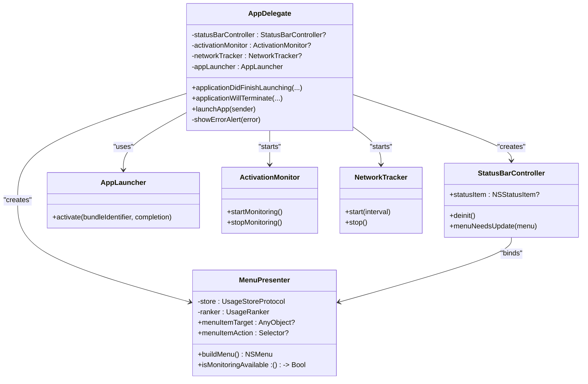

**Diagram sources**
- [AppDelegate.swift](file://iTip/AppDelegate.swift)
- [StatusBarController.swift](file://iTip/StatusBarController.swift)
- [MenuPresenter.swift](file://iTip/MenuPresenter.swift)
- [AppLauncher.swift](file://iTip/AppLauncher.swift)
- [ActivationMonitor.swift](file://iTip/ActivationMonitor.swift)
- [NetworkTracker.swift](file://iTip/NetworkTracker.swift)

**Section sources**
- [AppDelegate.swift](file://iTip/AppDelegate.swift)

### main.swift: Entry Point Integration
- Creates NSApplication singleton.
- Instantiates AppDelegate and sets it as the delegate.
- Sets activation policy to accessory to integrate with the menu bar.
- Starts the application run loop.

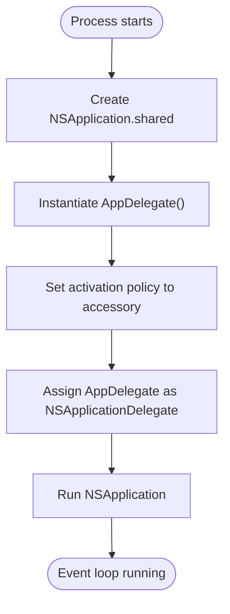

**Diagram sources**
- [main.swift](file://iTip/main.swift)
- [Info.plist](file://iTip/Info.plist)

**Section sources**
- [main.swift](file://iTip/main.swift)
- [Info.plist](file://iTip/Info.plist)

### StatusBarController: Menu Bar Integration
- Initializes an NSStatusItem with a template SF Symbol icon.
- Binds a menu built by MenuPresenter and acts as its delegate.
- Removes itself from the status bar in deinit to clean up resources.

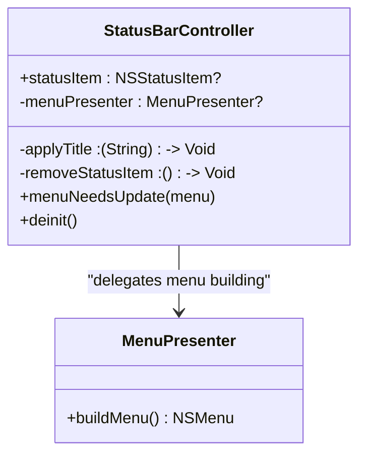

**Diagram sources**
- [StatusBarController.swift](file://iTip/StatusBarController.swift)
- [MenuPresenter.swift](file://iTip/MenuPresenter.swift)

**Section sources**
- [StatusBarController.swift](file://iTip/StatusBarController.swift)

### MenuPresenter: Dynamic Menu Building
- Loads records from UsageStore, ranks them, filters out missing apps, and builds a formatted NSMenu.
- Caches app icons and URL resolutions to reduce overhead.
- Exposes target/action for menu item clicks and a monitoring availability closure.
- Provides “Quit” action bound to NSApplication terminate selector.

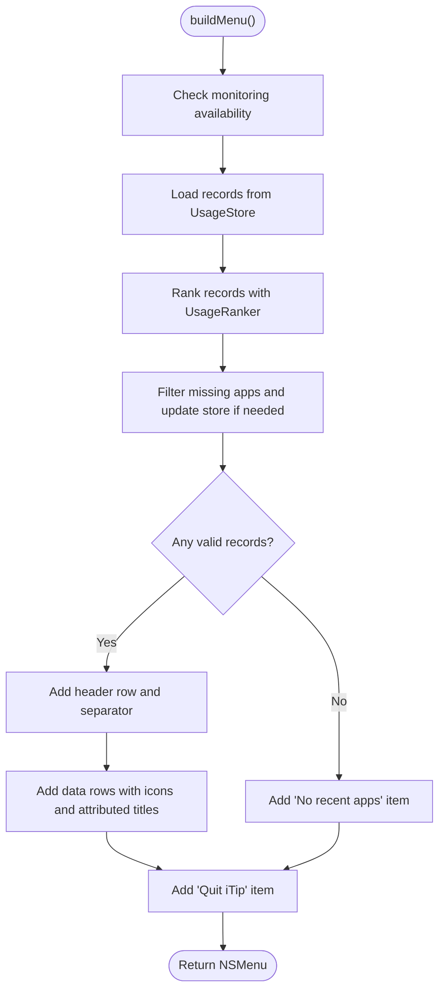

**Diagram sources**
- [MenuPresenter.swift](file://iTip/MenuPresenter.swift)
- [UsageStore.swift](file://iTip/UsageStore.swift)
- [UsageRanker.swift](file://iTip/UsageRanker.swift)

**Section sources**
- [MenuPresenter.swift](file://iTip/MenuPresenter.swift)

### UsageStore: Persistence and Concurrency
- Provides load/save/updateRecords with a serial queue to ensure thread safety.
- Caches loaded records to minimize disk I/O.
- Emits a usageStoreDidUpdate notification after persistence.
- Supports backward-compatible decoding for UsageRecord.

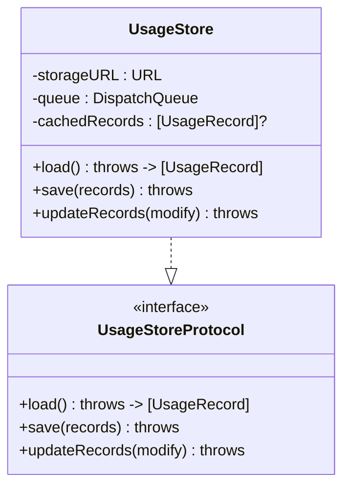

**Diagram sources**
- [UsageStore.swift](file://iTip/UsageStore.swift)
- [UsageStoreProtocol.swift](file://iTip/UsageStoreProtocol.swift)

**Section sources**
- [UsageStore.swift](file://iTip/UsageStore.swift)
- [UsageStoreProtocol.swift](file://iTip/UsageStoreProtocol.swift)

### ActivationMonitor: Foreground Tracking
- Observes NSWorkspace.didActivateApplicationNotification on the main queue.
- Maintains an in-memory cache of records with an index for O(1) lookup.
- Debounces disk writes with a periodic timer and marks dirty state when changes occur.
- Merges activation data into disk-stored records while preserving network-derived bytes.

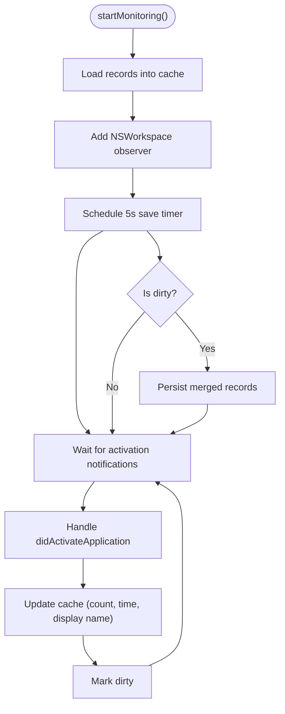

**Diagram sources**
- [ActivationMonitor.swift](file://iTip/ActivationMonitor.swift)
- [UsageStore.swift](file://iTip/UsageStore.swift)

**Section sources**
- [ActivationMonitor.swift](file://iTip/ActivationMonitor.swift)

### NetworkTracker: Background Sampling
- Schedules periodic sampling of per-process network usage via nettop.
- Parses CSV output, maps PIDs to bundle identifiers, accumulates bytes, and flushes to store.
- Uses a timeout queue to ensure the sampling process does not hang indefinitely.
- Preserves existing records and only updates bytes for known apps.

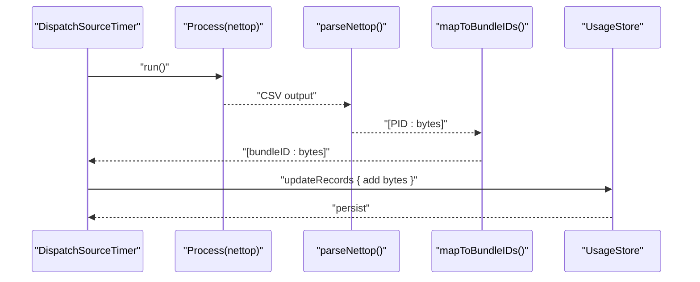

**Diagram sources**
- [NetworkTracker.swift](file://iTip/NetworkTracker.swift)
- [UsageStore.swift](file://iTip/UsageStore.swift)

**Section sources**
- [NetworkTracker.swift](file://iTip/NetworkTracker.swift)

### SpotlightSeeder: Cold-Start Seeding
- Queries Spotlight for recent application bundles and seeds UsageStore if empty.
- Skips system/background processes and avoids self.
- Runs off the main thread to avoid blocking launch.

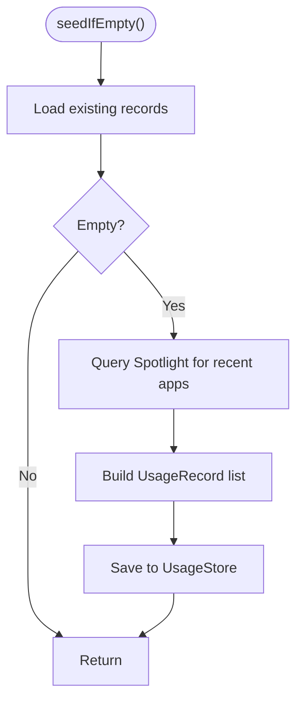

**Diagram sources**
- [SpotlightSeeder.swift](file://iTip/SpotlightSeeder.swift)
- [UsageStore.swift](file://iTip/UsageStore.swift)

**Section sources**
- [SpotlightSeeder.swift](file://iTip/SpotlightSeeder.swift)

### AppLauncher: Application Activation
- Detects if the target app is already running and activates it.
- Otherwise resolves the app URL and launches it with NSWorkspace, reporting success/failure on the main thread.
- Errors are surfaced to AppDelegate for user alerts.

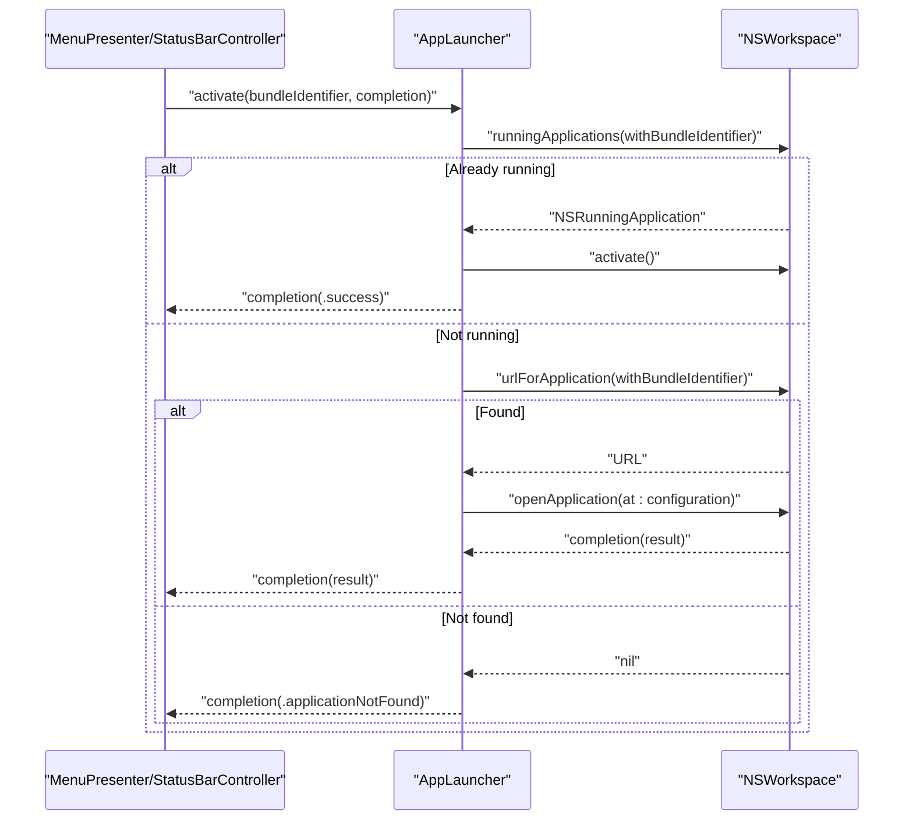

**Diagram sources**
- [AppLauncher.swift](file://iTip/AppLauncher.swift)

**Section sources**
- [AppLauncher.swift](file://iTip/AppLauncher.swift)

## Dependency Analysis
- Coupling: AppDelegate depends on concrete implementations of store, ranker, monitors, presenter, and launcher. This simplifies startup but reduces testability. Consider injecting protocols for store/ranker to enable mocking.
- Cohesion: Each component has a single responsibility—persistence, ranking, monitoring, networking, UI, or launching.
- External integrations: NSWorkspace, NSStatusItem, NSApplication, NSNotificationCenter, and system processes (nettop).
- Notifications: UsageStore posts usageStoreDidUpdate to signal UI refresh.

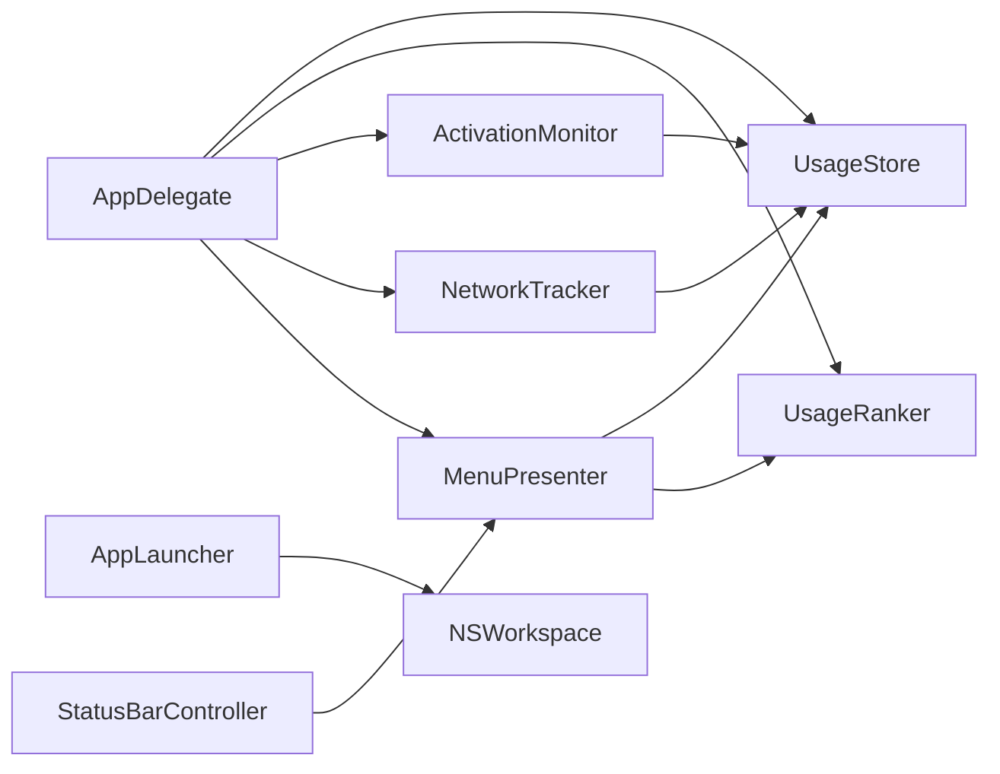

**Diagram sources**
- [AppDelegate.swift](file://iTip/AppDelegate.swift)
- [MenuPresenter.swift](file://iTip/MenuPresenter.swift)
- [ActivationMonitor.swift](file://iTip/ActivationMonitor.swift)
- [NetworkTracker.swift](file://iTip/NetworkTracker.swift)
- [UsageStore.swift](file://iTip/UsageStore.swift)
- [UsageRanker.swift](file://iTip/UsageRanker.swift)
- [StatusBarController.swift](file://iTip/StatusBarController.swift)
- [AppLauncher.swift](file://iTip/AppLauncher.swift)

**Section sources**
- [AppDelegate.swift](file://iTip/AppDelegate.swift)
- [UsageStore.swift](file://iTip/UsageStore.swift)
- [UsageRanker.swift](file://iTip/UsageRanker.swift)
- [ActivationMonitor.swift](file://iTip/ActivationMonitor.swift)
- [NetworkTracker.swift](file://iTip/NetworkTracker.swift)
- [MenuPresenter.swift](file://iTip/MenuPresenter.swift)
- [StatusBarController.swift](file://iTip/StatusBarController.swift)
- [AppLauncher.swift](file://iTip/AppLauncher.swift)

## Performance Considerations
- Disk I/O reduction: UsageStore caches records and uses a serial queue for atomic operations.
- UI responsiveness: Spotlight seeding runs on a utility queue; menu building defers heavy work to background threads where appropriate.
- Monitoring cadence: ActivationMonitor flushes every 5 seconds; NetworkTracker samples every 10 seconds. Tune intervals based on system load and accuracy needs.
- Memory footprint: ActivationMonitor maintains an in-memory cache; consider eviction policies for very long-running sessions.
- Icon caching: MenuPresenter caches app icons and URL lookups to reduce repeated disk and catalog queries.

[No sources needed since this section provides general guidance]

## Troubleshooting Guide
Common issues and remedies:
- Application not launching from menu:
  - Verify bundle identifier correctness and presence in Spotlight/System.
  - Check AppLauncher error handling and user alerts.
- No recent apps shown:
  - Confirm SpotlightSeeder ran and UsageStore is seeded.
  - Ensure MenuPresenter filtering excludes missing apps and updates store accordingly.
- Frequent crashes on quit:
  - Ensure applicationWillTerminate stops monitors and allows flush to complete.
- High CPU usage:
  - Adjust ActivationMonitor and NetworkTracker intervals.
  - Verify timers are invalidated on stop.

Startup error handling patterns:
- Use do/catch around store load/save/update to surface recoverable errors.
- Wrap asynchronous seeding in a utility queue and ignore failures to avoid blocking launch.
- Report AppLaunchError via user alerts with actionable messages.

Shutdown and cleanup:
- Cancel timers and observers in stopMonitoring/stop.
- Ensure deinit removes status items to prevent dangling references.
- Post notifications after persistence to trigger UI refresh.

**Section sources**
- [AppDelegate.swift](file://iTip/AppDelegate.swift)
- [AppLauncher.swift](file://iTip/AppLauncher.swift)
- [ActivationMonitor.swift](file://iTip/ActivationMonitor.swift)
- [NetworkTracker.swift](file://iTip/NetworkTracker.swift)
- [SpotlightSeeder.swift](file://iTip/SpotlightSeeder.swift)
- [StatusBarController.swift](file://iTip/StatusBarController.swift)

## Conclusion
iTip’s lifecycle is orchestrated by AppDelegate, which wires the store, ranker, monitors, presenter, and launcher, and integrates with the system menu bar. Startup is efficient and non-blocking thanks to background seeding and careful scheduling. Shutdown gracefully stops monitors and flushes state. The modular design supports future enhancements such as protocol-based dependency injection for improved testability and configurability.