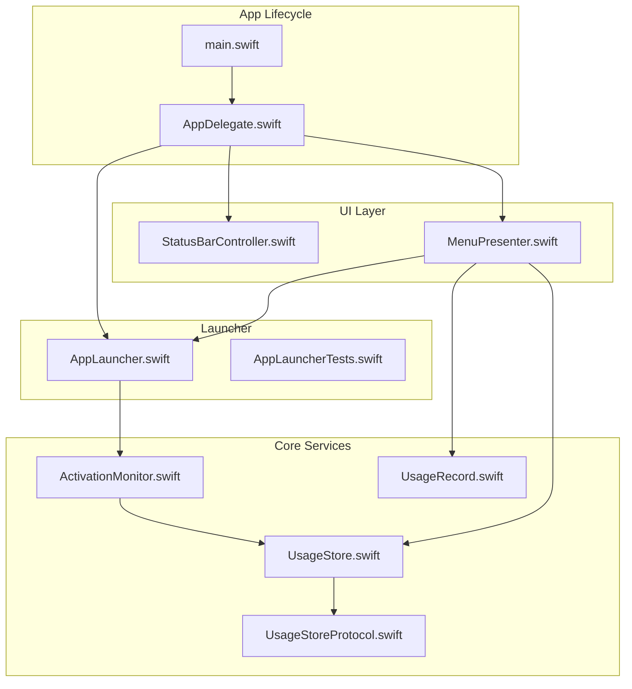
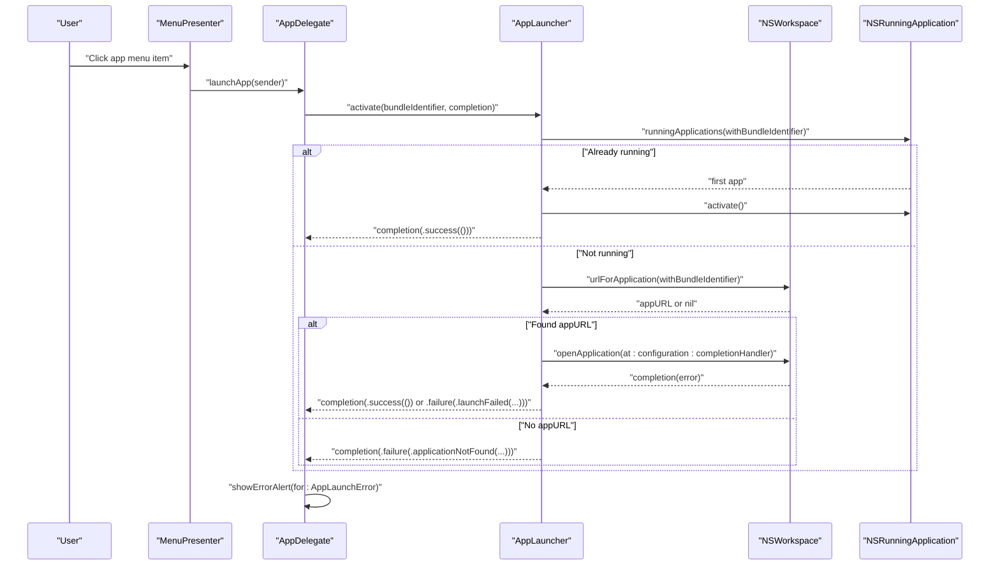
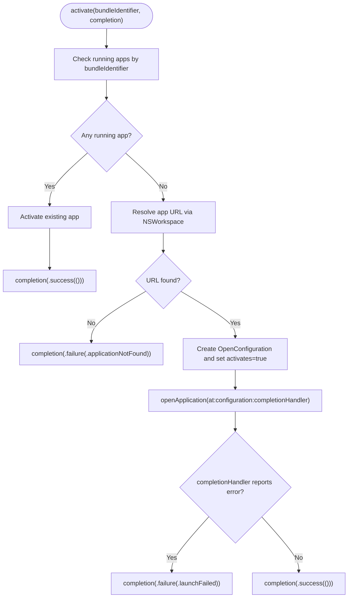
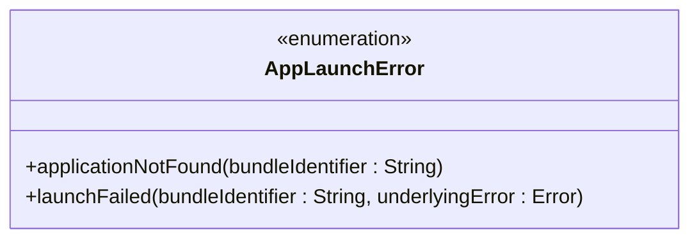
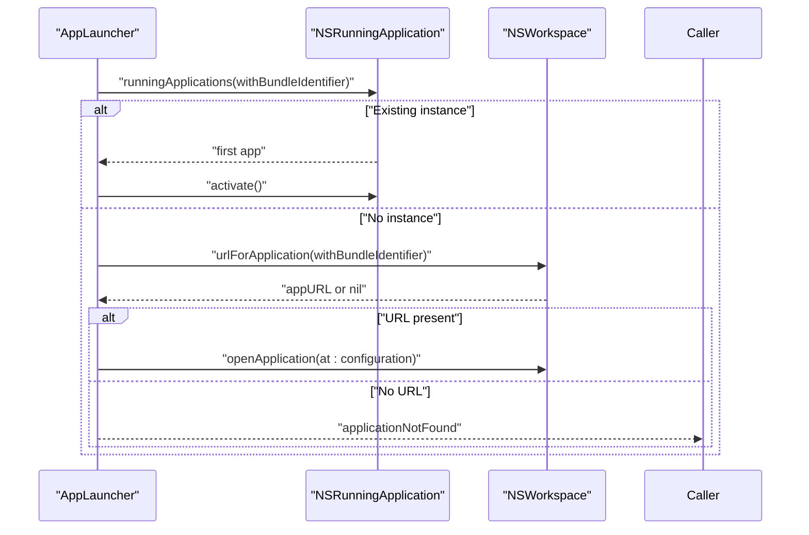
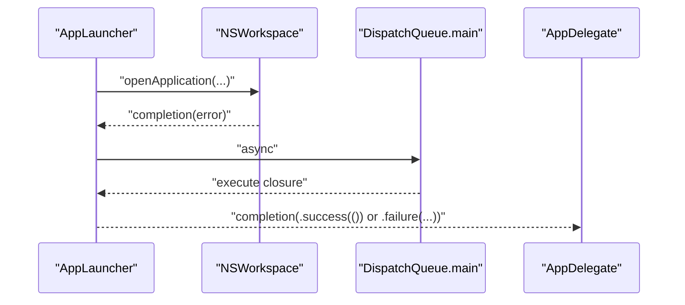
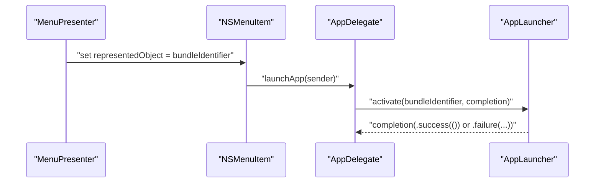
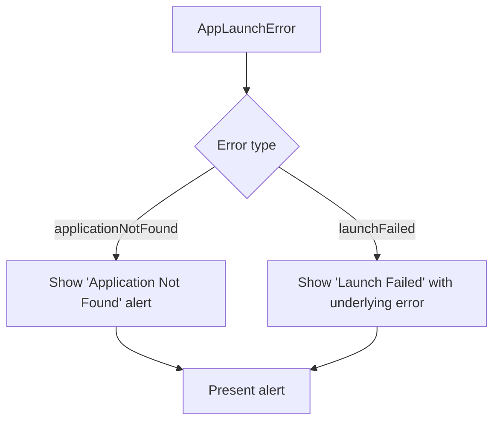
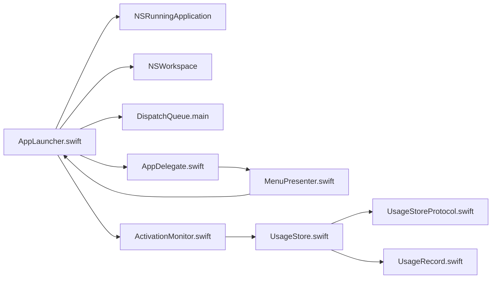

# Application Launcher

<cite>
**Referenced Files in This Document**
- [AppLauncher.swift](file://iTip/AppLauncher.swift)
- [AppDelegate.swift](file://iTip/AppDelegate.swift)
- [AppLauncherTests.swift](file://iTipTests/AppLauncherTests.swift)
- [main.swift](file://iTip/main.swift)
- [MenuPresenter.swift](file://iTip/MenuPresenter.swift)
- [ActivationMonitor.swift](file://iTip/ActivationMonitor.swift)
- [UsageStore.swift](file://iTip/UsageStore.swift)
- [UsageRecord.swift](file://iTip/UsageRecord.swift)
- [UsageStoreProtocol.swift](file://iTip/UsageStoreProtocol.swift)
- [StatusBarController.swift](file://iTip/StatusBarController.swift)
</cite>

## Table of Contents
1. [Introduction](#introduction)
2. [Project Structure](#project-structure)
3. [Core Components](#core-components)
4. [Architecture Overview](#architecture-overview)
5. [Detailed Component Analysis](#detailed-component-analysis)
6. [Dependency Analysis](#dependency-analysis)
7. [Performance Considerations](#performance-considerations)
8. [Troubleshooting Guide](#troubleshooting-guide)
9. [Conclusion](#conclusion)

## Introduction
This document explains the Application Launcher component responsible for launching and activating macOS applications from a menu bar accessory. It covers how the launcher detects already-running applications, resolves app locations using the workspace APIs, and handles launch failures gracefully. It documents the error model, activation workflow, completion handler behavior, and practical usage patterns. It also provides troubleshooting guidance for common launch issues.

## Project Structure
The Application Launcher lives in the macOS menu bar app project and integrates with the app’s lifecycle, menu presentation, and usage tracking.

**Diagram sources**
- [main.swift:1-8](file://iTip/main.swift#L1-L8)
- [AppDelegate.swift:1-81](file://iTip/AppDelegate.swift#L1-L81)
- [StatusBarController.swift:1-68](file://iTip/StatusBarController.swift#L1-L68)
- [MenuPresenter.swift:1-253](file://iTip/MenuPresenter.swift#L1-L253)
- [ActivationMonitor.swift:1-157](file://iTip/ActivationMonitor.swift#L1-L157)
- [UsageStore.swift:1-107](file://iTip/UsageStore.swift#L1-L107)
- [UsageRecord.swift:1-33](file://iTip/UsageRecord.swift#L1-L33)
- [UsageStoreProtocol.swift:1-14](file://iTip/UsageStoreProtocol.swift#L1-L14)
- [AppLauncher.swift:1-40](file://iTip/AppLauncher.swift#L1-L40)
- [AppLauncherTests.swift:1-33](file://iTipTests/AppLauncherTests.swift#L1-L33)

**Section sources**
- [main.swift:1-8](file://iTip/main.swift#L1-L8)
- [AppDelegate.swift:1-81](file://iTip/AppDelegate.swift#L1-L81)
- [MenuPresenter.swift:1-253](file://iTip/MenuPresenter.swift#L1-L253)
- [AppLauncher.swift:1-40](file://iTip/AppLauncher.swift#L1-L40)

## Core Components
- AppLauncher: Provides the activate method to bring an app to the foreground or launch it if not running. It reports outcomes via a Result callback on the main thread.
- AppLaunchError: Defines two failure modes: applicationNotFound and launchFailed, each carrying relevant context.
- AppDelegate: Integrates the launcher into the menu action flow and displays user-friendly alerts for errors.
- MenuPresenter: Builds the dynamic menu and triggers the launcher when users select an app item.
- ActivationMonitor and UsageStore: Track app activations and persist usage data; indirectly influence the launcher’s menu population.

**Section sources**
- [AppLauncher.swift:1-40](file://iTip/AppLauncher.swift#L1-L40)
- [AppDelegate.swift:1-81](file://iTip/AppDelegate.swift#L1-L81)
- [MenuPresenter.swift:1-253](file://iTip/MenuPresenter.swift#L1-L253)
- [ActivationMonitor.swift:1-157](file://iTip/ActivationMonitor.swift#L1-L157)
- [UsageStore.swift:1-107](file://iTip/UsageStore.swift#L1-L107)

## Architecture Overview
The launcher sits between the UI and the macOS workspace APIs. When a user clicks a menu item, the app delegate invokes the launcher with the selected bundle identifier. The launcher checks for an existing running instance and either activates it or opens it via the workspace.

**Diagram sources**
- [MenuPresenter.swift:131-138](file://iTip/MenuPresenter.swift#L131-L138)
- [AppDelegate.swift:43-54](file://iTip/AppDelegate.swift#L43-L54)
- [AppLauncher.swift:11-38](file://iTip/AppLauncher.swift#L11-L38)

## Detailed Component Analysis

### AppLauncher Implementation
The AppLauncher struct encapsulates the launch/activation logic:
- Detects existing running instances using NSRunningApplication.
- Resolves the app path via NSWorkspace.shared.urlForApplication(withBundleIdentifier:).
- Launches the app with NSWorkspace.shared.openApplication(at:configuration:completionHandler:), configured to activate automatically.
- Ensures the completion handler runs on the main thread.

**Diagram sources**
- [AppLauncher.swift:11-38](file://iTip/AppLauncher.swift#L11-L38)

**Section sources**
- [AppLauncher.swift:1-40](file://iTip/AppLauncher.swift#L1-L40)

### AppLaunchError Enum
The error model distinguishes two failure scenarios:
- applicationNotFound: Emitted when the bundle identifier cannot be resolved to an app path.
- launchFailed: Emitted when the app path is resolvable but the launch operation fails; carries the underlying error.

**Diagram sources**
- [AppLauncher.swift:3-6](file://iTip/AppLauncher.swift#L3-L6)

**Section sources**
- [AppLauncher.swift:3-6](file://iTip/AppLauncher.swift#L3-L6)

### Activation Workflow
The activation workflow optimizes user experience by avoiding redundant launches:
- If an app is already running, it is activated immediately.
- Otherwise, the launcher attempts to resolve the app path and launch it with activation enabled.

**Diagram sources**
- [AppLauncher.swift:11-24](file://iTip/AppLauncher.swift#L11-L24)

**Section sources**
- [AppLauncher.swift:11-24](file://iTip/AppLauncher.swift#L11-L24)

### Completion Handler Pattern and Main Thread Dispatching
- The completion handler is always invoked asynchronously.
- The launcher ensures main-thread dispatch before calling completion, guaranteeing UI-safe callbacks.
- The app delegate uses the completion result to either ignore success or show an alert for errors.

**Diagram sources**
- [AppLauncher.swift:29-37](file://iTip/AppLauncher.swift#L29-L37)
- [AppDelegate.swift:46-53](file://iTip/AppDelegate.swift#L46-L53)

**Section sources**
- [AppLauncher.swift:29-37](file://iTip/AppLauncher.swift#L29-L37)
- [AppDelegate.swift:46-53](file://iTip/AppDelegate.swift#L46-L53)

### Practical Usage Example: activate Method
- The menu presenter sets the representedObject of menu items to a bundle identifier.
- When the user selects an item, the app delegate calls the launcher with that identifier.
- The launcher returns success or failure through the completion handler.

**Diagram sources**
- [MenuPresenter.swift:131-138](file://iTip/MenuPresenter.swift#L131-L138)
- [AppDelegate.swift:43-54](file://iTip/AppDelegate.swift#L43-L54)
- [AppLauncher.swift:11-38](file://iTip/AppLauncher.swift#L11-L38)

**Section sources**
- [MenuPresenter.swift:131-138](file://iTip/MenuPresenter.swift#L131-L138)
- [AppDelegate.swift:43-54](file://iTip/AppDelegate.swift#L43-L54)

### Error Handling and User Feedback
- On applicationNotFound, the app displays a warning message indicating the app could not be found.
- On launchFailed, the app displays a warning with the localized description of the underlying error.
- Alerts are presented modally or as sheets depending on the presence of a visible window.

**Diagram sources**
- [AppDelegate.swift:58-79](file://iTip/AppDelegate.swift#L58-L79)

**Section sources**
- [AppDelegate.swift:58-79](file://iTip/AppDelegate.swift#L58-L79)

## Dependency Analysis
The launcher depends on macOS frameworks and integrates with the app’s UI and persistence layers.

**Diagram sources**
- [AppLauncher.swift:1-40](file://iTip/AppLauncher.swift#L1-L40)
- [AppDelegate.swift:1-81](file://iTip/AppDelegate.swift#L1-L81)
- [MenuPresenter.swift:1-253](file://iTip/MenuPresenter.swift#L1-L253)
- [ActivationMonitor.swift:1-157](file://iTip/ActivationMonitor.swift#L1-L157)
- [UsageStore.swift:1-107](file://iTip/UsageStore.swift#L1-L107)
- [UsageStoreProtocol.swift:1-14](file://iTip/UsageStoreProtocol.swift#L1-L14)
- [UsageRecord.swift:1-33](file://iTip/UsageRecord.swift#L1-L33)

**Section sources**
- [AppLauncher.swift:1-40](file://iTip/AppLauncher.swift#L1-L40)
- [AppDelegate.swift:1-81](file://iTip/AppDelegate.swift#L1-L81)
- [MenuPresenter.swift:1-253](file://iTip/MenuPresenter.swift#L1-L253)
- [ActivationMonitor.swift:1-157](file://iTip/ActivationMonitor.swift#L1-L157)
- [UsageStore.swift:1-107](file://iTip/UsageStore.swift#L1-L107)
- [UsageStoreProtocol.swift:1-14](file://iTip/UsageStoreProtocol.swift#L1-L14)
- [UsageRecord.swift:1-33](file://iTip/UsageRecord.swift#L1-L33)

## Performance Considerations
- The launcher performs minimal work: a quick check for running apps, a workspace lookup, and a single asynchronous open operation. These are efficient for typical usage.
- Main-thread dispatch is used only for the completion callback, keeping UI updates safe without blocking the launcher’s internal logic.
- The menu presenter caches app URLs and icons to reduce repeated filesystem lookups during menu builds.

[No sources needed since this section provides general guidance]

## Troubleshooting Guide
Common launch issues and resolutions:
- Missing application: The bundle identifier is not installed or invalid. The launcher emits applicationNotFound. Verify the bundle identifier and ensure the app is installed.
- Permission problems: The app may lack necessary entitlements or permissions to launch certain protected apps. Check system preferences and app permissions.
- System-level failures: Launch may fail due to system policies or sandbox restrictions. The launcher emits launchFailed with the underlying error. Review system logs and error messages for specifics.
- Menu item selection: Ensure the menu item’s representedObject is set to a valid bundle identifier. The app delegate reads this value and passes it to the launcher.

Debugging tips:
- Confirm the bundle identifier used in the menu matches the target app.
- Observe the completion result in the app delegate to distinguish applicationNotFound vs launchFailed.
- Use system logs to inspect the underlying error when launchFailed occurs.

**Section sources**
- [AppLauncher.swift:21-24](file://iTip/AppLauncher.swift#L21-L24)
- [AppLauncher.swift:29-37](file://iTip/AppLauncher.swift#L29-L37)
- [AppDelegate.swift:43-54](file://iTip/AppDelegate.swift#L43-L54)
- [MenuPresenter.swift:131-138](file://iTip/MenuPresenter.swift#L131-L138)

## Conclusion
The Application Launcher provides a robust, user-friendly mechanism to activate or launch macOS applications from the menu bar. It optimizes for existing running instances, validates app availability, and surfaces actionable errors to users. Its design ensures thread-safe callbacks and integrates cleanly with the app’s UI and persistence layers.