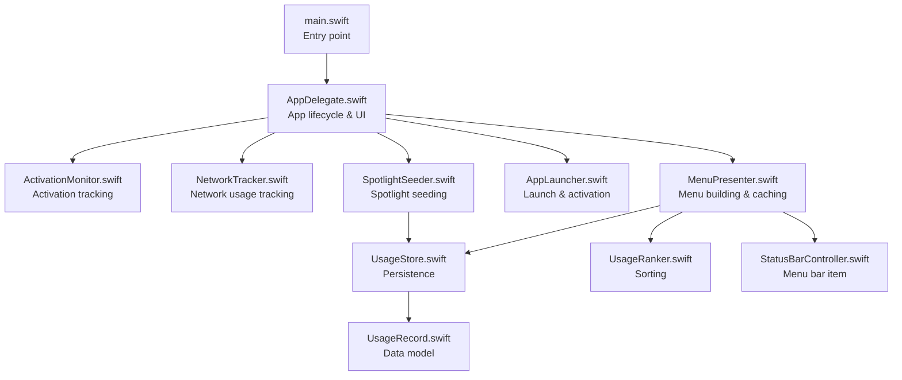
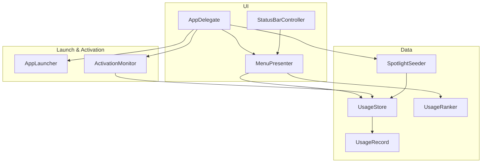
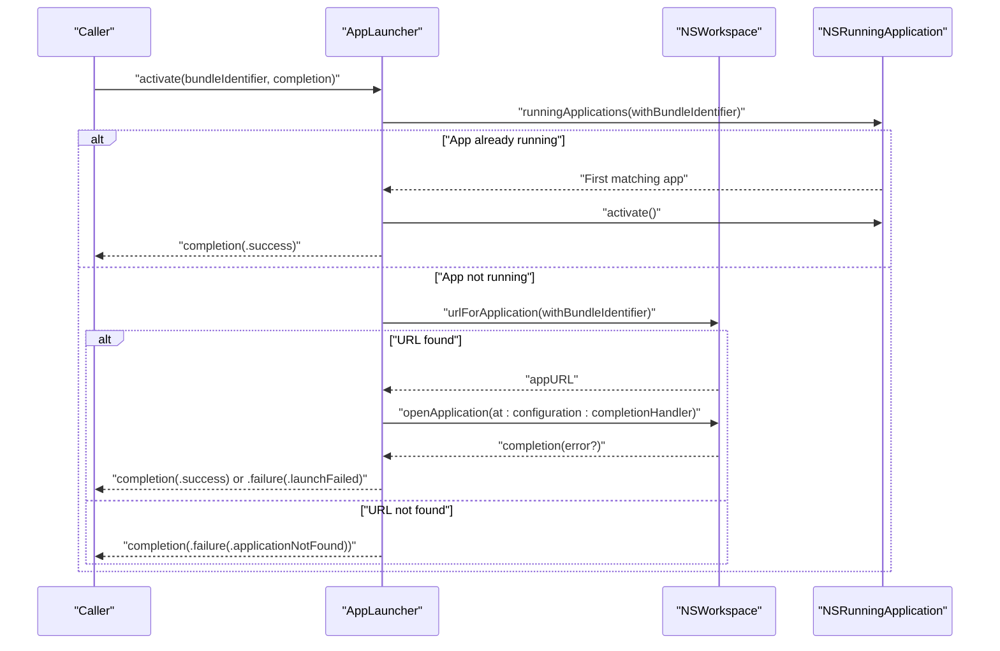
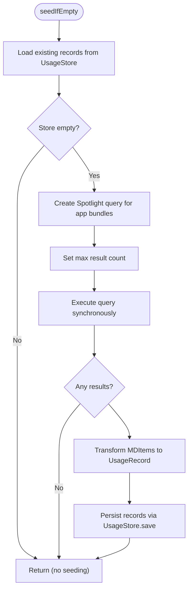
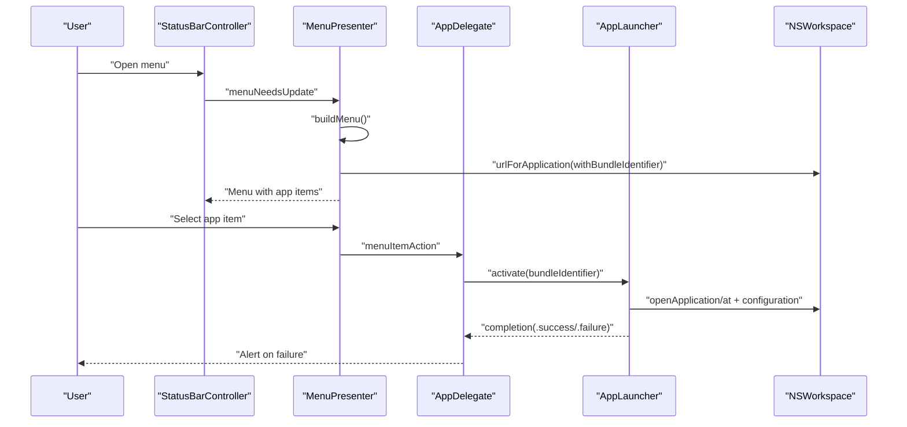
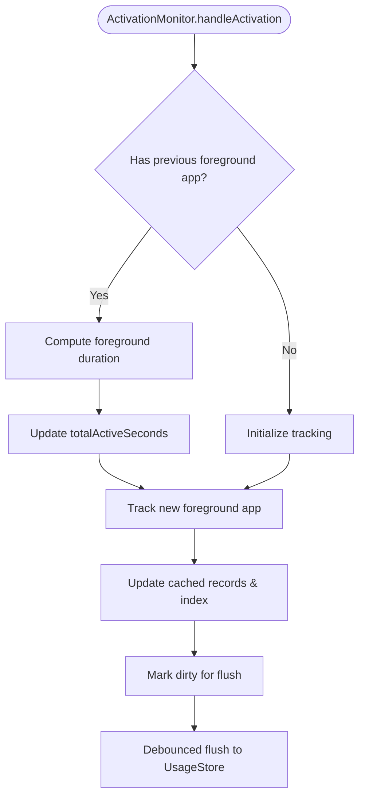
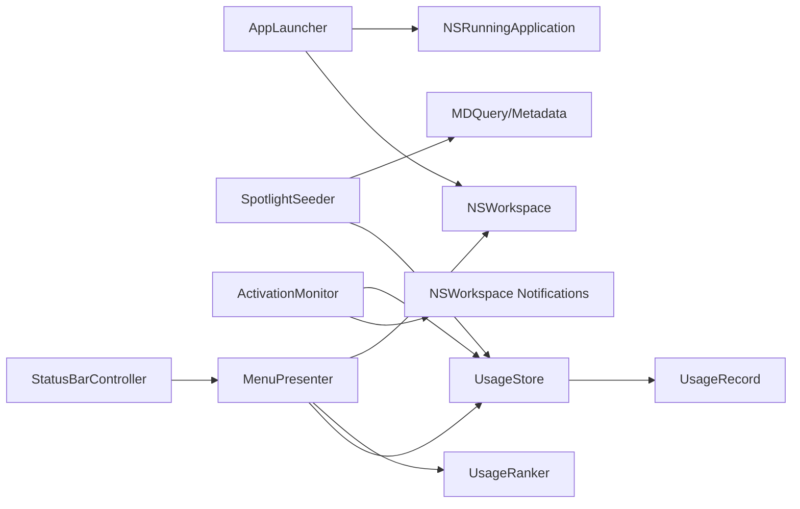

# Application Management

<cite>
**Referenced Files in This Document**
- [AppLauncher.swift](file://iTip/AppLauncher.swift)
- [SpotlightSeeder.swift](file://iTip/SpotlightSeeder.swift)
- [AppDelegate.swift](file://iTip/AppDelegate.swift)
- [ActivationMonitor.swift](file://iTip/ActivationMonitor.swift)
- [UsageStore.swift](file://iTip/UsageStore.swift)
- [UsageStoreProtocol.swift](file://iTip/UsageStoreProtocol.swift)
- [UsageRecord.swift](file://iTip/UsageRecord.swift)
- [UsageRanker.swift](file://iTip/UsageRanker.swift)
- [MenuPresenter.swift](file://iTip/MenuPresenter.swift)
- [StatusBarController.swift](file://iTip/StatusBarController.swift)
- [main.swift](file://iTip/main.swift)
- [AppLauncherTests.swift](file://iTipTests/AppLauncherTests.swift)
- [IntegrationTests.swift](file://iTipTests/IntegrationTests.swift)
- [README.md](file://README.md)
</cite>

## Table of Contents
1. [Introduction](#introduction)
2. [Project Structure](#project-structure)
3. [Core Components](#core-components)
4. [Architecture Overview](#architecture-overview)
5. [Detailed Component Analysis](#detailed-component-analysis)
6. [Dependency Analysis](#dependency-analysis)
7. [Performance Considerations](#performance-considerations)
8. [Troubleshooting Guide](#troubleshooting-guide)
9. [Conclusion](#conclusion)
10. [Appendices](#appendices)

## Introduction
This document explains iTip’s application management system with a focus on:
- AppLauncher lifecycle management: detecting running applications, launching via NSWorkspace, and robust error handling.
- SpotlightSeeder metadata seeding: Spotlight integration, data transformation, and performance optimizations.
- Application discovery, monitoring, and launch coordination with NSWorkspace.
- Error handling strategies for missing applications, permission issues, and system-level failures.
- Application state tracking, launch verification, and cleanup procedures.
- Practical workflows and troubleshooting guidance for reliable application management.

## Project Structure
The application is a macOS menu bar accessory built with AppKit. The core application management logic resides in the main app target under the iTip folder, with tests under iTipTests. The runtime entry point is main.swift, which sets up the NSApplication and AppDelegate.

**Diagram sources**
- [main.swift:1-8](file://iTip/main.swift#L1-L8)
- [AppDelegate.swift:1-81](file://iTip/AppDelegate.swift#L1-L81)
- [ActivationMonitor.swift:1-157](file://iTip/ActivationMonitor.swift#L1-L157)
- [MenuPresenter.swift:1-253](file://iTip/MenuPresenter.swift#L1-L253)
- [UsageStore.swift:1-107](file://iTip/UsageStore.swift#L1-L107)
- [UsageRanker.swift:1-15](file://iTip/UsageRanker.swift#L1-L15)
- [StatusBarController.swift:1-68](file://iTip/StatusBarController.swift#L1-L68)
- [AppLauncher.swift:1-40](file://iTip/AppLauncher.swift#L1-L40)
- [SpotlightSeeder.swift:1-80](file://iTip/SpotlightSeeder.swift#L1-L80)
- [UsageRecord.swift:1-33](file://iTip/UsageRecord.swift#L1-L33)

**Section sources**
- [main.swift:1-8](file://iTip/main.swift#L1-L8)
- [README.md:1-48](file://README.md#L1-L48)

## Core Components
- AppLauncher: Detects running apps by bundle identifier, resolves app URLs via NSWorkspace, configures launch behavior, and reports results on the main thread with structured error types.
- SpotlightSeeder: Seeds the UsageStore with recent app usage from Spotlight metadata when the store is empty, with query limits and filtering to optimize performance.
- ActivationMonitor: Monitors NSWorkspace activation notifications, maintains an in-memory cache, debounces writes, and persists merged updates to UsageStore.
- UsageStore: Thread-safe JSON-backed persistence with atomic updates, caching, and notifications for UI refresh.
- UsageRecord: Codable model capturing app usage metrics with backward-compatible decoding.
- UsageRanker: Ranks records by recency and frequency, returning top-N results.
- MenuPresenter: Builds dynamic menus from UsageStore, caches icons and URLs, auto-cleans missing apps, and formats usage statistics.
- StatusBarController: Manages the menu bar item and menu lifecycle, delegating menu updates to MenuPresenter.
- AppDelegate: Orchestrates initialization, starts monitors, seeds Spotlight data asynchronously, wires menu actions, and handles alerts for launch errors.

**Section sources**
- [AppLauncher.swift:1-40](file://iTip/AppLauncher.swift#L1-L40)
- [SpotlightSeeder.swift:1-80](file://iTip/SpotlightSeeder.swift#L1-L80)
- [ActivationMonitor.swift:1-157](file://iTip/ActivationMonitor.swift#L1-L157)
- [UsageStore.swift:1-107](file://iTip/UsageStore.swift#L1-L107)
- [UsageRecord.swift:1-33](file://iTip/UsageRecord.swift#L1-L33)
- [UsageRanker.swift:1-15](file://iTip/UsageRanker.swift#L1-L15)
- [MenuPresenter.swift:1-253](file://iTip/MenuPresenter.swift#L1-L253)
- [StatusBarController.swift:1-68](file://iTip/StatusBarController.swift#L1-L68)
- [AppDelegate.swift:1-81](file://iTip/AppDelegate.swift#L1-L81)

## Architecture Overview
The system integrates three primary subsystems:
- Launch and Activation: AppLauncher coordinates activation/launch; ActivationMonitor captures foreground app changes and updates UsageStore.
- Data Seeding: SpotlightSeeder pre-populates UsageStore on cold start using Spotlight metadata.
- UI Integration: MenuPresenter builds menus from UsageStore, caches frequently accessed data, and triggers launches via AppLauncher.

**Diagram sources**
- [AppLauncher.swift:1-40](file://iTip/AppLauncher.swift#L1-L40)
- [ActivationMonitor.swift:1-157](file://iTip/ActivationMonitor.swift#L1-L157)
- [SpotlightSeeder.swift:1-80](file://iTip/SpotlightSeeder.swift#L1-L80)
- [UsageStore.swift:1-107](file://iTip/UsageStore.swift#L1-L107)
- [UsageRecord.swift:1-33](file://iTip/UsageRecord.swift#L1-L33)
- [UsageRanker.swift:1-15](file://iTip/UsageRanker.swift#L1-L15)
- [MenuPresenter.swift:1-253](file://iTip/MenuPresenter.swift#L1-L253)
- [StatusBarController.swift:1-68](file://iTip/StatusBarController.swift#L1-L68)
- [AppDelegate.swift:1-81](file://iTip/AppDelegate.swift#L1-L81)

## Detailed Component Analysis

### AppLauncher: Application Lifecycle Management
AppLauncher encapsulates the logic to either activate an already-running app or launch it if not present. It:
- Detects running apps by bundle identifier using NSRunningApplication.
- Resolves app URL via NSWorkspace and configures NSWorkspace.OpenConfiguration to activate on launch.
- Executes asynchronous launch with a completion handler that always runs on the main thread.
- Provides structured errors for missing apps and launch failures.

**Diagram sources**
- [AppLauncher.swift:11-38](file://iTip/AppLauncher.swift#L11-L38)

Key implementation details:
- Running application detection uses NSRunningApplication.runningApplications(withBundleIdentifier:).
- Launch configuration sets activates to true via NSWorkspace.OpenConfiguration.
- Completion is dispatched to the main thread to safely update UI.
- Error types distinguish missing apps vs launch failures.

Error handling strategies:
- applicationNotFound: Returned when NSWorkspace cannot resolve the bundle identifier.
- launchFailed: Wraps underlying system errors from NSWorkspace.openApplication.

Verification and tests:
- Unit test validates applicationNotFound error for unknown bundle identifiers.

**Section sources**
- [AppLauncher.swift:1-40](file://iTip/AppLauncher.swift#L1-L40)
- [AppLauncherTests.swift:1-33](file://iTipTests/AppLauncherTests.swift#L1-L33)

### SpotlightSeeder: Metadata Query and Seeding
SpotlightSeeder pre-populates the UsageStore on cold start (empty store) using Spotlight metadata:
- Queries for application bundles with recent usage within a rolling time window.
- Limits query results to cap performance impact.
- Filters out system/background processes and the app itself.
- Transforms Spotlight attributes into UsageRecord instances and persists them atomically.

**Diagram sources**
- [SpotlightSeeder.swift:16-28](file://iTip/SpotlightSeeder.swift#L16-L28)
- [SpotlightSeeder.swift:32-78](file://iTip/SpotlightSeeder.swift#L32-L78)

Performance optimizations:
- Caps query results with a maximum count to prevent long-running queries.
- Skips system/background processes and the app’s own bundle identifier.
- Graceful error handling to avoid crashes during Spotlight operations.

Data transformation:
- Extracts bundle identifier, display name, last used date, and use count from Spotlight metadata.
- Creates UsageRecord entries and saves them atomically.

**Section sources**
- [SpotlightSeeder.swift:1-80](file://iTip/SpotlightSeeder.swift#L1-L80)
- [UsageStore.swift:52-67](file://iTip/UsageStore.swift#L52-L67)

### Application Discovery, Monitoring, and Launch Coordination
Discovery and monitoring:
- ActivationMonitor subscribes to NSWorkspace.didActivateApplicationNotification and tracks foreground app changes.
- Maintains an in-memory cache with O(1) index lookups and a periodic timer to flush changes to disk.
- Skips the app’s own bundle identifier and ignores empty identifiers.

Launch coordination:
- MenuPresenter resolves app URLs and caches them to avoid repeated NSWorkspace calls.
- On menu item selection, AppDelegate delegates to AppLauncher to activate or launch the selected app.
- MenuPresenter auto-cleans records whose bundle identifiers cannot be resolved by NSWorkspace.

**Diagram sources**
- [StatusBarController.swift:55-66](file://iTip/StatusBarController.swift#L55-L66)
- [MenuPresenter.swift:68-147](file://iTip/MenuPresenter.swift#L68-L147)
- [AppDelegate.swift:43-54](file://iTip/AppDelegate.swift#L43-L54)
- [AppLauncher.swift:11-38](file://iTip/AppLauncher.swift#L11-L38)

**Section sources**
- [ActivationMonitor.swift:38-67](file://iTip/ActivationMonitor.swift#L38-L67)
- [ActivationMonitor.swift:144-155](file://iTip/ActivationMonitor.swift#L144-L155)
- [MenuPresenter.swift:8-39](file://iTip/MenuPresenter.swift#L8-L39)
- [MenuPresenter.swift:92-114](file://iTip/MenuPresenter.swift#L92-L114)
- [AppDelegate.swift:43-54](file://iTip/AppDelegate.swift#L43-L54)

### Application State Tracking, Launch Verification, and Cleanup
State tracking:
- ActivationMonitor accumulates foreground duration for the previous foreground app and updates counts and timestamps for the newly activated app.
- Uses an in-memory cache and a debounced save timer to minimize disk I/O.

Launch verification:
- AppLauncher verifies successful launch by checking for an error in NSWorkspace.openApplication completion.
- Returns structured errors for missing apps and launch failures.

Cleanup procedures:
- MenuPresenter removes records whose bundle identifiers cannot be resolved by NSWorkspace and asynchronously persists the cleaned dataset.
- UsageStore persists updates atomically and posts a notification to trigger UI refresh.

**Diagram sources**
- [ActivationMonitor.swift:69-105](file://iTip/ActivationMonitor.swift#L69-L105)
- [ActivationMonitor.swift:116-142](file://iTip/ActivationMonitor.swift#L116-L142)

**Section sources**
- [ActivationMonitor.swift:12-26](file://iTip/ActivationMonitor.swift#L12-L26)
- [ActivationMonitor.swift:69-105](file://iTip/ActivationMonitor.swift#L69-L105)
- [ActivationMonitor.swift:116-142](file://iTip/ActivationMonitor.swift#L116-L142)
- [MenuPresenter.swift:92-114](file://iTip/MenuPresenter.swift#L92-L114)
- [UsageStore.swift:69-105](file://iTip/UsageStore.swift#L69-L105)

## Dependency Analysis
The components exhibit clean separation of concerns:
- AppLauncher depends on NSWorkspace and NSRunningApplication for lifecycle operations.
- SpotlightSeeder depends on MDQuery/Metadata APIs and UsageStore for seeding.
- ActivationMonitor depends on NSWorkspace notifications and UsageStore for persistence.
- MenuPresenter depends on UsageStore, UsageRanker, and NSWorkspace for discovery and UI.
- StatusBarController depends on MenuPresenter for menu assembly.
- UsageStore implements UsageStoreProtocol to decouple persistence from higher layers.

**Diagram sources**
- [AppLauncher.swift:1-40](file://iTip/AppLauncher.swift#L1-L40)
- [SpotlightSeeder.swift:1-80](file://iTip/SpotlightSeeder.swift#L1-L80)
- [ActivationMonitor.swift:1-157](file://iTip/ActivationMonitor.swift#L1-L157)
- [MenuPresenter.swift:1-253](file://iTip/MenuPresenter.swift#L1-L253)
- [StatusBarController.swift:1-68](file://iTip/StatusBarController.swift#L1-L68)
- [UsageStore.swift:1-107](file://iTip/UsageStore.swift#L1-L107)
- [UsageRecord.swift:1-33](file://iTip/UsageRecord.swift#L1-L33)

**Section sources**
- [UsageStoreProtocol.swift:1-14](file://iTip/UsageStoreProtocol.swift#L1-L14)

## Performance Considerations
- Spotlight query limits: The seeder caps results to reduce query time and memory footprint.
- In-memory caching: ActivationMonitor caches records and indices to avoid frequent disk reads/writes.
- Debounced persistence: A periodic timer reduces write frequency and contention.
- MenuPresenter caching: URL and icon caches minimize repeated NSWorkspace calls and disk lookups.
- Atomic writes: UsageStore persists updates atomically to maintain consistency and reduce partial writes.
- UI responsiveness: AppLauncher completion handlers are dispatched on the main thread; Spotlight seeding runs off the main thread to avoid blocking launch.

[No sources needed since this section provides general guidance]

## Troubleshooting Guide
Common issues and resolutions:
- Application not found
  - Symptom: Launch attempts fail with “application not found.”
  - Cause: Bundle identifier not present on the system or misconfigured.
  - Resolution: Verify bundle identifier correctness and ensure the app is installed in a standard location.
  - Evidence: AppLauncher returns applicationNotFound error; tests assert this behavior.

- Launch failed
  - Symptom: Launch attempts fail with a system-level error.
  - Causes: Permission restrictions, quarantine, or system policy.
  - Resolution: Confirm app is not quarantined, move to Applications, and retry. Review underlying error messages.
  - Evidence: AppLauncher wraps underlying errors in launchFailed.

- Permission issues
  - Symptom: Activation monitoring does not update usage.
  - Causes: Insufficient permissions for NSWorkspace notifications.
  - Resolution: Enable Accessibility permissions for the app in System Settings.

- Missing applications in menu
  - Symptom: Apps disappear from the menu after uninstallation.
  - Behavior: MenuPresenter automatically removes unresolved bundle identifiers and persists the cleaned dataset.
  - Evidence: MenuPresenter filters records and asynchronously saves the cleaned set.

- Cold start seeding not working
  - Symptom: No recent apps appear on first launch.
  - Causes: Spotlight indexing delay or insufficient permissions.
  - Resolution: Allow Spotlight to index, grant required permissions, and restart the app.

**Section sources**
- [AppLauncher.swift:3-6](file://iTip/AppLauncher.swift#L3-L6)
- [AppLauncher.swift:21-24](file://iTip/AppLauncher.swift#L21-L24)
- [AppLauncher.swift:29-37](file://iTip/AppLauncher.swift#L29-L37)
- [AppLauncherTests.swift:12-31](file://iTipTests/AppLauncherTests.swift#L12-L31)
- [MenuPresenter.swift:108-114](file://iTip/MenuPresenter.swift#L108-L114)
- [AppDelegate.swift:58-79](file://iTip/AppDelegate.swift#L58-L79)

## Conclusion
iTip’s application management system combines robust application lifecycle control, efficient Spotlight-driven seeding, and responsive UI integration. AppLauncher ensures reliable activation/launch with clear error reporting. SpotlightSeeder quickly populates usage history on cold start while respecting performance constraints. ActivationMonitor and UsageStore provide accurate, low-overhead state tracking. MenuPresenter delivers a fast, dynamic menu with automatic cleanup and formatting. Together, these components deliver a smooth, user-friendly experience for discovering and launching frequently used applications.

[No sources needed since this section summarizes without analyzing specific files]

## Appendices

### Example Workflows
- Launching an application
  - Trigger: User selects an app from the menu.
  - Flow: MenuPresenter invokes AppDelegate.action, which calls AppLauncher.activate. AppLauncher checks for a running instance, resolves the app URL, and launches with activation enabled. Completion is handled on the main thread; errors are surfaced via an alert.

- Seeding recent apps on cold start
  - Trigger: AppDelegate.finishLaunching schedules SpotlightSeeder after UI readiness.
  - Flow: SpotlightSeeder checks if the store is empty, queries Spotlight for recent app bundles, transforms results into UsageRecord, and saves them atomically.

- Monitoring activations and updating the menu
  - Trigger: NSWorkspace notification for app activation.
  - Flow: ActivationMonitor updates cached records and persists merged changes. MenuPresenter observes updates, invalidates caches, rebuilds the menu, and displays the latest rankings.

**Section sources**
- [AppDelegate.swift:28-33](file://iTip/AppDelegate.swift#L28-L33)
- [SpotlightSeeder.swift:16-28](file://iTip/SpotlightSeeder.swift#L16-L28)
- [ActivationMonitor.swift:38-67](file://iTip/ActivationMonitor.swift#L38-L67)
- [MenuPresenter.swift:52-60](file://iTip/MenuPresenter.swift#L52-L60)