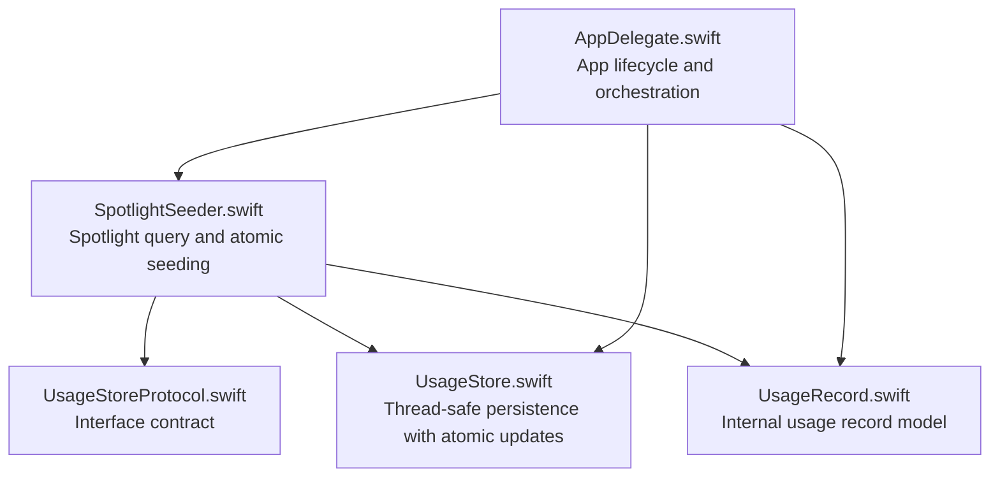
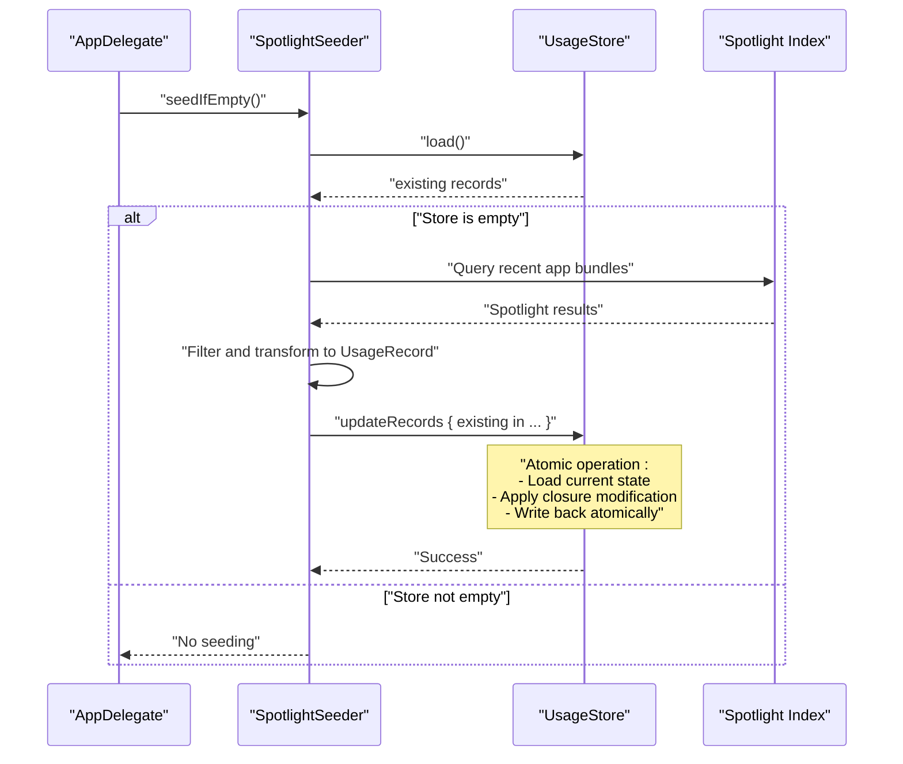
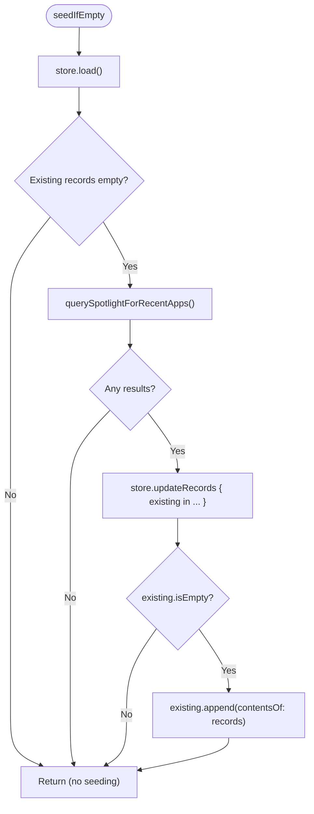
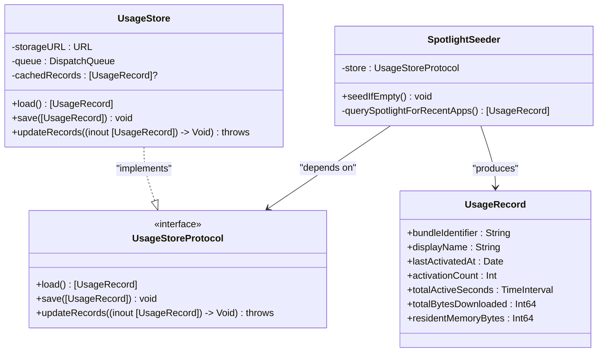

# Spotlight Data Seeder

<cite>
**Referenced Files in This Document**
- [SpotlightSeeder.swift](file://iTip/SpotlightSeeder.swift)
- [UsageRecord.swift](file://iTip/UsageRecord.swift)
- [UsageStore.swift](file://iTip/UsageStore.swift)
- [UsageStoreProtocol.swift](file://iTip/UsageStoreProtocol.swift)
- [AppDelegate.swift](file://iTip/AppDelegate.swift)
- [README.md](file://README.md)
- [IntegrationTests.swift](file://iTipTests/IntegrationTests.swift)
- [UsageStoreTests.swift](file://iTipTests/UsageStoreTests.swift)
- [InMemoryUsageStore.swift](file://iTipTests/InMemoryUsageStore.swift)
</cite>

## Update Summary
**Changes Made**
- Updated SpotlightSeeder implementation to use atomic `updateRecords()` method with closure-based approach
- Enhanced thread-safety and atomicity guarantees for seeding operations
- Improved error handling and graceful degradation when Spotlight data is unavailable
- Added comprehensive documentation for the new atomic seeding workflow

## Table of Contents
1. [Introduction](#introduction)
2. [Project Structure](#project-structure)
3. [Core Components](#core-components)
4. [Architecture Overview](#architecture-overview)
5. [Detailed Component Analysis](#detailed-component-analysis)
6. [Dependency Analysis](#dependency-analysis)
7. [Performance Considerations](#performance-considerations)
8. [Troubleshooting Guide](#troubleshooting-guide)
9. [Conclusion](#conclusion)

## Introduction
This document explains the Spotlight Data Seeder component that pre-populates application usage data during cold start by querying Spotlight metadata. The seeder now uses enhanced atomic seeding capabilities with thread-safe updates through the `updateRecords()` method, ensuring data consistency and preventing race conditions during concurrent access. It covers Spotlight integration, query construction, result filtering, transformation into internal usage records, and performance strategies.

## Project Structure
The Spotlight seeder lives in a dedicated module alongside the usage model and storage layer. The AppDelegate orchestrates seeding after UI initialization to keep startup responsive, utilizing the new atomic update mechanism for thread-safe data persistence.

**Diagram sources**
- [AppDelegate.swift:9-34](file://iTip/AppDelegate.swift#L9-L34)
- [SpotlightSeeder.swift:6-28](file://iTip/SpotlightSeeder.swift#L6-L28)
- [UsageStoreProtocol.swift:3-8](file://iTip/UsageStoreProtocol.swift#L3-L8)
- [UsageStore.swift:4-117](file://iTip/UsageStore.swift#L4-L117)
- [UsageRecord.swift:3-37](file://iTip/UsageRecord.swift#L3-L37)

**Section sources**
- [AppDelegate.swift:9-34](file://iTip/AppDelegate.swift#L9-L34)
- [README.md:11](file://README.md#L11)

## Core Components
- **SpotlightSeeder**: Queries Spotlight for recent application bundles and performs atomic seeding using closure-based updates for thread safety.
- **UsageRecord**: Internal model representing an application's usage metrics with backward-compatible decoding support.
- **UsageStore**: Thread-safe persistence layer with atomic writes and comprehensive error recovery mechanisms.
- **UsageStoreProtocol**: Defines the interface for loading, saving, and atomic update operations.
- **AppDelegate**: Initializes monitoring and triggers atomic seeding asynchronously after UI readiness.

Key responsibilities:
- **SpotlightSeeder** ensures seeding occurs only when the store is empty using atomic operations, transforms Spotlight results into UsageRecord instances, and handles errors gracefully.
- **UsageStore** manages concurrency via a serial queue, provides atomic update capabilities through closure-based modification, recovers from corruption automatically, and posts notifications upon updates.
- **UsageRecord** supports backward-compatible decoding for new fields and maintains comprehensive usage metrics.

**Section sources**
- [SpotlightSeeder.swift:6-28](file://iTip/SpotlightSeeder.swift#L6-L28)
- [UsageRecord.swift:3-37](file://iTip/UsageRecord.swift#L3-L37)
- [UsageStore.swift:4-117](file://iTip/UsageStore.swift#L4-L117)
- [UsageStoreProtocol.swift:3-8](file://iTip/UsageStoreProtocol.swift#L3-L8)
- [AppDelegate.swift:9-34](file://iTip/AppDelegate.swift#L9-L34)

## Architecture Overview
The seeder participates in the cold-start flow with enhanced atomic operations: the app initializes monitoring and UI, then runs atomic seeding in the background. The new implementation uses `updateRecords()` with closure-based modifications to ensure thread safety and data consistency.

**Diagram sources**
- [AppDelegate.swift:32-37](file://iTip/AppDelegate.swift#L32-L37)
- [SpotlightSeeder.swift:16-28](file://iTip/SpotlightSeeder.swift#L16-L28)
- [UsageStore.swift:78-115](file://iTip/UsageStore.swift#L78-L115)

## Detailed Component Analysis

### SpotlightSeeder
**Updated** Enhanced with atomic seeding capabilities using closure-based approach for thread-safe updates.

Purpose:
- Seed the store with recent app usage data when the store is empty using atomic operations.
- Query Spotlight for application bundles with recent activity and convert results into UsageRecord using thread-safe atomic updates.

Implementation highlights:
- **Atomic seeding**: Uses `store.updateRecords()` with closure-based modification for thread-safe updates.
- **Conditional seeding**: Only seeds when the store is empty, preventing conflicts with existing data.
- **Query construction**: Targets application bundles with recent usage thresholds and batch limiting.
- **Result filtering**: Excludes the app itself and non-user apps (useCount threshold).
- **Transformation**: Converts Spotlight results into UsageRecord instances with proper metadata.

**Diagram sources**
- [SpotlightSeeder.swift:16-28](file://iTip/SpotlightSeeder.swift#L16-L28)

**Section sources**
- [SpotlightSeeder.swift:16-28](file://iTip/SpotlightSeeder.swift#L16-L28)
- [SpotlightSeeder.swift:32-78](file://iTip/SpotlightSeeder.swift#L32-L78)

### UsageRecord
Purpose:
- Internal representation of an application's usage metrics with comprehensive backward compatibility.

Key attributes:
- **bundleIdentifier**: Unique app identifier.
- **displayName**: Human-readable name, with fallback to bundle identifier.
- **lastActivatedAt**: Timestamp of most recent activation.
- **activationCount**: Number of activations.
- **totalActiveSeconds**: Cumulative foreground active time (supports backward compatibility).
- **totalBytesDownloaded**: Cumulative downloaded bytes (supports backward compatibility).
- **residentMemoryBytes**: Latest sampled Resident Set Size (supports backward compatibility).

Backward compatibility:
- Decoding allows absent new fields to default to zero values.
- Maintains compatibility with older data formats.

**Section sources**
- [UsageRecord.swift:3-37](file://iTip/UsageRecord.swift#L3-L37)

### UsageStore
**Updated** Enhanced with comprehensive atomic update capabilities and error recovery mechanisms.

Purpose:
- Persist and load usage records atomically with thread safety, comprehensive error recovery, and automatic corruption handling.

Concurrency and caching:
- Serial dispatch queue ensures serialized access to prevent race conditions.
- In-memory cache avoids repeated disk reads until updated.

**Atomic update operations**:
- **Closure-based modifications**: `updateRecords()` accepts a closure that modifies the in-memory array.
- **Single transaction**: Loads current state, applies modification, and writes atomically in one operation.
- **Thread-safe**: All operations occur within a synchronized queue.

Persistence:
- **Atomic writes**: Prevents corruption by writing data atomically to disk.
- **Automatic recovery**: Detects and recovers from corrupted data files.
- **State management**: Reloads current state, applies mutation, and writes back atomically.

Error handling:
- **Decoding failures**: Logs errors and recovers by backing up corrupted files.
- **File system errors**: Handles missing directories and creates them automatically.
- **Graceful degradation**: Continues operation even when encountering issues.

Notifications:
- Posts a notification after successful persistence to signal observers.

**Section sources**
- [UsageStore.swift:4-117](file://iTip/UsageStore.swift#L4-L117)

### UsageStoreProtocol
Purpose:
- Defines the interface for store operations including atomic update capabilities.

Key methods:
- **load()**: Loads records from persistent storage.
- **save([UsageRecord])**: Saves records atomically to disk.
- **updateRecords((inout [UsageRecord]) -> Void)**: Performs atomic modifications using closure-based approach.

Notification:
- Provides a named notification posted after persistence for observer pattern support.

**Section sources**
- [UsageStoreProtocol.swift:3-8](file://iTip/UsageStoreProtocol.swift#L3-L8)

### AppDelegate Integration
Purpose:
- Initialize monitoring and UI, then trigger atomic seeding asynchronously after the UI is ready.

Behavior:
- Creates a background task with utility QoS to run the seeder using the new atomic update mechanism.
- Prevents blocking the main launch timeline while ensuring thread-safe data operations.

**Section sources**
- [AppDelegate.swift:9-34](file://iTip/AppDelegate.swift#L9-L34)

## Dependency Analysis
The seeder depends on the store interface and the Spotlight APIs. The store depends on the file system and serialization. The app delegate coordinates lifecycle and background execution with enhanced atomic operations.

**Diagram sources**
- [SpotlightSeeder.swift:6-78](file://iTip/SpotlightSeeder.swift#L6-L78)
- [UsageStoreProtocol.swift:3-8](file://iTip/UsageStoreProtocol.swift#L3-L8)
- [UsageStore.swift:4-117](file://iTip/UsageStore.swift#L4-L117)
- [UsageRecord.swift:3-37](file://iTip/UsageRecord.swift#L3-L37)

**Section sources**
- [SpotlightSeeder.swift:6-78](file://iTip/SpotlightSeeder.swift#L6-L78)
- [UsageStoreProtocol.swift:3-8](file://iTip/UsageStoreProtocol.swift#L3-L8)
- [UsageStore.swift:4-117](file://iTip/UsageStore.swift#L4-L117)
- [UsageRecord.swift:3-37](file://iTip/UsageRecord.swift#L3-L37)

## Performance Considerations
**Updated** Enhanced with atomic operation benefits and improved error handling.

- **Background execution**: Seeding runs on a utility-quality global queue to avoid blocking UI initialization.
- **Atomic operations**: `updateRecords()` provides thread-safe updates without manual locking.
- **Query limits**: The seeder caps the number of Spotlight results to reduce latency and resource usage.
- **Caching**: UsageStore caches records in memory to minimize repeated disk reads.
- **Automatic recovery**: Error recovery mechanisms prevent data corruption and ensure system stability.
- **Early exit**: If the store is not empty, seeding is skipped to avoid redundant work and conflicts.

Recommendations:
- Monitor Spotlight query duration and adjust max count based on observed performance.
- Consider incremental seeding or periodic refresh if needed, balancing freshness and overhead.
- Profile decode performance if large datasets are expected.
- Leverage atomic operations for future enhancements that require concurrent access.

**Section sources**
- [AppDelegate.swift:34-37](file://iTip/AppDelegate.swift#L34-L37)
- [SpotlightSeeder.swift:38](file://iTip/SpotlightSeeder.swift#L38)
- [UsageStore.swift:78-115](file://iTip/UsageStore.swift#L78-L115)

## Troubleshooting Guide
**Updated** Enhanced with atomic operation error handling and recovery mechanisms.

Common issues and mitigations:
- **Spotlight query failures**:
  - The seeder catches and ignores errors from Spotlight operations to avoid crashing. If no results are returned, seeding is skipped gracefully.
- **Permission and indexing concerns**:
  - Spotlight requires indexed content. If the index is incomplete or permissions restrict access, queries may return fewer results than expected. The seeder filters out non-user apps and the app itself to reduce noise.
- **Data consistency**:
  - **Enhanced atomic operations**: UsageStore uses `updateRecords()` with closure-based modifications to ensure thread-safe updates and prevent race conditions.
  - **Automatic recovery**: UsageStore detects and recovers from corrupted data files by backing them up and creating fresh data.
  - **Error propagation**: Decoding errors are logged and rethrown to let callers decide how to handle corrupted data.
- **Fallback behavior**:
  - If seeding yields no records or encounters errors, the app continues operating. Subsequent runtime activations populate the store safely.

Validation references:
- Integration tests demonstrate the end-to-end flow from activation to menu building, ensuring seeded data integrates with ranking and presentation.
- Store tests validate load/save semantics, atomic writes, error handling for corrupted JSON, and automatic recovery mechanisms.
- Atomic update tests verify thread safety and data consistency across concurrent operations.

**Section sources**
- [SpotlightSeeder.swift:25-27](file://iTip/SpotlightSeeder.swift#L25-L27)
- [UsageStore.swift:15-22](file://iTip/UsageStore.swift#L15-L22)
- [UsageStore.swift:89-95](file://iTip/UsageStore.swift#L89-L95)
- [IntegrationTests.swift:9-50](file://iTipTests/IntegrationTests.swift#L9-L50)
- [UsageStoreTests.swift:24-28](file://iTipTests/UsageStoreTests.swift#L24-L28)
- [UsageStoreTests.swift:53-60](file://iTipTests/UsageStoreTests.swift#L53-L60)
- [UsageStoreTests.swift:64-89](file://iTipTests/UsageStoreTests.swift#L64-L89)

## Conclusion
The Spotlight Data Seeder efficiently pre-populates application usage data on cold start by querying Spotlight for recent application bundles, filtering and transforming results into internal usage records, and persisting them atomically using the new `updateRecords()` method. The enhanced implementation provides thread-safe updates through closure-based modifications, ensuring data consistency and preventing race conditions during concurrent access. It integrates seamlessly with the app lifecycle, prioritizes performance via background execution and query limits, and gracefully handles errors and degraded Spotlight conditions through automatic recovery mechanisms. Together with the robust atomic store layer and comprehensive tests, the seeder provides a reliable foundation for accurate and timely usage insights with enhanced data integrity guarantees.