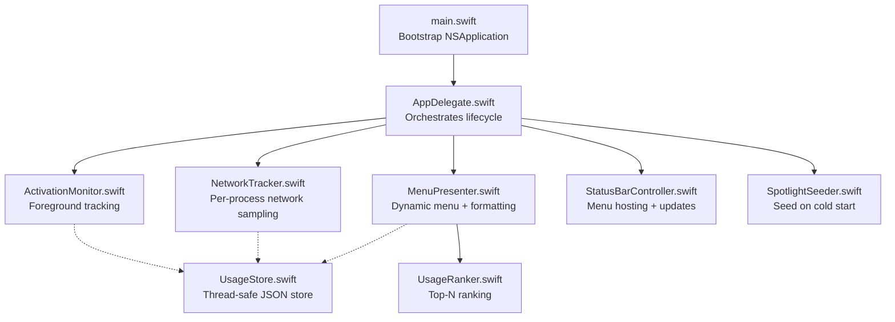
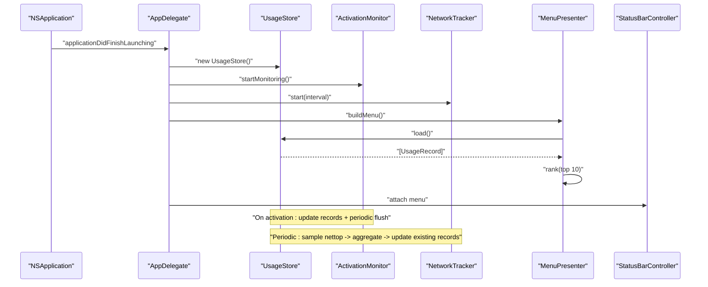
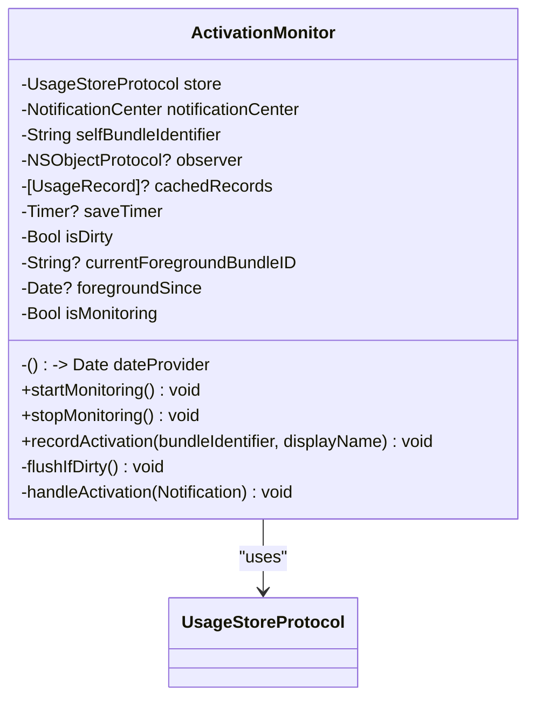
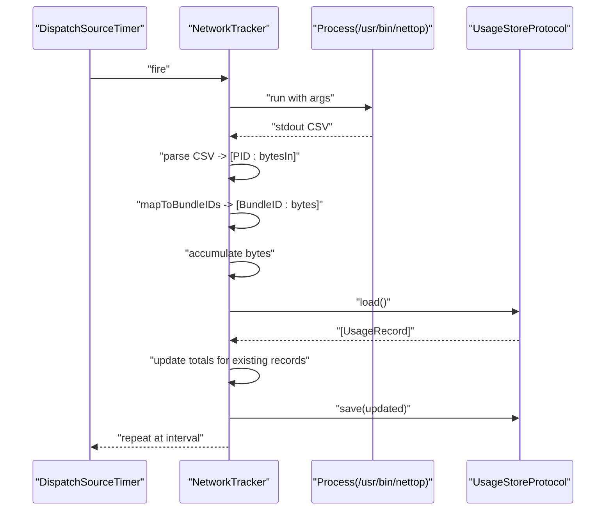
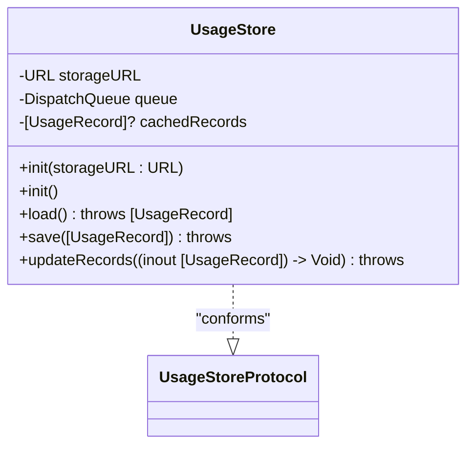
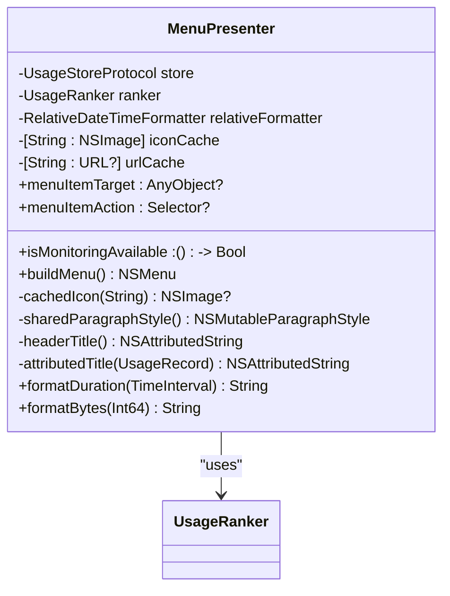
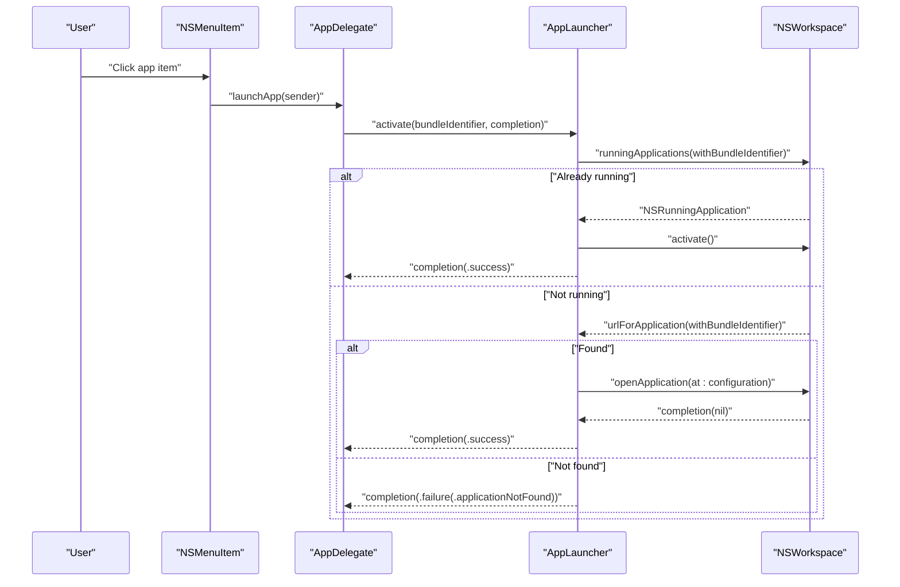
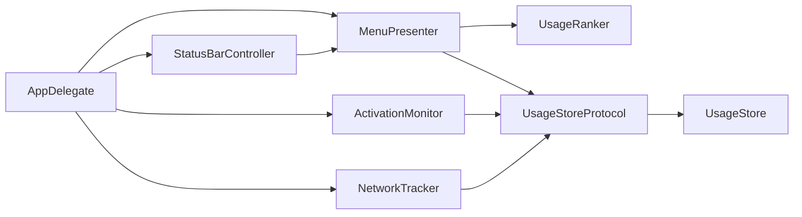

# Core Components

<cite>
**Referenced Files in This Document**
- [ActivationMonitor.swift](file://iTip/ActivationMonitor.swift)
- [NetworkTracker.swift](file://iTip/NetworkTracker.swift)
- [UsageStore.swift](file://iTip/UsageStore.swift)
- [UsageStoreProtocol.swift](file://iTip/UsageStoreProtocol.swift)
- [MenuPresenter.swift](file://iTip/MenuPresenter.swift)
- [AppLauncher.swift](file://iTip/AppLauncher.swift)
- [UsageRanker.swift](file://iTip/UsageRanker.swift)
- [UsageRecord.swift](file://iTip/UsageRecord.swift)
- [AppDelegate.swift](file://iTip/AppDelegate.swift)
- [StatusBarController.swift](file://iTip/StatusBarController.swift)
- [SpotlightSeeder.swift](file://iTip/SpotlightSeeder.swift)
- [main.swift](file://iTip/main.swift)
- [ActivationMonitorTests.swift](file://iTipTests/ActivationMonitorTests.swift)
- [UsageStoreTests.swift](file://iTipTests/UsageStoreTests.swift)
- [MenuPresenterTests.swift](file://iTipTests/MenuPresenterTests.swift)
</cite>

## Table of Contents
1. [Introduction](#introduction)
2. [Project Structure](#project-structure)
3. [Core Components](#core-components)
4. [Architecture Overview](#architecture-overview)
5. [Detailed Component Analysis](#detailed-component-analysis)
6. [Dependency Analysis](#dependency-analysis)
7. [Performance Considerations](#performance-considerations)
8. [Troubleshooting Guide](#troubleshooting-guide)
9. [Conclusion](#conclusion)
10. [Appendices](#appendices)

## Introduction
This document explains iTip’s core functional components that power macOS menu bar analytics and launching. It covers:
- ActivationMonitor: foreground app activation tracking via NSWorkspace, event handling, memory caching, and periodic persistence.
- NetworkTracker: per-process network sampling using system tools, parsing, mapping to bundle identifiers, and aggregation.
- UsageStore: thread-safe, atomic JSON persistence with in-memory caching and automatic cleanup of uninstalled apps.
- MenuPresenter: dynamic menu construction, ranking, display formatting, and icon caching.
- AppLauncher: application lifecycle management, detection of running apps, and launch configuration.
- UsageRanker: priority calculation and top-N selection algorithm.
- Supporting types and seeding: UsageRecord, UsageStoreProtocol, SpotlightSeeder, and application bootstrap.

## Project Structure
The application is a macOS accessory app built with AppKit. The core logic resides under iTip/, orchestrated by AppDelegate, which wires monitors, trackers, and UI components. Tests under iTipTests/ validate behavior and edge cases.

**Diagram sources**
- [main.swift:1-8](file://iTip/main.swift#L1-L8)
- [AppDelegate.swift:1-75](file://iTip/AppDelegate.swift#L1-L75)
- [ActivationMonitor.swift:1-141](file://iTip/ActivationMonitor.swift#L1-L141)
- [NetworkTracker.swift:1-143](file://iTip/NetworkTracker.swift#L1-L143)
- [MenuPresenter.swift:1-233](file://iTip/MenuPresenter.swift#L1-L233)
- [StatusBarController.swift:1-68](file://iTip/StatusBarController.swift#L1-L68)
- [UsageStore.swift:1-67](file://iTip/UsageStore.swift#L1-L67)
- [SpotlightSeeder.swift:1-80](file://iTip/SpotlightSeeder.swift#L1-L80)

**Section sources**
- [main.swift:1-8](file://iTip/main.swift#L1-L8)
- [AppDelegate.swift:1-75](file://iTip/AppDelegate.swift#L1-L75)

## Core Components
This section introduces each component’s responsibilities and integration points.

- ActivationMonitor
  - Subscribes to NSWorkspace foreground app activation notifications.
  - Maintains an in-memory cache and debounced periodic writes to UsageStore.
  - Tracks foreground duration and updates activation counts and timestamps.
  - Exposes monitoring state and lifecycle controls.

- NetworkTracker
  - Periodically invokes a system command to sample per-process network usage.
  - Parses CSV output, maps PIDs to bundle identifiers, aggregates bytes per app.
  - Flushes aggregated bytes into existing records without creating new ones.

- UsageStore
  - Thread-safe JSON persistence with in-memory caching.
  - Atomic writes to prevent corruption.
  - Loads gracefully when the file is missing or corrupted.

- MenuPresenter
  - Builds a dynamic menu from ranked UsageRecord entries.
  - Resolves app URLs and caches icons and URLs to reduce overhead.
  - Formats counts, durations, traffic, and relative timestamps.
  - Removes records for uninstalled apps asynchronously.

- AppLauncher
  - Detects if an app is already running and activates it.
  - Otherwise resolves the app bundle and launches it with configured activation.

- UsageRanker
  - Sorts by most recent activation time, then by activation count.
  - Returns the top 10 results.

- UsageRecord and UsageStoreProtocol
  - Codable model with backward-compatible decoding for new fields.
  - Protocol defines load/save/update semantics and a post-save notification.

**Section sources**
- [ActivationMonitor.swift:1-141](file://iTip/ActivationMonitor.swift#L1-L141)
- [NetworkTracker.swift:1-143](file://iTip/NetworkTracker.swift#L1-L143)
- [UsageStore.swift:1-67](file://iTip/UsageStore.swift#L1-L67)
- [UsageStoreProtocol.swift:1-14](file://iTip/UsageStoreProtocol.swift#L1-L14)
- [MenuPresenter.swift:1-233](file://iTip/MenuPresenter.swift#L1-L233)
- [AppLauncher.swift:1-40](file://iTip/AppLauncher.swift#L1-L40)
- [UsageRanker.swift:1-16](file://iTip/UsageRanker.swift#L1-L16)
- [UsageRecord.swift:1-33](file://iTip/UsageRecord.swift#L1-L33)

## Architecture Overview
The runtime flow connects monitors, trackers, and UI through a central store. On launch, the app seeds usage data from Spotlight, starts monitors, and builds a menu that reflects live and historical usage.

**Diagram sources**
- [AppDelegate.swift:9-34](file://iTip/AppDelegate.swift#L9-L34)
- [ActivationMonitor.swift:36-53](file://iTip/ActivationMonitor.swift#L36-L53)
- [NetworkTracker.swift:20-28](file://iTip/NetworkTracker.swift#L20-L28)
- [MenuPresenter.swift:36-112](file://iTip/MenuPresenter.swift#L36-L112)
- [UsageStore.swift:24-49](file://iTip/UsageStore.swift#L24-L49)

## Detailed Component Analysis

### ActivationMonitor
Responsibilities
- Subscribe to NSWorkspace foreground app activation notifications.
- Maintain an in-memory cache of records to minimize disk I/O.
- Debounce writes with a periodic timer to balance responsiveness and durability.
- Track foreground duration for the previous app and update totals.
- Ignore activations from the app itself.

Event Handling and Foreground Tracking
- On each activation, accumulate foreground seconds for the prior foreground app.
- Update current foreground tracking timestamps.
- Increment activation count and refresh last activated timestamp for the newly active app.
- Create a new record if the app is unknown.

Caching and Persistence
- Load records once into memory on start.
- Mark cache dirty on updates and flush periodically.
- Stop monitoring cancels observers and timers, then flushes pending changes.

Error Handling and Edge Cases
- Ignores notifications without a valid bundle identifier.
- Self-filtering prevents counting the app’s own activations.
- Graceful handling of missing localizedName falls back to bundle identifier.

Performance Considerations
- Single-threaded mutation guarded by a serial queue conceptually implied by the design.
- Debounce reduces write frequency; cache avoids repeated disk reads.

Integration Example
- Start monitoring during app launch and pass the store instance.
- Use the isMonitoring flag to reflect availability in UI.

**Section sources**
- [ActivationMonitor.swift:36-141](file://iTip/ActivationMonitor.swift#L36-L141)
- [ActivationMonitorTests.swift:17-101](file://iTipTests/ActivationMonitorTests.swift#L17-L101)

#### ActivationMonitor Class Diagram

**Diagram sources**
- [ActivationMonitor.swift:3-34](file://iTip/ActivationMonitor.swift#L3-L34)
- [UsageStoreProtocol.swift:3-8](file://iTip/UsageStoreProtocol.swift#L3-L8)

### NetworkTracker
Responsibilities
- Poll system command output to sample per-process network usage.
- Parse CSV lines and map PIDs to bundle identifiers.
- Aggregate bytes per bundle identifier and persist only to existing records.

Sampling and Parsing
- Run the system command with arguments to produce a single-line snapshot.
- Parse the CSV to extract process PID and bytes-in values.
- Map PIDs to bundle identifiers using NSRunningApplication.

Aggregation and Persistence
- Accumulate bytes per bundle ID in memory.
- Periodically flush to the store by loading, updating, and saving records.
- On save failure, restore aggregated bytes to memory.

Error Handling and Robustness
- Guard against missing outputs and malformed CSV lines.
- Skip non-positive byte values and unknown PIDs.
- Failures during save are handled by re-inserting buffered bytes.

Performance Considerations
- Uses a utility dispatch queue for sampling.
- Aggregates in-memory to minimize store operations.
- Only updates existing records to avoid polluting the store with transient data.

Integration Example
- Start with a desired interval and pass the store instance.
- Stop to cancel the timer and flush remaining bytes.

**Section sources**
- [NetworkTracker.swift:19-143](file://iTip/NetworkTracker.swift#L19-L143)

#### NetworkTracker Sequence

**Diagram sources**
- [NetworkTracker.swift:20-78](file://iTip/NetworkTracker.swift#L20-L78)
- [UsageStoreProtocol.swift:4-7](file://iTip/UsageStoreProtocol.swift#L4-L7)

### UsageStore
Responsibilities
- Provide thread-safe load/save operations backed by JSON.
- Maintain an in-memory cache to avoid repeated disk reads.
- Create directories atomically and write data atomically to prevent corruption.

Initialization and Paths
- Default initializer constructs a path under Application Support/iTip/usage.json.
- Accepts a custom storage URL for tests or alternate locations.

Loading and Decoding
- If the file does not exist, return an empty array and cache it.
- On decode failure, log and return an empty array, caching the empty set.

Saving and Atomicity
- Ensure the directory exists; create if missing.
- Encode to JSON and write atomically to the destination.

Error Handling
- Catches and logs decoding errors; returns empty array to keep the system resilient.

Integration Example
- Instantiate with default path for production or inject a test URL for unit tests.

**Section sources**
- [UsageStore.swift:15-67](file://iTip/UsageStore.swift#L15-L67)
- [UsageStoreTests.swift:22-90](file://iTipTests/UsageStoreTests.swift#L22-L90)

#### UsageStore Class Diagram

**Diagram sources**
- [UsageStore.swift:4-67](file://iTip/UsageStore.swift#L4-L67)
- [UsageStoreProtocol.swift:3-8](file://iTip/UsageStoreProtocol.swift#L3-L8)

### MenuPresenter
Responsibilities
- Build a dynamic NSMenu reflecting ranked usage records.
- Resolve app URLs and cache icons and URLs to reduce repeated work.
- Format monospaced statistics and relative timestamps.
- Remove records for uninstalled apps and persist the cleaned set.

Ranking and Filtering
- Load records from the store and pass through UsageRanker.
- Filter out records whose bundle identifiers cannot be resolved to app URLs.
- Persist the cleaned set asynchronously to avoid blocking UI.

Display Formatting
- Monospaced digits for counts, durations, and traffic.
- Relative time formatting for “last used.”
- Tab stops align columns consistently.

Caching Strategy
- Maintain icon cache keyed by bundle identifier.
- Maintain URL cache keyed by bundle identifier.

Integration Example
- Inject store and optional ranker.
- Configure target/action for menu item clicks.
- Expose monitoring availability closure for UI hints.

**Section sources**
- [MenuPresenter.swift:36-233](file://iTip/MenuPresenter.swift#L36-L233)
- [MenuPresenterTests.swift:6-91](file://iTipTests/MenuPresenterTests.swift#L6-L91)

#### MenuPresenter Class Diagram

**Diagram sources**
- [MenuPresenter.swift:3-34](file://iTip/MenuPresenter.swift#L3-L34)
- [UsageRanker.swift:3-15](file://iTip/UsageRanker.swift#L3-L15)

### AppLauncher
Responsibilities
- Activate a running app if detected.
- Otherwise resolve the app bundle and launch it with activation enabled.
- Report success or failure via a completion handler on the main thread.

Error Handling
- Distinguish between “application not found” and “launch failed.”
- Surface localized error messages to the user.

Integration Example
- Bind menu item actions to a selector that calls activate with the represented bundle identifier.

**Section sources**
- [AppLauncher.swift:3-40](file://iTip/AppLauncher.swift#L3-L40)

#### AppLauncher Sequence

**Diagram sources**
- [AppLauncher.swift:11-38](file://iTip/AppLauncher.swift#L11-L38)
- [AppDelegate.swift:43-54](file://iTip/AppDelegate.swift#L43-L54)

### UsageRanker
Responsibilities
- Sort usage records by last activated time (descending).
- For ties, sort by activation count (descending).
- Limit results to the top 10.

Integration Example
- Pass the store-loaded records to rank and display the top-N in the menu.

**Section sources**
- [UsageRanker.swift:4-15](file://iTip/UsageRanker.swift#L4-L15)

### UsageRecord and UsageStoreProtocol
UsageRecord
- Codable model with backward-compatible decoding for new fields.
- Provides a convenience initializer for tests and seeding.

UsageStoreProtocol
- Defines load/save/update semantics.
- Declares a post-update notification name for subscribers.

SpotlightSeeder
- Seeds the store on cold start using Spotlight metadata when the store is empty.
- Queries for recent application bundles and writes them to the store.

**Section sources**
- [UsageRecord.swift:14-31](file://iTip/UsageRecord.swift#L14-L31)
- [UsageStoreProtocol.swift:3-14](file://iTip/UsageStoreProtocol.swift#L3-L14)
- [SpotlightSeeder.swift:14-79](file://iTip/SpotlightSeeder.swift#L14-L79)

## Dependency Analysis
High-level dependencies among components:

**Diagram sources**
- [AppDelegate.swift:9-34](file://iTip/AppDelegate.swift#L9-L34)
- [MenuPresenter.swift:31-34](file://iTip/MenuPresenter.swift#L31-L34)
- [ActivationMonitor.swift:5-34](file://iTip/ActivationMonitor.swift#L5-L34)
- [NetworkTracker.swift:8-17](file://iTip/NetworkTracker.swift#L8-L17)
- [UsageStoreProtocol.swift:3-8](file://iTip/UsageStoreProtocol.swift#L3-L8)
- [UsageStore.swift:4-13](file://iTip/UsageStore.swift#L4-L13)
- [StatusBarController.swift:10-35](file://iTip/StatusBarController.swift#L10-L35)

**Section sources**
- [AppDelegate.swift:9-34](file://iTip/AppDelegate.swift#L9-L34)
- [UsageStoreProtocol.swift:3-14](file://iTip/UsageStoreProtocol.swift#L3-L14)

## Performance Considerations
- ActivationMonitor
  - Debounce timer reduces write frequency; tune interval based on accuracy needs.
  - In-memory cache minimizes disk I/O; ensure cache invalidation on significant changes.

- NetworkTracker
  - Sampling interval balances accuracy and overhead; shorter intervals increase CPU usage.
  - In-memory aggregation reduces store churn; ensure periodic flushing to avoid loss.

- UsageStore
  - Atomic writes prevent corruption; batching updates improves throughput.
  - Cache avoids repeated deserialization; consider cache invalidation on external changes.

- MenuPresenter
  - URL and icon caches reduce repeated filesystem and icon lookups.
  - Ranking is O(n log n); top-N truncation limits rendering cost.

- AppLauncher
  - Launch failures are surfaced asynchronously; avoid blocking UI threads.

[No sources needed since this section provides general guidance]

## Troubleshooting Guide
Common issues and resolutions:
- ActivationMonitor not recording
  - Verify monitoring started and isMonitoring is true.
  - Confirm NSWorkspace notifications are received and bundle identifiers are present.

- NetworkTracker shows no traffic
  - Ensure the system command runs successfully and produces CSV output.
  - Check that PIDs map to bundle identifiers; missing mappings imply unknown apps.

- Menu shows “No recent apps”
  - Confirm store contains records; seed on cold start if empty.
  - Verify bundle identifiers resolve to app URLs; uninstalled apps are filtered.

- Launch failures
  - Check for “application not found” vs. “launch failed” errors.
  - Confirm bundle identifiers are correct and apps are installed.

**Section sources**
- [ActivationMonitor.swift:36-64](file://iTip/ActivationMonitor.swift#L36-L64)
- [NetworkTracker.swift:38-78](file://iTip/NetworkTracker.swift#L38-L78)
- [MenuPresenter.swift:46-112](file://iTip/MenuPresenter.swift#L46-L112)
- [AppLauncher.swift:3-6](file://iTip/AppLauncher.swift#L3-L6)

## Conclusion
iTip’s core components form a cohesive pipeline: monitors capture usage, trackers enrich with network metrics, the store persists data safely, and the presenter renders actionable insights. The design emphasizes resilience, performance, and maintainability through caching, atomic writes, and clear separation of concerns.

[No sources needed since this section summarizes without analyzing specific files]

## Appendices

### Component Usage Examples
- Starting monitors and trackers
  - See [AppDelegate.swift:13-17](file://iTip/AppDelegate.swift#L13-L17) for initializing ActivationMonitor and NetworkTracker with the store.
- Building the menu
  - See [MenuPresenter.swift:36-112](file://iTip/MenuPresenter.swift#L36-L112) for constructing the menu and [StatusBarController.swift:55-66](file://iTip/StatusBarController.swift#L55-L66) for menu update delegation.
- Launching an app
  - See [AppLauncher.swift:11-38](file://iTip/AppLauncher.swift#L11-L38) and [AppDelegate.swift:43-54](file://iTip/AppDelegate.swift#L43-L54) for wiring menu actions to activation/launch.

**Section sources**
- [AppDelegate.swift:13-17](file://iTip/AppDelegate.swift#L13-L17)
- [MenuPresenter.swift:36-112](file://iTip/MenuPresenter.swift#L36-L112)
- [StatusBarController.swift:55-66](file://iTip/StatusBarController.swift#L55-L66)
- [AppLauncher.swift:11-38](file://iTip/AppLauncher.swift#L11-L38)
- [AppDelegate.swift:43-54](file://iTip/AppDelegate.swift#L43-L54)