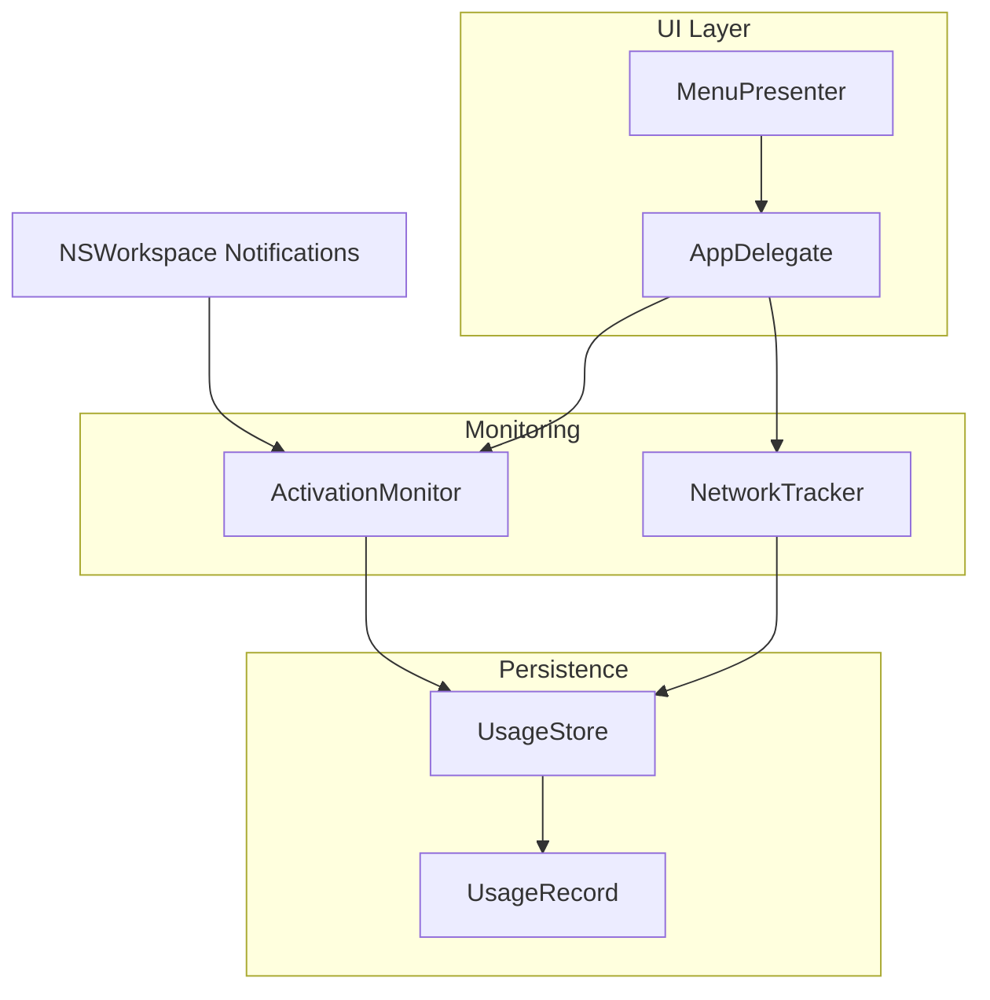
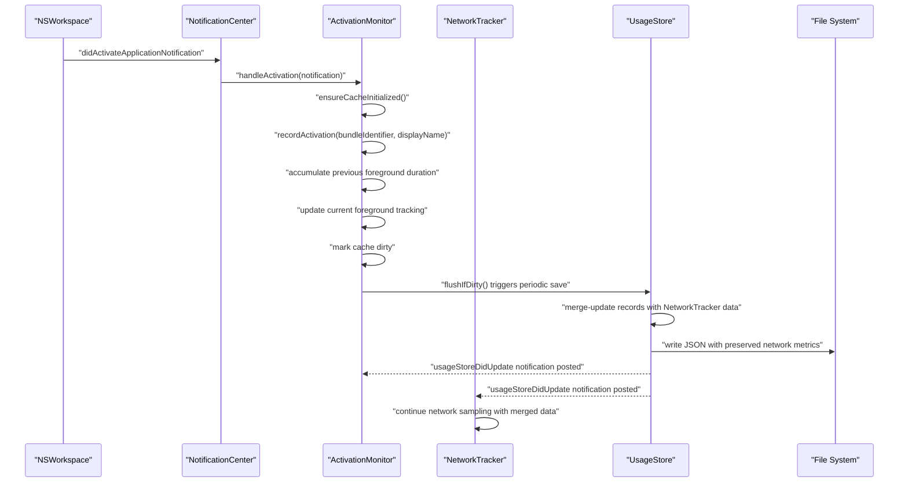
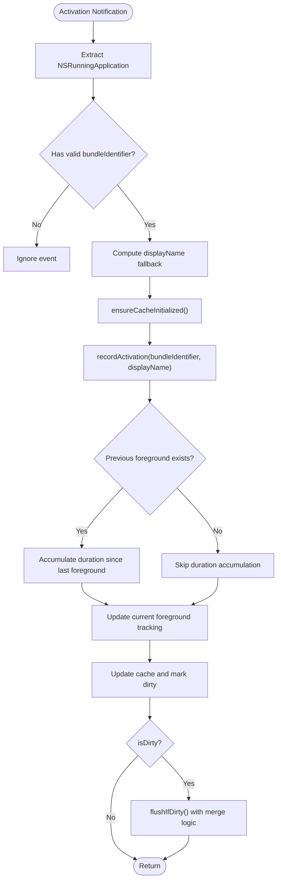
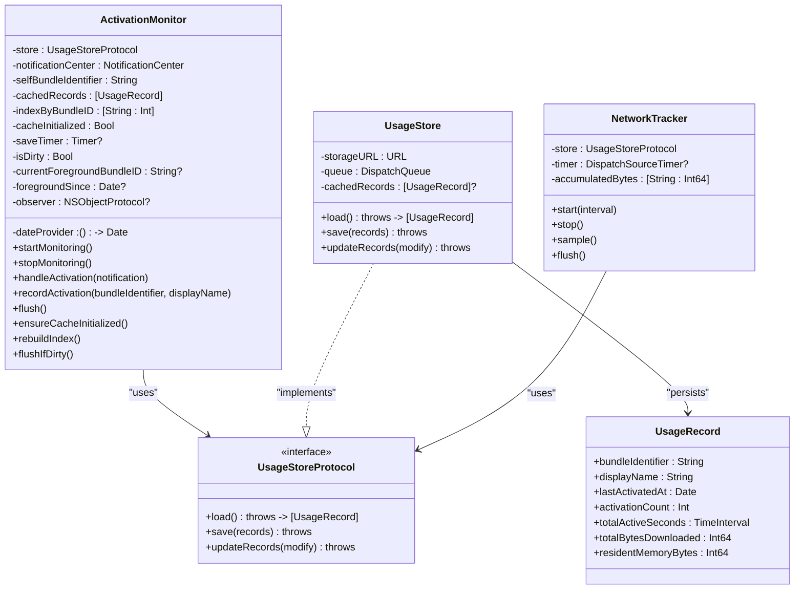

# Application Activation Monitoring

<cite>
**Referenced Files in This Document**
- [ActivationMonitor.swift](file://iTip/ActivationMonitor.swift)
- [UsageStore.swift](file://iTip/UsageStore.swift)
- [UsageRecord.swift](file://iTip/UsageRecord.swift)
- [UsageStoreProtocol.swift](file://iTip/UsageStoreProtocol.swift)
- [AppDelegate.swift](file://iTip/AppDelegate.swift)
- [NetworkTracker.swift](file://iTip/NetworkTracker.swift)
- [AppLauncher.swift](file://iTip/AppLauncher.swift)
- [ActivationMonitorTests.swift](file://iTipTests/ActivationMonitorTests.swift)
- [ActivationMonitorPropertyTests.swift](file://iTipTests/ActivationMonitorPropertyTests.swift)
- [InMemoryUsageStore.swift](file://iTipTests/InMemoryUsageStore.swift)
</cite>

## Update Summary
**Changes Made**
- Updated Core Components section to reflect O(1) lookup index and lazy initialization
- Enhanced Detailed Component Analysis with new cache management features
- Added Persistent Cache System section documenting lazy initialization and cache persistence
- Updated Memory Management Strategies to include O(1) lookup index benefits
- Enhanced Flush Operation section with merge logic details
- Updated Architecture Overview to show concurrent update protection

## Table of Contents
1. [Introduction](#introduction)
2. [Project Structure](#project-structure)
3. [Core Components](#core-components)
4. [Architecture Overview](#architecture-overview)
5. [Detailed Component Analysis](#detailed-component-analysis)
6. [Dependency Analysis](#dependency-analysis)
7. [Performance Considerations](#performance-considerations)
8. [Troubleshooting Guide](#troubleshooting-guide)
9. [Conclusion](#conclusion)

## Introduction
This document explains the Application Activation Monitoring component responsible for tracking macOS application activation events and maintaining usage statistics. It focuses on how the ActivationMonitor integrates with NSWorkspace to receive activation notifications, processes activation events, maintains an in-memory cache with O(1) lookup capabilities to minimize disk I/O, and persists changes efficiently. It also covers initialization parameters, lifecycle management, memory management strategies including lazy initialization, and practical usage patterns.

## Project Structure
The activation monitoring feature spans several modules:
- ActivationMonitor: Event handler and state machine for activation tracking with O(1) lookup index and lazy initialization
- UsageStore and UsageStoreProtocol: Persistence layer for usage records with atomic merge operations
- UsageRecord: Data model representing per-application usage metrics with backward compatibility
- NetworkTracker: Concurrent network usage tracker that preserves data during simultaneous updates
- AppDelegate: Orchestration of monitors during app lifecycle
- Tests: Behavioral verification of activation handling and persistence

**Diagram sources**
- [AppDelegate.swift:9-34](file://iTip/AppDelegate.swift#L9-L34)
- [ActivationMonitor.swift:38-67](file://iTip/ActivationMonitor.swift#L38-L67)
- [UsageStore.swift:4-107](file://iTip/UsageStore.swift#L4-L107)
- [UsageRecord.swift:3-32](file://iTip/UsageRecord.swift#L3-L32)
- [NetworkTracker.swift:4-6](file://iTip/NetworkTracker.swift#L4-L6)

**Section sources**
- [AppDelegate.swift:9-34](file://iTip/AppDelegate.swift#L9-L34)
- [ActivationMonitor.swift:3-36](file://iTip/ActivationMonitor.swift#L3-L36)
- [UsageStore.swift:4-22](file://iTip/UsageStore.swift#L4-L22)
- [UsageRecord.swift:3-32](file://iTip/UsageRecord.swift#L3-L32)
- [NetworkTracker.swift:4-6](file://iTip/NetworkTracker.swift#L4-L6)

## Core Components
- **ActivationMonitor**: Listens for NSWorkspace.didActivateApplicationNotification, filters self-activations, maintains an in-memory cache with O(1) lookup via bundleIdentifier index, tracks foreground applications, accumulates foreground durations, and persists changes via a debounced timer with merge logic.
- **UsageStore**: Provides asynchronous, thread-safe persistence with JSON encoding and atomic merge-update mechanisms to preserve network-derived metrics during concurrent updates.
- **UsageRecord**: Encodable model capturing per-app metrics including activation counts, timestamps, cumulative active seconds, and downloaded bytes with backward compatibility support.
- **UsageStoreProtocol**: Abstraction enabling test doubles and dependency injection.
- **NetworkTracker**: Concurrent network usage tracker that safely updates download metrics without interfering with activation data.

Key responsibilities:
- Event ingestion: Convert NSWorkspace notifications to internal activation events
- Filtering: Ignore self-activations and invalid identifiers
- Caching: Maintain an in-memory index for O(1) lookups with lazy initialization
- Duration tracking: Compute foreground duration for previously active apps
- Persistence: Debounce writes with merge logic to preserve concurrent updates
- Concurrent protection: Prevent data loss during simultaneous activation and network updates

**Section sources**
- [ActivationMonitor.swift:3-36](file://iTip/ActivationMonitor.swift#L3-L36)
- [UsageStore.swift:4-107](file://iTip/UsageStore.swift#L4-L107)
- [UsageRecord.swift:3-32](file://iTip/UsageRecord.swift#L3-L32)
- [UsageStoreProtocol.swift:3-8](file://iTip/UsageStoreProtocol.swift#L3-L8)
- [NetworkTracker.swift:4-6](file://iTip/NetworkTracker.swift#L4-L6)

## Architecture Overview
The monitoring pipeline integrates with the macOS notification system and persists usage metrics through a layered architecture with concurrent update protection.

**Diagram sources**
- [ActivationMonitor.swift:43-49](file://iTip/ActivationMonitor.swift#L43-L49)
- [ActivationMonitor.swift:144-155](file://iTip/ActivationMonitor.swift#L144-L155)
- [ActivationMonitor.swift:69-105](file://iTip/ActivationMonitor.swift#L69-L105)
- [ActivationMonitor.swift:116-142](file://iTip/ActivationMonitor.swift#L116-L142)
- [UsageStore.swift:69-105](file://iTip/UsageStore.swift#L69-L105)
- [NetworkTracker.swift:56-76](file://iTip/NetworkTracker.swift#L56-L76)

## Detailed Component Analysis

### ActivationMonitor Implementation
**Updated** Enhanced with O(1) lookup index, lazy initialization, and improved cache management

Responsibilities:
- Initialize with store dependency, notification center, date provider, and self bundle identifier
- Register for NSWorkspace.didActivateApplicationNotification on the main queue
- Maintain an in-memory cache of UsageRecord with O(1) lookup via bundleIdentifier index
- Implement lazy initialization to load cache only when needed
- Track foreground application and compute active duration for the previous foreground app
- Debounce writes with a periodic timer and an isDirty flag
- Persist changes atomically via UsageStore.updateRecords with merge logic

Initialization parameters:
- store: UsageStoreProtocol for persistence
- notificationCenter: Defaults to NSWorkspace.shared.notificationCenter
- dateProvider: Defaults to Date.init; useful for deterministic tests
- selfBundleIdentifier: Defaults to Bundle.main.bundleIdentifier; prevents self-activation from being recorded

Lifecycle:
- startMonitoring: Registers observer, starts periodic save timer, initializes cache lazily
- stopMonitoring: Removes observer, invalidates timer, flushes pending changes

Event handling:
- handleActivation: Extracts NSRunningApplication from notification userInfo, validates bundleIdentifier, computes displayName fallback, and delegates to recordActivation
- recordActivation: Updates foreground tracking, increments activation count, updates lastActivatedAt, and ensures displayName is set; creates new records if needed; marks cache dirty

**Updated** Cache Management:
- Lazy initialization: ensureCacheInitialized() loads cache only when first accessed
- Persistent cache: cachedRecords maintains state across activations until explicitly flushed
- O(1) lookup index: indexByBundleID provides constant-time record access
- Index rebuilding: rebuildIndex() maintains accurate mapping after modifications

**Updated** Memory management:
- In-memory cache avoids frequent disk I/O with lazy loading
- O(1) lookup index enables efficient record updates
- isDirty flag prevents unnecessary writes
- Weak self in closures avoids retain cycles
- saveTimer invalidated on stopMonitoring

**Updated** Flush operation with merge logic:
- flushIfDirty() performs atomic merge to preserve NetworkTracker data
- Snapshot-based approach prevents data conflicts during concurrent updates
- Error handling retries failed flushes by marking cache dirty

**Updated** Foreground tracking:
- currentForegroundBundleID and foregroundSince track the previous foreground app
- On each activation, compute duration since last foreground switch and add to totalActiveSeconds

**Section sources**
- [ActivationMonitor.swift:28-36](file://iTip/ActivationMonitor.swift#L28-L36)
- [ActivationMonitor.swift:38-67](file://iTip/ActivationMonitor.swift#L38-L67)
- [ActivationMonitor.swift:144-155](file://iTip/ActivationMonitor.swift#L144-L155)
- [ActivationMonitor.swift:69-105](file://iTip/ActivationMonitor.swift#L69-L105)
- [ActivationMonitor.swift:116-142](file://iTip/ActivationMonitor.swift#L116-L142)
- [ActivationMonitor.swift:77-86](file://iTip/ActivationMonitor.swift#L77-L86)
- [ActivationMonitor.swift:130-135](file://iTip/ActivationMonitor.swift#L130-L135)
- [ActivationMonitor.swift:137-163](file://iTip/ActivationMonitor.swift#L137-L163)

### UsageStore and UsageRecord
**Updated** Enhanced with atomic merge operations and concurrent update protection

UsageStore:
- Thread-safe JSON persistence using a serial queue
- Supports load, save, and atomic updateRecords with merge semantics
- Posts usageStoreDidUpdate upon successful persistence
- Handles missing files gracefully by returning empty arrays
- **New**: Atomic merge operations preserve concurrent updates from NetworkTracker

UsageRecord:
- Encodable struct with backward-compatible decoding defaults for new fields
- Fields include bundleIdentifier, displayName, lastActivatedAt, activationCount, totalActiveSeconds, and totalBytesDownloaded

**Section sources**
- [UsageStore.swift:4-107](file://iTip/UsageStore.swift#L4-L107)
- [UsageRecord.swift:3-32](file://iTip/UsageRecord.swift#L3-L32)

### NetworkTracker Integration
**New** Concurrent update protection mechanism

NetworkTracker:
- Samples network usage via nettop command every interval seconds
- Accumulates bytes per bundle identifier in memory
- Uses atomic updateRecords to safely append network data without interfering with activation metrics
- Preserves existing download metrics during concurrent activation updates
- Implements timeout safety net to prevent hangs during network sampling

**Section sources**
- [NetworkTracker.swift:4-6](file://iTip/NetworkTracker.swift#L4-L6)
- [NetworkTracker.swift:56-76](file://iTip/NetworkTracker.swift#L56-L76)

### UsageStoreProtocol and Test Doubles
UsageStoreProtocol defines the interface for persistence operations, enabling dependency injection and testing. InMemoryUsageStore is a test double that stores records in memory and supports updateRecords for property-based tests.

**Section sources**
- [UsageStoreProtocol.swift:3-8](file://iTip/UsageStoreProtocol.swift#L3-L8)
- [InMemoryUsageStore.swift:4-22](file://iTipTests/InMemoryUsageStore.swift#L4-L22)

### Lifecycle Management in AppDelegate
AppDelegate initializes and manages ActivationMonitor and NetworkTracker, starts monitoring on launch, and stops on termination. It also seeds the store with Spotlight data on cold start.

**Section sources**
- [AppDelegate.swift:9-34](file://iTip/AppDelegate.swift#L9-L34)
- [AppDelegate.swift:36-39](file://iTip/AppDelegate.swift#L36-L39)

### Practical Usage Examples
- Basic initialization and monitoring:
  - Instantiate UsageStore and pass it to ActivationMonitor
  - Call startMonitoring to begin listening for activation events
  - Call stopMonitoring to clean up observers and flush pending changes
- Testing with deterministic timestamps:
  - Inject a fixed dateProvider for reproducible tests
  - Use InMemoryUsageStore to verify in-memory caching behavior
- Filtering self-activations:
  - Provide selfBundleIdentifier to prevent recording the app's own activations
- **New**: Concurrency testing:
  - Verify that concurrent activation and network updates don't interfere with each other
  - Test merge logic preserves both activation and network data

**Section sources**
- [AppDelegate.swift:13-14](file://iTip/AppDelegate.swift#L13-L14)
- [ActivationMonitorTests.swift:8-15](file://iTipTests/ActivationMonitorTests.swift#L8-L15)
- [ActivationMonitorPropertyTests.swift:15-25](file://iTipTests/ActivationMonitorPropertyTests.swift#L15-L25)

### Event Handling Mechanism
The component listens for NSWorkspace.didActivateApplicationNotification and processes each activation as follows:
- Extract NSRunningApplication from notification userInfo
- Validate bundleIdentifier and displayName fallback
- Delegate to recordActivation to update cache and mark dirty
- Persist changes via periodic flushIfDirty with merge logic

**Diagram sources**
- [ActivationMonitor.swift:144-155](file://iTip/ActivationMonitor.swift#L144-L155)
- [ActivationMonitor.swift:69-105](file://iTip/ActivationMonitor.swift#L69-L105)
- [ActivationMonitor.swift:77-86](file://iTip/ActivationMonitor.swift#L77-L86)
- [ActivationMonitor.swift:137-163](file://iTip/ActivationMonitor.swift#L137-L163)

## Dependency Analysis
**Updated** Enhanced with concurrent update protection dependencies

ActivationMonitor depends on:
- UsageStoreProtocol for persistence
- NSWorkspace.shared.notificationCenter for activation events
- DateProvider for time-based operations
- Bundle.main.bundleIdentifier for self-filtering

UsageStore depends on:
- FileManager for file operations
- JSONEncoder/JSONDecoder for serialization
- DispatchQueue for thread safety

**Diagram sources**
- [ActivationMonitor.swift:3-36](file://iTip/ActivationMonitor.swift#L3-L36)
- [UsageStore.swift:4-107](file://iTip/UsageStore.swift#L4-L107)
- [UsageRecord.swift:3-32](file://iTip/UsageRecord.swift#L3-L32)
- [UsageStoreProtocol.swift:3-8](file://iTip/UsageStoreProtocol.swift#L3-L8)
- [NetworkTracker.swift:4-6](file://iTip/NetworkTracker.swift#L4-L6)

**Section sources**
- [ActivationMonitor.swift:3-36](file://iTip/ActivationMonitor.swift#L3-L36)
- [UsageStore.swift:4-107](file://iTip/UsageStore.swift#L4-L107)
- [UsageRecord.swift:3-32](file://iTip/UsageRecord.swift#L3-L32)
- [UsageStoreProtocol.swift:3-8](file://iTip/UsageStoreProtocol.swift#L3-L8)
- [NetworkTracker.swift:4-6](file://iTip/NetworkTracker.swift#L4-L6)

## Performance Considerations
**Updated** Enhanced with O(1) lookup performance and concurrent update benefits

- **In-memory cache with lazy initialization**: Reduces disk I/O by loading records only when first accessed and keeping them in RAM
- **O(1) lookup index**: bundleIdentifier → index mapping enables constant-time record access, eliminating linear searches
- **Debounced writes**: A periodic timer flushIfDirty reduces write frequency to every 5 seconds when dirty
- **Atomic merges**: updateRecords merges in-memory changes with disk state, preserving network-derived metrics from concurrent updates
- **Weak references**: Closures capture self weakly to avoid retain cycles
- **Main queue observation**: Ensures UI-related updates occur on the main thread
- **Concurrent protection**: Merge logic prevents data loss during simultaneous activation and network updates

## Troubleshooting Guide
**Updated** Added concurrency-related troubleshooting

Common issues and resolutions:
- Permission requirements:
  - macOS may require Accessibility permissions for reliable activation tracking. If notifications are not received, verify the app's accessibility settings.
- Notification delivery failures:
  - If NSWorkspace notifications are not delivered, confirm that the app is registered for activation events and that the observer is active.
- Missing application metadata:
  - If bundleIdentifier is empty or nil, the event is ignored. Ensure the app under test has a valid bundleIdentifier.
- Self-activation filtering:
  - The component ignores activations matching selfBundleIdentifier. Verify the identifier passed to initialization matches the app's bundle identifier.
- Persistence errors:
  - flushIfDirty catches and rethrows errors, marking the cache dirty to retry later. Check logs for JSON decoding/encoding failures.
- **New**: Concurrency conflicts:
  - If activation and network updates appear to overwrite each other, verify that merge logic is working correctly
  - Check that both ActivationMonitor and NetworkTracker use the same UsageStore instance
  - Monitor usageStoreDidUpdate notifications to ensure proper coordination

Practical checks:
- Verify isMonitoring is true after startMonitoring
- Confirm usageStoreDidUpdate notifications are posted after flushIfDirty
- Validate that totalActiveSeconds accumulates only for foreground transitions
- **New**: Verify concurrent updates preserve both activation and network data
- **New**: Test merge logic with simultaneous activation and network sampling

**Section sources**
- [ActivationMonitor.swift:144-155](file://iTip/ActivationMonitor.swift#L144-L155)
- [ActivationMonitor.swift:116-142](file://iTip/ActivationMonitor.swift#L116-L142)
- [UsageStore.swift:38-48](file://iTip/UsageStore.swift#L38-L48)
- [ActivationMonitorTests.swift:17-28](file://iTipTests/ActivationMonitorTests.swift#L17-L28)
- [ActivationMonitorTests.swift:83-97](file://iTipTests/ActivationMonitorTests.swift#L83-L97)

## Conclusion
The Application Activation Monitoring component provides robust, efficient tracking of macOS application activations with significant performance improvements. By leveraging NSWorkspace notifications, an in-memory cache with O(1) lookup capabilities, lazy initialization, and a debounced persistence strategy with merge logic, it minimizes I/O overhead while maintaining accurate usage metrics. The design supports testability via dependency injection and protocol-based abstractions, handles edge cases such as self-filtering and missing metadata gracefully, and provides concurrent update protection to prevent data conflicts between activation and network tracking operations.