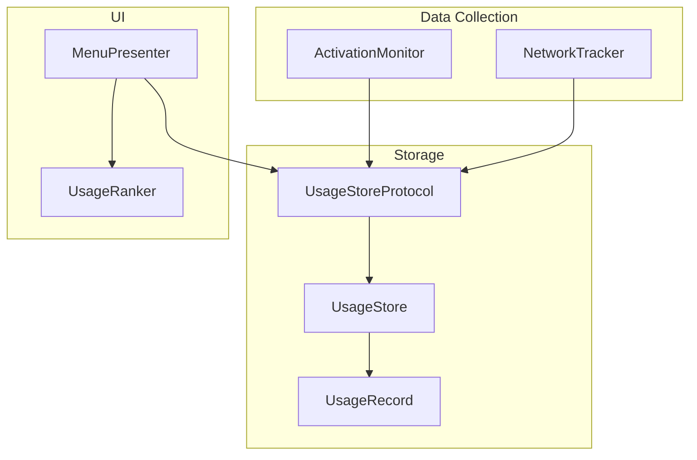
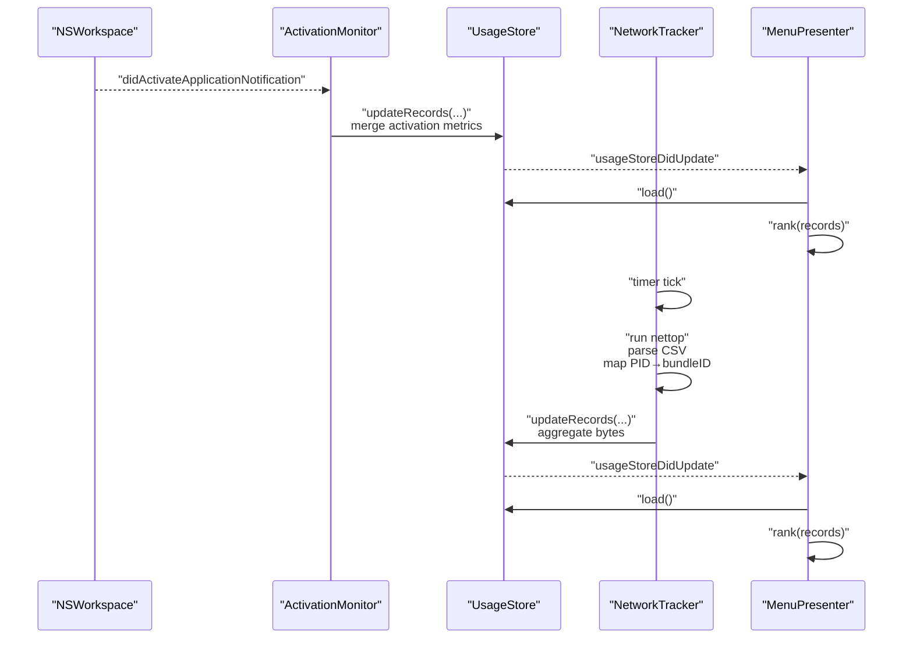
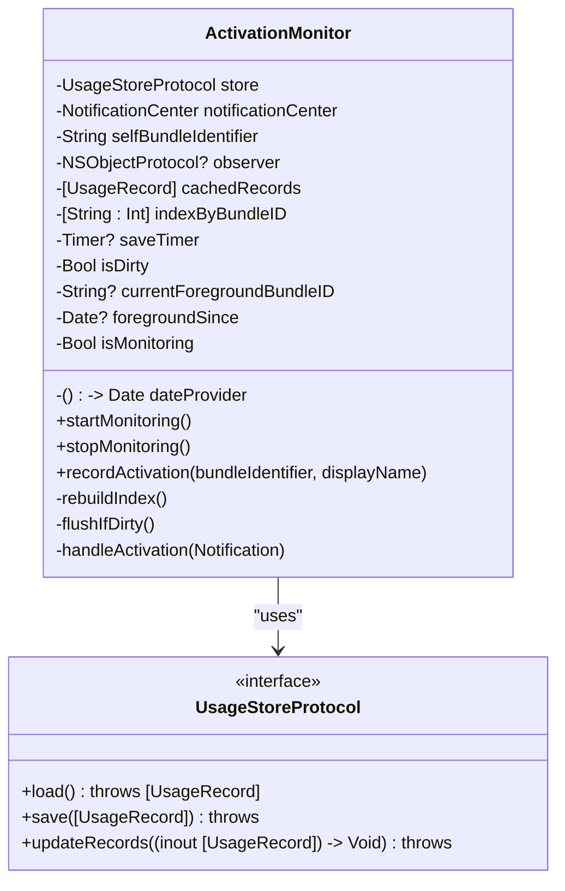
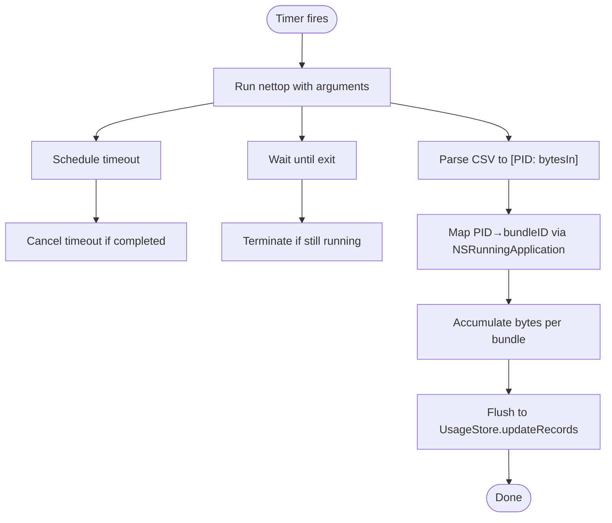
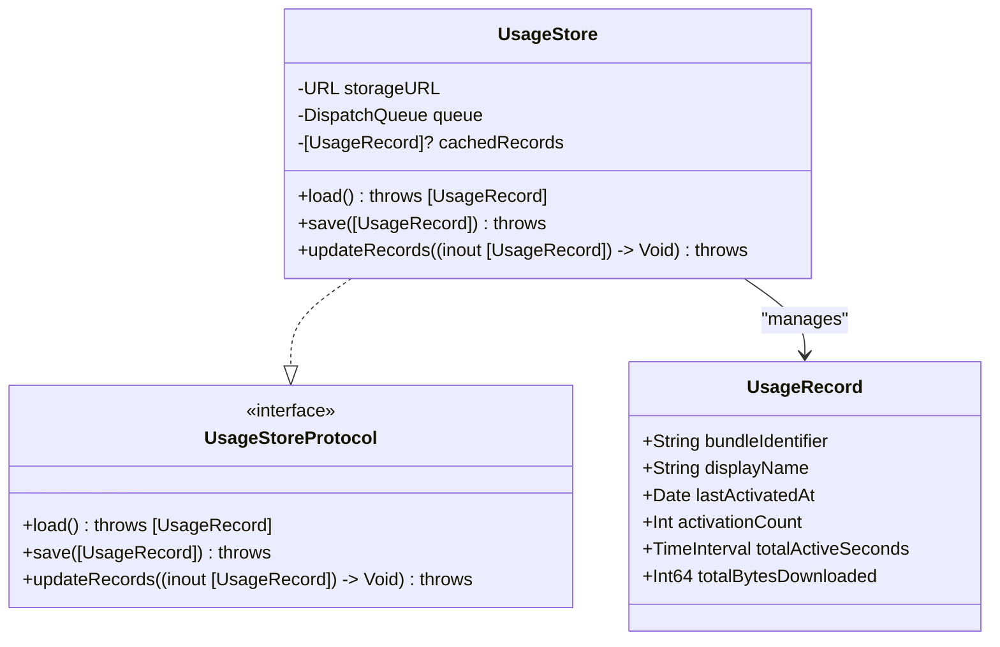
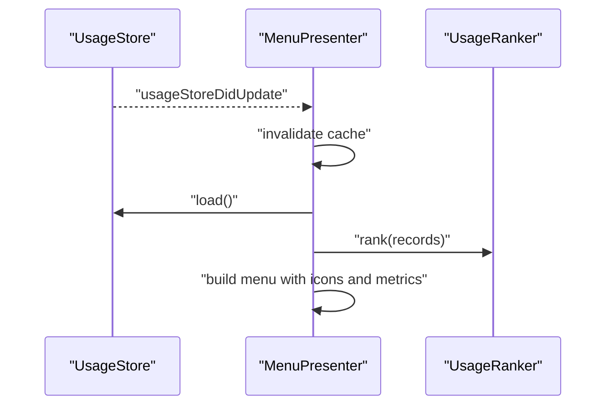
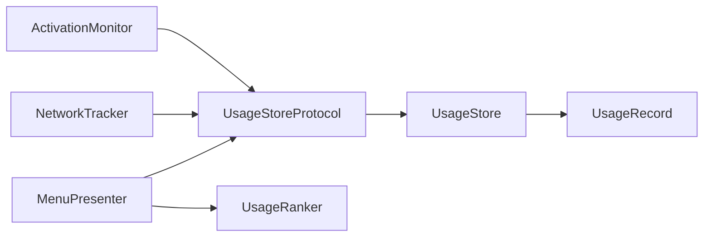

# Data Collection Layer

<cite>
**Referenced Files in This Document**
- [ActivationMonitor.swift](file://iTip/ActivationMonitor.swift)
- [NetworkTracker.swift](file://iTip/NetworkTracker.swift)
- [UsageStore.swift](file://iTip/UsageStore.swift)
- [UsageStoreProtocol.swift](file://iTip/UsageStoreProtocol.swift)
- [UsageRecord.swift](file://iTip/UsageRecord.swift)
- [AppDelegate.swift](file://iTip/AppDelegate.swift)
- [MenuPresenter.swift](file://iTip/MenuPresenter.swift)
- [UsageRanker.swift](file://iTip/UsageRanker.swift)
- [ActivationMonitorTests.swift](file://iTipTests/ActivationMonitorTests.swift)
- [IntegrationTests.swift](file://iTipTests/IntegrationTests.swift)
- [InMemoryUsageStore.swift](file://iTipTests/InMemoryUsageStore.swift)
</cite>

## Table of Contents
1. [Introduction](#introduction)
2. [Project Structure](#project-structure)
3. [Core Components](#core-components)
4. [Architecture Overview](#architecture-overview)
5. [Detailed Component Analysis](#detailed-component-analysis)
6. [Dependency Analysis](#dependency-analysis)
7. [Performance Considerations](#performance-considerations)
8. [Troubleshooting Guide](#troubleshooting-guide)
9. [Conclusion](#conclusion)
10. [Appendices](#appendices)

## Introduction
This document explains the data collection layer that powers iTip’s application usage metrics. It focuses on two primary collectors:
- ActivationMonitor: tracks application activation events using NSWorkspace notifications and maintains an in-memory cache with periodic disk flushes.
- NetworkTracker: periodically samples per-process network usage via the system command nettop and aggregates bytes per application bundle identifier into the UsageStore.

It covers event handling, memory management, caching, timing and sampling intervals, error handling, permission requirements, and integration with the UsageStore and UI components.

## Project Structure
The data collection layer is centered around:
- UsageStoreProtocol: interface for loading, saving, and atomic updates to usage records.
- UsageStore: concrete JSON-backed storage with thread-safe queues and in-memory caching.
- UsageRecord: model representing cumulative metrics per application.
- ActivationMonitor: NSWorkspace integration for activation events, in-memory cache, and periodic flush.
- NetworkTracker: system command integration for per-process network sampling, parsing, and aggregation.
- MenuPresenter: reads UsageStore, ranks records, and builds the menu with icons and formatted metrics.
- UsageRanker: sorts records by recency and frequency.
- AppDelegate: orchestrates lifecycle and starts/stops collectors.

**Diagram sources**
- [ActivationMonitor.swift:1-157](file://iTip/ActivationMonitor.swift#L1-L157)
- [NetworkTracker.swift:1-152](file://iTip/NetworkTracker.swift#L1-L152)
- [UsageStore.swift:1-107](file://iTip/UsageStore.swift#L1-L107)
- [UsageStoreProtocol.swift:1-14](file://iTip/UsageStoreProtocol.swift#L1-L14)
- [UsageRecord.swift:1-33](file://iTip/UsageRecord.swift#L1-L33)
- [MenuPresenter.swift:1-253](file://iTip/MenuPresenter.swift#L1-L253)
- [UsageRanker.swift:1-15](file://iTip/UsageRanker.swift#L1-L15)

**Section sources**
- [AppDelegate.swift:1-81](file://iTip/AppDelegate.swift#L1-L81)
- [UsageStoreProtocol.swift:1-14](file://iTip/UsageStoreProtocol.swift#L1-L14)

## Core Components
- ActivationMonitor
  - Subscribes to NSWorkspace didActivateApplicationNotification.
  - Maintains an in-memory cache of UsageRecord with O(1) lookup via bundleIdentifier.
  - Debounces disk writes with a periodic timer and marks dirty state when records change.
  - Computes foreground duration for the previous active app and updates counts and timestamps.
  - Ignores self-activations and empty bundle identifiers at the notification level.
- NetworkTracker
  - Periodically runs nettop with arguments to capture per-process traffic.
  - Parses CSV output to extract PID and bytes_in, maps PIDs to bundle identifiers via NSRunningApplication.
  - Aggregates bytes per bundle in memory and flushes to UsageStore atomically.
  - Uses timeouts to prevent hanging system commands and retries on failure.
- UsageStore and UsageRecord
  - Thread-safe JSON persistence with in-memory caching.
  - Atomic updateRecords to merge in-memory changes with disk state.
  - UsageRecord includes cumulative metrics: activationCount, lastActivatedAt, totalActiveSeconds, totalBytesDownloaded.
- MenuPresenter and UsageRanker
  - Rank records by lastActivatedAt and activationCount.
  - Build a menu with icons, formatted metrics, and dynamic refresh on store updates.

**Section sources**
- [ActivationMonitor.swift:1-157](file://iTip/ActivationMonitor.swift#L1-L157)
- [NetworkTracker.swift:1-152](file://iTip/NetworkTracker.swift#L1-L152)
- [UsageStore.swift:1-107](file://iTip/UsageStore.swift#L1-L107)
- [UsageRecord.swift:1-33](file://iTip/UsageRecord.swift#L1-L33)
- [MenuPresenter.swift:1-253](file://iTip/MenuPresenter.swift#L1-L253)
- [UsageRanker.swift:1-15](file://iTip/UsageRanker.swift#L1-L15)

## Architecture Overview
The collectors feed UsageStore, which emits a notification on updates. MenuPresenter listens for updates, invalidates caches, reloads records, ranks them, and renders the menu.

**Diagram sources**
- [ActivationMonitor.swift:38-67](file://iTip/ActivationMonitor.swift#L38-L67)
- [ActivationMonitor.swift:144-155](file://iTip/ActivationMonitor.swift#L144-L155)
- [NetworkTracker.swift:26-76](file://iTip/NetworkTracker.swift#L26-L76)
- [UsageStore.swift:69-105](file://iTip/UsageStore.swift#L69-L105)
- [MenuPresenter.swift:52-60](file://iTip/MenuPresenter.swift#L52-L60)

## Detailed Component Analysis

### ActivationMonitor
- NSWorkspace integration
  - Subscribes to NSWorkspace.didActivateApplicationNotification on the main queue.
  - Extracts NSRunningApplication from userInfo and derives bundleIdentifier and displayName.
  - Filters out self-activations and empty identifiers at the notification level.
- In-memory cache and indexing
  - Loads records once at startup and rebuilds an index mapping bundleIdentifier to cachedRecords indices.
  - Uses a dictionary indexByBundleID for O(1) lookup.
- Duration and accumulation
  - Tracks currentForegroundBundleID and foregroundSince to compute foreground duration for the previous app.
  - Updates totalActiveSeconds, lastActivatedAt, and activationCount atomically via UsageStore.updateRecords.
- Memory management and timers
  - Uses a weak self capture in closures to avoid retain cycles.
  - Debounces writes with a periodic Timer scheduled every 5 seconds.
  - On stopMonitoring, cancels the timer, flushes pending changes, and disables monitoring flag.
- Persistence strategy
  - flushIfDirty snapshots cachedRecords and merges with disk state, preserving network-derived bytes.
  - Retries on failure by marking isDirty to flush again later.

**Diagram sources**
- [ActivationMonitor.swift:1-157](file://iTip/ActivationMonitor.swift#L1-L157)
- [UsageStoreProtocol.swift:1-14](file://iTip/UsageStoreProtocol.swift#L1-L14)

**Section sources**
- [ActivationMonitor.swift:38-67](file://iTip/ActivationMonitor.swift#L38-L67)
- [ActivationMonitor.swift:69-105](file://iTip/ActivationMonitor.swift#L69-L105)
- [ActivationMonitor.swift:109-142](file://iTip/ActivationMonitor.swift#L109-L142)
- [ActivationMonitor.swift:144-155](file://iTip/ActivationMonitor.swift#L144-L155)

### NetworkTracker
- System command integration
  - Spawns /usr/bin/nettop with arguments to capture per-process traffic for a single snapshot.
  - Pipes stdout and discards stderr to avoid noise.
  - Schedules a timeout to terminate the process if it does not exit within a safety window.
- Parsing and mapping
  - Parses CSV output skipping the header and extracting PID and bytes_in.
  - Maps PIDs to bundle identifiers using NSWorkspace.shared.runningApplications.
- Aggregation and persistence
  - Accumulates bytes per bundle in memory and flushes to UsageStore.updateRecords.
  - Only updates existing records to avoid creating new entries solely for network data.
  - Retries failed flushes by restoring bytes into the accumulator.
- Timing and concurrency
  - Uses a GCD timer on a utility queue with a configurable interval (default 10 seconds).
  - Uses a separate timeout queue to ensure the timeout can fire even if the sampling queue is blocked.

**Diagram sources**
- [NetworkTracker.swift:26-76](file://iTip/NetworkTracker.swift#L26-L76)
- [NetworkTracker.swift:78-106](file://iTip/NetworkTracker.swift#L78-L106)
- [NetworkTracker.swift:109-150](file://iTip/NetworkTracker.swift#L109-L150)

**Section sources**
- [NetworkTracker.swift:21-40](file://iTip/NetworkTracker.swift#L21-L40)
- [NetworkTracker.swift:44-76](file://iTip/NetworkTracker.swift#L44-L76)
- [NetworkTracker.swift:78-106](file://iTip/NetworkTracker.swift#L78-L106)
- [NetworkTracker.swift:109-150](file://iTip/NetworkTracker.swift#L109-L150)

### UsageStore and UsageRecord
- UsageStoreProtocol
  - Defines load, save, and atomic updateRecords APIs.
  - Emits usageStoreDidUpdate notifications upon successful persistence.
- UsageStore
  - Thread-safe JSON persistence using a serial queue.
  - Caches loaded records to avoid repeated disk I/O.
  - updateRecords loads from cache or disk, applies modifications, encodes, and writes atomically.
  - Posts usageStoreDidUpdate on completion.
- UsageRecord
  - Codable struct with backward-compatible decoding defaults for new fields.
  - Fields include bundleIdentifier, displayName, lastActivatedAt, activationCount, totalActiveSeconds, totalBytesDownloaded.

**Diagram sources**
- [UsageStoreProtocol.swift:1-14](file://iTip/UsageStoreProtocol.swift#L1-L14)
- [UsageStore.swift:1-107](file://iTip/UsageStore.swift#L1-L107)
- [UsageRecord.swift:1-33](file://iTip/UsageRecord.swift#L1-L33)

**Section sources**
- [UsageStoreProtocol.swift:1-14](file://iTip/UsageStoreProtocol.swift#L1-L14)
- [UsageStore.swift:24-105](file://iTip/UsageStore.swift#L24-L105)
- [UsageRecord.swift:3-32](file://iTip/UsageRecord.swift#L3-L32)

### Integration Patterns with MenuPresenter and UsageRanker
- MenuPresenter
  - Observes usageStoreDidUpdate to invalidate caches and refresh menu content.
  - Loads records lazily and caches them until the next update.
  - Ranks records via UsageRanker and builds a menu with icons and formatted metrics.
  - Automatically removes records whose applications are no longer installed and persists the cleaned set.
- UsageRanker
  - Sorts by lastActivatedAt descending, then by activationCount descending, and limits to top 10.

**Diagram sources**
- [MenuPresenter.swift:52-60](file://iTip/MenuPresenter.swift#L52-L60)
- [MenuPresenter.swift:68-147](file://iTip/MenuPresenter.swift#L68-L147)
- [UsageRanker.swift:3-14](file://iTip/UsageRanker.swift#L3-L14)

**Section sources**
- [MenuPresenter.swift:52-60](file://iTip/MenuPresenter.swift#L52-L60)
- [MenuPresenter.swift:68-147](file://iTip/MenuPresenter.swift#L68-L147)
- [UsageRanker.swift:3-14](file://iTip/UsageRanker.swift#L3-L14)

## Dependency Analysis
- Coupling and cohesion
  - ActivationMonitor and NetworkTracker depend on UsageStoreProtocol, enabling test doubles and decoupling from concrete storage.
  - UsageStore encapsulates persistence and caching, minimizing coupling to UI components.
  - MenuPresenter depends on UsageStoreProtocol and UsageRanker, keeping UI concerns separate from data logic.
- External dependencies
  - NSWorkspace for activation events and application metadata.
  - nettop for per-process network sampling.
  - NSRunningApplication for PID-to-bundle mapping.
- Notifications
  - UsageStore posts usageStoreDidUpdate to notify observers (MenuPresenter) of changes.

**Diagram sources**
- [ActivationMonitor.swift:1-157](file://iTip/ActivationMonitor.swift#L1-L157)
- [NetworkTracker.swift:1-152](file://iTip/NetworkTracker.swift#L1-L152)
- [UsageStore.swift:1-107](file://iTip/UsageStore.swift#L1-L107)
- [UsageStoreProtocol.swift:1-14](file://iTip/UsageStoreProtocol.swift#L1-L14)
- [MenuPresenter.swift:1-253](file://iTip/MenuPresenter.swift#L1-L253)
- [UsageRanker.swift:1-15](file://iTip/UsageRanker.swift#L1-L15)

**Section sources**
- [UsageStoreProtocol.swift:1-14](file://iTip/UsageStoreProtocol.swift#L1-L14)
- [MenuPresenter.swift:52-60](file://iTip/MenuPresenter.swift#L52-L60)

## Performance Considerations
- ActivationMonitor
  - In-memory cache avoids frequent disk I/O; indexByBundleID ensures O(1) lookups.
  - Debounced flush reduces write frequency; isDirty prevents unnecessary saves.
  - Foreground duration computation occurs only when switching apps.
- NetworkTracker
  - Single snapshot per interval minimizes overhead; timeout prevents hangs.
  - Accumulation in memory reduces write frequency; flush writes aggregated bytes atomically.
  - PID-to-bundle mapping uses NSWorkspace.runningApplications; consider caching bundle IDs if the set is stable.
- UsageStore
  - Serial queue ensures atomicity; in-memory cache reduces disk access.
  - Atomic write with .atomic option ensures durability.
- MenuPresenter
  - Caches icons and URLs to avoid repeated disk and workspace lookups.
  - Invalidates cache on usageStoreDidUpdate to keep UI fresh.

[No sources needed since this section provides general guidance]

## Troubleshooting Guide
- ActivationMonitor
  - Self-activation filtering: Ensure selfBundleIdentifier is configured correctly; self-activations are ignored.
  - Empty bundle identifiers: Notifications with empty bundleIdentifier are ignored at the handler level.
  - Missing displayName fallback: Falls back to bundleIdentifier if localizedName is unavailable.
  - Dirty state not flushing: If flushIfDirty fails, isDirty remains true; the next timer tick will retry.
- NetworkTracker
  - nettop failures: If nettop exits with non-zero status or throws, the sample is skipped; check system permissions and availability.
  - Timeout handling: If nettop hangs, the timeout terminates it; adjust sampleTimeout if needed.
  - Bytes not appearing: NetworkTracker only updates existing records; ensure prior activation recorded the app.
- UsageStore
  - JSON decode errors: Throws on malformed data; inspect logs and fix file corruption.
  - Concurrency: All operations are serialized on a dedicated queue; avoid external concurrent writes.
- UI refresh
  - MenuPresenter listens for usageStoreDidUpdate; if the menu does not refresh, verify the notification is posted and observer is registered.
- Permission requirements
  - NSWorkspace activation events require Accessibility permissions; ensure the app is granted.
  - nettop invocation requires appropriate privileges; ensure the app has necessary entitlements and permissions.

**Section sources**
- [ActivationMonitor.swift:19-28](file://iTip/ActivationMonitor.swift#L19-L28)
- [ActivationMonitor.swift:144-155](file://iTip/ActivationMonitor.swift#L144-L155)
- [NetworkTracker.swift:78-106](file://iTip/NetworkTracker.swift#L78-L106)
- [NetworkTracker.swift:109-150](file://iTip/NetworkTracker.swift#L109-L150)
- [UsageStore.swift:38-48](file://iTip/UsageStore.swift#L38-L48)
- [MenuPresenter.swift:52-60](file://iTip/MenuPresenter.swift#L52-L60)

## Conclusion
The data collection layer combines precise NSWorkspace activation tracking with periodic per-process network sampling. It emphasizes efficient caching, atomic persistence, and robust error handling. Together with MenuPresenter and UsageRanker, it delivers a responsive UI that reflects real-time usage metrics while maintaining reliability and performance.

[No sources needed since this section summarizes without analyzing specific files]

## Appendices

### Configuration Options and Timing
- ActivationMonitor
  - Debounce interval: 5 seconds for periodic flush.
  - Self bundle identifier: configurable during initialization.
- NetworkTracker
  - Sampling interval: configurable start(interval:) with default 10 seconds.
  - Sample timeout: 8 seconds to prevent hangs.
- UsageStore
  - Storage path: default Application Support directory under iTip/usage.json.
- MenuPresenter
  - Ranking: top 10 by lastActivatedAt and activationCount.
  - Metrics formatting: duration and bytes are formatted for readability.

**Section sources**
- [ActivationMonitor.swift:52-56](file://iTip/ActivationMonitor.swift#L52-L56)
- [ActivationMonitor.swift:28-36](file://iTip/ActivationMonitor.swift#L28-L36)
- [NetworkTracker.swift:26-34](file://iTip/NetworkTracker.swift#L26-L34)
- [NetworkTracker.swift:18-23](file://iTip/NetworkTracker.swift#L18-L23)
- [UsageStore.swift:17-22](file://iTip/UsageStore.swift#L17-L22)
- [UsageRanker.swift:4-13](file://iTip/UsageRanker.swift#L4-L13)
- [MenuPresenter.swift:232-251](file://iTip/MenuPresenter.swift#L232-L251)

### Implementation Details and Best Practices
- Proper usage
  - Initialize ActivationMonitor and NetworkTracker with a shared UsageStore instance.
  - Start monitoring in applicationDidFinishLaunching and stop on applicationWillTerminate.
  - Inject a date provider for deterministic tests; use InMemoryUsageStore for unit tests.
- Error handling
  - Wrap store.updateRecords in do-catch to handle transient failures gracefully.
  - NetworkTracker retries failed flushes by restoring bytes into the accumulator.
  - ActivationMonitor marks isDirty to retry flush on subsequent timer ticks.
- Testing
  - Use InMemoryUsageStore to isolate tests from disk I/O.
  - Validate activation counting, display name fallback, and self-filtering behaviors.
  - Integration tests verify full data flow from activation to menu building.

**Section sources**
- [AppDelegate.swift:9-34](file://iTip/AppDelegate.swift#L9-L34)
- [AppDelegate.swift:36-39](file://iTip/AppDelegate.swift#L36-L39)
- [InMemoryUsageStore.swift:1-23](file://iTipTests/InMemoryUsageStore.swift#L1-L23)
- [ActivationMonitorTests.swift:17-101](file://iTipTests/ActivationMonitorTests.swift#L17-L101)
- [IntegrationTests.swift:6-128](file://iTipTests/IntegrationTests.swift#L6-L128)