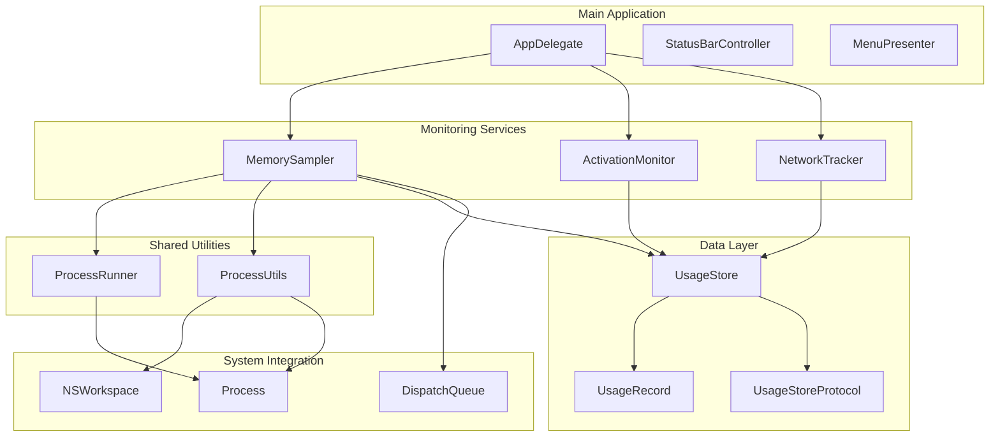
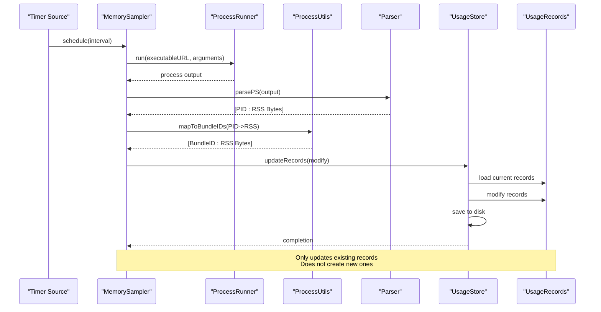
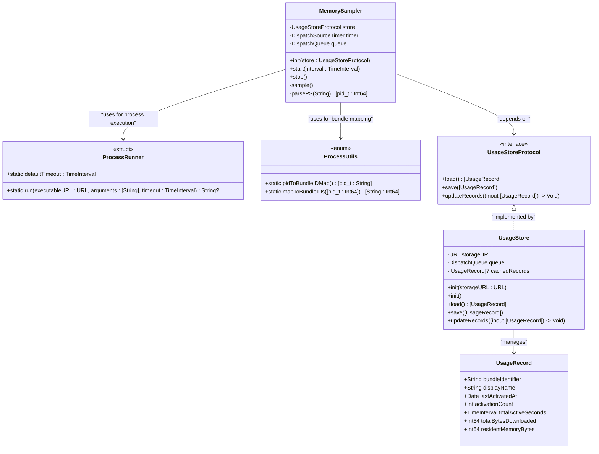
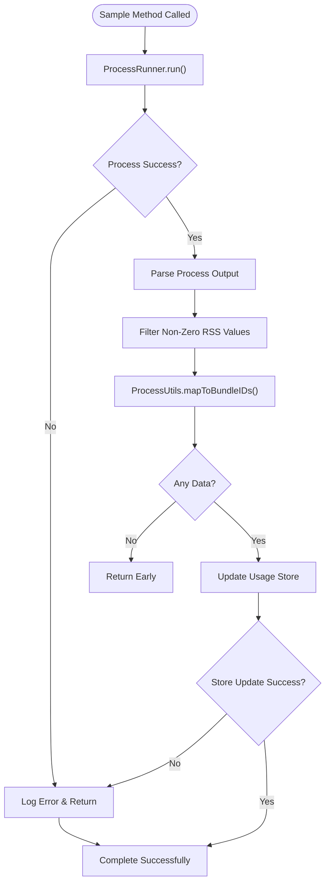
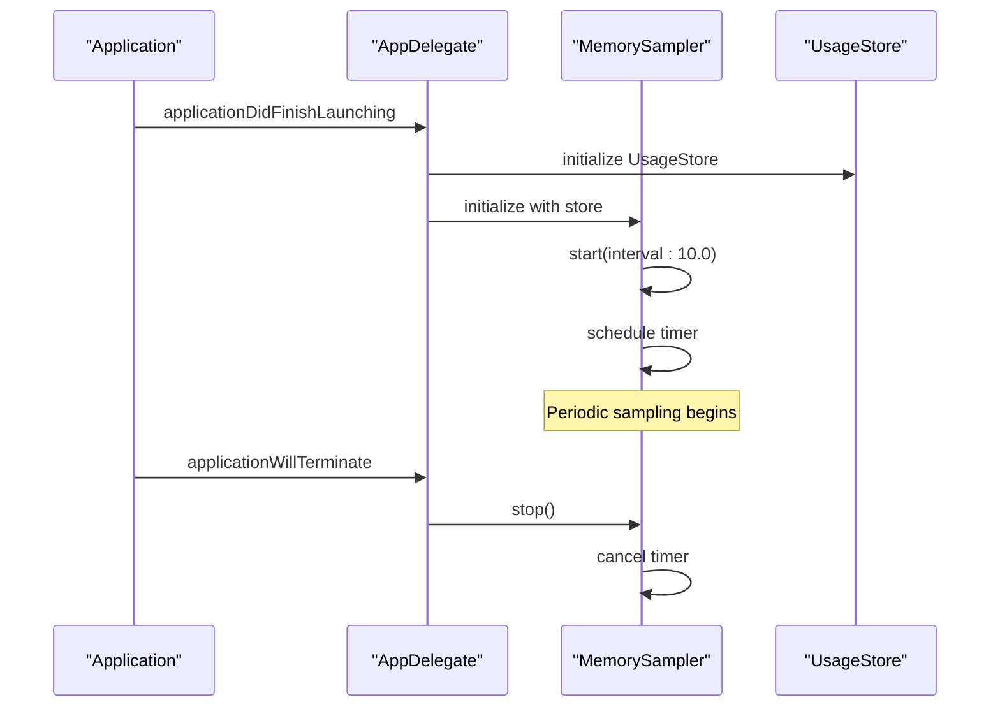

# MemorySampler Component

<cite>
**Referenced Files in This Document**
- [MemorySampler.swift](file://iTip/MemorySampler.swift)
- [ProcessUtils.swift](file://iTip/ProcessUtils.swift)
- [AppDelegate.swift](file://iTip/AppDelegate.swift)
- [UsageStore.swift](file://iTip/UsageStore.swift)
- [UsageStoreProtocol.swift](file://iTip/UsageStoreProtocol.swift)
- [UsageRecord.swift](file://iTip/UsageRecord.swift)
- [MenuPresenter.swift](file://iTip/MenuPresenter.swift)
- [ActivationMonitor.swift](file://iTip/ActivationMonitor.swift)
- [NetworkTracker.swift](file://iTip/NetworkTracker.swift)
- [main.swift](file://iTip/main.swift)
- [IntegrationTests.swift](file://iTipTests/IntegrationTests.swift)
</cite>

## Update Summary
**Changes Made**
- Updated external process execution implementation to use ProcessRunner struct
- Updated process-to-bundle mapping to use ProcessUtils.mapToBundleIDs() method
- Enhanced error handling and timeout management for system commands
- Improved code reusability through shared ProcessUtils utilities

## Table of Contents
1. [Introduction](#introduction)
2. [Project Structure](#project-structure)
3. [Core Components](#core-components)
4. [Architecture Overview](#architecture-overview)
5. [Detailed Component Analysis](#detailed-component-analysis)
6. [Dependency Analysis](#dependency-analysis)
7. [Performance Considerations](#performance-considerations)
8. [Troubleshooting Guide](#troubleshooting-guide)
9. [Conclusion](#conclusion)

## Introduction

The MemorySampler component is a crucial part of the iTip macOS menu bar application that monitors and tracks memory usage of applications. It periodically samples per-process Resident Set Size (RSS) using system commands and updates the memory statistics stored in the application's usage records. This component works alongside other monitoring systems to provide comprehensive application usage analytics, including activation tracking, network usage monitoring, and memory consumption analysis.

**Updated** The component now uses centralized ProcessRunner and ProcessUtils utilities for improved code organization and maintainability.

## Project Structure

The iTip project follows a modular Swift architecture with clear separation of concerns. The MemorySampler component integrates seamlessly with the broader application ecosystem:



**Diagram sources**
- [AppDelegate.swift:10-38](file://iTip/AppDelegate.swift#L10-L38)
- [MemorySampler.swift:6-14](file://iTip/MemorySampler.swift#L6-L14)
- [ProcessUtils.swift:6-50](file://iTip/ProcessUtils.swift#L6-L50)
- [UsageStore.swift:4-13](file://iTip/UsageStore.swift#L4-L13)

**Section sources**
- [main.swift:1-8](file://iTip/main.swift#L1-L8)
- [AppDelegate.swift:1-86](file://iTip/AppDelegate.swift#L1-L86)

## Core Components

The MemorySampler component consists of several key elements that work together to provide reliable memory monitoring:

### Primary Data Structures

The component operates on a simple but effective data model:

- **PID to RSS Mapping**: [pid_t: Int64] - Maps process identifiers to Resident Set Size in bytes
- **Bundle ID Aggregation**: [String: Int64] - Aggregates memory usage across multiple processes per application
- **UsageRecord Integration**: Updates existing UsageRecord objects with current memory statistics

### Key Responsibilities

1. **Periodic Sampling**: Runs on configurable intervals (default 10 seconds)
2. **Centralized Process Execution**: Uses ProcessRunner.run() to execute system commands safely
3. **Process-to-Bundle Mapping**: Leverages ProcessUtils.mapToBundleIDs() for efficient process-to-application mapping
4. **Data Aggregation**: Combines memory usage across multiple processes for each application
5. **Store Integration**: Updates existing usage records without creating new ones

**Updated** The component now delegates external process execution and bundle mapping to shared utility classes, improving code reuse and maintainability.

**Section sources**
- [MemorySampler.swift:4-82](file://iTip/MemorySampler.swift#L4-L82)
- [ProcessUtils.swift:53-78](file://iTip/ProcessUtils.swift#L53-L78)
- [UsageRecord.swift:3-14](file://iTip/UsageRecord.swift#L3-L14)

## Architecture Overview

The MemorySampler component follows a clean architecture pattern with clear separation between monitoring, data processing, and persistence layers:



**Diagram sources**
- [MemorySampler.swift:35-61](file://iTip/MemorySampler.swift#L35-L61)
- [ProcessUtils.swift:6-50](file://iTip/ProcessUtils.swift#L6-L50)
- [UsageStore.swift:78-115](file://iTip/UsageStore.swift#L78-L115)

The architecture ensures that memory sampling is decoupled from the main application logic while maintaining tight integration with the data persistence layer and shared utility services.

**Section sources**
- [MemorySampler.swift:17-30](file://iTip/MemorySampler.swift#L17-L30)
- [ProcessUtils.swift:6-50](file://iTip/ProcessUtils.swift#L6-L50)
- [UsageStore.swift:78-115](file://iTip/UsageStore.swift#L78-L115)

## Detailed Component Analysis

### MemorySampler Class Structure



**Diagram sources**
- [MemorySampler.swift:6-82](file://iTip/MemorySampler.swift#L6-L82)
- [ProcessUtils.swift:6-78](file://iTip/ProcessUtils.swift#L6-L78)
- [UsageStoreProtocol.swift:3-8](file://iTip/UsageStoreProtocol.swift#L3-L8)
- [UsageStore.swift:4-117](file://iTip/UsageStore.swift#L4-L117)
- [UsageRecord.swift:3-37](file://iTip/UsageRecord.swift#L3-L37)

### Sampling Process Implementation

The memory sampling process follows a multi-stage pipeline with centralized utility support:



**Diagram sources**
- [MemorySampler.swift:35-61](file://iTip/MemorySampler.swift#L35-L61)
- [ProcessUtils.swift:68-77](file://iTip/ProcessUtils.swift#L68-L77)
- [UsageStore.swift:78-115](file://iTip/UsageStore.swift#L78-L115)

### Data Processing Pipeline

The component implements a sophisticated data aggregation strategy through centralized utilities:

1. **Process Execution**: Uses ProcessRunner.run() to safely execute system commands with timeout support
2. **Process Enumeration**: Extracts process information via centralized ProcessRunner
3. **Memory Extraction**: Parses Resident Set Size (RSS) in kilobytes
4. **Unit Conversion**: Converts kilobytes to bytes for consistency
5. **Process Filtering**: Excludes processes with zero or negative memory usage
6. **Bundle Mapping**: Leverages ProcessUtils.mapToBundleIDs() for efficient process-to-application mapping
7. **Aggregation Strategy**: Sums memory usage across multiple processes per application

**Updated** The data processing pipeline now benefits from centralized error handling, timeout management, and reusable bundle mapping logic.

**Section sources**
- [MemorySampler.swift:35-61](file://iTip/MemorySampler.swift#L35-L61)
- [ProcessUtils.swift:6-50](file://iTip/ProcessUtils.swift#L6-L50)
- [ProcessUtils.swift:68-77](file://iTip/ProcessUtils.swift#L68-L77)
- [UsageStore.swift:78-115](file://iTip/UsageStore.swift#L78-L115)

### Integration with Application Lifecycle

The MemorySampler integrates with the application lifecycle through the AppDelegate:



**Diagram sources**
- [AppDelegate.swift:10-38](file://iTip/AppDelegate.swift#L10-L38)
- [AppDelegate.swift:40-44](file://iTip/AppDelegate.swift#L40-L44)
- [MemorySampler.swift:17-30](file://iTip/MemorySampler.swift#L17-L30)

**Section sources**
- [AppDelegate.swift:10-38](file://iTip/AppDelegate.swift#L10-L38)
- [AppDelegate.swift:40-44](file://iTip/AppDelegate.swift#L40-L44)

## Dependency Analysis

The MemorySampler component maintains minimal external dependencies while integrating effectively with the application ecosystem through shared utilities:

```mermaid
graph LR
subgraph "Internal Dependencies"
MemorySampler[MemorySampler]
UsageStoreProtocol[UsageStoreProtocol]
UsageStore[UsageStore]
UsageRecord[UsageRecord]
end
subgraph "Shared Utility Dependencies"
ProcessRunner[ProcessRunner]
ProcessUtils[ProcessUtils]
NSWorkspace[NSWorkspace]
Process[Process]
DispatchQueue[DispatchQueue]
end
subgraph "External Dependencies"
PSCommand[/bin/ps]
MacOSSystem[macOS System APIs]
end
MemorySampler --> UsageStoreProtocol
MemorySampler --> ProcessRunner
MemorySampler --> ProcessUtils
UsageStoreProtocol <|.. UsageStore
ProcessRunner --> Process
ProcessUtils --> NSWorkspace
ProcessUtils --> Process
MemorySampler --> DispatchQueue
ProcessRunner --> PSCommand
ProcessUtils --> MacOSSystem
```

**Diagram sources**
- [MemorySampler.swift:1-3](file://iTip/MemorySampler.swift#L1-L3)
- [ProcessUtils.swift:6-78](file://iTip/ProcessUtils.swift#L6-L78)
- [UsageStoreProtocol.swift:3-8](file://iTip/UsageStoreProtocol.swift#L3-L8)
- [UsageStore.swift:1-2](file://iTip/UsageStore.swift#L1-L2)

### Coupling and Cohesion Analysis

The component demonstrates excellent design principles with improved modularity:

- **High Cohesion**: All memory sampling functionality is contained within a single class
- **Low Coupling**: Depends on shared ProcessRunner and ProcessUtils utilities rather than duplicated implementations
- **Clear Separation**: No direct dependencies on specific implementations
- **Testability**: Easy to mock through protocol-based design
- **Reusability**: Shared utilities benefit other components in the system

**Updated** The component now benefits from centralized utility implementations, reducing code duplication and improving maintainability.

**Section sources**
- [MemorySampler.swift:6-14](file://iTip/MemorySampler.swift#L6-L14)
- [ProcessUtils.swift:6-50](file://iTip/ProcessUtils.swift#L6-L50)
- [UsageStoreProtocol.swift:3-8](file://iTip/UsageStoreProtocol.swift#L3-L8)

## Performance Considerations

The MemorySampler component is designed with performance optimization in mind, enhanced by centralized utility support:

### Resource Management

- **Timer-Based Sampling**: Uses `DispatchSourceTimer` for efficient periodic execution
- **Background Queues**: Operates on dedicated utility queues to avoid blocking UI
- **Centralized Process Execution**: Leverages ProcessRunner for safe, timeout-managed process execution
- **Memory Efficiency**: Processes data streams rather than loading entire outputs into memory
- **Shared Caching**: Benefits from ProcessUtils caching of bundle mappings

### Error Handling Strategy

The component implements a robust error handling approach with centralized support:

- **Graceful Degradation**: Silently handles failures and retries on next interval
- **Early Termination**: Returns immediately on command failures
- **Resource Cleanup**: Properly cancels timers and cleans up resources
- **Non-Blocking Operations**: All operations are designed to be non-blocking
- **Centralized Logging**: Uses shared logging infrastructure through os_log

### Scalability Considerations

- **Process Limit Scaling**: Efficiently handles varying numbers of running processes through ProcessRunner
- **Bundle Aggregation**: Reduces data volume by aggregating across multiple processes per application
- **Selective Updates**: Only updates existing records, avoiding unnecessary writes
- **Caching Strategy**: Benefits from ProcessUtils caching mechanisms
- **Timeout Management**: Prevents hanging processes with configurable timeouts

**Updated** The component now includes enhanced error handling through centralized ProcessRunner utilities and improved timeout management for system commands.

**Section sources**
- [MemorySampler.swift:17-30](file://iTip/MemorySampler.swift#L17-L30)
- [MemorySampler.swift:50-61](file://iTip/MemorySampler.swift#L50-L61)
- [ProcessUtils.swift:6-50](file://iTip/ProcessUtils.swift#L6-L50)

## Troubleshooting Guide

### Common Issues and Solutions

#### Memory Sampling Failures

**Symptoms**: Memory values not updating in the menu
**Causes**: 
- Process execution failures through ProcessRunner
- Timeout issues with system commands
- Bundle identifier mapping problems

**Solutions**:
- Verify ProcessRunner configuration and timeout settings
- Check system command availability (`/bin/ps`)
- Monitor ProcessUtils bundle mapping resolution
- Review centralized logging for detailed error information

#### Performance Impact

**Symptoms**: Application slowdown during sampling
**Causes**: 
- Frequent sampling intervals
- Large number of running processes
- Inefficient parsing operations
- Process execution overhead

**Solutions**:
- Adjust sampling interval (default 10 seconds)
- Monitor system resource usage
- Consider reducing sampling frequency for heavy workloads
- Review ProcessRunner timeout settings

#### Data Consistency Issues

**Symptoms**: Inconsistent memory values across sessions
**Causes**:
- Race conditions with other monitors
- Store update conflicts
- Process termination during sampling
- Bundle mapping inconsistencies

**Solutions**:
- Review concurrent access patterns
- Monitor store update logs
- Implement proper synchronization
- Verify ProcessUtils bundle mapping accuracy

### Debugging Techniques

1. **Enable Logging**: Monitor ProcessRunner execution logs
2. **Check Process Output**: Verify system command produces expected output
3. **Validate Bundle Mapping**: Ensure ProcessUtils proper application identification
4. **Monitor Queue Activity**: Track sampling thread execution
5. **Review Store Operations**: Confirm successful data persistence
6. **Examine Timeout Settings**: Verify ProcessRunner timeout configuration

**Updated** The troubleshooting guide now includes ProcessRunner and ProcessUtils-specific debugging techniques.

**Section sources**
- [MemorySampler.swift:50-61](file://iTip/MemorySampler.swift#L50-L61)
- [ProcessUtils.swift:6-50](file://iTip/ProcessUtils.swift#L6-L50)
- [ProcessUtils.swift:68-77](file://iTip/ProcessUtils.swift#L68-L77)

## Conclusion

The MemorySampler component represents a well-designed, efficient solution for monitoring application memory usage in the iTip ecosystem. Its architecture demonstrates strong separation of concerns, robust error handling, and optimal performance characteristics. The component successfully integrates with the broader application architecture while benefiting from centralized utility support through ProcessRunner and ProcessUtils.

Key strengths of the implementation include:

- **Efficient Sampling**: Minimal performance impact through careful resource management
- **Robust Error Handling**: Graceful degradation and retry mechanisms with centralized support
- **Clean Architecture**: Clear separation between monitoring, processing, and persistence layers
- **Scalable Design**: Handles varying workloads and system configurations
- **Integration Excellence**: Seamless coordination with other monitoring components
- **Code Reusability**: Centralized utilities reduce duplication and improve maintainability
- **Enhanced Reliability**: ProcessRunner provides timeout management and safe process execution

The component serves as a foundation for comprehensive application usage analytics, providing valuable insights into memory consumption patterns that complement the activation tracking and network monitoring capabilities already present in the iTip application. The adoption of centralized utilities ensures long-term maintainability and extensibility of the memory monitoring functionality.