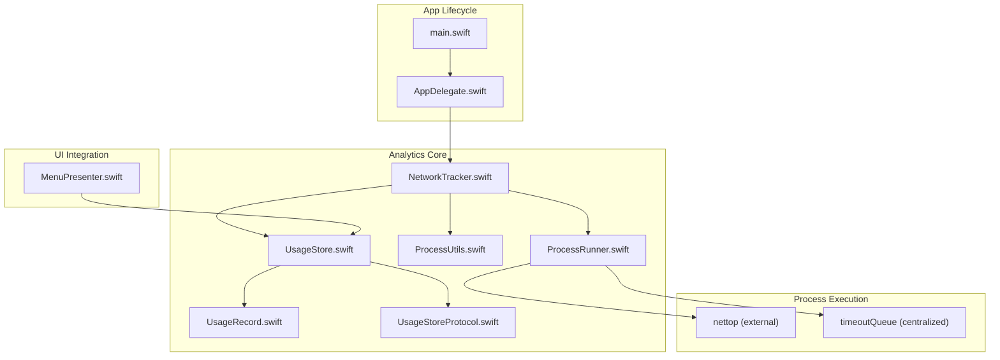
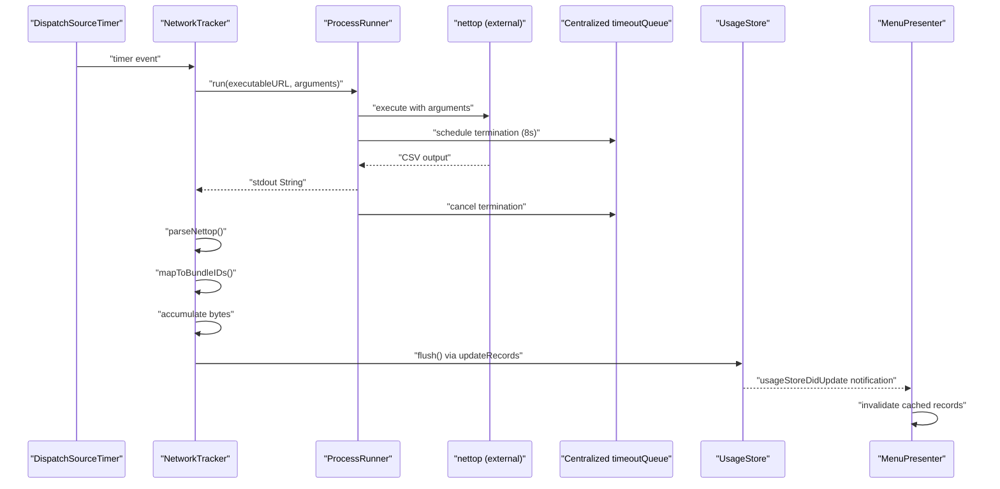
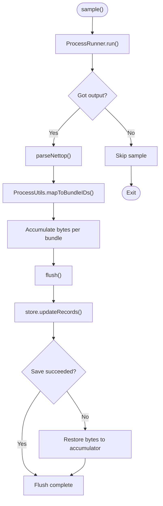
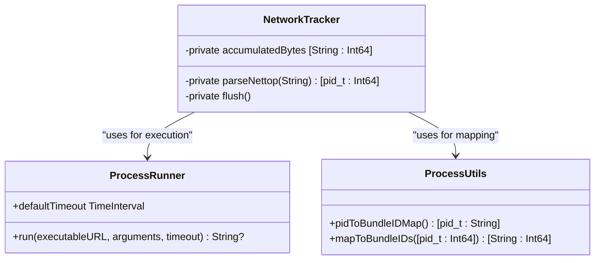
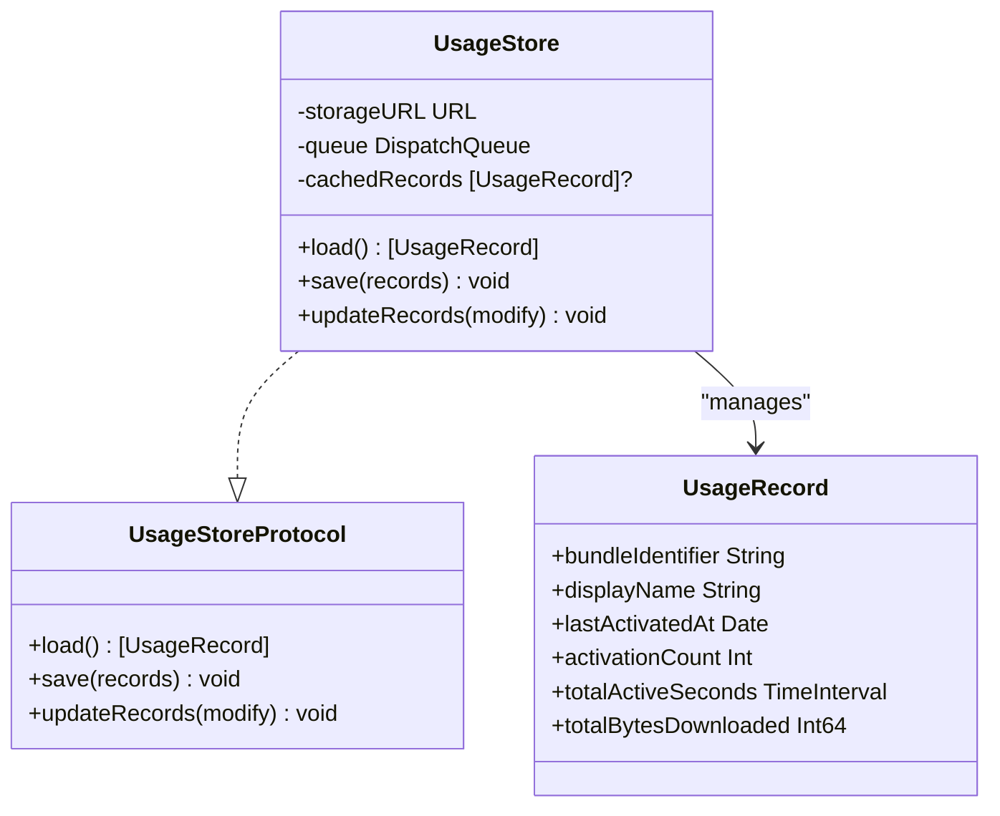
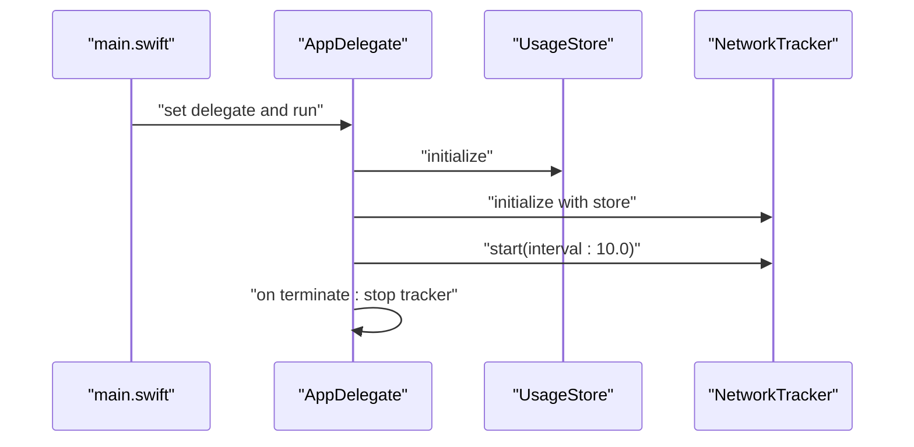
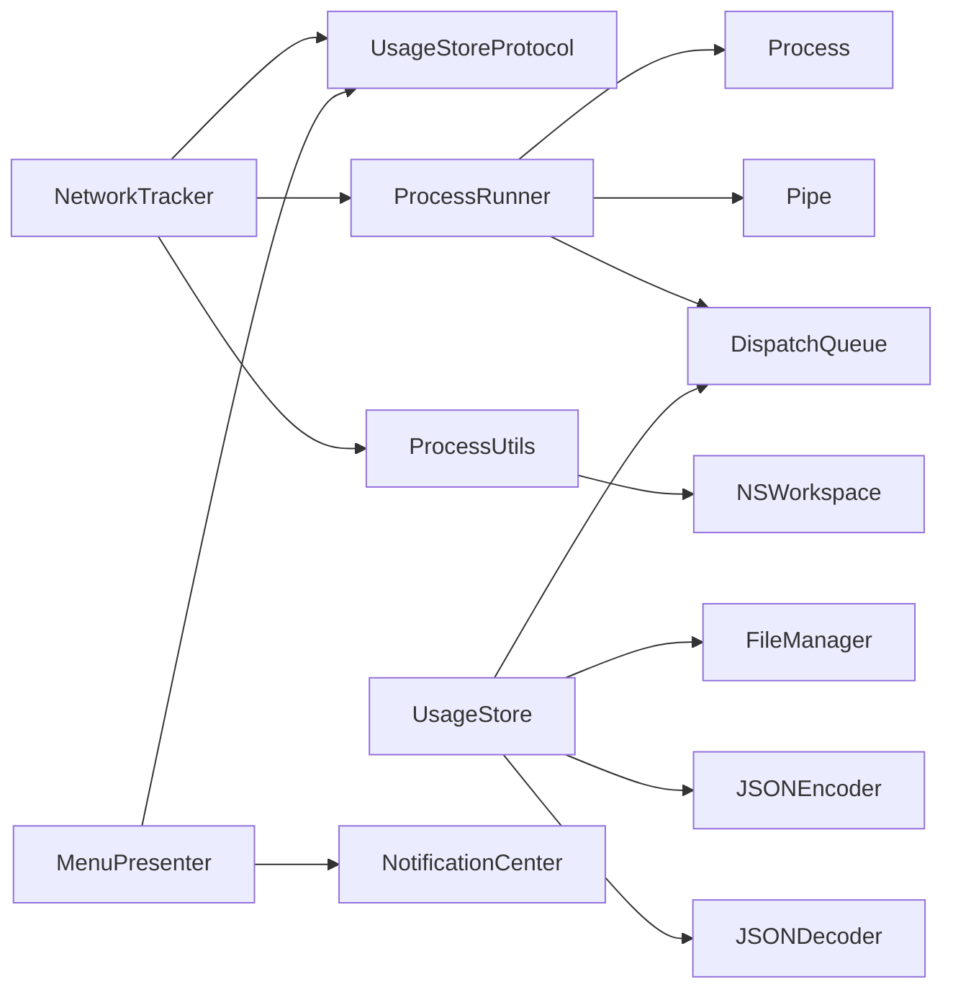

# Network Usage Tracking

<cite>
**Referenced Files in This Document**
- [NetworkTracker.swift](file://iTip/NetworkTracker.swift)
- [ProcessUtils.swift](file://iTip/ProcessUtils.swift)
- [UsageStore.swift](file://iTip/UsageStore.swift)
- [UsageRecord.swift](file://iTip/UsageRecord.swift)
- [UsageStoreProtocol.swift](file://iTip/UsageStoreProtocol.swift)
- [AppDelegate.swift](file://iTip/AppDelegate.swift)
- [main.swift](file://iTip/main.swift)
- [MenuPresenter.swift](file://iTip/MenuPresenter.swift)
- [README.md](file://README.md)
</cite>

## Update Summary
**Changes Made**
- Updated ProcessRunner integration documentation to reflect centralized external process execution
- Removed documentation for duplicated runNettop() implementation
- Enhanced timeout handling documentation to show centralized ProcessRunner.timeout mechanism
- Updated architecture diagrams to show ProcessRunner as the central execution handler
- Revised error handling documentation to reflect ProcessRunner's timeout and termination capabilities

## Table of Contents
1. [Introduction](#introduction)
2. [Project Structure](#project-structure)
3. [Core Components](#core-components)
4. [Architecture Overview](#architecture-overview)
5. [Detailed Component Analysis](#detailed-component-analysis)
6. [Dependency Analysis](#dependency-analysis)
7. [Performance Considerations](#performance-considerations)
8. [Troubleshooting Guide](#troubleshooting-guide)
9. [Conclusion](#conclusion)
10. [Appendices](#appendices)

## Introduction
This document explains the Network Usage Tracking component responsible for collecting per-process network usage on macOS and aggregating it into application usage analytics. The component has been modernized to use ProcessRunner for centralized external process execution, eliminating duplicated runNettop() implementations and providing robust timeout handling. It covers how the system integrates with macOS's nettop utility through ProcessRunner, parses the resulting CSV output, maps process IDs to bundle identifiers, aggregates byte counters, and persists the analytics alongside application usage records.

## Project Structure
The Network Usage Tracking feature is implemented as a streamlined component that integrates with the application lifecycle and usage analytics pipeline. The primary files involved are:
- NetworkTracker: orchestrates sampling, parsing, mapping, aggregation, and persistence with centralized ProcessRunner integration
- ProcessRunner: centralized external process execution with timeout handling
- ProcessUtils: shared utilities for process-to-bundle mapping
- UsageStore and UsageRecord: persistent storage and model for usage analytics
- UsageStoreProtocol: protocol abstraction for storage operations
- AppDelegate: initializes and starts NetworkTracker during application launch
- MenuPresenter: displays monitoring availability and invalidates caches on updates

**Diagram sources**
- [main.swift:1-8](file://iTip/main.swift#L1-L8)
- [AppDelegate.swift:9-34](file://iTip/AppDelegate.swift#L9-L34)
- [NetworkTracker.swift:6-23](file://iTip/NetworkTracker.swift#L6-L23)
- [ProcessUtils.swift:5-50](file://iTip/ProcessUtils.swift#L5-L50)
- [UsageStore.swift:4-13](file://iTip/UsageStore.swift#L4-L13)
- [UsageRecord.swift:3-12](file://iTip/UsageRecord.swift#L3-L12)
- [UsageStoreProtocol.swift:3-8](file://iTip/UsageStoreProtocol.swift#L3-L8)
- [MenuPresenter.swift:48-60](file://iTip/MenuPresenter.swift#L48-L60)

**Section sources**
- [main.swift:1-8](file://iTip/main.swift#L1-L8)
- [AppDelegate.swift:9-34](file://iTip/AppDelegate.swift#L9-L34)
- [NetworkTracker.swift:6-23](file://iTip/NetworkTracker.swift#L6-L23)
- [ProcessUtils.swift:5-50](file://iTip/ProcessUtils.swift#L5-L50)
- [UsageStore.swift:4-13](file://iTip/UsageStore.swift#L4-L13)
- [UsageRecord.swift:3-12](file://iTip/UsageRecord.swift#L3-L12)
- [UsageStoreProtocol.swift:3-8](file://iTip/UsageStoreProtocol.swift#L3-L8)
- [MenuPresenter.swift:48-60](file://iTip/MenuPresenter.swift#L48-L60)

## Core Components
- NetworkTracker: periodic sampler that uses ProcessRunner for nettop execution, parses CSV output, maps PIDs to bundle identifiers, aggregates per-bundle byte counters, and flushes updates to UsageStore without creating new records.
- ProcessRunner: centralized external process execution with 8-second timeout safety net and graceful termination capabilities.
- ProcessUtils: shared utilities for mapping process-level data to bundle identifiers with PID-to-bundle lookup and aggregation functions.
- UsageStore: thread-safe JSON-backed storage for UsageRecord with atomic updateRecords operation and in-memory caching.
- UsageRecord: data model for application usage including cumulative downloaded bytes.
- UsageStoreProtocol: interface abstraction for storage operations.
- MenuPresenter: observes store updates and reflects monitoring availability in the UI.

Key responsibilities:
- Sampling: scheduled timer triggers ProcessRunner.run() with nettop arguments at configurable intervals with centralized 8-second timeout handling.
- Parsing: CSV parsing extracts per-process bytes_in and process identifiers.
- Mapping: ProcessUtils.mapToBundleIDs() provides bundle identifiers for running applications.
- Aggregation: per-process bytes aggregated into per-bundle totals.
- Persistence: flush writes only to existing records, preserving network data across merges without creating new entries.

**Section sources**
- [NetworkTracker.swift:25-76](file://iTip/NetworkTracker.swift#L25-L76)
- [ProcessUtils.swift:5-50](file://iTip/ProcessUtils.swift#L5-L50)
- [ProcessUtils.swift:52-79](file://iTip/ProcessUtils.swift#L52-L79)
- [UsageStore.swift:69-105](file://iTip/UsageStore.swift#L69-L105)
- [UsageRecord.swift:3-12](file://iTip/UsageRecord.swift#L3-L12)
- [UsageStoreProtocol.swift:3-8](file://iTip/UsageStoreProtocol.swift#L3-L8)
- [MenuPresenter.swift:52-60](file://iTip/MenuPresenter.swift#L52-L60)

## Architecture Overview
The NetworkTracker runs on a dedicated timer and dispatch queue. It uses ProcessRunner to execute nettop with centralized timeout handling, reads the CSV output, parses and maps to bundle identifiers, accumulates bytes in memory, and flushes to the UsageStore atomically. The MenuPresenter listens for store updates and invalidates its cached records to reflect the latest analytics.

**Diagram sources**
- [NetworkTracker.swift:26-76](file://iTip/NetworkTracker.swift#L26-L76)
- [NetworkTracker.swift:78-106](file://iTip/NetworkTracker.swift#L78-L106)
- [NetworkTracker.swift:108-129](file://iTip/NetworkTracker.swift#L108-L129)
- [NetworkTracker.swift:131-150](file://iTip/NetworkTracker.swift#L131-L150)
- [ProcessUtils.swift:5-50](file://iTip/ProcessUtils.swift#L5-L50)
- [UsageStore.swift:69-105](file://iTip/UsageStore.swift#L69-L105)
- [MenuPresenter.swift:52-60](file://iTip/MenuPresenter.swift#L52-L60)

## Detailed Component Analysis

### NetworkTracker
Responsibilities:
- Schedules periodic sampling using a timer on a utility queue.
- Uses ProcessRunner.run() to execute nettop with arguments to produce a single-line CSV of per-process network activity.
- Parses CSV rows to extract process identifiers and bytes_in.
- Maps PIDs to bundle identifiers using ProcessUtils.mapToBundleIDs().
- Accumulates bytes per bundle in memory and flushes to UsageStore.
- Implements centralized timeout handling through ProcessRunner's timeout mechanism.
- Handles errors by skipping failed samples and preserving accumulated bytes.

**Updated** Streamlined to use ProcessRunner for external process execution and centralized timeout handling

Sampling methodology:
- Interval: configurable default of 10 seconds; adjustable via start(interval:).
- External execution: ProcessRunner.run() handles nettop execution with 8-second timeout safety net.
- Output consumption: captures stdout String from ProcessRunner and ignores stderr.

Data parsing algorithms:
- CSV parsing: splits on newline and comma; skips header row.
- Field extraction: process name field split by "." to derive PID; bytes_in column parsed as Int64.
- Filtering: only positive bytes_in values are considered.

Aggregation mechanisms:
- Per-process bytes aggregated into per-bundle totals using ProcessUtils.mapToBundleIDs().
- Flush writes only to existing records; does not create new records solely for network data.
- On persistence failure, re-injects bytes into in-memory accumulator.

Error handling:
- If ProcessRunner.run() fails to execute nettop or returns nil, the sample is skipped.
- If store.updateRecords fails, bytes are restored to in-memory accumulator for retry.
- Centralized timeout handling ensures terminated processes are properly managed through ProcessRunner.

**Diagram sources**
- [NetworkTracker.swift:41-55](file://iTip/NetworkTracker.swift#L41-L55)
- [NetworkTracker.swift:78-106](file://iTip/NetworkTracker.swift#L78-L106)
- [NetworkTracker.swift:108-129](file://iTip/NetworkTracker.swift#L108-L129)
- [NetworkTracker.swift:131-150](file://iTip/NetworkTracker.swift#L131-L150)
- [ProcessUtils.swift:52-79](file://iTip/ProcessUtils.swift#L52-L79)

**Section sources**
- [NetworkTracker.swift:25-76](file://iTip/NetworkTracker.swift#L25-L76)
- [NetworkTracker.swift:78-106](file://iTip/NetworkTracker.swift#L78-L106)
- [NetworkTracker.swift:108-129](file://iTip/NetworkTracker.swift#L108-L129)
- [NetworkTracker.swift:131-150](file://iTip/NetworkTracker.swift#L131-L150)

### ProcessRunner and ProcessUtils
ProcessRunner:
- Centralized external process execution with 8-second default timeout.
- Uses separate timeout queue to ensure termination can occur even when main queue is blocked.
- Provides graceful termination of hanging processes with proper cleanup.
- Returns stdout as String or nil on failure, with comprehensive error logging.

ProcessUtils:
- pidToBundleIDMap(): builds PID → bundleIdentifier lookup from currently running applications.
- mapToBundleIDs(): maps per-PID data to per-bundleIdentifier data by aggregating values for processes belonging to the same application.

**Updated** ProcessRunner now centralizes timeout handling and external process execution

**Diagram sources**
- [ProcessUtils.swift:5-50](file://iTip/ProcessUtils.swift#L5-L50)
- [ProcessUtils.swift:52-79](file://iTip/ProcessUtils.swift#L52-L79)
- [NetworkTracker.swift:41-55](file://iTip/NetworkTracker.swift#L41-L55)

**Section sources**
- [ProcessUtils.swift:5-50](file://iTip/ProcessUtils.swift#L5-L50)
- [ProcessUtils.swift:52-79](file://iTip/ProcessUtils.swift#L52-L79)

### UsageStore and UsageRecord
UsageStore:
- Provides thread-safe load/save/updateRecords operations.
- Uses a JSON encoder/decoder with atomic write semantics.
- Caches loaded records in memory to reduce disk IO.
- Emits a usageStoreDidUpdate notification upon successful save.

UsageRecord:
- Encodable struct containing bundleIdentifier, displayName, timestamps, activation metrics, and totalBytesDownloaded.
- Backward-compatible decoding defaults new fields to zero if missing.

**Updated** Enhanced error propagation in updateRecords to prevent partial data overwrites

**Diagram sources**
- [UsageStoreProtocol.swift:3-8](file://iTip/UsageStoreProtocol.swift#L3-L8)
- [UsageStore.swift:4-13](file://iTip/UsageStore.swift#L4-L13)
- [UsageStore.swift:69-105](file://iTip/UsageStore.swift#L69-L105)
- [UsageRecord.swift:3-12](file://iTip/UsageRecord.swift#L3-L12)

**Section sources**
- [UsageStore.swift:24-105](file://iTip/UsageStore.swift#L24-L105)
- [UsageRecord.swift:3-32](file://iTip/UsageRecord.swift#L3-L32)
- [UsageStoreProtocol.swift:3-8](file://iTip/UsageStoreProtocol.swift#L3-L8)

### Integration with Application Lifecycle
- AppDelegate initializes UsageStore and NetworkTracker during application launch.
- NetworkTracker is started with a 10-second interval.
- On termination, both monitors are stopped and NetworkTracker flushes remaining bytes.

**Diagram sources**
- [main.swift:3-8](file://iTip/main.swift#L3-L8)
- [AppDelegate.swift:9-39](file://iTip/AppDelegate.swift#L9-L39)
- [NetworkTracker.swift:25-40](file://iTip/NetworkTracker.swift#L25-L40)

**Section sources**
- [main.swift:3-8](file://iTip/main.swift#L3-L8)
- [AppDelegate.swift:9-39](file://iTip/AppDelegate.swift#L9-L39)
- [NetworkTracker.swift:25-40](file://iTip/NetworkTracker.swift#L25-L40)

### UI Integration and Monitoring Availability
- MenuPresenter subscribes to usageStoreDidUpdate notifications to invalidate cached records.
- When monitoring is unavailable, the menu displays a warning message indicating permission checks.

**Section sources**
- [MenuPresenter.swift:52-60](file://iTip/MenuPresenter.swift#L52-L60)
- [MenuPresenter.swift:68-76](file://iTip/MenuPresenter.swift#L68-L76)

## Dependency Analysis
- NetworkTracker depends on:
  - UsageStoreProtocol for persistence
  - ProcessRunner for external process execution with timeout handling
  - ProcessUtils for mapping PIDs to bundle identifiers
  - DispatchQueue for thread-safety
- ProcessRunner depends on:
  - Process and Pipe for executing external commands
  - DispatchQueue.global for timeout queue management
- UsageStore depends on:
  - FileManager and JSONEncoder/Decoder for file IO
  - DispatchQueue for thread-safety
- MenuPresenter depends on:
  - UsageStoreProtocol and notifications for UI updates

**Diagram sources**
- [NetworkTracker.swift:1-23](file://iTip/NetworkTracker.swift#L1-L23)
- [ProcessUtils.swift:1-79](file://iTip/ProcessUtils.swift#L1-L79)
- [UsageStore.swift:1-107](file://iTip/UsageStore.swift#L1-L107)
- [MenuPresenter.swift:48-60](file://iTip/MenuPresenter.swift#L48-L60)

**Section sources**
- [NetworkTracker.swift:1-23](file://iTip/NetworkTracker.swift#L1-L23)
- [ProcessUtils.swift:1-79](file://iTip/ProcessUtils.swift#L1-L79)
- [UsageStore.swift:1-107](file://iTip/UsageStore.swift#L1-L107)
- [MenuPresenter.swift:48-60](file://iTip/MenuPresenter.swift#L48-L60)

## Performance Considerations
- Sampling cadence: default 10 seconds balances responsiveness with overhead; adjust based on system resources.
- Centralized timeout handling: 8-second timeout prevents indefinite hangs; uses separate timeoutQueue to ensure termination even when main queue is blocked.
- Memory footprint: in-memory accumulation minimizes disk writes; flush occurs after each sample cycle.
- Thread safety: all store operations are serialized via a dedicated queue; UI updates occur on main queue.
- CSV parsing: linear scan over rows; minimal allocations by reusing arrays and dictionaries.
- Disk IO: atomic writes and in-memory caching reduce frequent disk access.
- Record optimization: network sampling only updates existing records, avoiding unnecessary record creation.
- Process execution efficiency: centralized ProcessRunner eliminates duplicated process execution logic and provides consistent timeout handling.

## Troubleshooting Guide
Common issues and remedies:
- Insufficient privileges for nettop:
  - Symptoms: ProcessRunner.run() returns nil; samples are skipped.
  - Resolution: ensure the app has appropriate permissions; verify nettop availability at /usr/bin/nettop.
- System command execution problems:
  - Symptoms: ProcessRunner.run() throws or returns nil; no network data collected.
  - Resolution: confirm nettop binary path and arguments; verify the process can spawn external commands.
- Timeout queue issues:
  - Symptoms: nettop processes hang indefinitely; system becomes unresponsive.
  - Resolution: verify ProcessRunner timeout mechanism is functioning; ensure 8-second timeout is sufficient for system load.
- Permission warnings in UI:
  - Symptoms: menu shows "Monitoring unavailable — check permissions."
  - Resolution: address underlying permission issues; restart the app after fixing.
- Data not persisting:
  - Symptoms: network bytes appear to accumulate but are not saved.
  - Resolution: check store.updateRecords error handling; verify file path and write permissions.
- Conflicts with other monitors:
  - ActivationMonitor and NetworkTracker both update records; ensure ActivationMonitor preserves network data during merges.

Implementation examples (paths only):
- Initialization and start:
  - [AppDelegate.swift:16-17](file://iTip/AppDelegate.swift#L16-L17)
- Data retrieval workflow:
  - [NetworkTracker.swift:41-55](file://iTip/NetworkTracker.swift#L41-L55)
- Persistence and merging:
  - [UsageStore.swift:69-105](file://iTip/UsageStore.swift#L69-L105)
- UI reflection of monitoring availability:
  - [MenuPresenter.swift:68-76](file://iTip/MenuPresenter.swift#L68-L76)

**Section sources**
- [NetworkTracker.swift:78-106](file://iTip/NetworkTracker.swift#L78-L106)
- [NetworkTracker.swift:61-76](file://iTip/NetworkTracker.swift#L61-L76)
- [UsageStore.swift:69-105](file://iTip/UsageStore.swift#L69-L105)
- [MenuPresenter.swift:68-76](file://iTip/MenuPresenter.swift#L68-L76)
- [AppDelegate.swift:16-17](file://iTip/AppDelegate.swift#L16-L17)

## Conclusion
The Network Usage Tracking component provides a robust, real-time per-application network analytics pipeline on macOS. By leveraging ProcessRunner for centralized external process execution with enhanced timeout safety nets, parsing CSV output, mapping PIDs to bundle identifiers, and integrating with the UsageStore, it enriches application usage analytics with network metrics. Its design emphasizes reliability through centralized timeout handling, optimized record updates, error handling, and atomic persistence, while maintaining low overhead through in-memory accumulation and efficient parsing.

## Appendices

### Appendix A: ProcessRunner Integration and Timeout Handling
The NetworkTracker now uses ProcessRunner for centralized external process execution:

- **Centralized ProcessRunner**: Eliminates duplicated runNettop() implementation and provides consistent timeout handling
- **Default 8-second timeout**: Prevents indefinite hangs while allowing sufficient time for nettop execution
- **Separate timeout queue**: DispatchQueue.global ensures timeout termination can occur even when main sampling queue is blocked
- **Graceful termination**: Terminates hanging nettop processes safely without affecting other operations
- **Consistent error handling**: Returns nil on failure and logs detailed error information

**Section sources**
- [ProcessUtils.swift:5-50](file://iTip/ProcessUtils.swift#L5-L50)
- [NetworkTracker.swift:42-45](file://iTip/NetworkTracker.swift#L42-L45)

### Appendix B: nettop Arguments and Output Notes
- Arguments passed to nettop:
  - -P: per-process mode
  - -L 1: limit to one line of output
  - -x: suppress headers
  - -n: numeric output
- Expected CSV fields:
  - Process name with PID suffix
  - Bytes received (bytes_in)
- Parsing logic:
  - Skips header row
  - Extracts PID from process name field
  - Converts bytes_in to Int64

**Section sources**
- [NetworkTracker.swift:78-86](file://iTip/NetworkTracker.swift#L78-L86)
- [NetworkTracker.swift:108-129](file://iTip/NetworkTracker.swift#L108-L129)

### Appendix C: Build and Runtime Environment
- Build requirements:
  - Xcode 16+
  - macOS 14+
- Installation notes:
  - Move app to /Applications before opening to avoid App Translocation issues.

**Section sources**
- [README.md:41-47](file://README.md#L41-L47)
- [README.md:36-37](file://README.md#L36-L37)

### Appendix D: Enhanced Timeout Mechanism
The NetworkTracker now implements a sophisticated timeout mechanism through ProcessRunner:

- **Centralized timeoutQueue**: Dedicated DispatchQueue.global ensures timeout termination can occur even when main sampling queue is blocked
- **8-second timeout**: Hard limit prevents indefinite hangs while allowing sufficient time for nettop execution
- **Process termination**: Terminates hanging nettop processes safely without affecting other operations
- **Graceful cancellation**: Timeout work items are cancelled when processes complete normally
- **Consistent error logging**: Comprehensive logging for debugging timeout and execution issues

**Section sources**
- [ProcessUtils.swift:30-38](file://iTip/ProcessUtils.swift#L30-L38)
- [ProcessUtils.swift:17-49](file://iTip/ProcessUtils.swift#L17-L49)

### Appendix E: Optimized Record Updating
Network sampling now optimizes record management by focusing on existing records:

- **Existing record priority**: Only updates records that already exist in the database
- **No new record creation**: Prevents creation of new UsageRecord entries solely for network data
- **Data preservation**: Ensures network analytics are preserved across merges with activation data
- **Conflict prevention**: Avoids duplication of application entries between monitors

**Section sources**
- [NetworkTracker.swift:64-68](file://iTip/NetworkTracker.swift#L64-L68)
- [NetworkTracker.swift:69-76](file://iTip/NetworkTracker.swift#L69-L76)