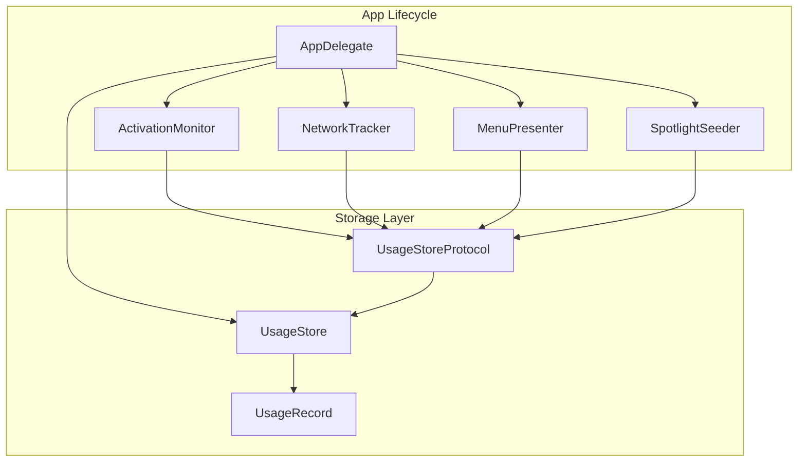
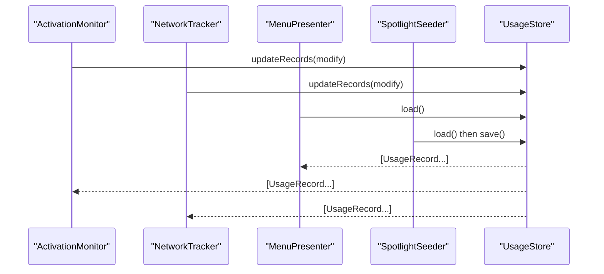
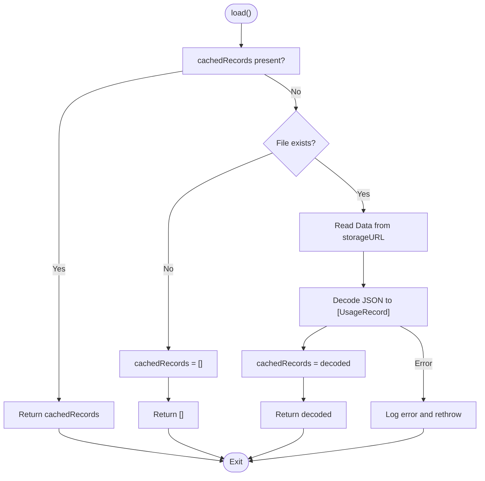
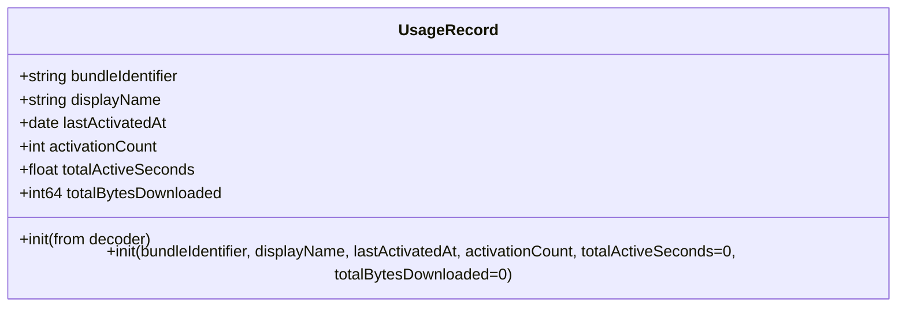
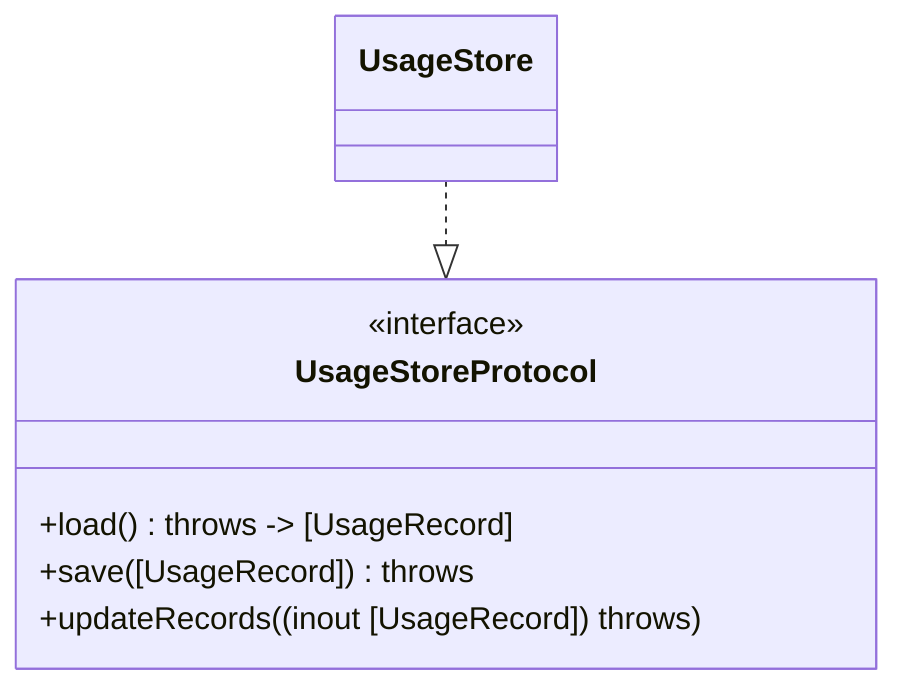
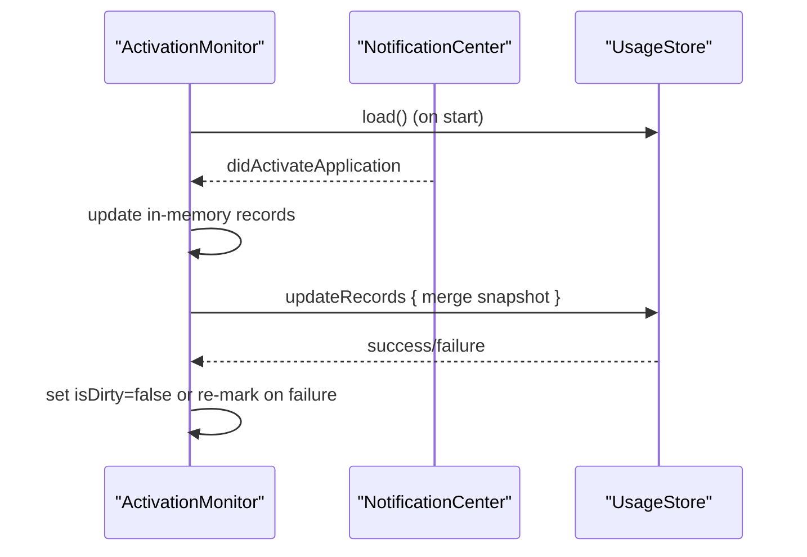
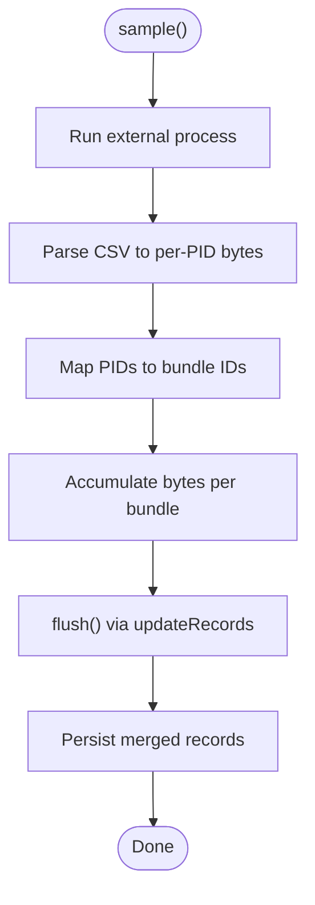
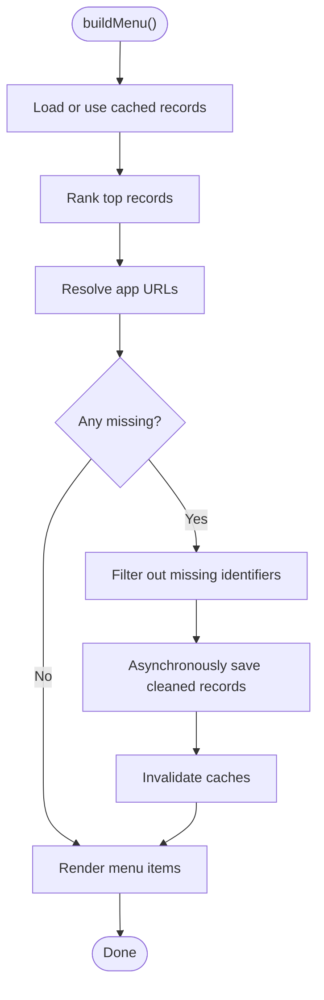
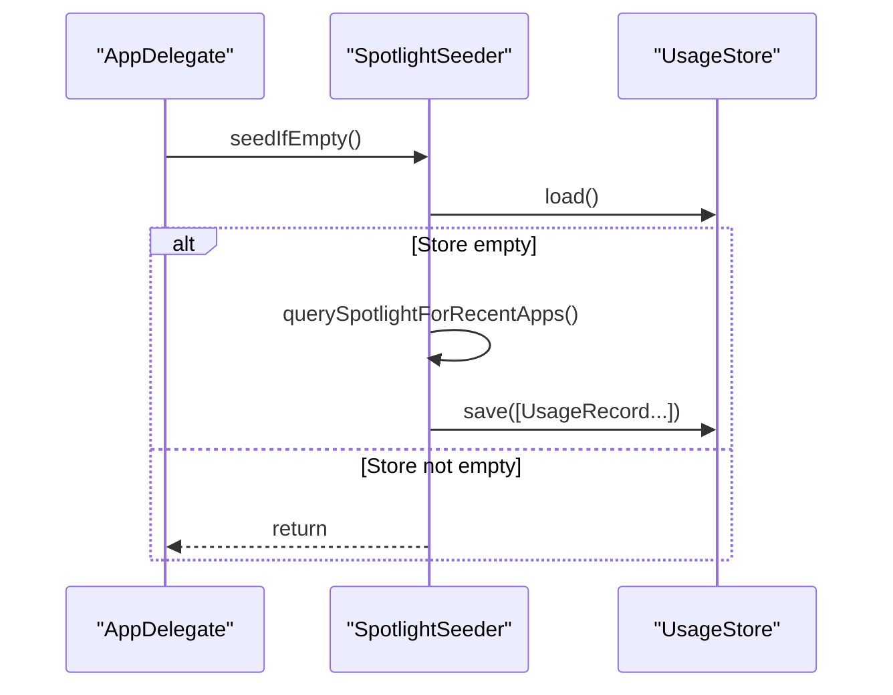
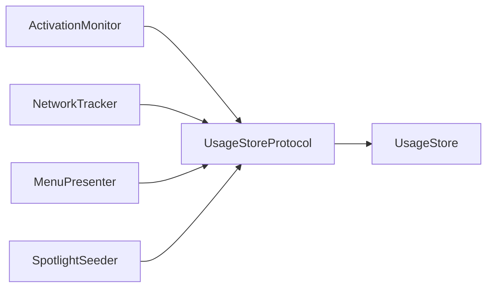

# Data Storage & Management

<cite>
**Referenced Files in This Document**
- [UsageStore.swift](file://iTip/UsageStore.swift)
- [UsageRecord.swift](file://iTip/UsageRecord.swift)
- [UsageStoreProtocol.swift](file://iTip/UsageStoreProtocol.swift)
- [ActivationMonitor.swift](file://iTip/ActivationMonitor.swift)
- [NetworkTracker.swift](file://iTip/NetworkTracker.swift)
- [MenuPresenter.swift](file://iTip/MenuPresenter.swift)
- [SpotlightSeeder.swift](file://iTip/SpotlightSeeder.swift)
- [AppDelegate.swift](file://iTip/AppDelegate.swift)
- [UsageStoreTests.swift](file://iTipTests/UsageStoreTests.swift)
- [InMemoryUsageStore.swift](file://iTipTests/InMemoryUsageStore.swift)
</cite>

## Table of Contents
1. [Introduction](#introduction)
2. [Project Structure](#project-structure)
3. [Core Components](#core-components)
4. [Architecture Overview](#architecture-overview)
5. [Detailed Component Analysis](#detailed-component-analysis)
6. [Dependency Analysis](#dependency-analysis)
7. [Performance Considerations](#performance-considerations)
8. [Troubleshooting Guide](#troubleshooting-guide)
9. [Conclusion](#conclusion)
10. [Appendices](#appendices)

## Introduction
This document explains iTip’s data storage and management system with a focus on the UsageStore thread-safe implementation, JSON serialization, caching strategy, and automatic cleanup of uninstalled applications. It also documents the UsageRecord data model, UsageStoreProtocol interface, persistence mechanisms, concurrency controls, and error recovery behavior. Practical usage patterns, custom storage implementations, and performance optimization techniques are included.

## Project Structure
The data storage system centers around a protocol-driven design:
- UsageStoreProtocol defines the contract for loading, saving, and atomic updates.
- UsageStore is the primary, thread-safe, file-backed implementation using JSON.
- UsageRecord is the persistent data model with backward-compatible decoding.
- Supporting components (ActivationMonitor, NetworkTracker, MenuPresenter, SpotlightSeeder) integrate with the store to populate, update, and clean up usage data.

**Diagram sources**
- [AppDelegate.swift:9-34](file://iTip/AppDelegate.swift#L9-L34)
- [UsageStoreProtocol.swift:3-8](file://iTip/UsageStoreProtocol.swift#L3-L8)
- [UsageStore.swift:4-107](file://iTip/UsageStore.swift#L4-L107)
- [UsageRecord.swift:3-32](file://iTip/UsageRecord.swift#L3-L32)
- [ActivationMonitor.swift:5-36](file://iTip/ActivationMonitor.swift#L5-L36)
- [NetworkTracker.swift:8-23](file://iTip/NetworkTracker.swift#L8-L23)
- [MenuPresenter.swift:48-60](file://iTip/MenuPresenter.swift#L48-L60)
- [SpotlightSeeder.swift:8-28](file://iTip/SpotlightSeeder.swift#L8-L28)

**Section sources**
- [AppDelegate.swift:9-34](file://iTip/AppDelegate.swift#L9-L34)
- [UsageStoreProtocol.swift:3-8](file://iTip/UsageStoreProtocol.swift#L3-L8)
- [UsageStore.swift:4-107](file://iTip/UsageStore.swift#L4-L107)
- [UsageRecord.swift:3-32](file://iTip/UsageRecord.swift#L3-L32)
- [ActivationMonitor.swift:5-36](file://iTip/ActivationMonitor.swift#L5-L36)
- [NetworkTracker.swift:8-23](file://iTip/NetworkTracker.swift#L8-L23)
- [MenuPresenter.swift:48-60](file://iTip/MenuPresenter.swift#L48-L60)
- [SpotlightSeeder.swift:8-28](file://iTip/SpotlightSeeder.swift#L8-L28)

## Core Components
- UsageStoreProtocol: Defines load, save, and atomic updateRecords APIs. Provides a Notification.Name for post-save events.
- UsageStore: Thread-safe JSON-backed storage with an internal serial queue, optional in-memory cache, and atomic file writes.
- UsageRecord: Codable model with backward-compatible decoding for new fields.

Key behaviors:
- Persistence: JSON-encoded arrays of UsageRecord stored at a configurable URL.
- Concurrency: All public methods synchronize via a dedicated serial queue.
- Caching: Optional in-memory cache populated on load and invalidated on save/update.
- Notifications: A post-update notification is broadcast after successful persistence.
- Error handling: Decoding failures during load are surfaced to callers; corrupted files yield empty results for load tests.

**Section sources**
- [UsageStoreProtocol.swift:3-14](file://iTip/UsageStoreProtocol.swift#L3-L14)
- [UsageStore.swift:24-107](file://iTip/UsageStore.swift#L24-L107)
- [UsageRecord.swift:3-32](file://iTip/UsageRecord.swift#L3-L32)
- [UsageStoreTests.swift:24-89](file://iTipTests/UsageStoreTests.swift#L24-L89)

## Architecture Overview
The store is consumed by multiple subsystems:
- ActivationMonitor: Maintains an in-memory cache and periodically flushes changes via updateRecords.
- NetworkTracker: Periodically appends downloaded bytes to existing records via updateRecords.
- MenuPresenter: Builds UI from cached or stored records, and prunes uninstalled apps by saving a filtered subset.
- SpotlightSeeder: Seeds initial data from Spotlight metadata when the store is empty.

**Diagram sources**
- [ActivationMonitor.swift:122-137](file://iTip/ActivationMonitor.swift#L122-L137)
- [NetworkTracker.swift:62-69](file://iTip/NetworkTracker.swift#L62-L69)
- [MenuPresenter.swift:78-85](file://iTip/MenuPresenter.swift#L78-L85)
- [SpotlightSeeder.swift:18-24](file://iTip/SpotlightSeeder.swift#L18-L24)
- [UsageStore.swift:69-105](file://iTip/UsageStore.swift#L69-L105)

## Detailed Component Analysis

### UsageStore: Thread-Safe JSON Storage
- Thread-safety: All public methods execute synchronously on a dedicated serial queue to serialize access to cachedRecords and disk I/O.
- Caching: On load, if cachedRecords exists, it is returned immediately. After save/update, cachedRecords is refreshed.
- Persistence: Uses JSONEncoder/JSONDecoder for arrays of UsageRecord. Writes are atomic to prevent partial writes.
- Notifications: Posts a usageStoreDidUpdate notification after successful save/update.
- Error handling: load returns an empty array when the file does not exist; decoding errors are logged and rethrown to callers.

**Diagram sources**
- [UsageStore.swift:24-50](file://iTip/UsageStore.swift#L24-L50)

**Section sources**
- [UsageStore.swift:24-107](file://iTip/UsageStore.swift#L24-L107)
- [UsageStoreTests.swift:24-89](file://iTipTests/UsageStoreTests.swift#L24-L89)

### UsageRecord: Data Model and Backward Compatibility
- Fields: bundleIdentifier, displayName, lastActivatedAt, activationCount, totalActiveSeconds, totalBytesDownloaded.
- Backward compatibility: New fields default to zero when missing during decoding, ensuring older JSON remains readable.

**Diagram sources**
- [UsageRecord.swift:3-32](file://iTip/UsageRecord.swift#L3-L32)

**Section sources**
- [UsageRecord.swift:3-32](file://iTip/UsageRecord.swift#L3-L32)

### UsageStoreProtocol: Enabling Custom Implementations
- Contract: load(), save(), and updateRecords(_:) define a minimal API surface for storage implementations.
- Notification: usageStoreDidUpdate is posted by conforming implementations to signal persistence completion.

**Diagram sources**
- [UsageStoreProtocol.swift:3-14](file://iTip/UsageStoreProtocol.swift#L3-L14)
- [UsageStore.swift:4-107](file://iTip/UsageStore.swift#L4-L107)

**Section sources**
- [UsageStoreProtocol.swift:3-14](file://iTip/UsageStoreProtocol.swift#L3-L14)
- [UsageStore.swift:4-107](file://iTip/UsageStore.swift#L4-L107)

### ActivationMonitor: In-Memory Cache and Periodic Flush
- In-memory cache: Maintains records and an index for O(1) lookup by bundleIdentifier.
- De-bounced writes: A periodic timer flushes changes to disk via updateRecords, merging in-memory updates with disk state.
- Foreground duration: Tracks cumulative foreground active time across activations.
- Robustness: On flush failure, marks dirty to retry later.

**Diagram sources**
- [ActivationMonitor.swift:38-156](file://iTip/ActivationMonitor.swift#L38-L156)
- [UsageStore.swift:69-105](file://iTip/UsageStore.swift#L69-L105)

**Section sources**
- [ActivationMonitor.swift:38-156](file://iTip/ActivationMonitor.swift#L38-L156)
- [UsageStore.swift:69-105](file://iTip/UsageStore.swift#L69-L105)

### NetworkTracker: Incremental Network Bytes Updates
- Sampling: Periodically runs a system command, parses CSV, maps PIDs to bundle identifiers, and accumulates bytes.
- Atomic updates: Uses updateRecords to append bytes to existing records without creating new entries.
- Safety net: A timeout queue ensures the sampling process does not hang indefinitely.

**Diagram sources**
- [NetworkTracker.swift:44-76](file://iTip/NetworkTracker.swift#L44-L76)
- [NetworkTracker.swift:78-150](file://iTip/NetworkTracker.swift#L78-L150)
- [UsageStore.swift:69-105](file://iTip/UsageStore.swift#L69-L105)

**Section sources**
- [NetworkTracker.swift:44-76](file://iTip/NetworkTracker.swift#L44-L76)
- [NetworkTracker.swift:78-150](file://iTip/NetworkTracker.swift#L78-L150)
- [UsageStore.swift:69-105](file://iTip/UsageStore.swift#L69-L105)

### MenuPresenter: Automatic Cleanup of Uninstalled Applications
- Validation: Resolves app URLs for each record; collects identifiers of apps not found on disk.
- Cleanup: Filters out missing apps, refreshes caches, and asynchronously persists the cleaned dataset.
- Cache invalidation: Subscribes to usageStoreDidUpdate to drop cached records.

**Diagram sources**
- [MenuPresenter.swift:78-114](file://iTip/MenuPresenter.swift#L78-L114)
- [UsageStore.swift:52-67](file://iTip/UsageStore.swift#L52-L67)

**Section sources**
- [MenuPresenter.swift:78-114](file://iTip/MenuPresenter.swift#L78-L114)
- [UsageStore.swift:52-67](file://iTip/UsageStore.swift#L52-L67)

### SpotlightSeeder: Cold-Start Seeding
- Purpose: Pre-seed the store with recent apps from Spotlight metadata when the store is empty.
- Behavior: Queries Spotlight, constructs UsageRecord entries, and saves them atomically.

**Diagram sources**
- [SpotlightSeeder.swift:16-28](file://iTip/SpotlightSeeder.swift#L16-L28)
- [UsageStore.swift:52-67](file://iTip/UsageStore.swift#L52-L67)

**Section sources**
- [SpotlightSeeder.swift:16-28](file://iTip/SpotlightSeeder.swift#L16-L28)
- [UsageStore.swift:52-67](file://iTip/UsageStore.swift#L52-L67)

## Dependency Analysis
- Coupling: Components depend on UsageStoreProtocol rather than a concrete implementation, enabling test doubles and alternate backends.
- Cohesion: UsageStore encapsulates persistence concerns; supporting components focus on data generation and presentation.
- External dependencies: JSON serialization, Foundation file I/O, and system commands for network sampling.

**Diagram sources**
- [UsageStoreProtocol.swift:3-14](file://iTip/UsageStoreProtocol.swift#L3-L14)
- [UsageStore.swift:4-107](file://iTip/UsageStore.swift#L4-L107)
- [ActivationMonitor.swift:5-36](file://iTip/ActivationMonitor.swift#L5-L36)
- [NetworkTracker.swift:8-23](file://iTip/NetworkTracker.swift#L8-L23)
- [MenuPresenter.swift:48-60](file://iTip/MenuPresenter.swift#L48-L60)
- [SpotlightSeeder.swift:8-28](file://iTip/SpotlightSeeder.swift#L8-L28)

**Section sources**
- [UsageStoreProtocol.swift:3-14](file://iTip/UsageStoreProtocol.swift#L3-L14)
- [UsageStore.swift:4-107](file://iTip/UsageStore.swift#L4-L107)
- [ActivationMonitor.swift:5-36](file://iTip/ActivationMonitor.swift#L5-L36)
- [NetworkTracker.swift:8-23](file://iTip/NetworkTracker.swift#L8-L23)
- [MenuPresenter.swift:48-60](file://iTip/MenuPresenter.swift#L48-L60)
- [SpotlightSeeder.swift:8-28](file://iTip/SpotlightSeeder.swift#L8-L28)

## Performance Considerations
- Minimize disk I/O:
  - Prefer in-memory caching in components like ActivationMonitor and MenuPresenter.
  - Use updateRecords for atomic merge-and-persist operations to reduce redundant writes.
- Batch writes:
  - ActivationMonitor flushes every few seconds; tune intervals based on usage patterns.
  - NetworkTracker aggregates bytes per interval before flushing.
- Efficient lookups:
  - Maintain an index by bundleIdentifier for O(1) updates.
- Serialization overhead:
  - Keep JSON payloads compact; avoid unnecessary fields.
- Memory footprint:
  - Cache icons and URLs in MenuPresenter to avoid repeated filesystem lookups.
- Atomic writes:
  - Use atomic file writes to prevent corruption and partial-state reads.

[No sources needed since this section provides general guidance]

## Troubleshooting Guide
Common issues and resolutions:
- Empty results on load:
  - If the storage file does not exist, load returns an empty array. Verify the storage path and permissions.
- Corrupted JSON:
  - Decoding errors are logged and rethrown. Validate JSON or delete the file to reset.
- Partial write failures:
  - Atomic writes ensure either full success or no change; if a failure occurs, retry logic in components marks dirty for later retry.
- Uninstalled applications remain visible:
  - MenuPresenter automatically removes missing apps and persists the cleaned dataset asynchronously. If stale, trigger a refresh or wait for cache invalidation.

**Section sources**
- [UsageStore.swift:24-50](file://iTip/UsageStore.swift#L24-L50)
- [UsageStore.swift:52-67](file://iTip/UsageStore.swift#L52-L67)
- [MenuPresenter.swift:108-114](file://iTip/MenuPresenter.swift#L108-L114)

## Conclusion
iTip’s storage system combines a thread-safe, JSON-backed UsageStore with a protocol-first design that enables flexible implementations. In-memory caching and periodic flushes optimize performance, while atomic writes and robust error handling ensure reliability. Automatic cleanup of uninstalled applications keeps the dataset accurate, and Spotlight seeding provides a smooth cold-start experience.

[No sources needed since this section summarizes without analyzing specific files]

## Appendices

### Usage Patterns and Examples
- Basic usage pattern:
  - Instantiate UsageStore with a storage URL or default initializer.
  - Use load/save for simple workflows; use updateRecords for atomic merges.
- Custom storage implementation:
  - Implement UsageStoreProtocol and optionally broadcast usageStoreDidUpdate.
  - Example in-memory implementation demonstrates the minimal API surface.
- Testing with custom stores:
  - Inject any UsageStoreProtocol conformer into components like ActivationMonitor, NetworkTracker, MenuPresenter, and SpotlightSeeder.

**Section sources**
- [UsageStore.swift:17-22](file://iTip/UsageStore.swift#L17-L22)
- [UsageStoreProtocol.swift:3-14](file://iTip/UsageStoreProtocol.swift#L3-L14)
- [InMemoryUsageStore.swift:4-22](file://iTipTests/InMemoryUsageStore.swift#L4-L22)