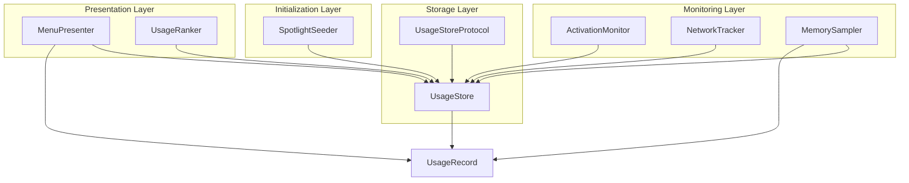
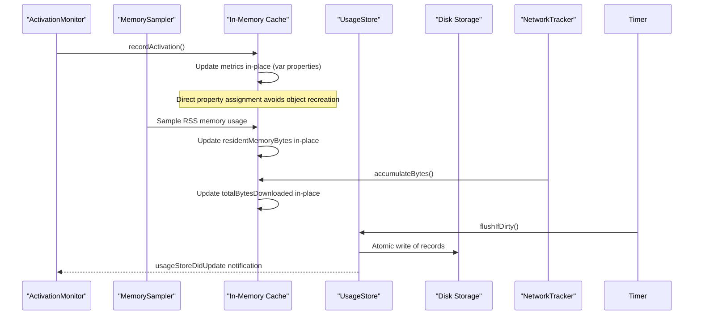
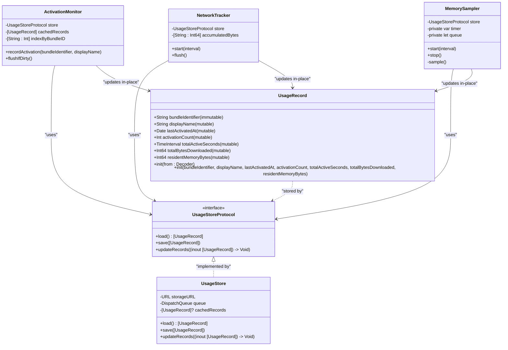
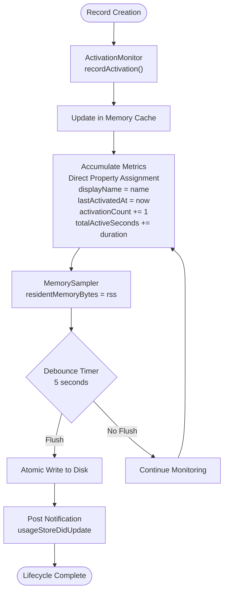
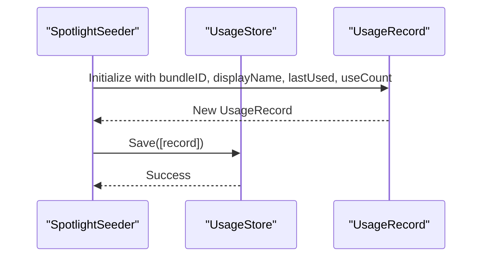
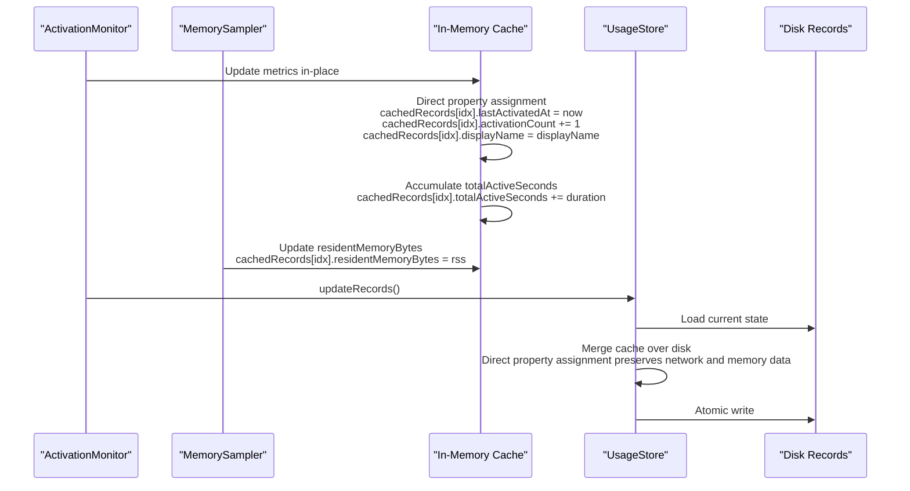
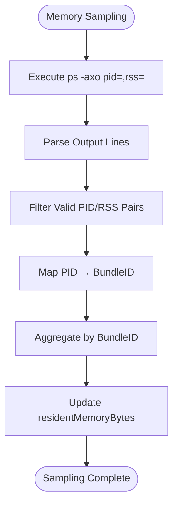
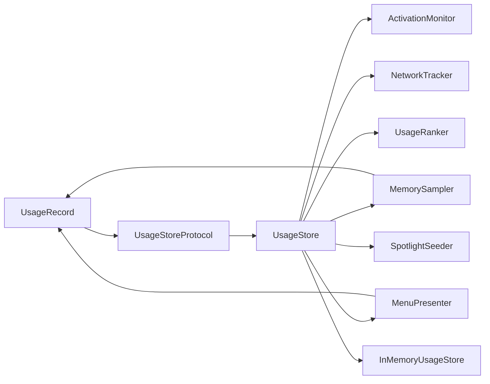

# UsageRecord Data Model

<cite>
**Referenced Files in This Document**
- [UsageRecord.swift](file://iTip/UsageRecord.swift)
- [UsageStore.swift](file://iTip/UsageStore.swift)
- [UsageStoreProtocol.swift](file://iTip/UsageStoreProtocol.swift)
- [ActivationMonitor.swift](file://iTip/ActivationMonitor.swift)
- [NetworkTracker.swift](file://iTip/NetworkTracker.swift)
- [UsageRanker.swift](file://iTip/UsageRanker.swift)
- [MenuPresenter.swift](file://iTip/MenuPresenter.swift)
- [SpotlightSeeder.swift](file://iTip/SpotlightSeeder.swift)
- [MemorySampler.swift](file://iTip/MemorySampler.swift)
- [UsageRecordPropertyTests.swift](file://iTipTests/UsageRecordPropertyTests.swift)
- [MenuPresenterTests.swift](file://iTipTests/MenuPresenterTests.swift)
- [InMemoryUsageStore.swift](file://iTipTests/InMemoryUsageStore.swift)
</cite>

## Update Summary
**Changes Made**
- Enhanced Field Definitions section to include new residentMemoryBytes field
- Updated Core Components section to reflect enhanced mutable properties with memory tracking
- Added Memory Tracking Architecture section covering MemorySampler integration
- Updated Detailed Component Analysis to include memory usage visualization
- Enhanced Backward Compatibility section with residentMemoryBytes fallback handling
- Added Memory Usage Visualization section with UI integration examples
- Updated Performance Considerations section to address memory sampling overhead

## Table of Contents
1. [Introduction](#introduction)
2. [Project Structure](#project-structure)
3. [Core Components](#core-components)
4. [Architecture Overview](#architecture-overview)
5. [Detailed Component Analysis](#detailed-component-analysis)
6. [Memory Tracking Architecture](#memory-tracking-architecture)
7. [Dependency Analysis](#dependency-analysis)
8. [Performance Considerations](#performance-considerations)
9. [Troubleshooting Guide](#troubleshooting-guide)
10. [Conclusion](#conclusion)

## Introduction
This document provides comprehensive documentation for the UsageRecord data model used by the iTip macOS menu bar application. It covers the complete structure of the UsageRecord, including all field definitions, Codable conformance, JSON serialization format, backward compatibility considerations, optional field handling, and data validation rules. The model now includes enhanced memory tracking capabilities through the residentMemoryBytes field, enabling per-application memory usage monitoring. It also explains the record lifecycle from creation through updates, automatic timestamp management, metric accumulation, and practical examples of record creation, modification, and comparison operations. Finally, it addresses data integrity checks, migration strategies for schema changes, and performance considerations for large datasets.

**Updated** The UsageRecord now features enhanced mutable properties including memory tracking capabilities, enabling efficient in-place updates without object recreation and comprehensive memory usage monitoring.

## Project Structure
The UsageRecord is part of the iTip application's core data model and is used across several subsystems:
- Storage layer: UsageStore persists records to disk using JSON serialization
- Monitoring layer: ActivationMonitor, NetworkTracker, and MemorySampler update records in memory and persist them
- Presentation layer: MenuPresenter formats records for display including memory usage
- Ranking layer: UsageRanker sorts records for ranking
- Initialization layer: SpotlightSeeder seeds records from system spotlight data

**Diagram sources**
- [UsageStore.swift:1-111](file://iTip/UsageStore.swift#L1-L111)
- [UsageStoreProtocol.swift:1-14](file://iTip/UsageStoreProtocol.swift#L1-L14)
- [ActivationMonitor.swift:1-179](file://iTip/ActivationMonitor.swift#L1-L179)
- [NetworkTracker.swift:1-152](file://iTip/NetworkTracker.swift#L1-L152)
- [MemorySampler.swift:1-117](file://iTip/MemorySampler.swift#L1-L117)
- [MenuPresenter.swift:180-272](file://iTip/MenuPresenter.swift#L180-L272)
- [UsageRanker.swift:1-15](file://iTip/UsageRanker.swift#L1-L15)
- [SpotlightSeeder.swift:60-80](file://iTip/SpotlightSeeder.swift#L60-L80)

**Section sources**
- [UsageStore.swift:1-111](file://iTip/UsageStore.swift#L1-L111)
- [UsageStoreProtocol.swift:1-14](file://iTip/UsageStoreProtocol.swift#L1-L14)
- [ActivationMonitor.swift:1-179](file://iTip/ActivationMonitor.swift#L1-L179)
- [NetworkTracker.swift:1-152](file://iTip/NetworkTracker.swift#L1-L152)
- [MemorySampler.swift:1-117](file://iTip/MemorySampler.swift#L1-L117)
- [MenuPresenter.swift:180-272](file://iTip/MenuPresenter.swift#L180-L272)
- [UsageRanker.swift:1-15](file://iTip/UsageRanker.swift#L1-L15)
- [SpotlightSeeder.swift:60-80](file://iTip/SpotlightSeeder.swift#L60-L80)

## Core Components
The UsageRecord is a lightweight, mutable data structure that captures application usage metrics including enhanced memory tracking. It conforms to Codable for JSON serialization and Equatable for comparison operations. All properties except bundleIdentifier are now mutable (var) to enable efficient in-place updates without object recreation.

### Field Definitions
- bundleIdentifier: String (immutable, primary key)
  - Purpose: Unique identifier for the application bundle
  - Constraints: Non-empty string, serves as dictionary key for merging
  - Validation: Must not be empty; enforced by monitor logic
- displayName: String (mutable)
  - Purpose: Human-readable name for display in UI
  - Constraints: Non-empty string for meaningful display
  - Update Method: Direct assignment for runtime display name changes
- lastActivatedAt: Date (mutable)
  - Purpose: Timestamp of the most recent activation
  - Constraints: Must be a valid Date; updated on each activation
  - Update Method: Direct assignment with current timestamp
- activationCount: Int (mutable)
  - Purpose: Total number of activations
  - Constraints: Non-negative integer; incremented on each activation
  - Update Method: Direct increment operation
- totalActiveSeconds: TimeInterval (mutable)
  - Purpose: Cumulative foreground active time in seconds
  - Constraints: Non-negative; accumulated from foreground duration
  - Update Method: Direct addition of foreground duration
- totalBytesDownloaded: Int64 (mutable)
  - Purpose: Cumulative downloaded bytes
  - Constraints: Non-negative; accumulated from network sampling
  - Update Method: Direct addition of sampled bytes
- residentMemoryBytes: Int64 (mutable)
  - Purpose: Latest sampled Resident Set Size (RSS) in bytes
  - Constraints: Non-negative; updated by MemorySampler via ps command
  - Default Value: 0 for backward compatibility
  - Update Method: Direct assignment from MemorySampler sampling

**Updated** Added residentMemoryBytes field for comprehensive memory usage tracking with backward compatibility support.

**Section sources**
- [UsageRecord.swift:3-37](file://iTip/UsageRecord.swift#L3-L37)
- [UsageRecordPropertyTests.swift:28-51](file://iTipTests/UsageRecordPropertyTests.swift#L28-L51)

## Architecture Overview
The UsageRecord participates in a multi-layered architecture where monitoring systems update in-memory caches and periodically persist to disk through the UsageStore. The enhanced mutable properties enable efficient in-place updates without object recreation, including memory usage tracking through the MemorySampler integration.

**Updated** The architecture now demonstrates in-place property updates including memory usage tracking for improved performance.

**Diagram sources**
- [ActivationMonitor.swift:69-105](file://iTip/ActivationMonitor.swift#L69-L105)
- [ActivationMonitor.swift:116-142](file://iTip/ActivationMonitor.swift#L116-L142)
- [MemorySampler.swift:42-53](file://iTip/MemorySampler.swift#L42-L53)
- [NetworkTracker.swift:56-76](file://iTip/NetworkTracker.swift#L56-L76)
- [UsageStore.swift:52-67](file://iTip/UsageStore.swift#L52-L67)

## Detailed Component Analysis

### UsageRecord Structure and Behavior
The UsageRecord is designed as a value type with enhanced mutable fields that enable efficient in-place updates. The bundleIdentifier remains immutable while all other properties are mutable (var) to support frequent modifications during runtime, including memory usage tracking.

**Updated** The class diagram now shows enhanced mutable properties including memory tracking capabilities and in-place update mechanisms.

**Diagram sources**
- [UsageRecord.swift:3-37](file://iTip/UsageRecord.swift#L3-L37)
- [UsageStoreProtocol.swift:3-8](file://iTip/UsageStoreProtocol.swift#L3-L8)
- [UsageStore.swift:4-111](file://iTip/UsageStore.swift#L4-L111)
- [ActivationMonitor.swift:3-36](file://iTip/ActivationMonitor.swift#L3-L36)
- [NetworkTracker.swift:6-23](file://iTip/NetworkTracker.swift#L6-L23)
- [MemorySampler.swift:6-117](file://iTip/MemorySampler.swift#L6-L117)

### Record Lifecycle Management
The record lifecycle spans creation, updates, and persistence through multiple stages with efficient in-place modifications, including memory usage tracking:

1. **Creation**: Records are created either by ActivationMonitor for new applications or by SpotlightSeeder from system data
2. **Updates**: Metrics are accumulated in memory using direct property assignments and periodically flushed to disk
3. **Memory Sampling**: MemorySampler periodically updates residentMemoryBytes for existing records
4. **Persistence**: Atomic writes ensure data integrity during concurrent access

**Updated** The flowchart now shows direct property assignment for in-place updates including memory usage tracking.

**Diagram sources**
- [ActivationMonitor.swift:69-105](file://iTip/ActivationMonitor.swift#L69-L105)
- [ActivationMonitor.swift:116-142](file://iTip/ActivationMonitor.swift#L116-L142)
- [MemorySampler.swift:42-53](file://iTip/MemorySampler.swift#L42-L53)
- [UsageStore.swift:52-67](file://iTip/UsageStore.swift#L52-L67)

### Backward Compatibility and Migration
The UsageRecord implements comprehensive custom decoding to handle schema evolution gracefully:

- New fields (totalActiveSeconds, totalBytesDownloaded, residentMemoryBytes) default to zero when absent
- Existing records continue to function without requiring migration
- Future schema changes can be handled similarly by adding optional decoding with sensible defaults
- Memory field defaults to 0 for backward compatibility with older JSON versions

**Updated** Enhanced backward compatibility support now includes residentMemoryBytes field with zero-value fallback.

**Section sources**
- [UsageRecord.swift:15-25](file://iTip/UsageRecord.swift#L15-L25)

### Data Validation Rules
Several validation rules ensure data integrity:

- bundleIdentifier must be non-empty (enforced by monitor logic)
- activationCount must be non-negative (incremented atomically)
- totalActiveSeconds must be non-negative (accumulated duration)
- totalBytesDownloaded must be non-negative (accumulated bytes)
- residentMemoryBytes must be non-negative (memory usage in bytes)
- lastActivatedAt must be a valid Date (updated on each activation)

**Updated** Added validation rule for residentMemoryBytes field ensuring non-negative memory usage values.

**Section sources**
- [ActivationMonitor.swift:69-105](file://iTip/ActivationMonitor.swift#L69-L105)
- [NetworkTracker.swift:56-76](file://iTip/NetworkTracker.swift#L56-L76)
- [MemorySampler.swift:42-53](file://iTip/MemorySampler.swift#L42-L53)

### Example Operations

#### Creating a New Record
Records can be created from system spotlight data or when first encountered by the activation monitor:

**Diagram sources**
- [SpotlightSeeder.swift:68-74](file://iTip/SpotlightSeeder.swift#L68-L74)
- [UsageStore.swift:52-67](file://iTip/UsageStore.swift#L52-L67)

#### Updating Existing Records
Metrics are accumulated in memory using direct property assignments and merged with disk state, including memory usage updates:

**Updated** The sequence diagram now shows direct property assignments for in-place updates including memory usage tracking.

**Diagram sources**
- [ActivationMonitor.swift:69-105](file://iTip/ActivationMonitor.swift#L69-L105)
- [ActivationMonitor.swift:122-137](file://iTip/ActivationMonitor.swift#L122-L137)
- [MemorySampler.swift:42-53](file://iTip/MemorySampler.swift#L42-L53)
- [UsageStore.swift:69-105](file://iTip/UsageStore.swift#L69-L105)

#### Comparison Operations
UsageRecord conforms to Equatable, enabling comparison for testing and validation:

**Section sources**
- [UsageRecord.swift:3](file://iTip/UsageRecord.swift#L3)
- [UsageRecordPropertyTests.swift:28-51](file://iTipTests/UsageRecordPropertyTests.swift#L28-L51)

## Memory Tracking Architecture
The MemorySampler component provides comprehensive per-application memory usage tracking through periodic RSS sampling and integration with the UsageRecord model.

### Memory Sampling Process
The MemorySampler periodically executes system commands to gather per-process memory usage data and updates UsageRecord instances:

1. **Process Enumeration**: Uses `/bin/ps` to enumerate all running processes with PID and RSS values
2. **Data Processing**: Parses output into [PID: RSS] mapping and converts KB to bytes
3. **Bundle Mapping**: Maps PIDs to bundle identifiers using NSWorkspace
4. **Aggregation**: Aggregates memory usage per application bundle (handles multiple processes)
5. **Update Application**: Updates residentMemoryBytes for existing records only

**Diagram sources**
- [MemorySampler.swift:55-115](file://iTip/MemorySampler.swift#L55-L115)

### Memory Usage Visualization
The MenuPresenter integrates memory usage data into the user interface, displaying memory consumption alongside other metrics:

- **Memory Column**: Shows formatted memory usage (bytes → MB/GB conversion)
- **Format Options**: Handles various memory sizes with appropriate units
- **Display Logic**: Shows "-" for zero or negative values, "<1M" for small values, and formatted numbers for larger values

**Section sources**
- [MemorySampler.swift:4-5](file://iTip/MemorySampler.swift#L4-L5)
- [MemorySampler.swift:17-25](file://iTip/MemorySampler.swift#L17-L25)
- [MemorySampler.swift:42-53](file://iTip/MemorySampler.swift#L42-L53)
- [MenuPresenter.swift:192-193](file://iTip/MenuPresenter.swift#L192-L193)
- [MenuPresenter.swift:263-270](file://iTip/MenuPresenter.swift#L263-L270)

## Dependency Analysis
The UsageRecord has minimal external dependencies and is primarily consumed by the storage and monitoring layers, with enhanced memory tracking integration.

**Diagram sources**
- [UsageStoreProtocol.swift:3-8](file://iTip/UsageStoreProtocol.swift#L3-L8)
- [UsageStore.swift:4-111](file://iTip/UsageStore.swift#L4-L111)
- [ActivationMonitor.swift:3-36](file://iTip/ActivationMonitor.swift#L3-L36)
- [NetworkTracker.swift:6-23](file://iTip/NetworkTracker.swift#L6-L23)
- [MemorySampler.swift:6-117](file://iTip/MemorySampler.swift#L6-L117)
- [MenuPresenter.swift:180-272](file://iTip/MenuPresenter.swift#L180-L272)
- [UsageRanker.swift:1-15](file://iTip/UsageRanker.swift#L1-L15)
- [SpotlightSeeder.swift:60-80](file://iTip/SpotlightSeeder.swift#L60-L80)
- [InMemoryUsageStore.swift:4-24](file://iTipTests/InMemoryUsageStore.swift#L4-L24)

**Section sources**
- [UsageStoreProtocol.swift:3-8](file://iTip/UsageStoreProtocol.swift#L3-L8)
- [UsageStore.swift:4-111](file://iTip/UsageStore.swift#L4-L111)
- [ActivationMonitor.swift:3-36](file://iTip/ActivationMonitor.swift#L3-L36)
- [NetworkTracker.swift:6-23](file://iTip/NetworkTracker.swift#L6-L23)
- [MemorySampler.swift:6-117](file://iTip/MemorySampler.swift#L6-L117)
- [MenuPresenter.swift:180-272](file://iTip/MenuPresenter.swift#L180-L272)
- [UsageRanker.swift:1-15](file://iTip/UsageRanker.swift#L1-L15)
- [SpotlightSeeder.swift:60-80](file://iTip/SpotlightSeeder.swift#L60-L80)
- [InMemoryUsageStore.swift:4-24](file://iTipTests/InMemoryUsageStore.swift#L4-L24)

## Performance Considerations
Several performance optimizations are implemented to handle large datasets efficiently, with enhanced benefits from mutable properties and memory tracking:

- **In-Memory Caching**: Records are cached in memory to avoid frequent disk I/O
- **O(1) Lookup**: Index by bundleIdentifier enables constant-time record updates
- **Debounced Writes**: 5-second timer batches writes to reduce filesystem overhead
- **Atomic Persistence**: Atomic writes prevent corruption during concurrent access
- **Efficient Merging**: Dictionary-based merge operation minimizes conflicts
- **Background Queues**: All storage operations occur on dedicated dispatch queues
- **In-Place Updates**: Mutable properties eliminate object recreation overhead
- **Direct Property Assignment**: Runtime updates use direct property assignment instead of object copying
- **Memory Sampling Efficiency**: MemorySampler runs on utility queue with configurable intervals
- **Selective Updates**: MemorySampler only updates existing records, avoiding unnecessary allocations
- **System Command Optimization**: Efficient parsing and aggregation of ps command output

**Updated** Added performance benefits from enhanced memory tracking including efficient memory sampling and selective record updates.

**Section sources**
- [ActivationMonitor.swift:12-26](file://iTip/ActivationMonitor.swift#L12-L26)
- [ActivationMonitor.swift:109-114](file://iTip/ActivationMonitor.swift#L109-L114)
- [ActivationMonitor.swift:52-56](file://iTip/ActivationMonitor.swift#L52-L56)
- [MemorySampler.swift:10-11](file://iTip/MemorySampler.swift#L10-L11)
- [MemorySampler.swift:17-25](file://iTip/MemorySampler.swift#L17-L25)
- [MemorySampler.swift:42-53](file://iTip/MemorySampler.swift#L42-L53)
- [UsageStore.swift:7-9](file://iTip/UsageStore.swift#L7-L9)
- [UsageStore.swift:61-66](file://iTip/UsageStore.swift#L61-L66)

## Troubleshooting Guide
Common issues and their resolutions:

### JSON Decoding Issues
- **Problem**: Older JSON versions missing new fields
- **Solution**: Custom decoding provides sensible defaults (zero values) including residentMemoryBytes
- **Prevention**: Always use the provided custom initializer for backward compatibility

### Data Integrity Problems
- **Problem**: Concurrent access causing inconsistent state
- **Solution**: Atomic writes and synchronized queues prevent race conditions
- **Prevention**: Use updateRecords() for atomic modifications

### Performance Degradation
- **Problem**: Frequent disk writes causing slowdown
- **Solution**: Debounced writes (5-second intervals) batch operations
- **Prevention**: Monitor cache size and adjust timer intervals as needed
- **Updated** **New Solution**: In-place property updates reduce memory allocation overhead
- **Updated** **New Solution**: MemorySampler runs on background queue to minimize UI impact

### Memory Sampling Issues
- **Problem**: Memory usage not appearing in UI
- **Solution**: Verify MemorySampler is running and has sufficient permissions
- **Prevention**: Check ps command execution and process enumeration
- **Updated** **New Solution**: Resident memory values default to 0 for backward compatibility

### Mutable Property Issues
- **Problem**: Unexpected property mutations in testing
- **Solution**: Use immutable copies when testing expected states
- **Prevention**: Create snapshots of records before assertions

**Section sources**
- [UsageRecord.swift:15-25](file://iTip/UsageRecord.swift#L15-L25)
- [UsageStore.swift:43-48](file://iTip/UsageStore.swift#L43-L48)
- [ActivationMonitor.swift:52-56](file://iTip/ActivationMonitor.swift#L52-L56)
- [MemorySampler.swift:42-53](file://iTip/MemorySampler.swift#L42-L53)

## Conclusion
The UsageRecord data model provides a robust foundation for tracking application usage metrics in the iTip application, now enhanced with comprehensive memory usage monitoring capabilities. Its design emphasizes backward compatibility, data integrity, and performance through careful use of in-memory caching, debounced persistence, and atomic operations. The recent enhancement to include residentMemoryBytes field enables efficient in-place updates without object recreation, significantly improving performance for frequent modifications. The MemorySampler integration provides real-time per-application memory usage tracking through system process enumeration and RSS sampling. The model's Codable conformance ensures seamless integration with the storage layer while maintaining flexibility for future schema evolution. The comprehensive testing suite validates serialization round-trips, property-based testing ensures correctness across various scenarios, and the enhanced mutable design supports real-time updates with minimal performance overhead. The addition of memory tracking capabilities makes the UsageRecord a comprehensive solution for application usage analytics on macOS.