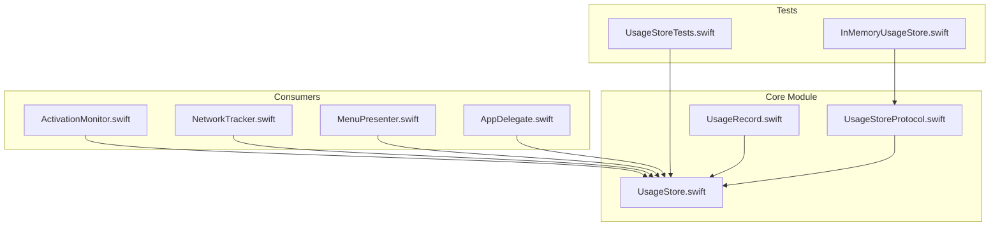
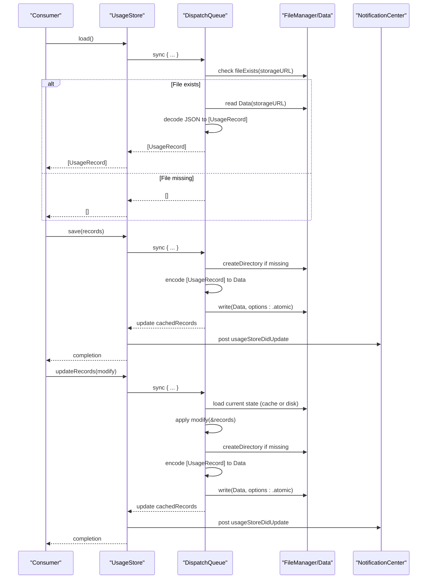
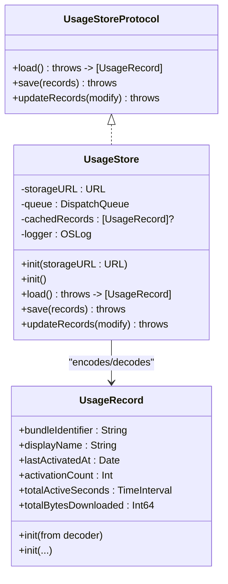
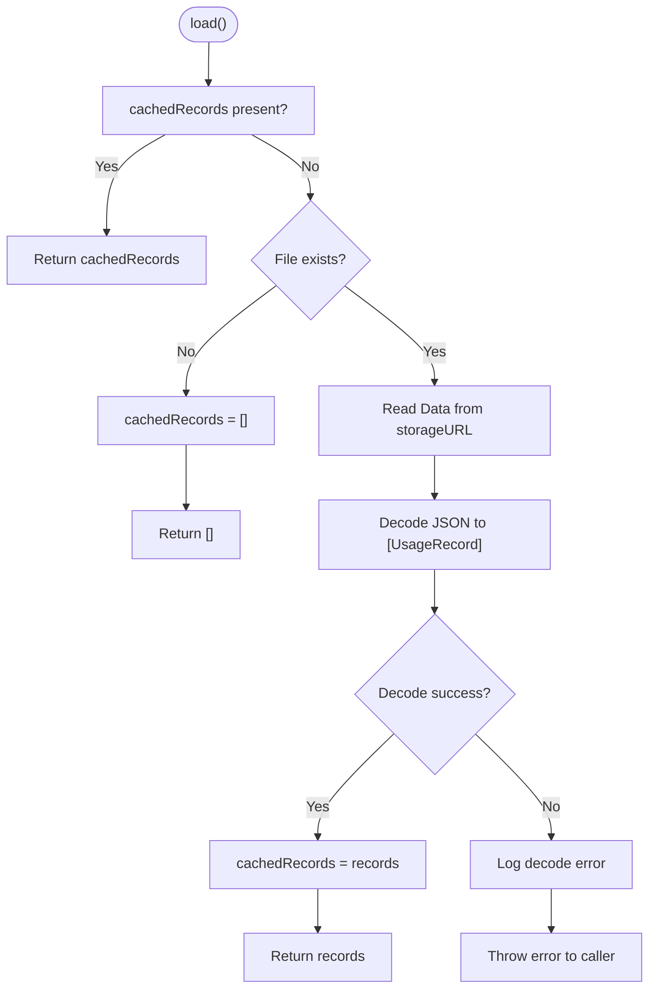
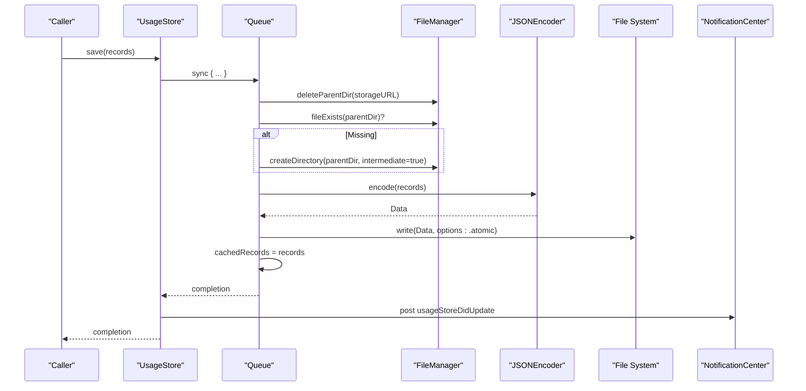
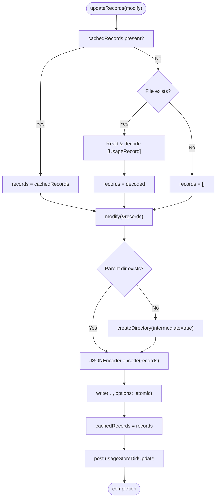
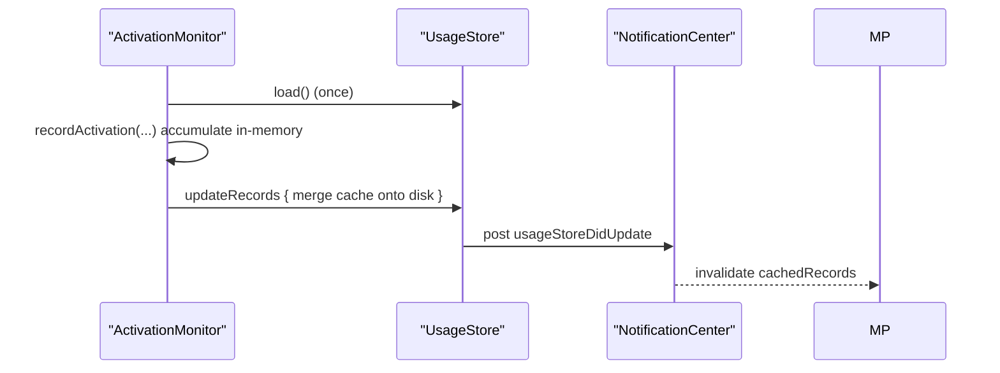
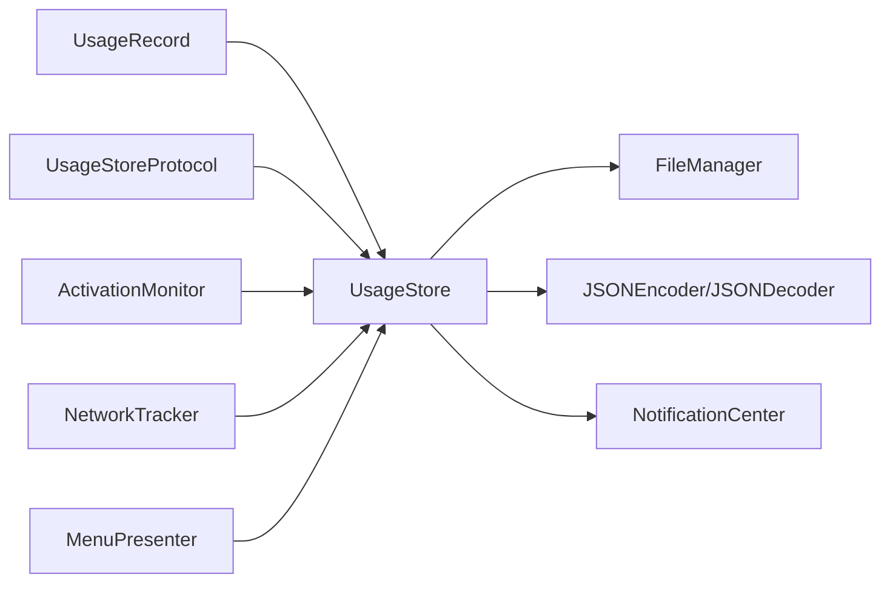

# UsageStore Implementation

<cite>
**Referenced Files in This Document**
- [UsageStore.swift](file://iTip/UsageStore.swift)
- [UsageStoreProtocol.swift](file://iTip/UsageStoreProtocol.swift)
- [UsageRecord.swift](file://iTip/UsageRecord.swift)
- [AppDelegate.swift](file://iTip/AppDelegate.swift)
- [ActivationMonitor.swift](file://iTip/ActivationMonitor.swift)
- [NetworkTracker.swift](file://iTip/NetworkTracker.swift)
- [MenuPresenter.swift](file://iTip/MenuPresenter.swift)
- [UsageStoreTests.swift](file://iTipTests/UsageStoreTests.swift)
- [InMemoryUsageStore.swift](file://iTipTests/InMemoryUsageStore.swift)
</cite>

## Update Summary
**Changes Made**
- Updated updateRecords(_:) method documentation to reflect enhanced atomic operations and error handling
- Added comprehensive coverage of the notification system (usageStoreDidUpdate) and its role in preventing data corruption
- Enhanced error handling documentation to address concurrent access scenarios between ActivationMonitor and NetworkTracker
- Updated integration examples to demonstrate proper notification handling and cache invalidation patterns

## Table of Contents
1. [Introduction](#introduction)
2. [Project Structure](#project-structure)
3. [Core Components](#core-components)
4. [Architecture Overview](#architecture-overview)
5. [Detailed Component Analysis](#detailed-component-analysis)
6. [Dependency Analysis](#dependency-analysis)
7. [Performance Considerations](#performance-considerations)
8. [Troubleshooting Guide](#troubleshooting-guide)
9. [Conclusion](#conclusion)
10. [Appendices](#appendices)

## Introduction
This document provides a comprehensive guide to the UsageStore class, focusing on its thread-safe architecture using Grand Central Dispatch (GCD) queues, caching mechanism for performance optimization, JSON serialization/deserialization process, storage URL configuration, file I/O operations, and atomic write semantics. It also covers the load() and save() methods' error handling, fallback mechanisms, cache invalidation strategies, and practical usage patterns integrated with other components such as ActivationMonitor, NetworkTracker, and MenuPresenter. The implementation now includes enhanced atomic operations with improved error handling to prevent data corruption during concurrent access between monitoring components.

## Project Structure
The UsageStore resides in the application's core module alongside related protocols, models, and consumers. It is consumed by multiple subsystems that coordinate application usage tracking and UI presentation, with a notification system that ensures all components stay synchronized.

**Diagram sources**
- [UsageStore.swift:1-111](file://iTip/UsageStore.swift#L1-L111)
- [UsageStoreProtocol.swift:1-14](file://iTip/UsageStoreProtocol.swift#L1-L14)
- [UsageRecord.swift:1-33](file://iTip/UsageRecord.swift#L1-L33)
- [ActivationMonitor.swift:1-178](file://iTip/ActivationMonitor.swift#L1-L178)
- [NetworkTracker.swift:1-152](file://iTip/NetworkTracker.swift#L1-L152)
- [MenuPresenter.swift:1-253](file://iTip/MenuPresenter.swift#L1-L253)
- [UsageStoreTests.swift:1-93](file://iTipTests/UsageStoreTests.swift#L1-L93)
- [InMemoryUsageStore.swift:1-24](file://iTipTests/InMemoryUsageStore.swift#L1-L24)

**Section sources**
- [UsageStore.swift:1-111](file://iTip/UsageStore.swift#L1-L111)
- [UsageStoreProtocol.swift:1-14](file://iTip/UsageStoreProtocol.swift#L1-L14)
- [UsageRecord.swift:1-33](file://iTip/UsageRecord.swift#L1-L33)

## Core Components
- UsageStore: Thread-safe persistence layer for [UsageRecord] with GCD queue synchronization, in-memory cache, JSON encode/decode, atomic writes, and notification propagation.
- UsageStoreProtocol: Defines the contract for loading, saving, and atomic update of usage records, including the new updateRecords method.
- UsageRecord: Codable model representing per-application usage metrics with backward-compatible decoding.
- Consumers: ActivationMonitor, NetworkTracker, and MenuPresenter integrate with UsageStore for monitoring, seeding, and UI updates, with proper notification handling.

**Section sources**
- [UsageStore.swift:4-111](file://iTip/UsageStore.swift#L4-L111)
- [UsageStoreProtocol.swift:3-8](file://iTip/UsageStoreProtocol.swift#L3-L8)
- [UsageRecord.swift:3-32](file://iTip/UsageRecord.swift#L3-L32)

## Architecture Overview
UsageStore centralizes persistence and exposes a simple protocol to consumers. It ensures thread safety via a dedicated serial GCD queue and maintains an in-memory cache to minimize disk I/O. A notification system propagates changes to UI and other components, preventing data corruption during concurrent access between monitoring systems.

**Diagram sources**
- [UsageStore.swift:24-109](file://iTip/UsageStore.swift#L24-L109)
- [UsageStoreProtocol.swift:10-13](file://iTip/UsageStoreProtocol.swift#L10-L13)

## Detailed Component Analysis

### UsageStore Class
- Thread-safety: All public methods synchronize on a dedicated serial queue to serialize access and prevent race conditions.
- Caching: Maintains an optional in-memory cache of [UsageRecord] to avoid repeated disk reads until invalidated by save/update.
- Storage URL: Supports explicit URL configuration and a convenience initializer that resolves to a default Application Support path under the app's bundle name.
- JSON Serialization: Uses JSONEncoder/JSONDecoder for encode/decode of [UsageRecord], with robust error logging and graceful fallback behavior.
- Atomic Writes: Uses Data.write(to:options:.atomic) to ensure safe persistence without partial writes.
- Notifications: Posts a named notification upon successful save/update to signal observers (e.g., MenuPresenter) to invalidate caches.

**Diagram sources**
- [UsageStore.swift:4-111](file://iTip/UsageStore.swift#L4-L111)
- [UsageStoreProtocol.swift:3-8](file://iTip/UsageStoreProtocol.swift#L3-L8)
- [UsageRecord.swift:3-32](file://iTip/UsageRecord.swift#L3-L32)

**Section sources**
- [UsageStore.swift:4-111](file://iTip/UsageStore.swift#L4-L111)
- [UsageStoreProtocol.swift:3-8](file://iTip/UsageStoreProtocol.swift#L3-L8)
- [UsageRecord.swift:3-32](file://iTip/UsageRecord.swift#L3-L32)

### load() Method
- Behavior:
  - If cache is present, returns cached records immediately.
  - If file does not exist, sets cache to an empty array and returns an empty array.
  - If file exists, reads Data and decodes to [UsageRecord]; on success, caches and returns records.
  - On decode failure, logs an error and rethrows to allow callers to decide how to handle corrupted data.
- Error handling and fallback:
  - Missing file: returns empty array and caches an empty array.
  - Corrupted JSON: throws to surface the error; callers can fall back to defaults or prompt the user.
- Cache invalidation:
  - Occurs implicitly when save/update succeeds and cache is refreshed.

**Diagram sources**
- [UsageStore.swift:24-50](file://iTip/UsageStore.swift#L24-L50)

**Section sources**
- [UsageStore.swift:24-50](file://iTip/UsageStore.swift#L24-L50)

### save() Method
- Directory creation:
  - Ensures the parent directory exists by creating it with intermediate directories enabled.
- Encoding:
  - Encodes [UsageRecord] to Data using JSONEncoder.
- Atomic write:
  - Writes Data to storageURL using .atomic to avoid partial writes.
- Cache update:
  - Updates cachedRecords to reflect the saved state.
- Notification:
  - Posts a usageStoreDidUpdate notification to inform observers.

**Diagram sources**
- [UsageStore.swift:52-67](file://iTip/UsageStore.swift#L52-L67)

**Section sources**
- [UsageStore.swift:52-67](file://iTip/UsageStore.swift#L52-L67)

### updateRecords(_:) Method
- Purpose:
  - Loads current state (either from cache or disk), applies a mutation closure, persists the result atomically, and updates the cache.
- Loading strategy:
  - If cache exists, uses it; otherwise, reads and decodes from disk or initializes an empty array on missing file.
- Enhanced error handling:
  - **Updated**: Propagates decode errors instead of falling back to empty arrays to prevent data corruption during concurrent access.
  - **Updated**: Uses defensive error handling to ensure partial data doesn't overwrite existing files.
- Mutation:
  - Applies the provided closure to modify the records array in place.
- Persistence:
  - Creates directory if missing, encodes, and writes atomically.
- Cache invalidation:
  - Updates cachedRecords after a successful write.
- Notification:
  - Posts usageStoreDidUpdate after a successful write.

**Updated** Enhanced atomic operations with improved error handling to prevent data corruption during concurrent access between ActivationMonitor and NetworkTracker.

**Diagram sources**
- [UsageStore.swift:69-109](file://iTip/UsageStore.swift#L69-L109)

**Section sources**
- [UsageStore.swift:69-109](file://iTip/UsageStore.swift#L69-L109)

### UsageStoreProtocol and Notification System
- Protocol defines the contract for load/save/update operations.
- Notification.Name extension defines a usageStoreDidUpdate notification posted by UsageStore after successful persistence.
- **Updated**: The notification system ensures all components stay synchronized during concurrent access scenarios.

**Section sources**
- [UsageStoreProtocol.swift:3-8](file://iTip/UsageStoreProtocol.swift#L3-L8)
- [UsageStoreProtocol.swift:10-13](file://iTip/UsageStoreProtocol.swift#L10-L13)

### UsageRecord Model
- Codable with backward-compatible decoding that defaults new fields to zero if absent.
- Provides a convenience initializer for constructing records programmatically.

**Section sources**
- [UsageRecord.swift:3-32](file://iTip/UsageRecord.swift#L3-L32)

### Integration with Consumers

#### ActivationMonitor
- Loads records into an in-memory cache once and periodically flushes changes to disk via updateRecords.
- **Updated**: Uses updateRecords with proper error handling to merge activation data while preserving network-derived metrics.
- **Updated**: Implements retry logic on merge failures to ensure data integrity during concurrent access.

**Diagram sources**
- [ActivationMonitor.swift:38-178](file://iTip/ActivationMonitor.swift#L38-L178)
- [UsageStore.swift:69-109](file://iTip/UsageStore.swift#L69-L109)
- [MenuPresenter.swift:52-60](file://iTip/MenuPresenter.swift#L52-L60)

**Section sources**
- [ActivationMonitor.swift:38-178](file://iTip/ActivationMonitor.swift#L38-L178)
- [UsageStore.swift:69-109](file://iTip/UsageStore.swift#L69-L109)
- [MenuPresenter.swift:52-60](file://iTip/MenuPresenter.swift#L52-L60)

#### NetworkTracker
- Periodically samples network usage and accumulates bytes per bundle identifier.
- **Updated**: Uses updateRecords to merge network-derived bytes into existing records without creating new entries.
- **Updated**: Implements comprehensive error handling and retry mechanisms to prevent data loss during concurrent access.

**Section sources**
- [NetworkTracker.swift:56-76](file://iTip/NetworkTracker.swift#L56-L76)
- [UsageStore.swift:69-109](file://iTip/UsageStore.swift#L69-L109)

#### MenuPresenter
- Observes usageStoreDidUpdate to invalidate its own cache and refresh the UI.
- Uses load() with local caching to avoid frequent disk access.
- **Updated**: Implements proper cache invalidation through notification observation to maintain UI consistency.

**Section sources**
- [MenuPresenter.swift:52-60](file://iTip/MenuPresenter.swift#L52-L60)
- [MenuPresenter.swift:78-85](file://iTip/MenuPresenter.swift#L78-L85)

### Practical Usage Patterns and Examples
- Proper instantiation:
  - Default initializer resolves to a standard Application Support path.
  - Explicit initializer allows customizing the storage URL for testing or alternate locations.
- Typical usage:
  - Load records, render UI, and persist changes via save or updateRecords.
  - Use updateRecords for atomic merge operations that preserve data from other sources.
- Integration tips:
  - Subscribe to usageStoreDidUpdate to keep UI and caches synchronized.
  - Use InMemoryUsageStore in tests to isolate persistence concerns.
- **Updated**: Concurrent access patterns:
  - Both ActivationMonitor and NetworkTracker use updateRecords for atomic operations.
  - Error handling ensures data integrity during simultaneous modifications.

**Section sources**
- [UsageStore.swift:17-22](file://iTip/UsageStore.swift#L17-L22)
- [UsageStore.swift:52-67](file://iTip/UsageStore.swift#L52-L67)
- [UsageStore.swift:69-109](file://iTip/UsageStore.swift#L69-L109)
- [InMemoryUsageStore.swift:4-23](file://iTipTests/InMemoryUsageStore.swift#L4-L23)

## Dependency Analysis
UsageStore depends on Foundation for file I/O and JSON serialization, and uses OSLog for structured logging. It is consumed by multiple components that coordinate application usage tracking and UI updates, with a notification system ensuring proper synchronization.

**Diagram sources**
- [UsageStore.swift:1-111](file://iTip/UsageStore.swift#L1-L111)
- [UsageStoreProtocol.swift:1-14](file://iTip/UsageStoreProtocol.swift#L1-L14)
- [UsageRecord.swift:1-33](file://iTip/UsageRecord.swift#L1-L33)
- [ActivationMonitor.swift:1-178](file://iTip/ActivationMonitor.swift#L1-L178)
- [NetworkTracker.swift:1-152](file://iTip/NetworkTracker.swift#L1-L152)
- [MenuPresenter.swift:1-253](file://iTip/MenuPresenter.swift#L1-L253)

**Section sources**
- [UsageStore.swift:1-111](file://iTip/UsageStore.swift#L1-L111)
- [UsageStoreProtocol.swift:1-14](file://iTip/UsageStoreProtocol.swift#L1-L14)
- [UsageRecord.swift:1-33](file://iTip/UsageRecord.swift#L1-L33)

## Performance Considerations
- Thread-safety via GCD queue prevents contention and ensures deterministic ordering of file operations.
- In-memory caching reduces repeated disk reads; cache is invalidated on successful writes.
- Atomic writes avoid partial or corrupted files, improving reliability and reducing recovery overhead.
- Consumers (ActivationMonitor, NetworkTracker, MenuPresenter) implement their own caches (e.g., icon, URL, and records) to minimize repeated work.
- NetworkTracker uses separate queues and timeouts to avoid blocking and to handle external process hangs safely.
- **Updated**: Notification system ensures minimal cache invalidation overhead while maintaining data consistency across components.

## Troubleshooting Guide
- load() returns empty array:
  - If the storage file does not exist, the store returns an empty array and caches it. Verify the storage URL and file presence.
- load() throws on decode:
  - Corrupted JSON causes a decode error. The store logs the error and rethrows. Consider backing up and recreating the file or prompting the user.
- save() fails:
  - Check directory permissions and disk availability. Ensure the parent directory exists or allow the store to create it.
- updateRecords() merges incorrectly:
  - **Updated**: Enhanced error handling now prevents partial data corruption during concurrent access. If merge-save fails, the system retries and preserves existing data.
- UI not updating:
  - **Updated**: Confirm that observers listen for usageStoreDidUpdate and invalidate their caches accordingly. The notification system ensures proper cache invalidation across all components.
- Concurrent access issues:
  - **New**: Both ActivationMonitor and NetworkTracker use updateRecords for atomic operations, preventing data corruption during simultaneous modifications.

**Section sources**
- [UsageStore.swift:24-50](file://iTip/UsageStore.swift#L24-L50)
- [UsageStore.swift:52-67](file://iTip/UsageStore.swift#L52-L67)
- [UsageStore.swift:69-109](file://iTip/UsageStore.swift#L69-L109)
- [MenuPresenter.swift:52-60](file://iTip/MenuPresenter.swift#L52-L60)

## Conclusion
UsageStore provides a robust, thread-safe, and efficient persistence layer for application usage records. Its design balances performance (caching), correctness (atomic writes), and resilience (graceful error handling and cache invalidation). The enhanced atomic operations with improved error handling now prevent data corruption during concurrent access between ActivationMonitor and NetworkTracker, while the notification system ensures all components stay synchronized. By integrating with ActivationMonitor, NetworkTracker, and MenuPresenter, it enables a cohesive usage tracking pipeline with responsive UI updates and reliable data integrity.

## Appendices

### Test Coverage Highlights
- load() returns empty when file is missing.
- Round-trip save/load preserves records.
- load() returns empty when JSON is corrupted.
- Atomic write does not corrupt existing data during overwrite.
- **Updated**: Enhanced error handling prevents data corruption during concurrent access scenarios.

**Section sources**
- [UsageStoreTests.swift:24-28](file://iTipTests/UsageStoreTests.swift#L24-L28)
- [UsageStoreTests.swift:32-49](file://iTipTests/UsageStoreTests.swift#L32-L49)
- [UsageStoreTests.swift:53-62](file://iTipTests/UsageStoreTests.swift#L53-L62)
- [UsageStoreTests.swift:66-91](file://iTipTests/UsageStoreTests.swift#L66-L91)