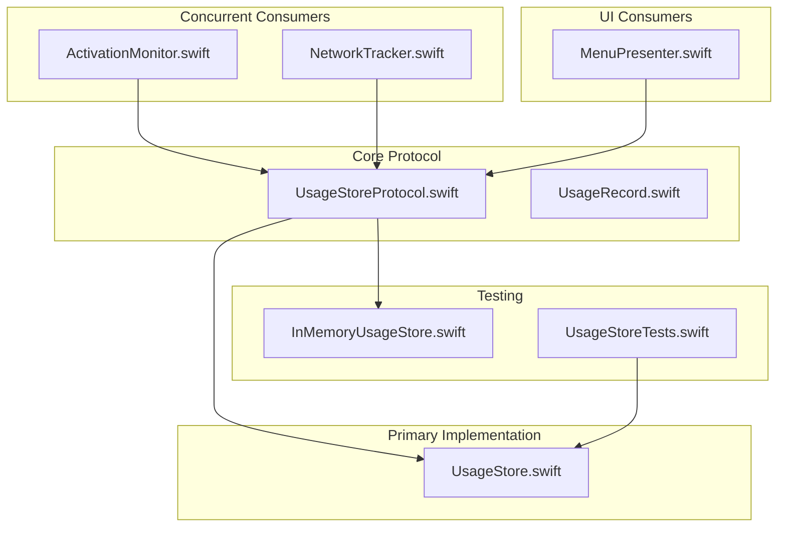
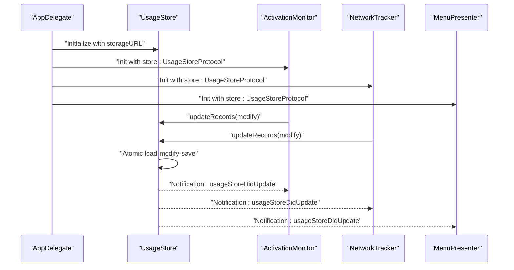
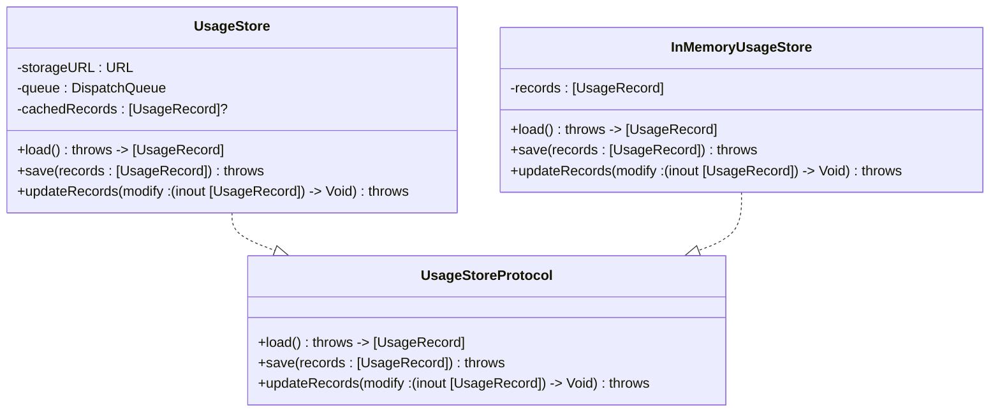
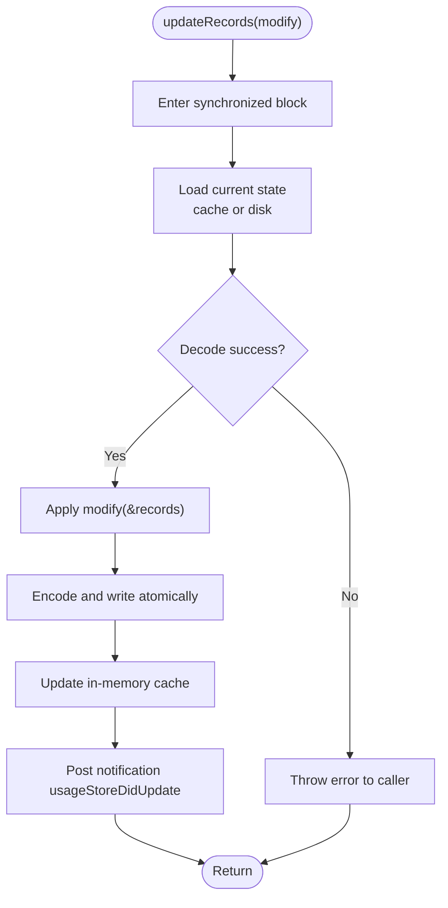
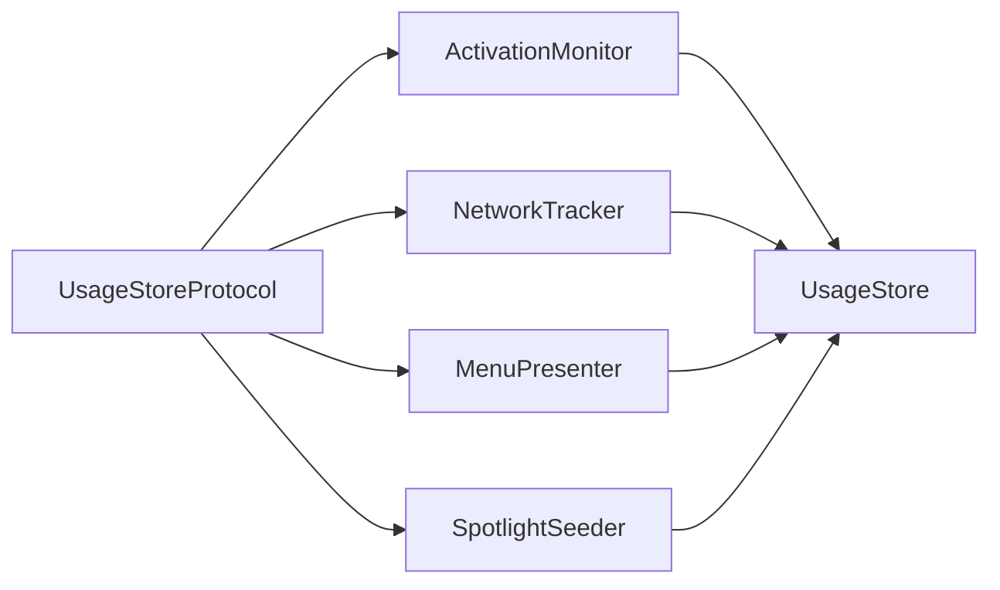
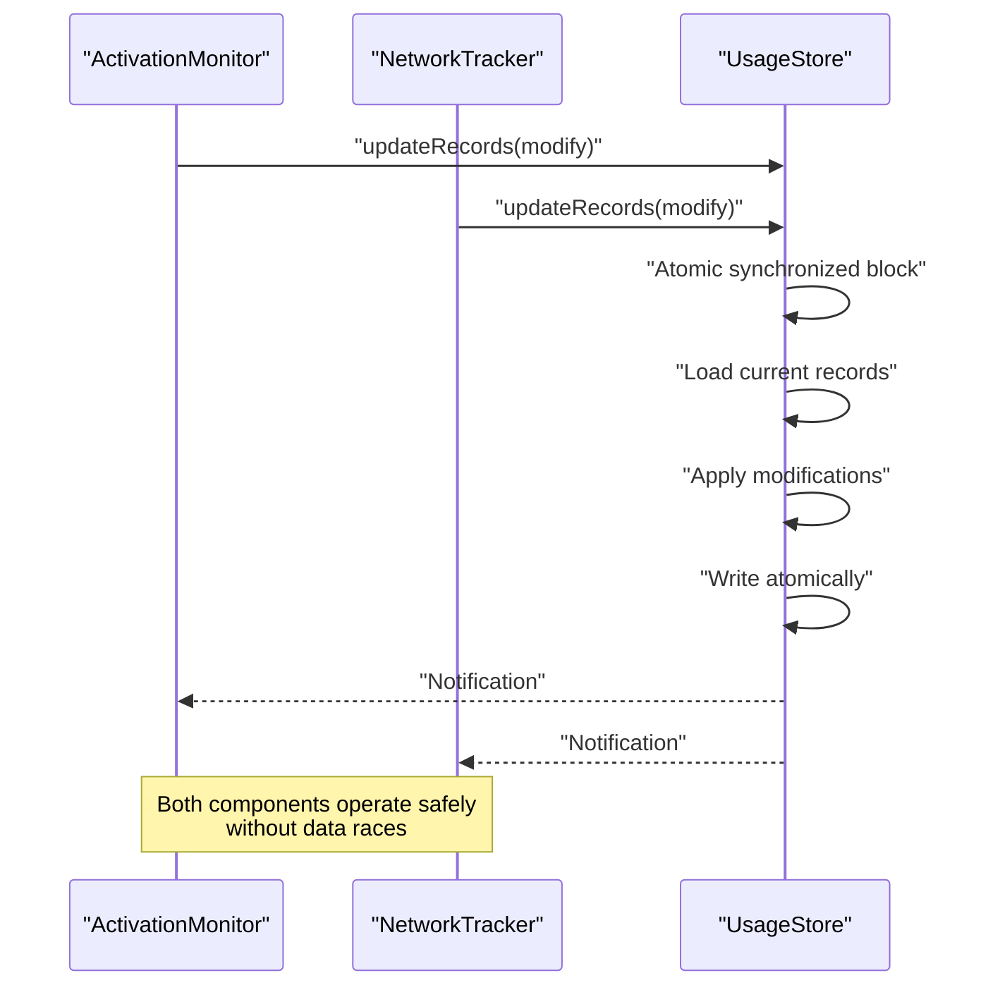
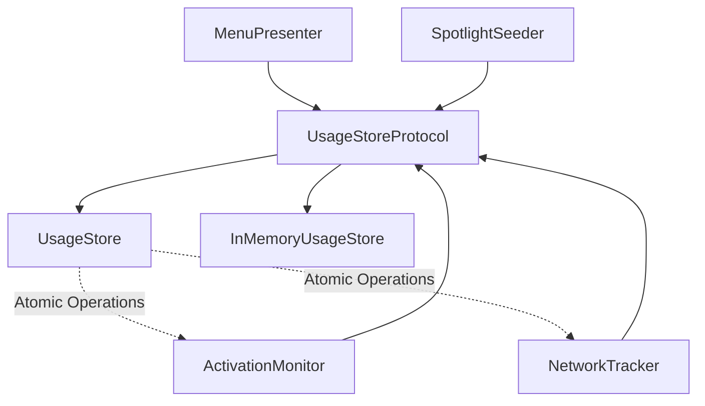

# UsageStoreProtocol Interface

<cite>
**Referenced Files in This Document**
- [UsageStoreProtocol.swift](file://iTip/UsageStoreProtocol.swift)
- [UsageStore.swift](file://iTip/UsageStore.swift)
- [UsageRecord.swift](file://iTip/UsageRecord.swift)
- [AppDelegate.swift](file://iTip/AppDelegate.swift)
- [ActivationMonitor.swift](file://iTip/ActivationMonitor.swift)
- [MenuPresenter.swift](file://iTip/MenuPresenter.swift)
- [NetworkTracker.swift](file://iTip/NetworkTracker.swift)
- [SpotlightSeeder.swift](file://iTip/SpotlightSeeder.swift)
- [InMemoryUsageStore.swift](file://iTipTests/InMemoryUsageStore.swift)
- [UsageStoreTests.swift](file://iTipTests/UsageStoreTests.swift)
</cite>

## Update Summary
**Changes Made**
- Enhanced documentation to cover the new atomic `updateRecords(_:)` method and its role in preventing data races
- Added detailed explanation of how concurrent components safely merge their updates
- Updated architecture diagrams to reflect the atomic operation pattern
- Expanded performance considerations to include concurrency benefits
- Added troubleshooting guidance for concurrent access scenarios

## Table of Contents
1. [Introduction](#introduction)
2. [Project Structure](#project-structure)
3. [Core Components](#core-components)
4. [Architecture Overview](#architecture-overview)
5. [Detailed Component Analysis](#detailed-component-analysis)
6. [Concurrency and Data Race Prevention](#concurrency-and-data-race-prevention)
7. [Dependency Analysis](#dependency-analysis)
8. [Performance Considerations](#performance-considerations)
9. [Troubleshooting Guide](#troubleshooting-guide)
10. [Conclusion](#conclusion)

## Introduction
This document provides comprehensive technical documentation for the UsageStoreProtocol interface and its central role in the iTip macOS menu bar application. The protocol defines a clean abstraction for persisting and retrieving application usage records, enabling dependency injection, testing strategies, and architectural flexibility. It underpins the application's ability to track user activity, integrate with multiple subsystems (activation monitoring, network tracking, UI presentation), and support extensible storage backends.

**Updated** The protocol now emphasizes atomic operations that prevent data races between concurrent components, making it a critical foundation for reliable concurrent access patterns.

## Project Structure
The iTip application organizes its core functionality around protocols and concrete implementations to achieve separation of concerns and testability. The UsageStoreProtocol resides alongside its primary implementation and several consumers that depend on the protocol rather than a concrete storage class.

**Diagram sources**
- [UsageStoreProtocol.swift:1-14](file://iTip/UsageStoreProtocol.swift#L1-L14)
- [UsageStore.swift:1-111](file://iTip/UsageStore.swift#L1-L111)
- [UsageRecord.swift:1-33](file://iTip/UsageRecord.swift#L1-L33)
- [ActivationMonitor.swift:1-178](file://iTip/ActivationMonitor.swift#L1-L178)
- [MenuPresenter.swift:1-253](file://iTip/MenuPresenter.swift#L1-L253)
- [NetworkTracker.swift:1-152](file://iTip/NetworkTracker.swift#L1-L152)
- [InMemoryUsageStore.swift:1-24](file://iTipTests/InMemoryUsageStore.swift#L1-L24)
- [UsageStoreTests.swift:1-93](file://iTipTests/UsageStoreTests.swift#L1-L93)

**Section sources**
- [UsageStoreProtocol.swift:1-14](file://iTip/UsageStoreProtocol.swift#L1-L14)
- [UsageStore.swift:1-111](file://iTip/UsageStore.swift#L1-L111)
- [UsageRecord.swift:1-33](file://iTip/UsageRecord.swift#L1-L33)
- [AppDelegate.swift:1-81](file://iTip/AppDelegate.swift#L1-L81)

## Core Components
- **UsageStoreProtocol**: Defines the contract for loading, saving, and atomic record updates. It also exposes a notification name for store change events.
- **UsageStore**: The primary implementation that persists records to disk using JSON serialization, maintains an in-memory cache, and posts notifications upon updates.
- **UsageRecord**: The data model representing per-application usage metrics, including backward-compatible decoding for new fields.
- **Consumers**: ActivationMonitor, MenuPresenter, NetworkTracker, and SpotlightSeeder depend on UsageStoreProtocol, enabling flexible storage backends and test doubles.

Key design goals:
- **Abstraction**: Decouple storage details from business logic.
- **Testability**: Allow injecting mock or in-memory stores during unit tests.
- **Flexibility**: Enable alternative storage backends (cloud sync, database, etc.) without changing consumers.
- **Concurrency**: Provide thread-safe operations via internal queues and atomic writes.
- **Race Prevention**: Prevent data races between concurrent components through atomic operations.

**Updated** The protocol now prioritizes atomic operations to ensure safe concurrent access patterns across multiple subsystems.

**Section sources**
- [UsageStoreProtocol.swift:3-8](file://iTip/UsageStoreProtocol.swift#L3-L8)
- [UsageStore.swift:4-110](file://iTip/UsageStore.swift#L4-L110)
- [UsageRecord.swift:3-32](file://iTip/UsageRecord.swift#L3-L32)

## Architecture Overview
The protocol enables dependency injection across the application. The AppDelegate constructs a concrete UsageStore and passes it to consumers. This pattern ensures that:
- Consumers declare their storage needs via the protocol.
- The application wiring remains centralized.
- Tests can inject lightweight alternatives like InMemoryUsageStore.

**Updated** The architecture now centers around atomic operations that prevent race conditions between concurrent components.

**Diagram sources**
- [AppDelegate.swift:9-33](file://iTip/AppDelegate.swift#L9-L33)
- [ActivationMonitor.swift:143-158](file://iTip/ActivationMonitor.swift#L143-L158)
- [NetworkTracker.swift:62-69](file://iTip/NetworkTracker.swift#L62-L69)
- [UsageStore.swift:69-109](file://iTip/UsageStore.swift#L69-L109)

## Detailed Component Analysis

### UsageStoreProtocol
Defines three essential operations:
- **load()**: Retrieves the current set of usage records, throwing on failure.
- **save(_:)**: Persists a given set of records atomically.
- **updateRecords(_:)**: Performs an atomic load-modify-save operation within a synchronized block, preventing data races between concurrent components.

Additionally, the protocol exposes a notification name for store updates, enabling decoupled observers to refresh caches and UI.

**Updated** The `updateRecords(_:)` method is now highlighted as the primary mechanism for preventing data races in concurrent environments.

**Diagram sources**
- [UsageStoreProtocol.swift:3-8](file://iTip/UsageStoreProtocol.swift#L3-L8)
- [UsageStore.swift:4-110](file://iTip/UsageStore.swift#L4-L110)
- [InMemoryUsageStore.swift:4-23](file://iTipTests/InMemoryUsageStore.swift#L4-L23)

**Section sources**
- [UsageStoreProtocol.swift:3-8](file://iTip/UsageStoreProtocol.swift#L3-L8)
- [UsageStoreProtocol.swift:10-13](file://iTip/UsageStoreProtocol.swift#L10-L13)

### UsageStore (Primary Implementation)
Responsibilities:
- Thread-safe operations using an internal serial queue.
- In-memory caching to reduce disk I/O.
- Atomic writes to prevent partial writes.
- Post-store-update notifications to invalidate caches in consumers.

**Updated** The implementation now centers around atomic operations that prevent data races between concurrent components.

Concurrency and caching:
- **load()**: Returns cached records if present; otherwise reads from disk and decodes JSON.
- **save()**: Writes atomically and updates the in-memory cache, posting notifications afterward.
- **updateRecords(_)**: Provides atomic load-modify-save within a synchronized block, preventing race conditions.

Error handling:
- On decode failures, the implementation logs and rethrows to let callers decide how to handle corrupted data.
- Errors during atomic operations propagate to prevent partial data corruption.

Integration points:
- Used by ActivationMonitor for merging activation metrics with network data.
- Used by NetworkTracker for accumulating download bytes without creating new records.
- Used by MenuPresenter for UI rendering and cache invalidation.
- Used by SpotlightSeeder for seeding initial data when the store is empty.

**Updated** The atomic operation pattern ensures that concurrent updates from different components don't overwrite each other's changes.

**Diagram sources**
- [UsageStore.swift:69-109](file://iTip/UsageStore.swift#L69-L109)

**Section sources**
- [UsageStore.swift:24-109](file://iTip/UsageStore.swift#L24-L109)

### UsageRecord (Data Model)
Responsibilities:
- Encodable/Decodable representation of per-application usage metrics.
- Backward-compatible decoding to default new fields to zero when absent in older data.

Fields include bundle identifier, display name, last activated time, activation count, cumulative active seconds, and total downloaded bytes.

**Section sources**
- [UsageRecord.swift:3-32](file://iTip/UsageRecord.swift#L3-L32)

### Consumers of UsageStoreProtocol
- **ActivationMonitor**: Maintains an in-memory cache and debounced writes; uses updateRecords to merge activation data with network data while preserving network metrics.
- **MenuPresenter**: Caches records and observes store updates to invalidate its cache; uses load() and save() for UI rendering and cleanup.
- **NetworkTracker**: Accumulates per-process network usage and uses updateRecords to increment download bytes for existing records.
- **SpotlightSeeder**: Seeds the store with historical data from Spotlight when empty; uses load() and save().

**Updated** All consumers now use atomic operations to prevent race conditions when multiple components try to update the store simultaneously.

**Diagram sources**
- [ActivationMonitor.swift:143-158](file://iTip/ActivationMonitor.swift#L143-L158)
- [MenuPresenter.swift:48-60](file://iTip/MenuPresenter.swift#L48-L60)
- [NetworkTracker.swift:62-69](file://iTip/NetworkTracker.swift#L62-L69)
- [SpotlightSeeder.swift:10-12](file://iTip/SpotlightSeeder.swift#L10-L12)
- [UsageStore.swift:4-110](file://iTip/UsageStore.swift#L4-L110)

**Section sources**
- [ActivationMonitor.swift:28-178](file://iTip/ActivationMonitor.swift#L28-L178)
- [MenuPresenter.swift:48-253](file://iTip/MenuPresenter.swift#L48-L253)
- [NetworkTracker.swift:21-152](file://iTip/NetworkTracker.swift#L21-L152)
- [SpotlightSeeder.swift:10-80](file://iTip/SpotlightSeeder.swift#L10-L80)

### Testing Strategies with Mock Objects
- **InMemoryUsageStore**: Implements the protocol with an in-memory array, enabling fast unit tests without filesystem I/O.
- **UsageStoreTests**: Validates load/save round-trips, atomic writes, and error handling for corrupted JSON.

Benefits:
- **Isolation**: Consumers can be tested independently of the filesystem.
- **Determinism**: Controlled initial state and deterministic outcomes.
- **Speed**: Eliminates disk I/O overhead.

**Updated** Testing now includes validation of atomic operation behavior and concurrent access patterns.

**Section sources**
- [InMemoryUsageStore.swift:4-23](file://iTipTests/InMemoryUsageStore.swift#L4-L23)
- [UsageStoreTests.swift:24-93](file://iTipTests/UsageStoreTests.swift#L24-L93)

## Concurrency and Data Race Prevention

### Atomic Operation Pattern
The `updateRecords(_:)` method serves as the cornerstone of concurrency safety in the application. It provides a thread-safe mechanism for components to perform load-modify-save operations without interfering with each other.

**Key Benefits:**
- **Race Prevention**: No two components can simultaneously modify the store
- **Consistency**: Atomic operations ensure data integrity
- **Simplicity**: Single method handles complex concurrency concerns
- **Reliability**: Prevents partial writes and data corruption

### Concurrent Component Interactions
Two primary components use atomic operations concurrently:

**ActivationMonitor** (foreground app tracking):
- Monitors application activations and updates activation counts
- Merges with existing network data to preserve download metrics
- Uses atomic operations to prevent conflicts with NetworkTracker

**NetworkTracker** (background network monitoring):
- Periodically samples network usage per application
- Increments download byte counters for existing records
- Uses atomic operations to prevent conflicts with ActivationMonitor

**Diagram sources**
- [ActivationMonitor.swift:143-158](file://iTip/ActivationMonitor.swift#L143-L158)
- [NetworkTracker.swift:62-69](file://iTip/NetworkTracker.swift#L62-L69)
- [UsageStore.swift:69-109](file://iTip/UsageStore.swift#L69-L109)

### Error Handling in Concurrent Scenarios
The atomic operation pattern includes robust error handling:
- **Decode Failures**: Propagated to prevent partial data corruption
- **Write Failures**: Roll back to previous state, allowing retries
- **Component Failures**: Individual component failures don't affect others

**Section sources**
- [UsageStore.swift:69-109](file://iTip/UsageStore.swift#L69-L109)
- [ActivationMonitor.swift:143-162](file://iTip/ActivationMonitor.swift#L143-L162)
- [NetworkTracker.swift:62-75](file://iTip/NetworkTracker.swift#L62-L75)

## Dependency Analysis
The protocol reduces coupling between consumers and storage implementation. The following diagram shows how the protocol sits at the center of the dependency graph.

**Updated** The dependency graph now emphasizes the atomic operation pattern that enables safe concurrent access.

**Diagram sources**
- [UsageStoreProtocol.swift:3-8](file://iTip/UsageStoreProtocol.swift#L3-L8)
- [UsageStore.swift:4-110](file://iTip/UsageStore.swift#L4-L110)
- [InMemoryUsageStore.swift:4-23](file://iTipTests/InMemoryUsageStore.swift#L4-L23)
- [ActivationMonitor.swift:143-158](file://iTip/ActivationMonitor.swift#L143-L158)
- [NetworkTracker.swift:62-69](file://iTip/NetworkTracker.swift#L62-L69)
- [MenuPresenter.swift:48-60](file://iTip/MenuPresenter.swift#L48-L60)
- [SpotlightSeeder.swift:10-12](file://iTip/SpotlightSeeder.swift#L10-L12)

**Section sources**
- [UsageStoreProtocol.swift:3-8](file://iTip/UsageStoreProtocol.swift#L3-L8)
- [UsageStore.swift:4-110](file://iTip/UsageStore.swift#L4-L110)
- [InMemoryUsageStore.swift:4-23](file://iTipTests/InMemoryUsageStore.swift#L4-L23)
- [ActivationMonitor.swift:28-178](file://iTip/ActivationMonitor.swift#L28-L178)
- [NetworkTracker.swift:21-152](file://iTip/NetworkTracker.swift#L21-L152)
- [MenuPresenter.swift:48-253](file://iTip/MenuPresenter.swift#L48-L253)
- [SpotlightSeeder.swift:10-80](file://iTip/SpotlightSeeder.swift#L10-L80)

## Performance Considerations

**Updated** Performance considerations now include concurrency benefits and atomic operation overhead.

- **In-memory caching**: UsageStore caches records to minimize disk reads; consumers rely on notifications to invalidate caches.
- **Atomic writes**: Ensures data integrity and avoids partial writes.
- **Debounced writes**: ActivationMonitor batches changes and flushes periodically to reduce I/O.
- **Queue-based concurrency**: Internal dispatch queues serialize access to shared state.
- **Atomic operation efficiency**: Single synchronized block prevents multiple disk operations and reduces contention.
- **Cache invalidation**: Notifications enable efficient cache management across concurrent components.

Recommendations:
- **Prefer updateRecords for merge scenarios**: Avoids redundant disk reads and prevents race conditions.
- **Use load() sparingly**: Leverage cache invalidation via notifications.
- **Monitor disk I/O patterns**: Adjust flush intervals based on usage and component interaction frequency.
- **Consider atomic operation costs**: Balance between safety and performance in high-frequency scenarios.

**Section sources**
- [UsageStore.swift:24-109](file://iTip/UsageStore.swift#L24-L109)
- [ActivationMonitor.swift:12-178](file://iTip/ActivationMonitor.swift#L12-L178)
- [MenuPresenter.swift:35-60](file://iTip/MenuPresenter.swift#L35-L60)

## Troubleshooting Guide

**Updated** Troubleshooting now includes guidance for concurrent access issues and atomic operation problems.

Common issues and resolutions:
- **Corrupted JSON**: load() throws on decode failure; callers should handle gracefully and potentially recreate the store.
- **Empty store on cold start**: SpotlightSeeder seeds data when the store is empty; verify Spotlight permissions and query results.
- **Cache staleness**: Consumers observe usageStoreDidUpdate to invalidate caches; ensure observers are registered and retained appropriately.
- **Disk write failures**: updateRecords and save post notifications on success; failures leave cache unchanged and should be retried.
- **Data race symptoms**: If components appear to overwrite each other's changes, verify they're using updateRecords instead of separate load/save calls.
- **Concurrent modification errors**: Ensure all updates go through the atomic operation pattern to prevent race conditions.

**Updated** New troubleshooting scenarios:
- **Race condition detection**: Monitor for intermittent data loss or inconsistent records between components.
- **Atomic operation failures**: Check for proper error handling in updateRecords closures.
- **Component coordination**: Verify that both ActivationMonitor and NetworkTracker are using atomic operations consistently.

Validation examples:
- Round-trip save/load correctness.
- Atomic write behavior under concurrent access.
- Error propagation for malformed data.
- Race condition prevention between concurrent components.

**Section sources**
- [UsageStore.swift:43-48](file://iTip/UsageStore.swift#L43-L48)
- [UsageStore.swift:66-109](file://iTip/UsageStore.swift#L66-L109)
- [UsageStoreTests.swift:24-93](file://iTipTests/UsageStoreTests.swift#L24-L93)
- [SpotlightSeeder.swift:16-80](file://iTip/SpotlightSeeder.swift#L16-L80)

## Conclusion
UsageStoreProtocol is the cornerstone of iTip's storage abstraction, enabling dependency injection, testability, and architectural flexibility. Its three primary methods—load, save, and updateRecords—cover all essential persistence needs while supporting atomic operations and cache invalidation.

**Updated** The protocol's atomic `updateRecords(_:)` method is now the primary mechanism for preventing data races between concurrent components, making it essential for reliable concurrent access patterns. The protocol's adoption across ActivationMonitor, MenuPresenter, NetworkTracker, and SpotlightSeeder demonstrates strong separation of concerns and adherence to SOLID principles.

By leveraging the protocol, developers can swap storage backends, introduce cloud synchronization, or enhance testing without disrupting consumer logic. The atomic operation pattern ensures that concurrent components can safely share the same storage resource without data corruption or race conditions.

The protocol's design enables:
- **Safe Concurrency**: Atomic operations prevent data races between components
- **Flexible Architecture**: Easy to swap storage implementations
- **Robust Testing**: Mock implementations enable comprehensive unit testing
- **Maintainable Code**: Clear separation of concerns across all application layers