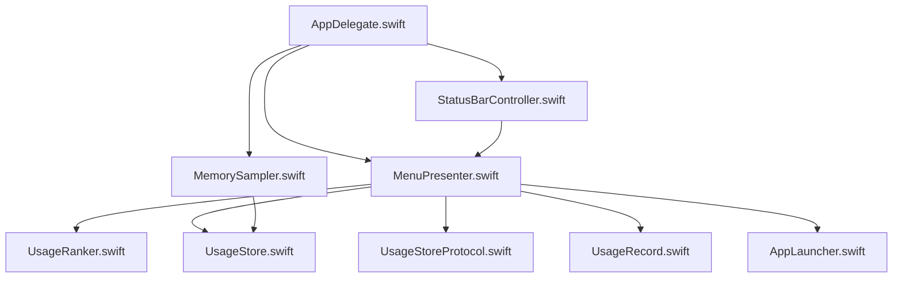
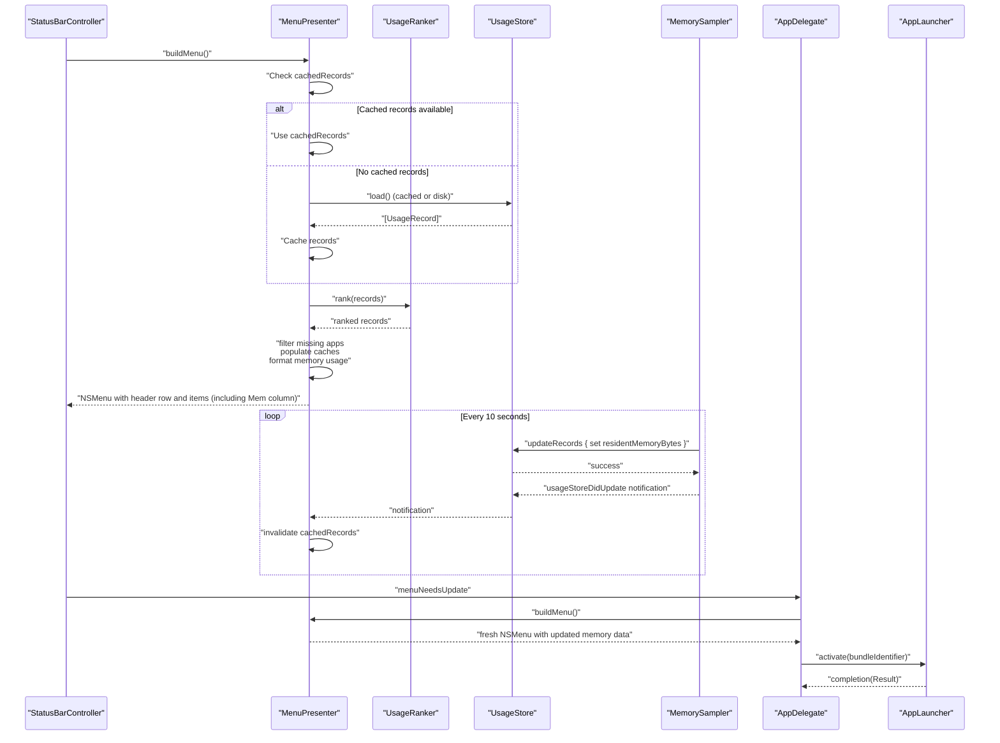
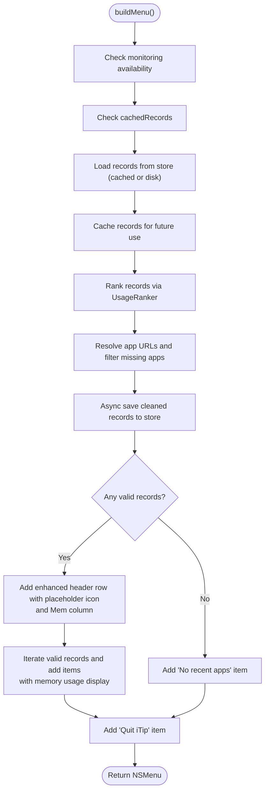
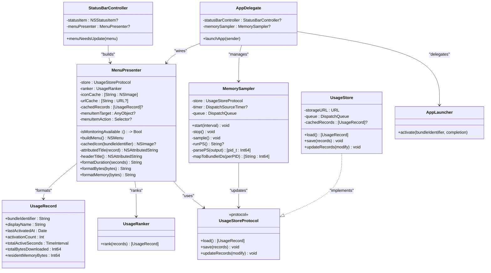

# MenuPresenter

<cite>
**Referenced Files in This Document**
- [MenuPresenter.swift](file://iTip/MenuPresenter.swift)
- [UsageRanker.swift](file://iTip/UsageRanker.swift)
- [UsageStore.swift](file://iTip/UsageStore.swift)
- [UsageStoreProtocol.swift](file://iTip/UsageStoreProtocol.swift)
- [UsageRecord.swift](file://iTip/UsageRecord.swift)
- [StatusBarController.swift](file://iTip/StatusBarController.swift)
- [AppDelegate.swift](file://iTip/AppDelegate.swift)
- [AppLauncher.swift](file://iTip/AppLauncher.swift)
- [MemorySampler.swift](file://iTip/MemorySampler.swift)
- [MenuPresenterTests.swift](file://iTipTests/MenuPresenterTests.swift)
- [InMemoryUsageStore.swift](file://iTipTests/InMemoryUsageStore.swift)
</cite>

## Update Summary
**Changes Made**
- Enhanced MenuPresenter with memory usage display functionality
- Added new 'Mem' column in the menu interface with dedicated tab stop positioning
- Integrated formatMemory helper function for adaptive unit selection (bytes, MB, GB)
- Updated tab stop positions to accommodate the new memory column
- Added residentMemoryBytes field to UsageRecord for storing memory usage data
- Integrated MemorySampler for periodic memory usage collection
- Updated display formatting to include memory consumption alongside other statistics

## Table of Contents
1. [Introduction](#introduction)
2. [Project Structure](#project-structure)
3. [Core Components](#core-components)
4. [Architecture Overview](#architecture-overview)
5. [Detailed Component Analysis](#detailed-component-analysis)
6. [Dependency Analysis](#dependency-analysis)
7. [Performance Considerations](#performance-considerations)
8. [Troubleshooting Guide](#troubleshooting-guide)
9. [Conclusion](#conclusion)

## Introduction
MenuPresenter is responsible for constructing the dynamic menu displayed in the macOS menu bar. It builds application entries from usage data, ranks them via UsageRanker, and formats them with icons, statistics, and relative timestamps. The enhanced version now includes memory usage display functionality, showing resident memory consumption for each application. It integrates with UsageStore for data access, maintains a persistent cache system to optimize performance, coordinates with the delegate pattern to keep the menu fresh on demand, and works with MemorySampler for periodic memory data collection. This document explains the menu building process, caching strategies, real-time updates, ranking integration, display formatting including memory statistics, and error handling.

## Project Structure
The menu system spans several components with enhanced memory monitoring capabilities:
- MenuPresenter constructs the NSMenu, manages persistent caching, formatting, and integrates memory usage display.
- UsageRanker sorts and limits usage records for display.
- UsageStore persists and retrieves usage data, posting notifications on updates.
- MemorySampler periodically collects memory usage data via system processes and updates residentMemoryBytes.
- UsageRecord now includes residentMemoryBytes field for storing memory consumption metrics.
- StatusBarController sets up the status item and triggers menu refresh via NSMenuDelegate.
- AppDelegate wires MenuPresenter to the status bar, handles application launch actions, and manages MemorySampler integration.
- AppLauncher activates or launches applications when users select menu items.

**Diagram sources**
- [MenuPresenter.swift](file://iTip/MenuPresenter.swift)
- [UsageRanker.swift](file://iTip/UsageRanker.swift)
- [UsageStore.swift](file://iTip/UsageStore.swift)
- [UsageStoreProtocol.swift](file://iTip/UsageStoreProtocol.swift)
- [UsageRecord.swift](file://iTip/UsageRecord.swift)
- [MemorySampler.swift](file://iTip/MemorySampler.swift)
- [StatusBarController.swift](file://iTip/StatusBarController.swift)
- [AppDelegate.swift](file://iTip/AppDelegate.swift)
- [AppLauncher.swift](file://iTip/AppLauncher.swift)

**Section sources**
- [MenuPresenter.swift](file://iTip/MenuPresenter.swift)
- [UsageRanker.swift](file://iTip/UsageRanker.swift)
- [UsageStore.swift](file://iTip/UsageStore.swift)
- [UsageStoreProtocol.swift](file://iTip/UsageStoreProtocol.swift)
- [UsageRecord.swift](file://iTip/UsageRecord.swift)
- [MemorySampler.swift](file://iTip/MemorySampler.swift)
- [StatusBarController.swift](file://iTip/StatusBarController.swift)
- [AppDelegate.swift](file://iTip/AppDelegate.swift)
- [AppLauncher.swift](file://iTip/AppLauncher.swift)

## Core Components
- MenuPresenter
  - Responsibilities: Build NSMenu, rank records, format display including memory usage, manage persistent caches, integrate with store updates, and configure target-action for launching.
  - Key caches: iconCache for NSImage, urlCache for resolved app URLs, and cachedRecords for persistent store caching.
  - Real-time updates: Observes usageStoreDidUpdate notifications to invalidate cached records.
  - Delegate integration: Works with StatusBarController's NSMenuDelegate to rebuild the menu on demand.
  - Memory display: Integrates residentMemoryBytes from UsageRecord and formats memory usage with adaptive units.
- UsageRanker
  - Sorts records by last activation time, then by activation count, and limits to top N.
- UsageStore
  - Persists usage data to disk, caches in-memory, and posts usageStoreDidUpdate notifications on save/update.
- MemorySampler
  - Periodically samples per-process Resident Set Size (RSS) via system commands and updates residentMemoryBytes in UsageRecord.
  - Runs on a 10-second interval and aggregates memory data across all application processes.
- UsageRecord
  - Enhanced with residentMemoryBytes field for storing latest memory consumption in bytes.
  - Backward-compatible decoding supports missing fields with sensible defaults.
- StatusBarController
  - Creates the status item, assigns MenuPresenter-built menu, and implements menuNeedsUpdate to refresh items.
- AppDelegate
  - Wires MenuPresenter, sets target/action for menu items, handles application launch actions, and manages MemorySampler lifecycle.
- AppLauncher
  - Activates or launches an app by bundle identifier and reports errors.

**Section sources**
- [MenuPresenter.swift](file://iTip/MenuPresenter.swift)
- [UsageRanker.swift](file://iTip/UsageRanker.swift)
- [UsageStore.swift](file://iTip/UsageStore.swift)
- [UsageStoreProtocol.swift](file://iTip/UsageStoreProtocol.swift)
- [UsageRecord.swift](file://iTip/UsageRecord.swift)
- [MemorySampler.swift](file://iTip/MemorySampler.swift)
- [StatusBarController.swift](file://iTip/StatusBarController.swift)
- [AppDelegate.swift](file://iTip/AppDelegate.swift)
- [AppLauncher.swift](file://iTip/AppLauncher.swift)

## Architecture Overview
The enhanced menu lifecycle with memory monitoring:
- On menu opening or needs-update, StatusBarController delegates to MenuPresenter to build a fresh NSMenu.
- MenuPresenter checks for cached records, loads from store if needed, ranks them, filters out missing apps, and formats each item with memory usage.
- MemorySampler periodically updates residentMemoryBytes in UsageRecord through MemorySampler integration.
- Items carry representedObject with bundleIdentifier and target-action pointing to AppDelegate to launch the app.
- UsageStore posts notifications on updates; MenuPresenter invalidates caches accordingly.
- Memory data flows from MemorySampler through UsageStore to MenuPresenter for display.

**Diagram sources**
- [StatusBarController.swift](file://iTip/StatusBarController.swift)
- [MenuPresenter.swift](file://iTip/MenuPresenter.swift)
- [UsageRanker.swift](file://iTip/UsageRanker.swift)
- [UsageStore.swift](file://iTip/UsageStore.swift)
- [MemorySampler.swift](file://iTip/MemorySampler.swift)
- [AppDelegate.swift](file://iTip/AppDelegate.swift)
- [AppLauncher.swift](file://iTip/AppLauncher.swift)

## Detailed Component Analysis

### MenuPresenter: Enhanced Dynamic Menu Construction with Memory Display
- Initialization and caches
  - Initializes with a UsageStoreProtocol and optional UsageRanker.
  - Registers for usageStoreDidUpdate notification to invalidate cached records.
  - Maintains iconCache, urlCache, and persistent cachedRecords keyed by bundleIdentifier.
  - Enhanced with memory column support through dedicated tab stop positioning.
- Menu building with persistent caching and memory integration
  - First checks cachedRecords for existing data to avoid store hits on every menu open.
  - Loads records from store (cached or disk), ranks them, and filters out records whose bundle identifiers cannot be resolved to app URLs.
  - Cleans stale records asynchronously and persists the filtered set.
  - Builds enhanced header row with monospaced stats, placeholder icon for alignment, and separators, then app rows with icons, formatted attributed titles including memory usage, and updated tab stops.
  - Memory column displays residentMemoryBytes from UsageRecord using formatMemory helper function.
  - Adds Quit item bound to NSApplication termination.
- Target-action configuration
  - menuItemTarget and menuItemAction are set by the controller (AppDelegate) to route clicks to launchApp.
  - Each NSMenuItem stores the bundleIdentifier in representedObject for later retrieval.
- Display formatting with memory statistics
  - Monospaced digits for counts/time/traffic/memory; relative time formatting for "last activated."
  - Adaptive units for traffic with improved precision (one decimal place for KB values).
  - Memory formatting with formatMemory function: displays "-" for zero/null values, "<1M" for values under 1MB, "NMB" for MB values, and "N.NGB" for GB values.
  - Paragraph-style tabs align columns consistently with five columns: App, Count, Time, Mem, Traffic, Last.

**Diagram sources**
- [MenuPresenter.swift](file://iTip/MenuPresenter.swift)
- [UsageRanker.swift](file://iTip/UsageRanker.swift)
- [UsageStore.swift](file://iTip/UsageStore.swift)

**Section sources**
- [MenuPresenter.swift](file://iTip/MenuPresenter.swift)

### MemorySampler: Periodic Memory Usage Collection
- Periodically samples per-process Resident Set Size (RSS) via system commands
- Runs on a 10-second interval using DispatchSourceTimer
- Collects memory data using `/bin/ps -axo pid=,rss=` command
- Parses output to convert KB to bytes and aggregates across all application processes
- Updates residentMemoryBytes in existing UsageRecord entries through UsageStore.updateRecords
- Handles parsing errors silently and continues sampling on subsequent intervals

**Section sources**
- [MemorySampler.swift](file://iTip/MemorySampler.swift)

### UsageRecord: Enhanced Data Model with Memory Statistics
- Encodes/decodes usage metrics: bundleIdentifier, displayName, lastActivatedAt, activationCount, totalActiveSeconds, totalBytesDownloaded, residentMemoryBytes.
- residentMemoryBytes field stores latest sampled Resident Set Size in bytes.
- Backward-compatible decoding supports missing fields with sensible defaults (0 for residentMemoryBytes).
- Used by MemorySampler to update memory consumption data.

**Section sources**
- [UsageRecord.swift](file://iTip/UsageRecord.swift)

### UsageRanker: Application Ranking
- Sorts by lastActivatedAt descending, then by activationCount descending, and limits to top N (implementation-defined limit).
- Provides deterministic ordering for menu presentation.

**Section sources**
- [UsageRanker.swift](file://iTip/UsageRanker.swift)

### UsageStore and UsageStoreProtocol: Data Access
- UsageStoreProtocol defines load/save/updateRecords.
- UsageStore implements thread-safe persistence with in-memory caching and atomic writes.
- Emits usageStoreDidUpdate notifications after save/update to trigger cache invalidation.
- Used by MemorySampler to update residentMemoryBytes in existing records.

**Section sources**
- [UsageStoreProtocol.swift](file://iTip/UsageStoreProtocol.swift)
- [UsageStore.swift](file://iTip/UsageStore.swift)

### StatusBarController: Refresh Cycle
- Assigns MenuPresenter-built menu to the status item.
- Implements NSMenuDelegate.menuNeedsUpdate to rebuild and replace menu items dynamically.

**Section sources**
- [StatusBarController.swift](file://iTip/StatusBarController.swift)

### AppDelegate: Launch Action, Memory Integration, and Wiring
- Sets MenuPresenter's menuItemTarget and menuItemAction to route clicks to launchApp.
- Manages MemorySampler lifecycle with 10-second interval sampling.
- Delegates app activation to AppLauncher and displays user-facing alerts on failures.
- Integrates ActivationMonitor, NetworkTracker, and MemorySampler to populate UsageStore.

**Section sources**
- [AppDelegate.swift](file://iTip/AppDelegate.swift)
- [AppLauncher.swift](file://iTip/AppLauncher.swift)

### AppLauncher: Application Launch
- If the app is already running, activates it.
- Otherwise resolves app URL and launches it with activation enabled.
- Reports structured errors for missing apps or launch failures.

**Section sources**
- [AppLauncher.swift](file://iTip/AppLauncher.swift)

### Testing Coverage
- Tests verify:
  - Empty store yields "No recent apps" and Quit item.
  - Ranked order matches expected sorting by last activation time and activation count.
  - Unresolvable bundle identifiers are omitted and removed from store.
  - Traffic formatting uses adaptive units with improved precision.
  - Memory formatting uses adaptive units with proper handling of edge cases.
  - Memory column appears in menu items with correct formatting.

**Section sources**
- [MenuPresenterTests.swift](file://iTipTests/MenuPresenterTests.swift)
- [InMemoryUsageStore.swift](file://iTipTests/InMemoryUsageStore.swift)

## Dependency Analysis
- Coupling and cohesion
  - MenuPresenter depends on UsageStoreProtocol (low coupling) and UsageRanker (clear responsibility).
  - MemorySampler depends on UsageStoreProtocol for updating residentMemoryBytes.
  - StatusBarController depends on MenuPresenter for menu construction and NSMenuDelegate for refresh.
  - AppDelegate orchestrates wiring, action handling, and MemorySampler lifecycle management.
- External dependencies
  - AppKit for NSMenu, NSMenuItem, NSWorkspace, and NSImage.
  - Foundation for Codable, Date, JSON serialization, and notifications.
  - System processes (/bin/ps) for memory data collection.
- Notifications
  - usageStoreDidUpdate invalidates MenuPresenter's cached records to ensure freshness.
  - MemorySampler uses UsageStore's update mechanism to persist memory data.

**Diagram sources**
- [MenuPresenter.swift](file://iTip/MenuPresenter.swift)
- [MemorySampler.swift](file://iTip/MemorySampler.swift)
- [UsageRanker.swift](file://iTip/UsageRanker.swift)
- [UsageStore.swift](file://iTip/UsageStore.swift)
- [UsageStoreProtocol.swift](file://iTip/UsageStoreProtocol.swift)
- [UsageRecord.swift](file://iTip/UsageRecord.swift)
- [StatusBarController.swift](file://iTip/StatusBarController.swift)
- [AppDelegate.swift](file://iTip/AppDelegate.swift)
- [AppLauncher.swift](file://iTip/AppLauncher.swift)

**Section sources**
- [MenuPresenter.swift](file://iTip/MenuPresenter.swift)
- [MemorySampler.swift](file://iTip/MemorySampler.swift)
- [UsageRanker.swift](file://iTip/UsageRanker.swift)
- [UsageStore.swift](file://iTip/UsageStore.swift)
- [UsageStoreProtocol.swift](file://iTip/UsageStoreProtocol.swift)
- [UsageRecord.swift](file://iTip/UsageRecord.swift)
- [StatusBarController.swift](file://iTip/StatusBarController.swift)
- [AppDelegate.swift](file://iTip/AppDelegate.swift)
- [AppLauncher.swift](file://iTip/AppLauncher.swift)

## Performance Considerations
- Persistent caching
  - cachedRecords avoids repeated store reads until invalidated by usageStoreDidUpdate notification.
  - iconCache avoids repeated NSWorkspace icon lookups per bundleIdentifier.
  - urlCache avoids repeated NSWorkspace URL resolution.
- Asynchronous cleanup
  - Removes unresolvable bundle identifiers and saves filtered records on a utility dispatch queue.
- Sorting and limiting
  - UsageRanker sorts and limits results to reduce menu rendering overhead.
- Notification-based invalidation
  - Automatic cache invalidation ensures menu freshness without manual intervention.
- Memory sampling efficiency
  - MemorySampler runs on 10-second intervals to balance accuracy with system resource usage.
  - Uses system ps command for efficient memory data collection across all processes.
  - Aggregates memory data per bundle ID to handle multi-process applications.
- UI refresh
  - StatusBarController replaces menu items atomically on menuNeedsUpdate to minimize flicker and redundant work.
- Memory formatting optimization
  - formatMemory function uses simple arithmetic operations for fast unit conversion.
  - Caches memory values in UsageRecord to avoid recomputation.

**Section sources**
- [MenuPresenter.swift](file://iTip/MenuPresenter.swift)
- [UsageStore.swift](file://iTip/UsageStore.swift)
- [UsageRanker.swift](file://iTip/UsageRanker.swift)
- [StatusBarController.swift](file://iTip/StatusBarController.swift)
- [MemorySampler.swift](file://iTip/MemorySampler.swift)

## Troubleshooting Guide
- Missing applications
  - If a bundle identifier cannot be resolved to an app URL, the record is excluded from the menu and asynchronously removed from the store.
- Permission-related warnings
  - When monitoring is unavailable, a warning item is shown to guide users to check permissions.
- Launch failures
  - AppLauncher reports structured errors for missing apps or launch failures; AppDelegate surfaces user-facing alerts.
- Store read/write errors
  - UsageStore logs decoding errors and rethrows to callers to prevent silent data loss.
- Cache invalidation issues
  - If menu appears stale, verify that usageStoreDidUpdate notifications are being posted and received correctly.
- Memory data not updating
  - Verify that MemorySampler is running with proper permissions and system ps command is accessible.
  - Check that residentMemoryBytes field is being populated in UsageRecord through MemorySampler updates.
- Memory formatting issues
  - formatMemory function handles edge cases: returns "-" for zero/null values, "<1M" for values under 1MB, and uses appropriate decimal places for larger values.
- Tab alignment problems
  - Ensure tab stop positions are correctly configured: col1=150 (Count), col2=210 (Time), col3=280 (Mem), col4=360 (Traffic), col5=440 (Last).

**Section sources**
- [MenuPresenter.swift](file://iTip/MenuPresenter.swift)
- [UsageStore.swift](file://iTip/UsageStore.swift)
- [AppDelegate.swift](file://iTip/AppDelegate.swift)
- [AppLauncher.swift](file://iTip/AppLauncher.swift)
- [MemorySampler.swift](file://iTip/MemorySampler.swift)

## Conclusion
MenuPresenter centralizes dynamic menu construction with enhanced memory usage display functionality, integrating UsageRanker for relevance, UsageStore for persistence, MemorySampler for periodic memory data collection, and StatusBarController for refresh. Its persistent caching strategies and notification-based invalidation ensure optimal performance with large application lists while maintaining menu freshness. The addition of the Mem column provides users with valuable memory consumption insights alongside traditional usage statistics. The enhanced header row structure with five columns (App, Count, Time, Mem, Traffic, Last) provides better visual alignment, and improved memory formatting offers precise memory usage representation with adaptive units. The target-action pattern cleanly routes user actions to AppLauncher, while error handling and notifications maintain correctness and user feedback. Together, these components deliver a robust, accessible, and efficient menu experience with comprehensive application monitoring capabilities.