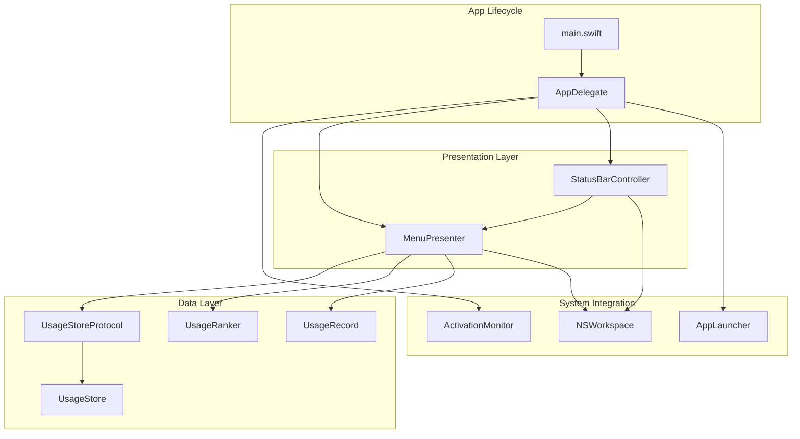
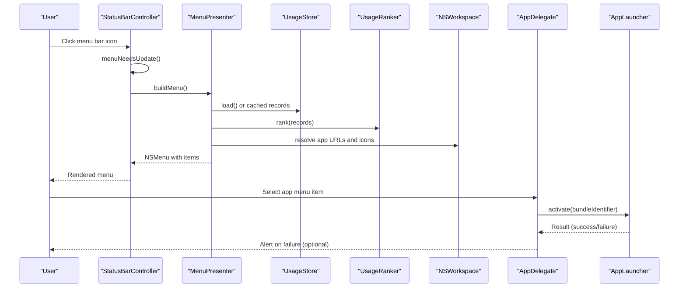
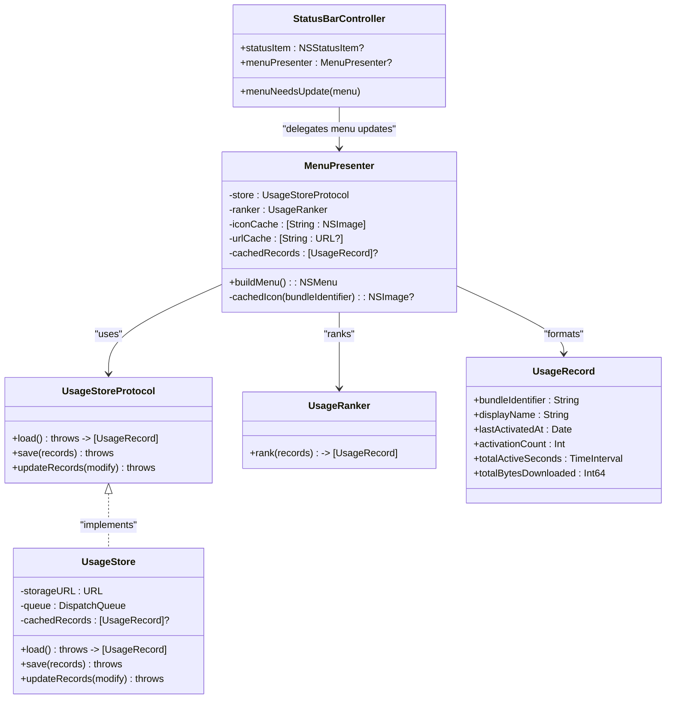

# Presentation Layer

<cite>
**Referenced Files in This Document**
- [main.swift](file://iTip/main.swift)
- [AppDelegate.swift](file://iTip/AppDelegate.swift)
- [StatusBarController.swift](file://iTip/StatusBarController.swift)
- [MenuPresenter.swift](file://iTip/MenuPresenter.swift)
- [UsageStoreProtocol.swift](file://iTip/UsageStoreProtocol.swift)
- [UsageStore.swift](file://iTip/UsageStore.swift)
- [UsageRanker.swift](file://iTip/UsageRanker.swift)
- [UsageRecord.swift](file://iTip/UsageRecord.swift)
- [AppLauncher.swift](file://iTip/AppLauncher.swift)
- [ActivationMonitor.swift](file://iTip/ActivationMonitor.swift)
- [StatusBarControllerTests.swift](file://iTipTests/StatusBarControllerTests.swift)
- [MenuPresenterTests.swift](file://iTipTests/MenuPresenterTests.swift)
</cite>

## Table of Contents
1. [Introduction](#introduction)
2. [Project Structure](#project-structure)
3. [Core Components](#core-components)
4. [Architecture Overview](#architecture-overview)
5. [Detailed Component Analysis](#detailed-component-analysis)
6. [Dependency Analysis](#dependency-analysis)
7. [Performance Considerations](#performance-considerations)
8. [Troubleshooting Guide](#troubleshooting-guide)
9. [Conclusion](#conclusion)

## Introduction
This document explains the presentation layer of iTip, focusing on the macOS menu bar integration and user interface display. It covers how the StatusBarController integrates with the macOS menu bar system, how the MenuPresenter constructs dynamic menus, ranks applications, and formats display content. It also documents the menu item creation process, icon caching, real-time updates, integration with NSWorkspace for application discovery, styling, localization considerations, accessibility compliance, error handling, and performance optimizations.

## Project Structure
The presentation layer is centered around two primary components:
- StatusBarController: Manages the NSStatusItem, sets the menu bar icon, and delegates menu updates.
- MenuPresenter: Builds the dynamic menu, ranks usage records, resolves app metadata, caches icons and URLs, and formats display text.

These components coordinate with the application lifecycle and data sources:
- AppDelegate initializes monitors, creates the MenuPresenter, and wires up menu item actions.
- UsageStore and UsageStoreProtocol provide persistence and change notifications.
- UsageRanker sorts usage records for display.
- AppLauncher handles launching or activating applications.
- ActivationMonitor tracks foreground app activations and updates usage records.

**Diagram sources**
- [main.swift:1-8](file://iTip/main.swift#L1-L8)
- [AppDelegate.swift:1-81](file://iTip/AppDelegate.swift#L1-L81)
- [StatusBarController.swift:1-68](file://iTip/StatusBarController.swift#L1-L68)
- [MenuPresenter.swift:1-253](file://iTip/MenuPresenter.swift#L1-L253)
- [UsageStoreProtocol.swift:1-14](file://iTip/UsageStoreProtocol.swift#L1-L14)
- [UsageStore.swift:1-107](file://iTip/UsageStore.swift#L1-L107)
- [UsageRanker.swift:1-15](file://iTip/UsageRanker.swift#L1-L15)
- [UsageRecord.swift:1-33](file://iTip/UsageRecord.swift#L1-L33)
- [AppLauncher.swift:1-40](file://iTip/AppLauncher.swift#L1-L40)
- [ActivationMonitor.swift:1-157](file://iTip/ActivationMonitor.swift#L1-L157)

**Section sources**
- [main.swift:1-8](file://iTip/main.swift#L1-L8)
- [AppDelegate.swift:1-81](file://iTip/AppDelegate.swift#L1-L81)
- [StatusBarController.swift:1-68](file://iTip/StatusBarController.swift#L1-L68)
- [MenuPresenter.swift:1-253](file://iTip/MenuPresenter.swift#L1-L253)
- [UsageStoreProtocol.swift:1-14](file://iTip/UsageStoreProtocol.swift#L1-L14)
- [UsageStore.swift:1-107](file://iTip/UsageStore.swift#L1-L107)
- [UsageRanker.swift:1-15](file://iTip/UsageRanker.swift#L1-L15)
- [UsageRecord.swift:1-33](file://iTip/UsageRecord.swift#L1-L33)
- [AppLauncher.swift:1-40](file://iTip/AppLauncher.swift#L1-L40)
- [ActivationMonitor.swift:1-157](file://iTip/ActivationMonitor.swift#L1-L157)

## Core Components
- StatusBarController
  - Creates and manages an NSStatusItem with a template icon and fallback title.
  - Delegates menu updates via NSMenuDelegate and rebuilds menu items on demand.
  - Supports injection for title assignment and cleanup hooks.
- MenuPresenter
  - Builds the menu dynamically on each open, including a header row, ranked app entries, separators, and a Quit item.
  - Ranks records using UsageRanker and filters out apps whose bundle identifiers cannot be resolved via NSWorkspace.
  - Caches app icons and URL resolutions to minimize repeated disk and system lookups.
  - Formats display text with monospaced digits and localized relative time.
  - Observes store updates to invalidate caches and trigger UI refresh.
  - Exposes closures and targets for menu item actions and monitoring availability.

**Section sources**
- [StatusBarController.swift:3-68](file://iTip/StatusBarController.swift#L3-L68)
- [MenuPresenter.swift:3-253](file://iTip/MenuPresenter.swift#L3-L253)
- [UsageRanker.swift:3-14](file://iTip/UsageRanker.swift#L3-L14)
- [UsageStoreProtocol.swift:3-14](file://iTip/UsageStoreProtocol.swift#L3-L14)

## Architecture Overview
The presentation layer follows a clean separation of concerns:
- AppDelegate orchestrates initialization, wiring monitors, and setting up the MenuPresenter and StatusBarController.
- StatusBarController owns the NSStatusItem and forwards menu update requests to MenuPresenter.
- MenuPresenter encapsulates menu construction, ranking, formatting, and caching, interacting with NSWorkspace for app metadata and with the store for usage data.
- AppLauncher handles launching or activating applications when users select menu items.
- ActivationMonitor continuously updates usage records and persists them, triggering UI refresh through store notifications.

**Diagram sources**
- [StatusBarController.swift:55-66](file://iTip/StatusBarController.swift#L55-L66)
- [MenuPresenter.swift:68-147](file://iTip/MenuPresenter.swift#L68-L147)
- [UsageStore.swift:24-67](file://iTip/UsageStore.swift#L24-L67)
- [UsageRanker.swift:4-13](file://iTip/UsageRanker.swift#L4-L13)
- [AppLauncher.swift:11-38](file://iTip/AppLauncher.swift#L11-L38)
- [AppDelegate.swift:43-54](file://iTip/AppDelegate.swift#L43-L54)

## Detailed Component Analysis

### StatusBarController
Responsibilities:
- Initialize NSStatusItem with a template SF Symbol icon and fallback title.
- Assign a menu built by MenuPresenter and set itself as the menu’s delegate.
- On menuNeedsUpdate, rebuild the menu and replace items efficiently to keep the UI responsive.

Key behaviors:
- Uses NSMenuDelegate to intercept menu update events and rebuild the menu dynamically.
- Applies template rendering for the icon to respect system appearance.
- Supports a constructor variant for testing and external control of title and removal.

Accessibility and styling:
- Uses a system symbol with an accessibility description for the icon.
- Title fallback ensures visibility when system symbols are unavailable.

Real-time updates:
- Delegates menu rebuild to MenuPresenter on each menu open.

**Section sources**
- [StatusBarController.swift:3-68](file://iTip/StatusBarController.swift#L3-L68)

### MenuPresenter
Responsibilities:
- Construct the menu on each open, including a header row, ranked app entries, separators, and a Quit item.
- Rank usage records and filter out apps that cannot be resolved via NSWorkspace.
- Cache app icons and URL resolutions to reduce repeated system calls.
- Format display text with monospaced digits and localized relative time.
- Observe store updates to invalidate caches and trigger UI refresh.

Dynamic menu construction:
- Checks monitoring availability and displays a warning when monitoring is inactive.
- Loads records from the store or cached copy, ranks them, and filters out unresolved bundle identifiers.
- Removes invalid entries from the cache and asynchronously persists the cleaned dataset.
- Builds a header row with aligned columns and adds app entries with attributed titles and icons.

Formatting and styling:
- Uses a shared paragraph style with tab stops for consistent column alignment.
- Applies monospaced digit fonts for statistics and menu fonts for names.
- Uses secondary/tertiary label colors for a subtle, system-consistent appearance.

Localization and accessibility:
- Relies on RelativeDateTimeFormatter for abbreviated relative time strings.
- Uses NSWorkspace-provided app names and icons, which are localized by the system.

Icon caching:
- Maintains a dictionary mapping bundle identifiers to NSImage instances.
- Resolves app URLs lazily and caches them separately to avoid redundant lookups.

Integration with NSWorkspace:
- Resolves app URLs via bundle identifiers and retrieves icons for display.
- Filters out entries whose bundle identifiers cannot be resolved.

Relationship with data sources:
- Depends on UsageStoreProtocol for loading and saving usage records.
- Uses UsageRanker to sort records by recency and frequency.
- Observes storeDidUpdate notifications to invalidate caches.

Error handling:
- Gracefully handles store load failures and continues with empty records.
- Removes invalid entries and persists the cleaned dataset asynchronously.

**Section sources**
- [MenuPresenter.swift:3-253](file://iTip/MenuPresenter.swift#L3-L253)
- [UsageStoreProtocol.swift:3-14](file://iTip/UsageStoreProtocol.swift#L3-L14)
- [UsageStore.swift:24-105](file://iTip/UsageStore.swift#L24-L105)
- [UsageRanker.swift:3-14](file://iTip/UsageRanker.swift#L3-L14)

### Application Launch Integration
When users select an app menu item:
- AppDelegate receives the action and extracts the bundle identifier from the menu item.
- AppLauncher attempts to activate an already-running app; if not running, resolves the app URL and launches it.
- On failure, AppDelegate presents a non-blocking alert with actionable feedback.

Error handling:
- Distinguishes between “application not found” and “launch failed” scenarios.
- Presents alerts attached to the key window when possible to avoid interrupting the user.

**Section sources**
- [AppDelegate.swift:43-80](file://iTip/AppDelegate.swift#L43-L80)
- [AppLauncher.swift:3-40](file://iTip/AppLauncher.swift#L3-L40)

### Data Source Integration
- UsageStoreProtocol defines load/save/update semantics and posts a usageStoreDidUpdate notification upon persistence.
- UsageStore implements thread-safe load/save/update with an internal queue and maintains an in-memory cache.
- ActivationMonitor populates UsageRecord fields incrementally and periodically flushes changes to disk, merging with network-tracker data.

**Section sources**
- [UsageStoreProtocol.swift:3-14](file://iTip/UsageStoreProtocol.swift#L3-L14)
- [UsageStore.swift:4-107](file://iTip/UsageStore.swift#L4-L107)
- [ActivationMonitor.swift:38-157](file://iTip/ActivationMonitor.swift#L38-L157)

### Testing Patterns
- StatusBarControllerTests verifies default title assignment and cleanup behavior.
- MenuPresenterTests validates menu construction under empty store, ranked ordering, and filtering of unresolvable bundle identifiers, plus traffic formatting.

**Section sources**
- [StatusBarControllerTests.swift:1-42](file://iTipTests/StatusBarControllerTests.swift#L1-L42)
- [MenuPresenterTests.swift:1-91](file://iTipTests/MenuPresenterTests.swift#L1-L91)

## Dependency Analysis
The presentation layer exhibits low coupling and high cohesion:
- StatusBarController depends on MenuPresenter and NSWorkspace for icon/title setup.
- MenuPresenter depends on UsageStoreProtocol, UsageRanker, and NSWorkspace, with internal caching and store observation.
- AppDelegate coordinates initialization and action routing.

**Diagram sources**
- [StatusBarController.swift:3-68](file://iTip/StatusBarController.swift#L3-L68)
- [MenuPresenter.swift:3-253](file://iTip/MenuPresenter.swift#L3-L253)
- [UsageStoreProtocol.swift:3-14](file://iTip/UsageStoreProtocol.swift#L3-L14)
- [UsageStore.swift:4-107](file://iTip/UsageStore.swift#L4-L107)
- [UsageRanker.swift:3-14](file://iTip/UsageRanker.swift#L3-L14)
- [UsageRecord.swift:3-33](file://iTip/UsageRecord.swift#L3-L33)

**Section sources**
- [StatusBarController.swift:3-68](file://iTip/StatusBarController.swift#L3-L68)
- [MenuPresenter.swift:3-253](file://iTip/MenuPresenter.swift#L3-L253)
- [UsageStoreProtocol.swift:3-14](file://iTip/UsageStoreProtocol.swift#L3-L14)
- [UsageStore.swift:4-107](file://iTip/UsageStore.swift#L4-L107)
- [UsageRanker.swift:3-14](file://iTip/UsageRanker.swift#L3-L14)
- [UsageRecord.swift:3-33](file://iTip/UsageRecord.swift#L3-L33)

## Performance Considerations
- Caching
  - MenuPresenter caches app icons and URL resolutions to avoid repeated disk and system lookups.
  - MenuPresenter caches usage records to prevent repeated store reads during a single menu session.
  - UsageStore maintains an in-memory cache and posts notifications to invalidate caches on updates.
- Efficient menu rebuild
  - StatusBarController replaces menu items by moving items from a freshly built menu into the existing menu, minimizing churn.
- Asynchronous operations
  - Cleaning invalid entries and persisting updates occur on a global utility queue to avoid blocking the UI.
- Debounced persistence
  - ActivationMonitor debounces disk writes with a timer to batch updates and reduce I/O overhead.
- UI responsiveness
  - Store operations are serialized on a dedicated queue to prevent contention and ensure thread safety.

**Section sources**
- [MenuPresenter.swift:30-66](file://iTip/MenuPresenter.swift#L30-L66)
- [MenuPresenter.swift:78-114](file://iTip/MenuPresenter.swift#L78-L114)
- [UsageStore.swift:7-105](file://iTip/UsageStore.swift#L7-L105)
- [ActivationMonitor.swift:52-56](file://iTip/ActivationMonitor.swift#L52-L56)
- [ActivationMonitor.swift:116-142](file://iTip/ActivationMonitor.swift#L116-L142)
- [StatusBarController.swift:55-66](file://iTip/StatusBarController.swift#L55-L66)

## Troubleshooting Guide
Common issues and remedies:
- Menu does not update
  - Ensure menuNeedsUpdate is firing and MenuPresenter is rebuilding the menu.
  - Confirm storeDidUpdate notifications are posted and caches are invalidated.
- Missing app icons or entries
  - Verify bundle identifiers resolve via NSWorkspace; MenuPresenter filters out unresolvable entries.
  - Check that icons are cached and sized appropriately.
- Launch failures
  - Use the error alert presented by AppDelegate to diagnose “application not found” versus “launch failed.”
- Accessibility and localization
  - Icons use system symbols with accessibility descriptions.
  - Relative time formatting uses system-localized abbreviations.

Validation via tests:
- StatusBarControllerTests confirms default title and cleanup behavior.
- MenuPresenterTests validates menu construction under empty store, ranked ordering, filtering of unresolvable entries, and traffic formatting.

**Section sources**
- [MenuPresenter.swift:78-114](file://iTip/MenuPresenter.swift#L78-L114)
- [AppDelegate.swift:58-80](file://iTip/AppDelegate.swift#L58-L80)
- [StatusBarControllerTests.swift:1-42](file://iTipTests/StatusBarControllerTests.swift#L1-L42)
- [MenuPresenterTests.swift:1-91](file://iTipTests/MenuPresenterTests.swift#L1-L91)

## Conclusion
The presentation layer integrates tightly with the macOS menu bar and system services to deliver a responsive, styled, and accessible menu. StatusBarController and MenuPresenter collaborate to provide dynamic, real-time updates driven by the store and monitors. Robust caching, efficient rebuild strategies, and careful error handling ensure smooth user experience. The design cleanly separates concerns and enables testability, making it straightforward to extend and maintain.