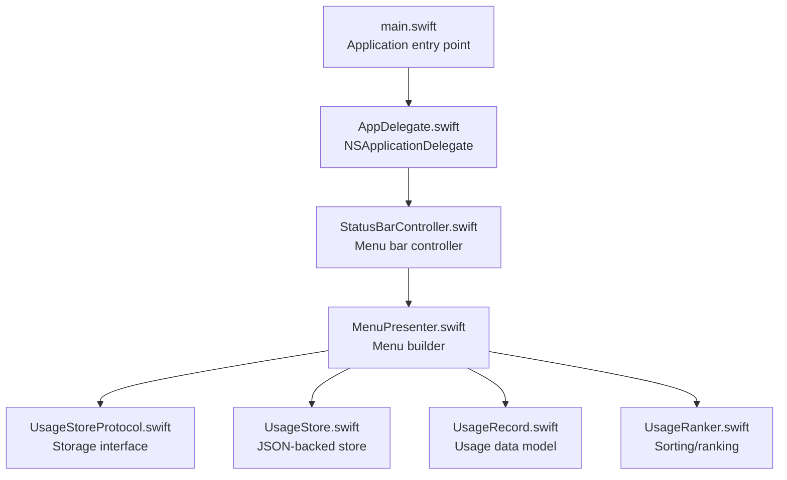
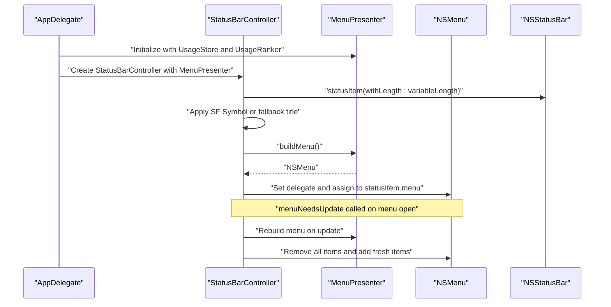
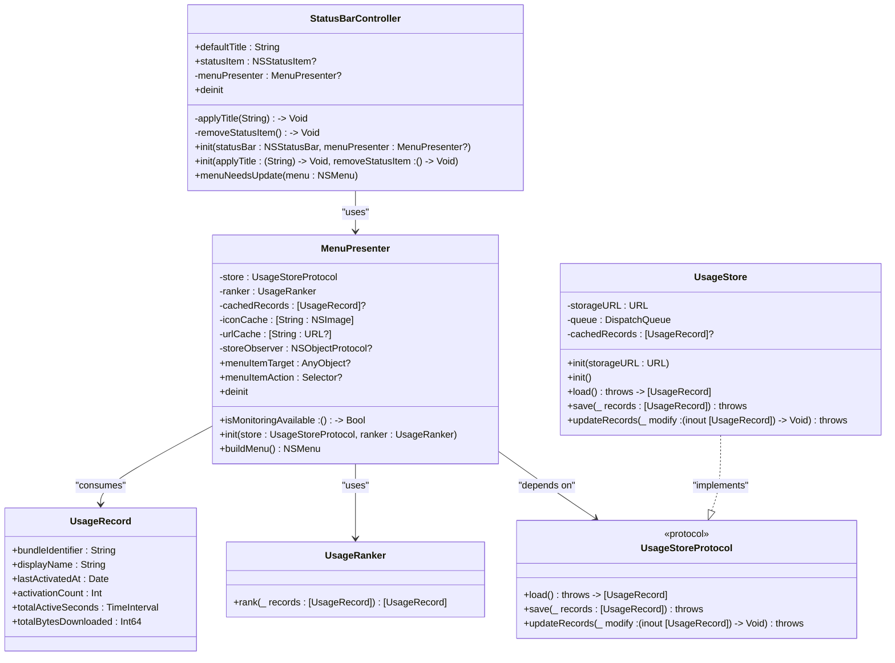
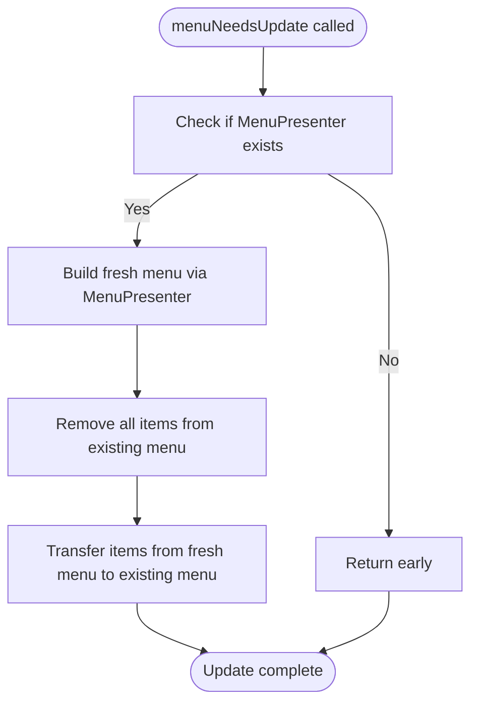
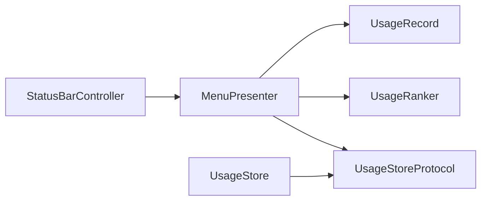

# StatusBarController

<cite>
**Referenced Files in This Document**
- [StatusBarController.swift](file://iTip/StatusBarController.swift)
- [MenuPresenter.swift](file://iTip/MenuPresenter.swift)
- [AppDelegate.swift](file://iTip/AppDelegate.swift)
- [main.swift](file://iTip/main.swift)
- [UsageStoreProtocol.swift](file://iTip/UsageStoreProtocol.swift)
- [UsageStore.swift](file://iTip/UsageStore.swift)
- [UsageRanker.swift](file://iTip/UsageRanker.swift)
- [UsageRecord.swift](file://iTip/UsageRecord.swift)
- [StatusBarControllerTests.swift](file://iTipTests/StatusBarControllerTests.swift)
</cite>

## Table of Contents
1. [Introduction](#introduction)
2. [Project Structure](#project-structure)
3. [Core Components](#core-components)
4. [Architecture Overview](#architecture-overview)
5. [Detailed Component Analysis](#detailed-component-analysis)
6. [Dependency Analysis](#dependency-analysis)
7. [Performance Considerations](#performance-considerations)
8. [Troubleshooting Guide](#troubleshooting-guide)
9. [Conclusion](#conclusion)

## Introduction
This document provides a comprehensive analysis of the StatusBarController component responsible for macOS menu bar integration. It covers NSStatusItem initialization, SF Symbol integration for the menu bar icon, template image handling, dual initialization patterns for production and testing, NSMenuDelegate implementation for dynamic menu refresh, lifecycle management and memory cleanup, and the relationship with MenuPresenter for menu construction. It also documents button configuration, title application, and fallback handling when system symbols are unavailable, along with the integration with NSStatusBar and the delegation pattern for menu updates.

## Project Structure
The StatusBarController is part of a macOS menu bar application built with AppKit. The component integrates with MenuPresenter to construct menus dynamically, and it relies on UsageStoreProtocol and related usage data structures to populate menu items. The application entry point sets up the NSApplication delegate chain, which initializes the StatusBarController and MenuPresenter.

**Diagram sources**
- [main.swift:1-8](file://iTip/main.swift#L1-L8)
- [AppDelegate.swift:1-81](file://iTip/AppDelegate.swift#L1-L81)
- [StatusBarController.swift:1-68](file://iTip/StatusBarController.swift#L1-L68)
- [MenuPresenter.swift:1-253](file://iTip/MenuPresenter.swift#L1-L253)
- [UsageStoreProtocol.swift:1-14](file://iTip/UsageStoreProtocol.swift#L1-L14)
- [UsageStore.swift:1-107](file://iTip/UsageStore.swift#L1-L107)
- [UsageRecord.swift:1-33](file://iTip/UsageRecord.swift#L1-L33)
- [UsageRanker.swift:1-15](file://iTip/UsageRanker.swift#L1-L15)

**Section sources**
- [main.swift:1-8](file://iTip/main.swift#L1-L8)
- [AppDelegate.swift:1-81](file://iTip/AppDelegate.swift#L1-L81)
- [StatusBarController.swift:1-68](file://iTip/StatusBarController.swift#L1-L68)
- [MenuPresenter.swift:1-253](file://iTip/MenuPresenter.swift#L1-L253)
- [UsageStoreProtocol.swift:1-14](file://iTip/UsageStoreProtocol.swift#L1-L14)
- [UsageStore.swift:1-107](file://iTip/UsageStore.swift#L1-L107)
- [UsageRecord.swift:1-33](file://iTip/UsageRecord.swift#L1-L33)
- [UsageRanker.swift:1-15](file://iTip/UsageRanker.swift#L1-L15)

## Core Components
- StatusBarController: Manages the NSStatusItem, applies SF Symbol or fallback title, binds a menu via MenuPresenter, and implements NSMenuDelegate to refresh the menu dynamically.
- MenuPresenter: Builds the NSMenu with usage data, caches icons and URLs, and handles dynamic updates through notifications.
- UsageStoreProtocol and UsageStore: Provide asynchronous, thread-safe persistence of usage records with caching and change notifications.
- UsageRanker: Ranks usage records for display order.
- UsageRecord: Defines the shape of stored usage data.
- AppDelegate: Wires up the application lifecycle, creates MenuPresenter, and initializes StatusBarController.

**Section sources**
- [StatusBarController.swift:1-68](file://iTip/StatusBarController.swift#L1-L68)
- [MenuPresenter.swift:1-253](file://iTip/MenuPresenter.swift#L1-L253)
- [UsageStoreProtocol.swift:1-14](file://iTip/UsageStoreProtocol.swift#L1-L14)
- [UsageStore.swift:1-107](file://iTip/UsageStore.swift#L1-L107)
- [UsageRanker.swift:1-15](file://iTip/UsageRanker.swift#L1-L15)
- [UsageRecord.swift:1-33](file://iTip/UsageRecord.swift#L1-L33)
- [AppDelegate.swift:1-81](file://iTip/AppDelegate.swift#L1-L81)

## Architecture Overview
The StatusBarController integrates with NSStatusBar to create a status item with either an SF Symbol icon or a fallback title. It delegates menu construction to MenuPresenter, which builds a dynamic menu from usage data. The NSMenuDelegate method menuNeedsUpdate ensures the menu reflects the latest state by rebuilding and swapping items.

**Diagram sources**
- [AppDelegate.swift:19-26](file://iTip/AppDelegate.swift#L19-L26)
- [StatusBarController.swift:12-36](file://iTip/StatusBarController.swift#L12-L36)
- [MenuPresenter.swift:68-147](file://iTip/MenuPresenter.swift#L68-L147)
- [StatusBarController.swift:55-66](file://iTip/StatusBarController.swift#L55-L66)

## Detailed Component Analysis

### NSStatusItem Initialization and Icon Handling
- Production initialization: Creates a status item using NSStatusBar.system, assigns a template SF Symbol image, and clears the title. If the system symbol is unavailable, falls back to applying the default title.
- Testing initialization: Accepts closures to apply the title and remove the status item, enabling controlled testing without interacting with NSStatusBar.

Key behaviors:
- Template image handling: The SF Symbol is marked as a template to integrate with the system menu bar appearance.
- Fallback handling: When NSImage(systemSymbolName:) fails, the default title is applied via the captured closure.

**Section sources**
- [StatusBarController.swift:12-36](file://iTip/StatusBarController.swift#L12-L36)
- [StatusBarController.swift:38-47](file://iTip/StatusBarController.swift#L38-L47)

### Dual Initialization Pattern
- Production initializer: Injects NSStatusBar and MenuPresenter, constructs the menu, and sets the NSMenuDelegate.
- Test initializer: Accepts applyTitle and removeStatusItem closures, bypassing NSStatusBar and NSMenu creation, allowing tests to spy on title assignment and removal.

Benefits:
- Enables unit testing of title application and lifecycle cleanup without launching the app.
- Keeps production code decoupled from the global NSStatusBar instance.

**Section sources**
- [StatusBarController.swift:12-36](file://iTip/StatusBarController.swift#L12-L36)
- [StatusBarController.swift:38-47](file://iTip/StatusBarController.swift#L38-L47)
- [StatusBarControllerTests.swift:6-24](file://iTipTests/StatusBarControllerTests.swift#L6-L24)

### NSMenuDelegate Implementation and Dynamic Menu Refresh
- The StatusBarController conforms to NSMenuDelegate and implements menuNeedsUpdate to rebuild the menu on demand.
- On update, it requests a fresh menu from MenuPresenter, removes all existing items, and transfers items from the fresh menu to the existing menu.

Behavioral notes:
- Ensures the menu reflects the latest usage data and UI state.
- Avoids retaining stale items and maintains a clean update cycle.

**Section sources**
- [StatusBarController.swift:3](file://iTip/StatusBarController.swift#L3)
- [StatusBarController.swift:55-66](file://iTip/StatusBarController.swift#L55-L66)
- [MenuPresenter.swift:68-147](file://iTip/MenuPresenter.swift#L68-L147)

### Status Item Lifecycle Management and Memory Cleanup
- Deinitialization invokes the removeStatusItem closure, ensuring the status item is removed from NSStatusBar when the controller is deallocated.
- MenuPresenter manages its own observer cleanup in deinit, removing the usage store update notification observer.

**Section sources**
- [StatusBarController.swift:49-51](file://iTip/StatusBarController.swift#L49-L51)
- [MenuPresenter.swift:62-66](file://iTip/MenuPresenter.swift#L62-L66)

### Relationship with MenuPresenter for Menu Construction
- StatusBarController passes a MenuPresenter instance to configure the status item’s menu.
- MenuPresenter builds the menu using usage data from UsageStoreProtocol, ranks entries with UsageRanker, and caches icons and URLs to optimize performance.
- MenuPresenter posts a usageStoreDidUpdate notification when records are saved, enabling observers (including MenuPresenter) to invalidate caches.

**Section sources**
- [StatusBarController.swift:10](file://iTip/StatusBarController.swift#L10)
- [StatusBarController.swift:31-35](file://iTip/StatusBarController.swift#L31-L35)
- [MenuPresenter.swift:48-60](file://iTip/MenuPresenter.swift#L48-L60)
- [MenuPresenter.swift:68-147](file://iTip/MenuPresenter.swift#L68-L147)
- [UsageStoreProtocol.swift:10-13](file://iTip/UsageStoreProtocol.swift#L10-L13)

### Button Configuration, Title Application, and Fallback Handling
- Button configuration: The controller sets the status item’s button image to a template SF Symbol and clears the title when successful.
- Title application: Uses a captured closure to set the default title in both production and test modes.
- Fallback handling: When NSImage(systemSymbolName:) returns nil, the controller applies the default title instead of leaving the button empty.

**Section sources**
- [StatusBarController.swift:17](file://iTip/StatusBarController.swift#L17)
- [StatusBarController.swift:23-29](file://iTip/StatusBarController.swift#L23-L29)
- [StatusBarController.swift:46](file://iTip/StatusBarController.swift#L46)

### Integration with NSStatusBar and Delegation Pattern
- NSStatusBar integration: The controller obtains a status item from NSStatusBar.system and assigns it to the status item.
- Delegation pattern: The controller sets itself as the NSMenuDelegate so that menuNeedsUpdate is invoked when the menu opens, enabling dynamic refresh.

**Section sources**
- [StatusBarController.swift:13](file://iTip/StatusBarController.swift#L13)
- [StatusBarController.swift:33](file://iTip/StatusBarController.swift#L33)
- [StatusBarController.swift:55-66](file://iTip/StatusBarController.swift#L55-L66)

### Class Relationships

**Diagram sources**
- [StatusBarController.swift:3-68](file://iTip/StatusBarController.swift#L3-L68)
- [MenuPresenter.swift:3-253](file://iTip/MenuPresenter.swift#L3-L253)
- [UsageStoreProtocol.swift:3-8](file://iTip/UsageStoreProtocol.swift#L3-L8)
- [UsageStore.swift:4-107](file://iTip/UsageStore.swift#L4-L107)
- [UsageRanker.swift:3-14](file://iTip/UsageRanker.swift#L3-L14)
- [UsageRecord.swift:3-32](file://iTip/UsageRecord.swift#L3-L32)

### Dynamic Menu Refresh Flow

**Diagram sources**
- [StatusBarController.swift:55-66](file://iTip/StatusBarController.swift#L55-L66)
- [MenuPresenter.swift:68-147](file://iTip/MenuPresenter.swift#L68-L147)

## Dependency Analysis
- StatusBarController depends on NSStatusBar for status item creation and NSMenuDelegate for dynamic updates.
- StatusBarController composes MenuPresenter to construct the menu and delegates menu building to it.
- MenuPresenter depends on UsageStoreProtocol for data access, UsageRanker for sorting, and caches icons and URLs to minimize IO and system calls.
- UsageStore implements UsageStoreProtocol and posts notifications on updates, enabling MenuPresenter to invalidate caches.

**Diagram sources**
- [StatusBarController.swift:6-10](file://iTip/StatusBarController.swift#L6-L10)
- [MenuPresenter.swift:3-60](file://iTip/MenuPresenter.swift#L3-L60)
- [UsageStoreProtocol.swift:3-8](file://iTip/UsageStoreProtocol.swift#L3-L8)
- [UsageStore.swift:4-107](file://iTip/UsageStore.swift#L4-L107)
- [UsageRanker.swift:3-14](file://iTip/UsageRanker.swift#L3-L14)
- [UsageRecord.swift:3-32](file://iTip/UsageRecord.swift#L3-L32)

**Section sources**
- [StatusBarController.swift:6-10](file://iTip/StatusBarController.swift#L6-L10)
- [MenuPresenter.swift:3-60](file://iTip/MenuPresenter.swift#L3-L60)
- [UsageStoreProtocol.swift:3-8](file://iTip/UsageStoreProtocol.swift#L3-L8)
- [UsageStore.swift:4-107](file://iTip/UsageStore.swift#L4-L107)
- [UsageRanker.swift:3-14](file://iTip/UsageRanker.swift#L3-L14)
- [UsageRecord.swift:3-32](file://iTip/UsageRecord.swift#L3-L32)

## Performance Considerations
- Caching: MenuPresenter caches icons and URLs to avoid repeated disk and system lookups, reducing menu build time.
- Asynchronous saving: UsageStore writes to disk asynchronously and posts notifications, keeping UI responsive.
- Template images: Using template SF Symbols ensures efficient rendering and system theme compliance.
- Minimal allocations: The dynamic refresh replaces items rather than recreating the entire menu structure, minimizing overhead.

[No sources needed since this section provides general guidance]

## Troubleshooting Guide
Common issues and resolutions:
- SF Symbol not available: If NSImage(systemSymbolName:) returns nil, the controller falls back to applying the default title. Verify the symbol name and availability on the target macOS version.
- Menu not updating: Ensure the controller is set as the NSMenuDelegate and that MenuPresenter is provided. Confirm that menuNeedsUpdate is being invoked and that the menu is rebuilt on each update.
- Status item not removed: Verify that the removeStatusItem closure is called during deinit. In tests, confirm that the removal spy was invoked.
- Permissions: If monitoring is unavailable, MenuPresenter adds a warning item. Check system permissions and ensure the app has necessary entitlements.

**Section sources**
- [StatusBarController.swift:23-29](file://iTip/StatusBarController.swift#L23-L29)
- [StatusBarController.swift:55-66](file://iTip/StatusBarController.swift#L55-L66)
- [StatusBarControllerTests.swift:14-24](file://iTipTests/StatusBarControllerTests.swift#L14-L24)
- [MenuPresenter.swift:71-76](file://iTip/MenuPresenter.swift#L71-L76)

## Conclusion
The StatusBarController provides a robust, testable integration with the macOS menu bar. It supports both production and testing scenarios, applies SF Symbols with graceful fallbacks, and delegates menu construction to MenuPresenter. Its NSMenuDelegate implementation ensures dynamic updates, and lifecycle management guarantees proper cleanup. Together with MenuPresenter and the usage data stack, it delivers a responsive and maintainable menu bar experience.