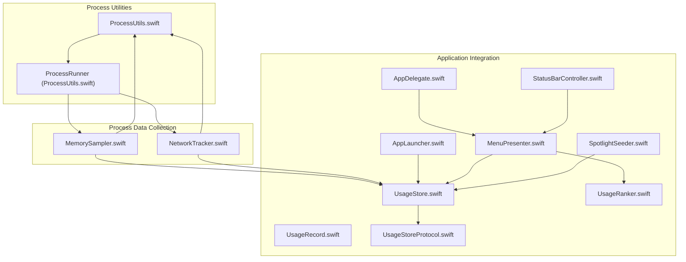
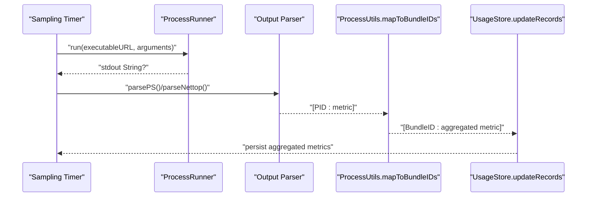
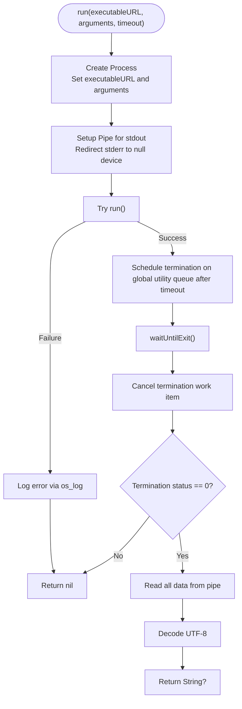
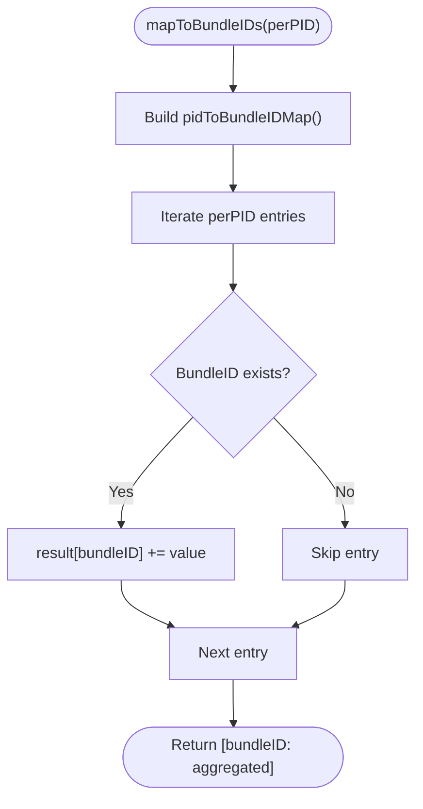
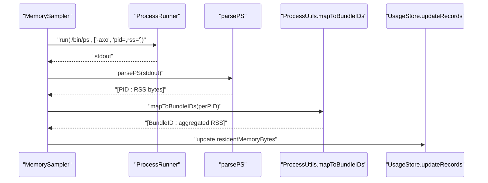
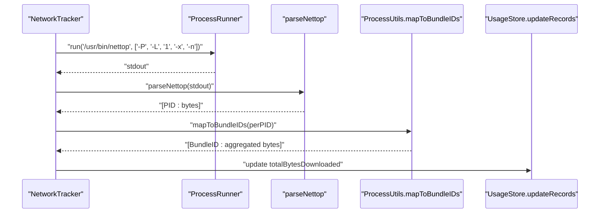
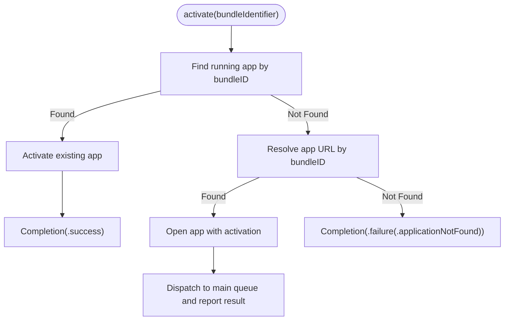
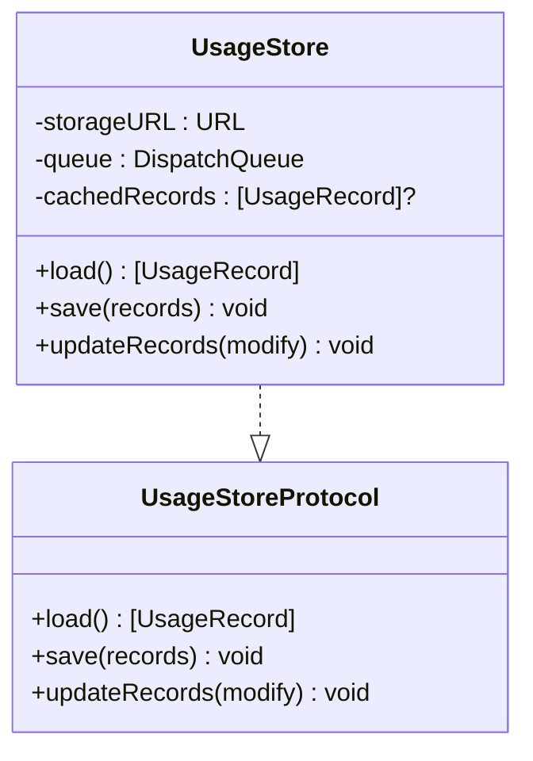
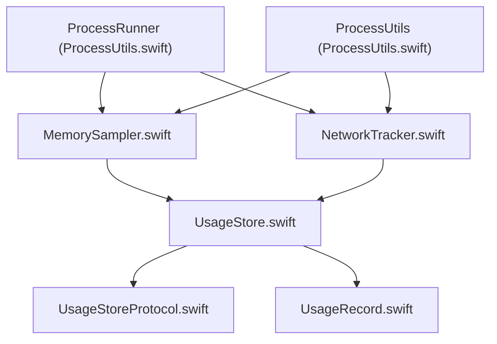

# Process Utilities Component

<cite>
**Referenced Files in This Document**
- [ProcessUtils.swift](file://iTip/ProcessUtils.swift)
- [MemorySampler.swift](file://iTip/MemorySampler.swift)
- [NetworkTracker.swift](file://iTip/NetworkTracker.swift)
- [AppLauncher.swift](file://iTip/AppLauncher.swift)
- [AppDelegate.swift](file://iTip/AppDelegate.swift)
- [main.swift](file://iTip/main.swift)
- [UsageStore.swift](file://iTip/UsageStore.swift)
- [UsageStoreProtocol.swift](file://iTip/UsageStoreProtocol.swift)
- [UsageRecord.swift](file://iTip/UsageRecord.swift)
- [UsageRanker.swift](file://iTip/UsageRanker.swift)
- [MenuPresenter.swift](file://iTip/MenuPresenter.swift)
- [StatusBarController.swift](file://iTip/StatusBarController.swift)
- [SpotlightSeeder.swift](file://iTip/SpotlightSeeder.swift)
- [IntegrationTests.swift](file://iTipTests/IntegrationTests.swift)
</cite>

## Table of Contents
1. [Introduction](#introduction)
2. [Project Structure](#project-structure)
3. [Core Components](#core-components)
4. [Architecture Overview](#architecture-overview)
5. [Detailed Component Analysis](#detailed-component-analysis)
6. [Dependency Analysis](#dependency-analysis)
7. [Performance Considerations](#performance-considerations)
8. [Troubleshooting Guide](#troubleshooting-guide)
9. [Conclusion](#conclusion)

## Introduction
This document describes the Process Utilities Component within the iTip macOS menu bar application. The component focuses on process-level data collection and manipulation, specifically enabling memory and network usage tracking, process-to-application mapping, and robust subprocess execution with timeouts. It integrates with the broader application lifecycle to provide actionable insights about user application usage patterns.

## Project Structure
The Process Utilities Component is primarily implemented in dedicated Swift modules that encapsulate process execution, data aggregation, and integration points with the application's core services.

**Diagram sources**
- [ProcessUtils.swift:1-79](file://iTip/ProcessUtils.swift#L1-L79)
- [MemorySampler.swift:1-82](file://iTip/MemorySampler.swift#L1-L82)
- [NetworkTracker.swift:1-106](file://iTip/NetworkTracker.swift#L1-L106)
- [AppLauncher.swift:1-40](file://iTip/AppLauncher.swift#L1-L40)
- [AppDelegate.swift:1-86](file://iTip/AppDelegate.swift#L1-L86)
- [StatusBarController.swift:1-68](file://iTip/StatusBarController.swift#L1-L68)
- [MenuPresenter.swift:1-283](file://iTip/MenuPresenter.swift#L1-L283)
- [UsageStore.swift:1-117](file://iTip/UsageStore.swift#L1-L117)
- [UsageStoreProtocol.swift:1-14](file://iTip/UsageStoreProtocol.swift#L1-L14)
- [UsageRecord.swift:1-37](file://iTip/UsageRecord.swift#L1-L37)
- [UsageRanker.swift:1-15](file://iTip/UsageRanker.swift#L1-L15)
- [SpotlightSeeder.swift:1-79](file://iTip/SpotlightSeeder.swift#L1-L79)

**Section sources**
- [ProcessUtils.swift:1-79](file://iTip/ProcessUtils.swift#L1-L79)
- [MemorySampler.swift:1-82](file://iTip/MemorySampler.swift#L1-L82)
- [NetworkTracker.swift:1-106](file://iTip/NetworkTracker.swift#L1-L106)
- [AppLauncher.swift:1-40](file://iTip/AppLauncher.swift#L1-L40)
- [AppDelegate.swift:1-86](file://iTip/AppDelegate.swift#L1-L86)
- [main.swift:1-8](file://iTip/main.swift#L1-L8)
- [UsageStore.swift:1-117](file://iTip/UsageStore.swift#L1-L117)
- [UsageStoreProtocol.swift:1-14](file://iTip/UsageStoreProtocol.swift#L1-L14)
- [UsageRecord.swift:1-37](file://iTip/UsageRecord.swift#L1-L37)
- [UsageRanker.swift:1-15](file://iTip/UsageRanker.swift#L1-L15)
- [MenuPresenter.swift:1-283](file://iTip/MenuPresenter.swift#L1-L283)
- [StatusBarController.swift:1-68](file://iTip/StatusBarController.swift#L1-L68)
- [SpotlightSeeder.swift:1-79](file://iTip/SpotlightSeeder.swift#L1-L79)

## Core Components
This section outlines the primary building blocks of the Process Utilities Component and their roles in the system.

- ProcessRunner: Provides safe, timeout-aware subprocess execution with standardized output capture and logging.
- ProcessUtils: Offers utilities for mapping process-level metrics to application bundle identifiers.
- MemorySampler: Periodically samples per-process RSS via the system ps utility and aggregates data by application.
- NetworkTracker: Periodically samples per-process download traffic via the system nettop utility and aggregates data by application.
- AppLauncher: Handles activation and launching of applications using their bundle identifiers.
- UsageStore and UsageStoreProtocol: Persist and manage application usage records atomically.
- UsageRecord: Defines the data model for application usage metrics.
- UsageRanker: Ranks usage records for presentation.
- MenuPresenter: Builds dynamic menus with formatted usage statistics and app launch actions.
- StatusBarController: Manages the menu bar item and delegates menu updates.
- SpotlightSeeder: Seeds the usage store with recent application data from Spotlight on cold start.

**Section sources**
- [ProcessUtils.swift:5-79](file://iTip/ProcessUtils.swift#L5-L79)
- [MemorySampler.swift:5-82](file://iTip/MemorySampler.swift#L5-L82)
- [NetworkTracker.swift:5-106](file://iTip/NetworkTracker.swift#L5-L106)
- [AppLauncher.swift:3-40](file://iTip/AppLauncher.swift#L3-L40)
- [UsageStore.swift:4-117](file://iTip/UsageStore.swift#L4-L117)
- [UsageStoreProtocol.swift:3-14](file://iTip/UsageStoreProtocol.swift#L3-L14)
- [UsageRecord.swift:3-37](file://iTip/UsageRecord.swift#L3-L37)
- [UsageRanker.swift:3-15](file://iTip/UsageRanker.swift#L3-L15)
- [MenuPresenter.swift:3-283](file://iTip/MenuPresenter.swift#L3-L283)
- [StatusBarController.swift:3-68](file://iTip/StatusBarController.swift#L3-L68)
- [SpotlightSeeder.swift:3-79](file://iTip/SpotlightSeeder.swift#L3-L79)

## Architecture Overview
The Process Utilities Component orchestrates process data collection, aggregation, and persistence. Subprocesses are executed safely with timeouts, and their outputs are parsed into per-process metrics. These metrics are aggregated by application bundle identifier and merged into the persistent usage store. The UI layer consumes the store to present ranked application usage in the menu bar.

**Diagram sources**
- [ProcessUtils.swift:17-50](file://iTip/ProcessUtils.swift#L17-L50)
- [MemorySampler.swift:35-80](file://iTip/MemorySampler.swift#L35-L80)
- [NetworkTracker.swift:41-104](file://iTip/NetworkTracker.swift#L41-L104)
- [UsageStore.swift:78-115](file://iTip/UsageStore.swift#L78-L115)

## Detailed Component Analysis

### ProcessRunner: Safe Subprocess Execution
ProcessRunner encapsulates the creation and execution of external processes with a configurable timeout. It captures stdout, ensures the process terminates after the timeout on a background queue, and returns UTF-8 decoded output on success.

Key characteristics:
- Timeout handling: Uses a global utility queue to schedule termination if the process does not exit within the timeout.
- Error handling: Catches launch exceptions and logs them via os_log.
- Output handling: Reads all remaining data from the pipe and decodes it as UTF-8.

**Diagram sources**
- [ProcessUtils.swift:17-49](file://iTip/ProcessUtils.swift#L17-L49)

**Section sources**
- [ProcessUtils.swift:5-50](file://iTip/ProcessUtils.swift#L5-L50)

### ProcessUtils: Process-to-Bundle Mapping
ProcessUtils provides two primary capabilities:
- pidToBundleIDMap(): Builds a mapping from process identifiers to bundle identifiers using the running applications registry.
- mapToBundleIDs(): Aggregates per-process metrics into per-application totals by applying the PID-to-bundle map.

**Diagram sources**
- [ProcessUtils.swift:56-77](file://iTip/ProcessUtils.swift#L56-L77)

**Section sources**
- [ProcessUtils.swift:52-78](file://iTip/ProcessUtils.swift#L52-L78)

### MemorySampler: RSS Sampling and Aggregation
MemorySampler periodically executes the ps utility to collect per-process RSS values, parses the output into a PID-to-RSS map, and aggregates it by bundle identifier. It updates only existing records in the usage store to avoid creating new entries solely for memory data.

Processing pipeline:
- Subprocess execution: Uses ProcessRunner to run ps with appropriate arguments.
- Parsing: Converts KB to bytes and filters non-positive values.
- Aggregation: Applies ProcessUtils.mapToBundleIDs to compute per-application RSS.
- Persistence: Updates residentMemoryBytes for matching records via UsageStore.updateRecords.

**Diagram sources**
- [MemorySampler.swift:35-61](file://iTip/MemorySampler.swift#L35-L61)
- [ProcessUtils.swift:56-77](file://iTip/ProcessUtils.swift#L56-L77)
- [UsageStore.swift:78-115](file://iTip/UsageStore.swift#L78-L115)

**Section sources**
- [MemorySampler.swift:5-82](file://iTip/MemorySampler.swift#L5-L82)
- [ProcessUtils.swift:52-78](file://iTip/ProcessUtils.swift#L52-L78)
- [UsageStore.swift:78-115](file://iTip/UsageStore.swift#L78-L115)

### NetworkTracker: Traffic Sampling and Aggregation
NetworkTracker periodically executes the nettop utility to capture per-process download bytes, parses the CSV output, aggregates by bundle identifier, and persists cumulative downloads to existing records.

Processing pipeline:
- Subprocess execution: Uses ProcessRunner to run nettop with appropriate arguments.
- Parsing: Extracts PID and bytes_in from CSV rows.
- Aggregation: Applies ProcessUtils.mapToBundleIDs to compute per-application traffic.
- Persistence: Updates totalBytesDownloaded for matching records via UsageStore.updateRecords.

**Diagram sources**
- [NetworkTracker.swift:41-81](file://iTip/NetworkTracker.swift#L41-L81)
- [ProcessUtils.swift:56-77](file://iTip/ProcessUtils.swift#L56-L77)
- [UsageStore.swift:78-115](file://iTip/UsageStore.swift#L78-L115)

**Section sources**
- [NetworkTracker.swift:5-106](file://iTip/NetworkTracker.swift#L5-L106)
- [ProcessUtils.swift:52-78](file://iTip/ProcessUtils.swift#L52-L78)
- [UsageStore.swift:78-115](file://iTip/UsageStore.swift#L78-L115)

### AppLauncher: Application Activation and Launch
AppLauncher determines whether an application is already running and either activates it or locates and launches it using the bundle identifier. It reports success or failure via a completion handler.

Key behaviors:
- Running application check: Uses NSRunningApplication to locate existing instances.
- Launch configuration: Opens the application with activation enabled.
- Error reporting: Distinguishes between missing applications and launch failures.

**Diagram sources**
- [AppLauncher.swift:11-38](file://iTip/AppLauncher.swift#L11-L38)

**Section sources**
- [AppLauncher.swift:3-40](file://iTip/AppLauncher.swift#L3-L40)

### UsageStore and UsageStoreProtocol: Atomic Persistence
UsageStore implements UsageStoreProtocol to provide atomic load-modify-save operations for usage records. It manages caching, directory creation, JSON serialization, and post-update notifications.

Key features:
- Concurrency: Serializes operations on a dedicated queue.
- Recovery: Moves corrupted files to a backup extension and resets to empty state.
- Notifications: Posts a usageStoreDidUpdate notification after successful persistence.

**Diagram sources**
- [UsageStoreProtocol.swift:3-8](file://iTip/UsageStoreProtocol.swift#L3-L8)
- [UsageStore.swift:4-117](file://iTip/UsageStore.swift#L4-L117)

**Section sources**
- [UsageStoreProtocol.swift:1-14](file://iTip/UsageStoreProtocol.swift#L1-L14)
- [UsageStore.swift:1-117](file://iTip/UsageStore.swift#L1-L117)

### UsageRecord: Data Model
UsageRecord defines the structure for storing application usage metrics, including bundle identifier, display name, timestamps, counts, and resource usage statistics. It supports backward-compatible decoding with default values for new fields.

**Section sources**
- [UsageRecord.swift:1-37](file://iTip/UsageRecord.swift#L1-L37)

### UsageRanker: Ranking Logic
UsageRanker sorts usage records by last activation time (descending), with activation count as a tiebreaker, and limits the result to the top 10.

**Section sources**
- [UsageRanker.swift:1-15](file://iTip/UsageRanker.swift#L1-L15)

### MenuPresenter: Dynamic Menu Building
MenuPresenter constructs the menu bar menu, caches records and icons for performance, resolves application URLs, and formats usage statistics. It listens for store updates to invalidate caches and refresh the menu.

Formatting highlights:
- Duration formatting: Human-readable time spans.
- Memory formatting: Converts bytes to human-friendly units.
- Download formatting: Converts bytes to human-friendly units.

**Section sources**
- [MenuPresenter.swift:1-283](file://iTip/MenuPresenter.swift#L1-L283)

### StatusBarController: Menu Bar Integration
StatusBarController creates and manages the menu bar item, sets a template icon, and delegates menu updates to MenuPresenter. It swaps menu items dynamically to reflect the latest data.

**Section sources**
- [StatusBarController.swift:1-68](file://iTip/StatusBarController.swift#L1-L68)

### SpotlightSeeder: Cold Start Data Population
SpotlightSeeder queries the Spotlight index for recent application bundles within a time window, converts metadata into UsageRecord entries, and seeds the store if empty.

**Section sources**
- [SpotlightSeeder.swift:1-79](file://iTip/SpotlightSeeder.swift#L1-L79)

## Dependency Analysis
The Process Utilities Component exhibits clear separation of concerns with minimal coupling between modules. ProcessRunner and ProcessUtils are foundational utilities consumed by MemorySampler and NetworkTracker. UsageStore serves as the central persistence layer, while MenuPresenter and StatusBarController provide the UI integration.

**Diagram sources**
- [ProcessUtils.swift:5-79](file://iTip/ProcessUtils.swift#L5-L79)
- [MemorySampler.swift:1-82](file://iTip/MemorySampler.swift#L1-L82)
- [NetworkTracker.swift:1-106](file://iTip/NetworkTracker.swift#L1-L106)
- [UsageStore.swift:1-117](file://iTip/UsageStore.swift#L1-L117)
- [UsageStoreProtocol.swift:1-14](file://iTip/UsageStoreProtocol.swift#L1-L14)
- [UsageRecord.swift:1-37](file://iTip/UsageRecord.swift#L1-L37)

**Section sources**
- [ProcessUtils.swift:1-79](file://iTip/ProcessUtils.swift#L1-L79)
- [MemorySampler.swift:1-82](file://iTip/MemorySampler.swift#L1-L82)
- [NetworkTracker.swift:1-106](file://iTip/NetworkTracker.swift#L1-L106)
- [UsageStore.swift:1-117](file://iTip/UsageStore.swift#L1-L117)
- [UsageStoreProtocol.swift:1-14](file://iTip/UsageStoreProtocol.swift#L1-L14)
- [UsageRecord.swift:1-37](file://iTip/UsageRecord.swift#L1-L37)

## Performance Considerations
- Subprocess execution: ProcessRunner runs external commands synchronously but schedules termination on a utility queue to prevent blocking the caller indefinitely.
- Parsing efficiency: MemorySampler and NetworkTracker parse textual outputs line-by-line and filter invalid entries early to minimize overhead.
- Caching: MenuPresenter caches icons and URL resolutions to reduce repeated filesystem lookups and improve menu responsiveness.
- Atomic persistence: UsageStore performs atomic writes and posts notifications to trigger UI updates efficiently.
- Sampling intervals: MemorySampler and NetworkTracker use periodic timers to balance accuracy and resource usage.

[No sources needed since this section provides general guidance]

## Troubleshooting Guide
Common issues and remedies:
- Subprocess failures: ProcessRunner logs launch errors via os_log. Verify executable paths and permissions for ps and nettop.
- Empty or corrupted store: UsageStore recovers from corruption by backing up the current file and resetting to an empty state.
- Missing applications: AppLauncher distinguishes between missing applications and launch failures; ensure bundle identifiers are correct.
- Menu refresh delays: MenuPresenter caches records and icons; store updates trigger cache invalidation and menu rebuild.

**Section sources**
- [ProcessUtils.swift:44-48](file://iTip/ProcessUtils.swift#L44-L48)
- [UsageStore.swift:15-22](file://iTip/UsageStore.swift#L15-L22)
- [AppLauncher.swift:63-84](file://iTip/AppLauncher.swift#L63-L84)
- [MenuPresenter.swift:56-72](file://iTip/MenuPresenter.swift#L56-L72)

## Conclusion
The Process Utilities Component provides a robust foundation for collecting, aggregating, and persisting process-level metrics in iTip. Its design emphasizes safety, performance, and maintainability, integrating seamlessly with the application's UI and persistence layers to deliver accurate and timely insights into user application usage.