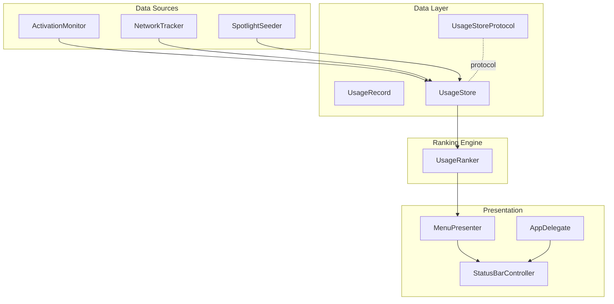
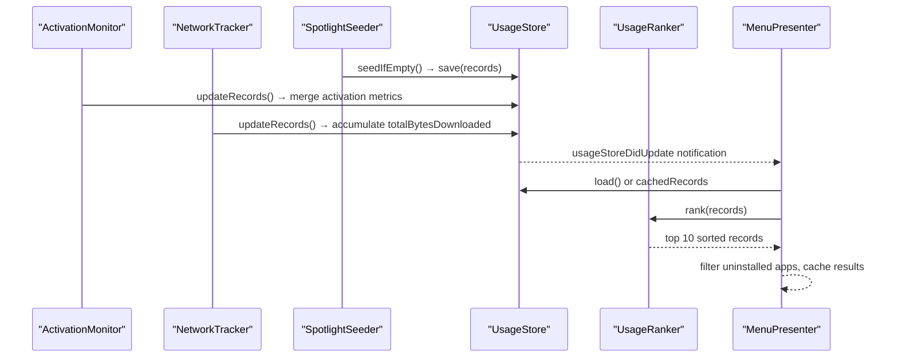
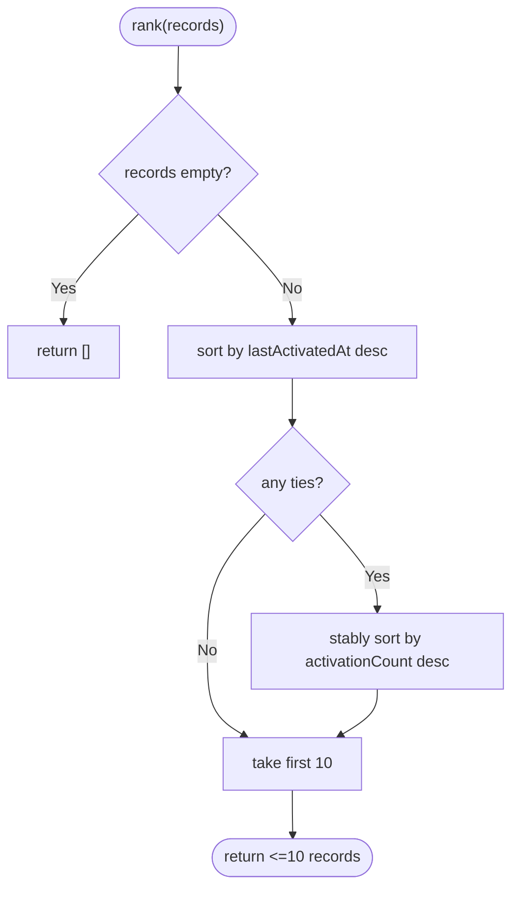
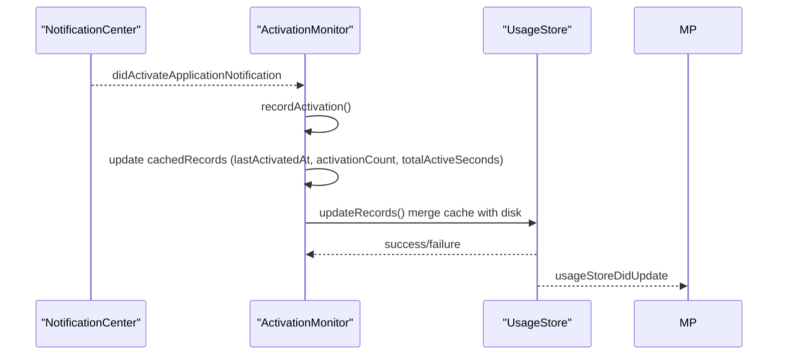
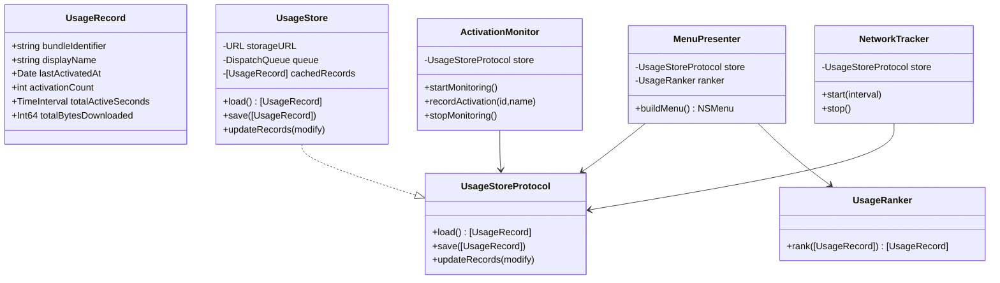

# Ranking Algorithms

<cite>
**Referenced Files in This Document**
- [UsageRanker.swift](file://iTip/UsageRanker.swift)
- [UsageRecord.swift](file://iTip/UsageRecord.swift)
- [UsageStore.swift](file://iTip/UsageStore.swift)
- [UsageStoreProtocol.swift](file://iTip/UsageStoreProtocol.swift)
- [ActivationMonitor.swift](file://iTip/ActivationMonitor.swift)
- [NetworkTracker.swift](file://iTip/NetworkTracker.swift)
- [MenuPresenter.swift](file://iTip/MenuPresenter.swift)
- [SpotlightSeeder.swift](file://iTip/iTip/SpotlightSeeder.swift)
- [AppDelegate.swift](file://iTip/AppDelegate.swift)
- [UsageRankerTests.swift](file://iTipTests/UsageRankerTests.swift)
- [UsageRankerPropertyTests.swift](file://iTipTests/UsageRankerPropertyTests.swift)
- [IntegrationTests.swift](file://iTipTests/IntegrationTests.swift)
</cite>

## Table of Contents
1. [Introduction](#introduction)
2. [Project Structure](#project-structure)
3. [Core Components](#core-components)
4. [Architecture Overview](#architecture-overview)
5. [Detailed Component Analysis](#detailed-component-analysis)
6. [Dependency Analysis](#dependency-analysis)
7. [Performance Considerations](#performance-considerations)
8. [Troubleshooting Guide](#troubleshooting-guide)
9. [Conclusion](#conclusion)
10. [Appendices](#appendices)

## Introduction
This document explains iTip’s application ranking algorithms with a focus on the UsageRanker and its role in computing application priority from usage data. It details the sorting mechanism, the metrics used, and how raw usage data is transformed into final rankings. It also covers performance characteristics, optimization strategies, and the end-to-end pipeline that updates rankings in real time.

## Project Structure
The ranking system is composed of:
- UsageRecord: the data model capturing per-application usage metrics.
- UsageStore: persistent storage for usage records with thread-safe load/save/update operations.
- UsageRanker: the ranking engine that sorts records by recency and frequency.
- ActivationMonitor: captures foreground activations and updates usage metrics.
- NetworkTracker: periodically samples per-process network usage and accumulates download bytes.
- MenuPresenter: builds the menu from ranked records, caches data, and triggers cleanup.
- SpotlightSeeder: seeds the store with historical data on cold start.
- AppDelegate: wires components together at app lifecycle events.

**Diagram sources**
- [UsageRecord.swift:3-32](file://iTip/UsageRecord.swift#L3-L32)
- [UsageStore.swift:4-106](file://iTip/UsageStore.swift#L4-L106)
- [UsageStoreProtocol.swift:3-13](file://iTip/UsageStoreProtocol.swift#L3-L13)
- [UsageRanker.swift:3-14](file://iTip/UsageRanker.swift#L3-L14)
- [ActivationMonitor.swift:3-156](file://iTip/ActivationMonitor.swift#L3-L156)
- [NetworkTracker.swift:6-151](file://iTip/NetworkTracker.swift#L6-L151)
- [SpotlightSeeder.swift:6-79](file://iTip/iTip/SpotlightSeeder.swift#L6-L79)
- [MenuPresenter.swift:3-252](file://iTip/MenuPresenter.swift#L3-L252)
- [AppDelegate.swift:3-80](file://iTip/AppDelegate.swift#L3-L80)

**Section sources**
- [UsageRecord.swift:3-32](file://iTip/UsageRecord.swift#L3-L32)
- [UsageStore.swift:4-106](file://iTip/UsageStore.swift#L4-L106)
- [UsageStoreProtocol.swift:3-13](file://iTip/UsageStoreProtocol.swift#L3-L13)
- [UsageRanker.swift:3-14](file://iTip/UsageRanker.swift#L3-L14)
- [ActivationMonitor.swift:3-156](file://iTip/ActivationMonitor.swift#L3-L156)
- [NetworkTracker.swift:6-151](file://iTip/NetworkTracker.swift#L6-L151)
- [SpotlightSeeder.swift:6-79](file://iTip/iTip/SpotlightSeeder.swift#L6-L79)
- [MenuPresenter.swift:3-252](file://iTip/MenuPresenter.swift#L3-L252)
- [AppDelegate.swift:3-80](file://iTip/AppDelegate.swift#L3-L80)

## Core Components
- UsageRecord encapsulates:
  - bundleIdentifier: unique app identifier.
  - displayName: human-readable name.
  - lastActivatedAt: most recent activation timestamp.
  - activationCount: number of activations.
  - totalActiveSeconds: cumulative foreground active time in seconds.
  - totalBytesDownloaded: cumulative downloaded bytes.
- UsageStore persists and retrieves UsageRecord arrays with thread-safe operations and maintains a cache to reduce disk I/O.
- UsageRanker sorts UsageRecord arrays by lastActivatedAt descending, then by activationCount descending, and limits output to the top 10.

**Section sources**
- [UsageRecord.swift:3-32](file://iTip/UsageRecord.swift#L3-L32)
- [UsageStore.swift:24-105](file://iTip/UsageStore.swift#L24-L105)
- [UsageRanker.swift:4-13](file://iTip/UsageRanker.swift#L4-L13)

## Architecture Overview
The ranking pipeline integrates live and historical usage signals:
- ActivationMonitor updates per-app metrics (activation count, last activation timestamp, foreground duration) and periodically flushes to disk.
- NetworkTracker periodically samples per-process network usage and accumulates bytes per app without creating new records.
- SpotlightSeeder pre-seeds the store with recent apps on cold start.
- UsageStore caches records and notifies observers on updates.
- MenuPresenter loads records, applies UsageRanker, filters out uninstalled apps, and builds the menu.

**Diagram sources**
- [SpotlightSeeder.swift:16-28](file://iTip/iTip/SpotlightSeeder.swift#L16-L28)
- [ActivationMonitor.swift:116-142](file://iTip/ActivationMonitor.swift#L116-L142)
- [NetworkTracker.swift:56-76](file://iTip/NetworkTracker.swift#L56-L76)
- [UsageStore.swift:69-105](file://iTip/UsageStore.swift#L69-L105)
- [MenuPresenter.swift:52-60](file://iTip/MenuPresenter.swift#L52-L60)
- [MenuPresenter.swift:78-114](file://iTip/MenuPresenter.swift#L78-L114)
- [UsageRanker.swift:4-13](file://iTip/UsageRanker.swift#L4-L13)

## Detailed Component Analysis

### UsageRanker
- Sorting criteria:
  - Primary: lastActivatedAt descending.
  - Secondary: activationCount descending when timestamps are equal.
- Output limit:
  - Returns at most 10 records via prefix(10).
- Stability:
  - Tests confirm idempotency and consistent ordering across runs.

**Diagram sources**
- [UsageRanker.swift:4-13](file://iTip/UsageRanker.swift#L4-L13)

**Section sources**
- [UsageRanker.swift:4-13](file://iTip/UsageRanker.swift#L4-L13)
- [UsageRankerTests.swift:10-73](file://iTipTests/UsageRankerTests.swift#L10-L73)
- [UsageRankerPropertyTests.swift:16-74](file://iTipTests/UsageRankerPropertyTests.swift#L16-L74)

### UsageRecord
- Data model fields and backward-compatibility decoding:
  - totalActiveSeconds and totalBytesDownloaded default to zero if absent in older JSON.
- These fields are populated by ActivationMonitor and NetworkTracker respectively.

**Section sources**
- [UsageRecord.swift:14-31](file://iTip/UsageRecord.swift#L14-L31)

### UsageStore
- Thread-safety:
  - Serial queues protect load/save/update operations.
- Caching:
  - In-memory cachedRecords avoids frequent disk reads.
- Persistence:
  - Atomic JSON writes ensure durability.
- Notifications:
  - usageStoreDidUpdate posted after successful save/update.

**Section sources**
- [UsageStore.swift:24-105](file://iTip/UsageStore.swift#L24-L105)
- [UsageStoreProtocol.swift:3-13](file://iTip/UsageStoreProtocol.swift#L3-L13)

### ActivationMonitor
- Live activation tracking:
  - Observes NSWorkspace foreground activation events.
  - Updates lastActivatedAt, activationCount, and foreground duration.
- De-duplicated writes:
  - Maintains an in-memory cache and debounces periodic flush to disk.
- Merge semantics:
  - updateRecords overlays activation metrics onto disk-stored records, preserving network-derived totalBytesDownloaded.

**Diagram sources**
- [ActivationMonitor.swift:38-105](file://iTip/ActivationMonitor.swift#L38-L105)
- [ActivationMonitor.swift:116-142](file://iTip/ActivationMonitor.swift#L116-L142)
- [UsageStore.swift:69-105](file://iTip/UsageStore.swift#L69-L105)
- [MenuPresenter.swift:52-60](file://iTip/MenuPresenter.swift#L52-L60)

**Section sources**
- [ActivationMonitor.swift:38-156](file://iTip/ActivationMonitor.swift#L38-L156)
- [UsageStore.swift:69-105](file://iTip/UsageStore.swift#L69-L105)

### NetworkTracker
- Sampling:
  - Periodically invokes nettop to sample per-process bytes_in.
- Aggregation:
  - Accumulates bytes per bundleIdentifier in memory and flushes to disk.
- Safety:
  - Enforces a timeout to prevent hanging processes.
- Non-destructive:
  - Only updates existing records’ totalBytesDownloaded; does not create new records.

**Section sources**
- [NetworkTracker.swift:26-151](file://iTip/NetworkTracker.swift#L26-L151)

### MenuPresenter
- Real-time freshness:
  - Loads records on each menu open or invalidates cache on store updates.
- Ranking and filtering:
  - Applies UsageRanker, filters out uninstalled apps, and caches results.
- Cleanup:
  - Removes unresolvable bundle identifiers and persists the cleaned set.

**Section sources**
- [MenuPresenter.swift:52-60](file://iTip/MenuPresenter.swift#L52-L60)
- [MenuPresenter.swift:78-114](file://iTip/MenuPresenter.swift#L78-L114)
- [MenuPresenter.swift:87](file://iTip/MenuPresenter.swift#L87)

### SpotlightSeeder
- Cold-start seeding:
  - On first launch with an empty store, queries Spotlight for recent apps and seeds the store.

**Section sources**
- [SpotlightSeeder.swift:16-79](file://iTip/iTip/SpotlightSeeder.swift#L16-L79)

## Dependency Analysis
- Cohesion:
  - UsageRanker is stateless and depends only on UsageRecord, keeping logic pure and easy to test.
- Coupling:
  - MenuPresenter depends on UsageStoreProtocol and UsageRanker.
  - ActivationMonitor and NetworkTracker depend on UsageStoreProtocol for persistence.
- Notifications:
  - MenuPresenter listens for usageStoreDidUpdate to invalidate caches and reflect fresh data.

**Diagram sources**
- [UsageRecord.swift:3-32](file://iTip/UsageRecord.swift#L3-L32)
- [UsageStoreProtocol.swift:3-13](file://iTip/UsageStoreProtocol.swift#L3-L13)
- [UsageStore.swift:4-106](file://iTip/UsageStore.swift#L4-L106)
- [UsageRanker.swift:3-14](file://iTip/UsageRanker.swift#L3-L14)
- [ActivationMonitor.swift:3-156](file://iTip/ActivationMonitor.swift#L3-L156)
- [NetworkTracker.swift:6-151](file://iTip/NetworkTracker.swift#L6-L151)
- [MenuPresenter.swift:3-252](file://iTip/MenuPresenter.swift#L3-L252)

**Section sources**
- [UsageStoreProtocol.swift:3-13](file://iTip/UsageStoreProtocol.swift#L3-L13)
- [UsageStore.swift:4-106](file://iTip/UsageStore.swift#L4-L106)
- [UsageRanker.swift:3-14](file://iTip/UsageRanker.swift#L3-L14)
- [ActivationMonitor.swift:3-156](file://iTip/ActivationMonitor.swift#L3-L156)
- [NetworkTracker.swift:6-151](file://iTip/NetworkTracker.swift#L6-L151)
- [MenuPresenter.swift:3-252](file://iTip/MenuPresenter.swift#L3-L252)

## Performance Considerations
- Sorting complexity:
  - UsageRanker sorts O(N) records with a comparator that compares two fields; typical sort complexity is O(N log N).
- Output truncation:
  - prefix(10) ensures constant-time post-sort selection of top 10.
- Memory footprint:
  - ActivationMonitor maintains an in-memory cache and an index map for O(1) lookups, reducing repeated disk access.
- Disk I/O:
  - UsageStore uses atomic writes and a serial queue to minimize contention.
- Network sampling:
  - NetworkTracker batches bytes per interval and flushes periodically to reduce write frequency.
- UI responsiveness:
  - MenuPresenter caches records and invalidates on store updates to avoid repeated loads.

[No sources needed since this section provides general guidance]

## Troubleshooting Guide
- Rankings not updating:
  - Verify store updates are triggered and notifications are posted. Check that MenuPresenter observes usageStoreDidUpdate and clears cachedRecords.
- Missing apps in the menu:
  - MenuPresenter removes uninstalled apps; ensure bundle identifiers resolve via NSWorkspace and that records are persisted after removal.
- Corrupted or missing usage.json:
  - UsageStore returns empty arrays on missing/corrupted files and logs via os_log; verify file permissions and path.
- Activation or network data not persisting:
  - Confirm ActivationMonitor and NetworkTracker are started and that updateRecords merges data correctly without overwriting network-derived fields.

**Section sources**
- [MenuPresenter.swift:52-60](file://iTip/MenuPresenter.swift#L52-L60)
- [MenuPresenter.swift:108-114](file://iTip/MenuPresenter.swift#L108-L114)
- [UsageStore.swift:38-48](file://iTip/UsageStore.swift#L38-L48)
- [ActivationMonitor.swift:116-142](file://iTip/ActivationMonitor.swift#L116-L142)
- [NetworkTracker.swift:56-76](file://iTip/NetworkTracker.swift#L56-L76)

## Conclusion
iTip’s ranking algorithm is intentionally simple and robust: prioritize recency, then frequency, and cap the results to the top 10. The system integrates live activation and network usage signals, persists data safely, and keeps the UI fresh through caching and notifications. While the current model does not incorporate advanced weighting or decay functions, the modular design allows future enhancements to introduce normalization, thresholds, and recency weighting without disrupting existing components.

[No sources needed since this section summarizes without analyzing specific files]

## Appendices

### Mathematical Model and Normalization Notes
- Current model:
  - Primary score: lastActivatedAt (descending).
  - Secondary score: activationCount (descending).
  - Output limit: top 10.
- No explicit normalization or thresholding is applied in the current implementation.
- Future extensions could include:
  - Weighted linear combinations of metrics.
  - Exponential or polynomial recency weighting.
  - Threshold-based filtering for minimum activity.
  - Per-app normalization of metrics to balance scales.

[No sources needed since this section provides general guidance]

### Implementation Details and Examples
- Ranking calculation:
  - See [UsageRanker.swift:4-13](file://iTip/UsageRanker.swift#L4-L13).
- Sorting correctness and idempotency:
  - See [UsageRankerPropertyTests.swift:16-74](file://iTipTests/UsageRankerPropertyTests.swift#L16-L74).
- Output count limit:
  - See [UsageRankerTests.swift:39-52](file://iTipTests/UsageRankerTests.swift#L39-L52).
- Full data flow integration:
  - See [IntegrationTests.swift:9-127](file://iTipTests/IntegrationTests.swift#L9-L127).
- Real-time updates:
  - ActivationMonitor and NetworkTracker update records; MenuPresenter rebuilds the menu on demand.
  - See [ActivationMonitor.swift:116-142](file://iTip/ActivationMonitor.swift#L116-L142), [NetworkTracker.swift:56-76](file://iTip/NetworkTracker.swift#L56-L76), [MenuPresenter.swift:52-60](file://iTip/MenuPresenter.swift#L52-L60).

**Section sources**
- [UsageRanker.swift:4-13](file://iTip/UsageRanker.swift#L4-L13)
- [UsageRankerPropertyTests.swift:16-74](file://iTipTests/UsageRankerPropertyTests.swift#L16-L74)
- [UsageRankerTests.swift:39-52](file://iTipTests/UsageRankerTests.swift#L39-L52)
- [IntegrationTests.swift:9-127](file://iTipTests/IntegrationTests.swift#L9-L127)
- [ActivationMonitor.swift:116-142](file://iTip/ActivationMonitor.swift#L116-L142)
- [NetworkTracker.swift:56-76](file://iTip/NetworkTracker.swift#L56-L76)
- [MenuPresenter.swift:52-60](file://iTip/MenuPresenter.swift#L52-L60)