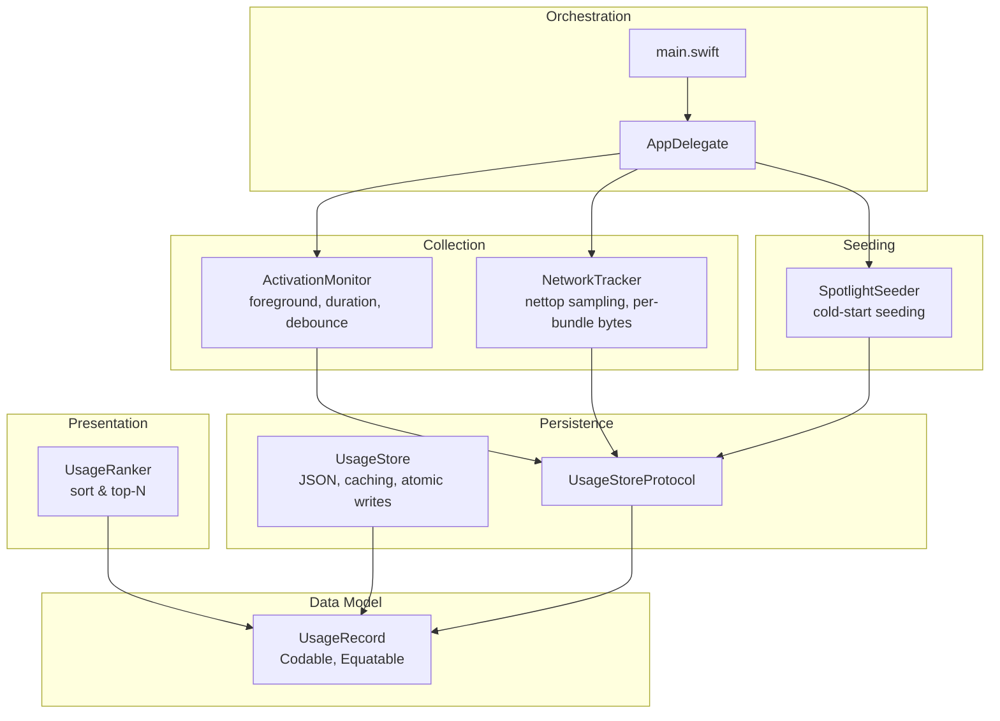
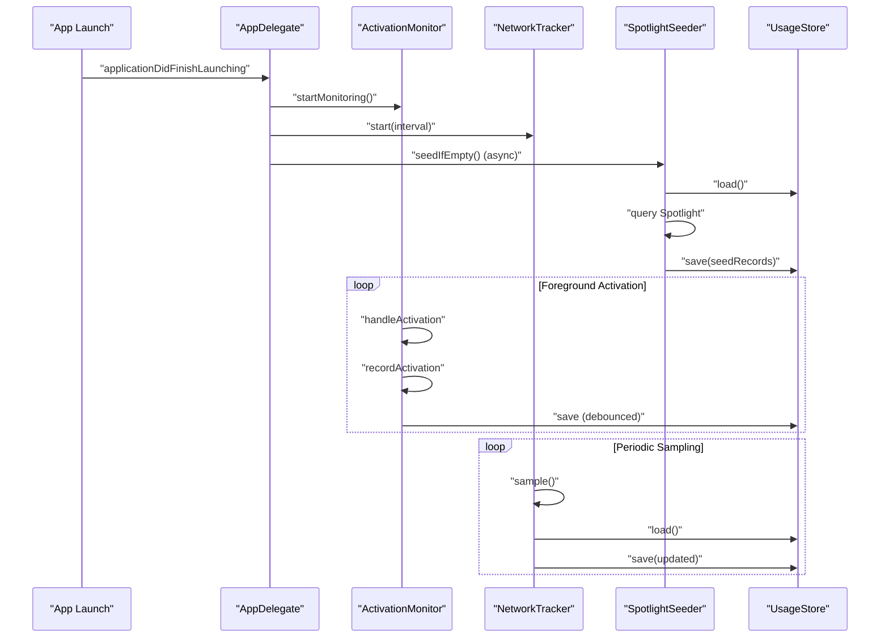
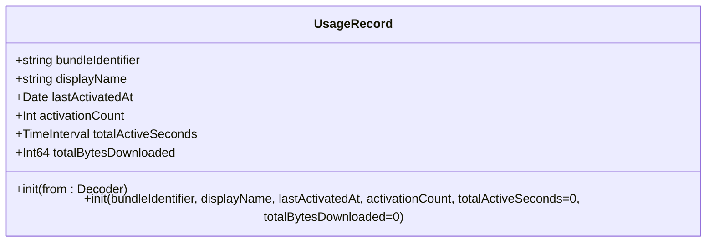
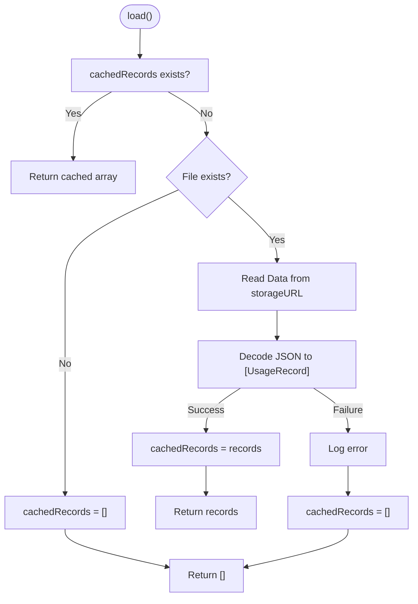
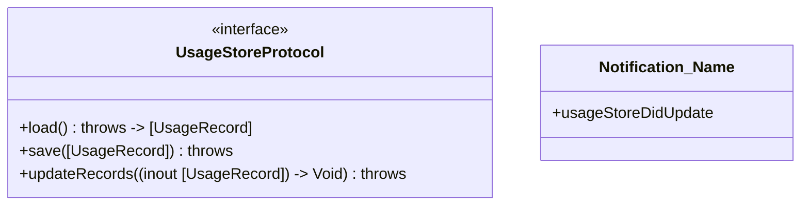
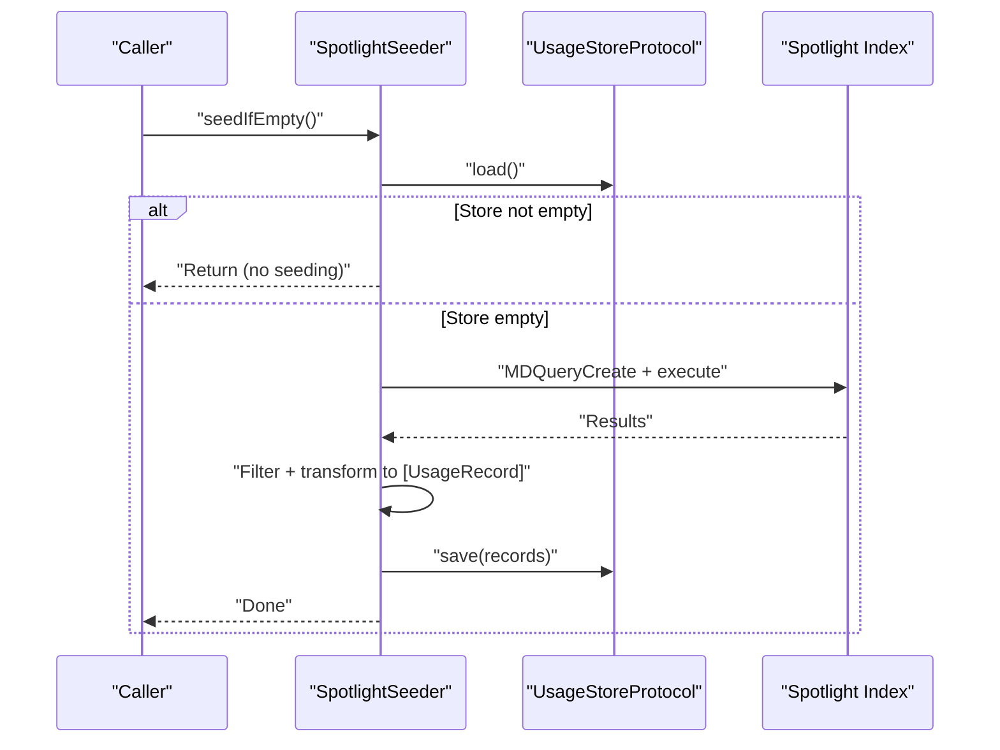
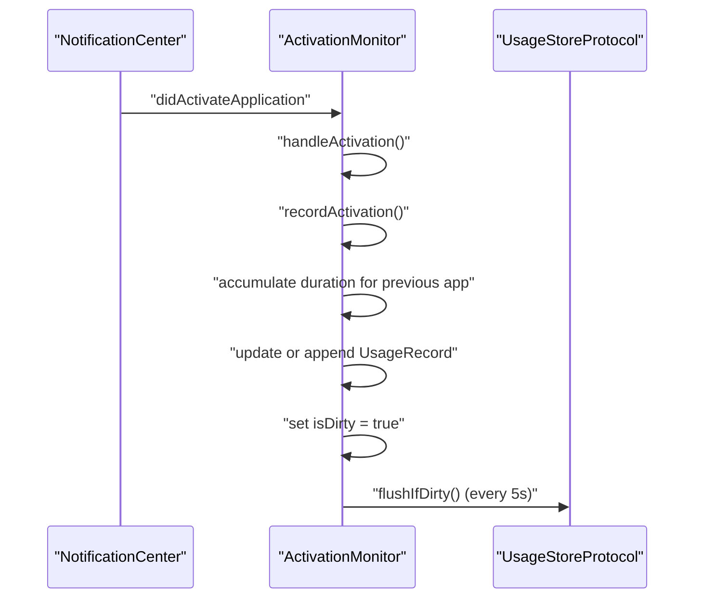
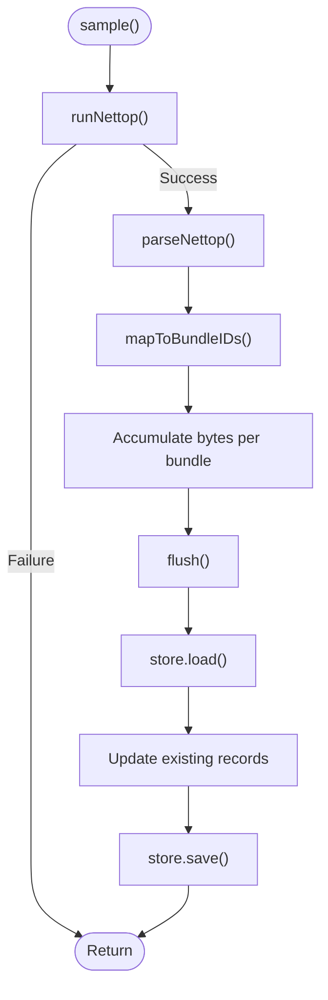
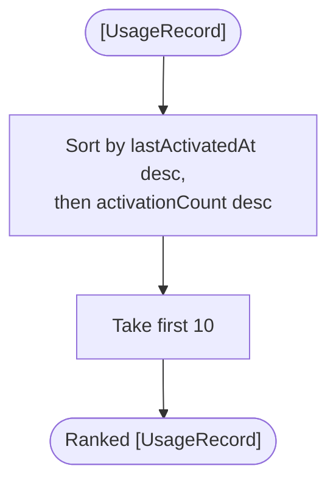
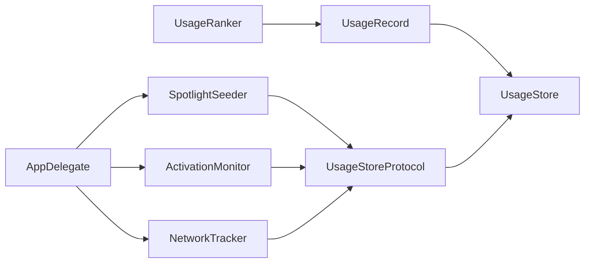

# Data Management

<cite>
**Referenced Files in This Document**
- [UsageRecord.swift](file://iTip/UsageRecord.swift)
- [UsageStore.swift](file://iTip/UsageStore.swift)
- [UsageStoreProtocol.swift](file://iTip/UsageStoreProtocol.swift)
- [SpotlightSeeder.swift](file://iTip/SpotlightSeeder.swift)
- [ActivationMonitor.swift](file://iTip/ActivationMonitor.swift)
- [NetworkTracker.swift](file://iTip/NetworkTracker.swift)
- [UsageRanker.swift](file://iTip/UsageRanker.swift)
- [AppDelegate.swift](file://iTip/AppDelegate.swift)
- [main.swift](file://iTip/main.swift)
- [UsageStoreTests.swift](file://iTipTests/UsageStoreTests.swift)
- [UsageRecordPropertyTests.swift](file://iTipTests/UsageRecordPropertyTests.swift)
- [ActivationMonitorPropertyTests.swift](file://iTipTests/ActivationMonitorPropertyTests.swift)
- [ActivationMonitorTests.swift](file://iTipTests/ActivationMonitorTests.swift)
- [InMemoryUsageStore.swift](file://iTipTests/InMemoryUsageStore.swift)
- [README.md](file://README.md)
</cite>

## Table of Contents
1. [Introduction](#introduction)
2. [Project Structure](#project-structure)
3. [Core Components](#core-components)
4. [Architecture Overview](#architecture-overview)
5. [Detailed Component Analysis](#detailed-component-analysis)
6. [Dependency Analysis](#dependency-analysis)
7. [Performance Considerations](#performance-considerations)
8. [Troubleshooting Guide](#troubleshooting-guide)
9. [Conclusion](#conclusion)
10. [Appendices](#appendices)

## Introduction
This document describes the data model and management system used by iTip to track application usage on macOS. It covers the UsageRecord data structure, the UsageStore’s thread-safe persistence layer, the SpotlightSeeder’s metadata-driven seeding, and the data lifecycle from collection to presentation. It also addresses backward compatibility, schema evolution, performance characteristics, security and privacy considerations, and operational procedures such as backup and restore.

## Project Structure
The data management subsystem centers around a small set of cohesive components:
- Data model: UsageRecord
- Persistence: UsageStore implementing UsageStoreProtocol
- Initial seeding: SpotlightSeeder
- Collection: ActivationMonitor (foreground activation and duration) and NetworkTracker (download bytes)
- Presentation: UsageRanker
- Orchestration: AppDelegate and main.swift

**Diagram sources**
- [UsageRecord.swift:3-32](file://iTip/UsageRecord.swift#L3-L32)
- [UsageStore.swift:4-66](file://iTip/UsageStore.swift#L4-L66)
- [UsageStoreProtocol.swift:3-13](file://iTip/UsageStoreProtocol.swift#L3-L13)
- [SpotlightSeeder.swift:6-79](file://iTip/SpotlightSeeder.swift#L6-L79)
- [ActivationMonitor.swift:3-141](file://iTip/ActivationMonitor.swift#L3-L141)
- [NetworkTracker.swift:6-143](file://iTip/NetworkTracker.swift#L6-L143)
- [UsageRanker.swift:3-15](file://iTip/UsageRanker.swift#L3-L15)
- [AppDelegate.swift:3-34](file://iTip/AppDelegate.swift#L3-L34)
- [main.swift:1-8](file://iTip/main.swift#L1-L8)

**Section sources**
- [README.md:1-48](file://README.md#L1-L48)
- [main.swift:1-8](file://iTip/main.swift#L1-L8)
- [AppDelegate.swift:3-34](file://iTip/AppDelegate.swift#L3-L34)

## Core Components
- UsageRecord: Encapsulates per-application usage metrics with backward-compatible decoding for new fields.
- UsageStore: Thread-safe JSON-backed store with in-memory caching, atomic writes, and graceful error handling.
- UsageStoreProtocol: Defines the interface for loading, saving, and atomic updates.
- SpotlightSeeder: Seeds the store on cold start using Spotlight metadata.
- ActivationMonitor: Observes foreground activations, tracks duration, and debounces writes.
- NetworkTracker: Periodically samples per-process network usage and accumulates bytes per bundle.
- UsageRanker: Ranks records by recency and frequency for presentation.

**Section sources**
- [UsageRecord.swift:3-32](file://iTip/UsageRecord.swift#L3-L32)
- [UsageStore.swift:4-66](file://iTip/UsageStore.swift#L4-L66)
- [UsageStoreProtocol.swift:3-13](file://iTip/UsageStoreProtocol.swift#L3-L13)
- [SpotlightSeeder.swift:6-79](file://iTip/SpotlightSeeder.swift#L6-L79)
- [ActivationMonitor.swift:3-141](file://iTip/ActivationMonitor.swift#L3-L141)
- [NetworkTracker.swift:6-143](file://iTip/NetworkTracker.swift#L6-L143)
- [UsageRanker.swift:3-15](file://iTip/UsageRanker.swift#L3-L15)

## Architecture Overview
The system follows a layered design:
- Data model layer defines UsageRecord.
- Persistence layer abstracts storage via UsageStoreProtocol and implements it with UsageStore.
- Collection layer updates records via ActivationMonitor and NetworkTracker.
- Seeding layer populates initial data via SpotlightSeeder.
- Presentation layer ranks and limits results for UI.

**Diagram sources**
- [AppDelegate.swift:9-33](file://iTip/AppDelegate.swift#L9-L33)
- [ActivationMonitor.swift:36-139](file://iTip/ActivationMonitor.swift#L36-L139)
- [NetworkTracker.swift:20-78](file://iTip/NetworkTracker.swift#L20-L78)
- [SpotlightSeeder.swift:16-28](file://iTip/SpotlightSeeder.swift#L16-L28)
- [UsageStore.swift:24-65](file://iTip/UsageStore.swift#L24-L65)

## Detailed Component Analysis

### UsageRecord Data Model
- Purpose: Represents a single application’s usage metrics.
- Fields:
  - bundleIdentifier: Unique app identifier.
  - displayName: Human-readable name.
  - lastActivatedAt: Timestamp of most recent activation.
  - activationCount: Number of activations.
  - totalActiveSeconds: Cumulative foreground active time in seconds.
  - totalBytesDownloaded: Cumulative bytes downloaded attributed to the app.
- Backward compatibility: New fields default to zero during decoding if absent, enabling schema evolution without breaking older data.

**Diagram sources**
- [UsageRecord.swift:3-32](file://iTip/UsageRecord.swift#L3-L32)

**Section sources**
- [UsageRecord.swift:3-32](file://iTip/UsageRecord.swift#L3-L32)

### UsageStore: Thread-Safe Persistence
- Responsibilities:
  - Load and save arrays of UsageRecord to a JSON file.
  - Provide atomic writes using an internal serial queue.
  - Maintain an in-memory cache to reduce frequent disk I/O.
  - Gracefully handle missing or corrupted files by returning empty arrays and logging errors.
- Concurrency:
  - Uses a dedicated serial DispatchQueue for synchronization.
  - load() returns cached data if present; otherwise reads from disk and caches.
  - save() writes atomically and updates the cache.
- Error handling:
  - On decode failure, logs an error and returns an empty array, ensuring robustness.

**Diagram sources**
- [UsageStore.swift:24-48](file://iTip/UsageStore.swift#L24-L48)

**Section sources**
- [UsageStore.swift:4-66](file://iTip/UsageStore.swift#L4-L66)
- [UsageStoreTests.swift:22-28](file://iTipTests/UsageStoreTests.swift#L22-L28)
- [UsageStoreTests.swift:51-60](file://iTipTests/UsageStoreTests.swift#L51-L60)

### UsageStoreProtocol: Interface Contract
- Defines:
  - load(): Returns [UsageRecord].
  - save(_:): Persists [UsageRecord].
  - updateRecords(_:): Performs atomic load-modify-save within a single synchronized block.
- Provides a notification name for post-update events.

**Diagram sources**
- [UsageStoreProtocol.swift:3-13](file://iTip/UsageStoreProtocol.swift#L3-L13)

**Section sources**
- [UsageStoreProtocol.swift:3-13](file://iTip/UsageStoreProtocol.swift#L3-L13)

### SpotlightSeeder: Metadata-Based Seeding
- Purpose: Populate the store on cold start (empty store) using Spotlight metadata.
- Implementation:
  - Queries the Spotlight index for application bundles active within a recent period.
  - Limits query results to a safe batch size.
  - Skips system/background processes and the app itself.
  - Converts Spotlight attributes into UsageRecord entries.
  - Saves the resulting records atomically.
- Performance:
  - Uses a bounded result count and filters aggressively to avoid heavy queries.

**Diagram sources**
- [SpotlightSeeder.swift:16-28](file://iTip/SpotlightSeeder.swift#L16-L28)
- [SpotlightSeeder.swift:32-78](file://iTip/SpotlightSeeder.swift#L32-L78)

**Section sources**
- [SpotlightSeeder.swift:6-79](file://iTip/SpotlightSeeder.swift#L6-L79)

### ActivationMonitor: Foreground Tracking and Duration
- Responsibilities:
  - Observe foreground app activations via NSWorkspace notifications.
  - Track previous foreground app to compute foreground duration and accumulate totalActiveSeconds.
  - Increment activationCount and update lastActivatedAt for existing/new records.
  - Debounce writes with a periodic timer and in-memory cache.
- Behavior:
  - Ignores self-activations.
  - Falls back to bundleIdentifier if localized name is unavailable.
  - Writes to disk only when dirty, minimizing I/O.

**Diagram sources**
- [ActivationMonitor.swift:36-139](file://iTip/ActivationMonitor.swift#L36-L139)

**Section sources**
- [ActivationMonitor.swift:3-141](file://iTip/ActivationMonitor.swift#L3-L141)
- [ActivationMonitorPropertyTests.swift:15-93](file://iTipTests/ActivationMonitorPropertyTests.swift#L15-L93)
- [ActivationMonitorTests.swift:17-28](file://iTipTests/ActivationMonitorTests.swift#L17-L28)

### NetworkTracker: Per-Process Network Sampling
- Responsibilities:
  - Periodically run nettop to sample per-process inbound bytes.
  - Map PIDs to bundle identifiers using NSRunningApplication.
  - Accumulate bytes per bundle in memory and flush to store periodically.
  - Only update existing records (no creation), preserving store contents.
- Robustness:
  - Retries failed flushes by re-accumulating bytes.
  - Filters out non-positive byte counts.

**Diagram sources**
- [NetworkTracker.swift:38-78](file://iTip/NetworkTracker.swift#L38-L78)
- [NetworkTracker.swift:80-141](file://iTip/NetworkTracker.swift#L80-L141)

**Section sources**
- [NetworkTracker.swift:6-143](file://iTip/NetworkTracker.swift#L6-L143)

### UsageRanker: Presentation Ranking
- Purpose: Sort and limit usage records for display.
- Sorting criteria:
  - Primary: lastActivatedAt (newer first).
  - Secondary: activationCount (higher first).
  - Top 10 items are returned.

**Diagram sources**
- [UsageRanker.swift:4-14](file://iTip/UsageRanker.swift#L4-L14)

**Section sources**
- [UsageRanker.swift:3-15](file://iTip/UsageRanker.swift#L3-L15)

## Dependency Analysis
- UsageStore depends on Foundation and os.log for file I/O and logging.
- SpotlightSeeder depends on UsageStoreProtocol and Spotlight APIs.
- ActivationMonitor depends on NSWorkspace and UsageStoreProtocol.
- NetworkTracker depends on Foundation, AppKit, and external nettop utility.
- UsageRanker depends on Foundation sorting primitives.
- AppDelegate orchestrates all components and triggers seeding asynchronously.

**Diagram sources**
- [UsageStore.swift:4-66](file://iTip/UsageStore.swift#L4-L66)
- [UsageStoreProtocol.swift:3-13](file://iTip/UsageStoreProtocol.swift#L3-L13)
- [SpotlightSeeder.swift:6-79](file://iTip/SpotlightSeeder.swift#L6-L79)
- [ActivationMonitor.swift:3-141](file://iTip/ActivationMonitor.swift#L3-L141)
- [NetworkTracker.swift:6-143](file://iTip/NetworkTracker.swift#L6-L143)
- [UsageRanker.swift:3-15](file://iTip/UsageRanker.swift#L3-L15)
- [AppDelegate.swift:3-34](file://iTip/AppDelegate.swift#L3-L34)

**Section sources**
- [AppDelegate.swift:9-33](file://iTip/AppDelegate.swift#L9-L33)

## Performance Considerations
- Caching:
  - UsageStore maintains an in-memory cache to minimize repeated disk reads.
  - ActivationMonitor caches records and debounces writes to reduce I/O frequency.
- Atomic writes:
  - UsageStore uses atomic file writing to prevent partial writes.
- Query limits:
  - SpotlightSeeder caps result count to avoid long-running queries.
- Sampling intervals:
  - NetworkTracker samples at a configurable interval to balance accuracy and overhead.
- Sorting cost:
  - UsageRanker sorts up to N items; keep N bounded (as implemented) to control cost.

[No sources needed since this section provides general guidance]

## Troubleshooting Guide
Common issues and remedies:
- Empty store on startup:
  - Verify the default storage path and permissions. The store returns an empty array if the file does not exist.
- Corrupted JSON:
  - On decode failure, the store logs an error and returns an empty array. Replace or delete the corrupted file.
- Atomic write failures:
  - The store’s atomic write ensures data integrity. If a write fails, the cache remains consistent.
- Spotlight seeding not working:
  - Confirm Spotlight accessibility and query conditions. The seeder only runs when the store is empty.
- Network statistics missing:
  - Ensure nettop is executable and accessible. The tracker ignores non-positive byte counts and only updates existing records.

**Section sources**
- [UsageStore.swift:24-48](file://iTip/UsageStore.swift#L24-L48)
- [UsageStoreTests.swift:51-60](file://iTipTests/UsageStoreTests.swift#L51-L60)
- [SpotlightSeeder.swift:16-28](file://iTip/SpotlightSeeder.swift#L16-L28)
- [NetworkTracker.swift:50-78](file://iTip/NetworkTracker.swift#L50-L78)

## Conclusion
iTip’s data management system is designed for simplicity, reliability, and performance. The UsageRecord model is compact and backward compatible. UsageStore provides thread-safe, atomic persistence with caching and robust error handling. SpotlightSeeder seeds the store efficiently, while ActivationMonitor and NetworkTracker collect usage signals with minimal overhead. UsageRanker delivers a concise, ranked view for the UI. Together, these components form a cohesive pipeline from collection to presentation.

[No sources needed since this section summarizes without analyzing specific files]

## Appendices

### Data Lifecycle: From Collection to Presentation
- Collection:
  - Foreground activations are observed and transformed into UsageRecord updates.
  - Network sampling updates per-app download totals.
- Storage:
  - Records are persisted atomically to JSON with in-memory caching.
- Presentation:
  - Records are ranked by recency and frequency, limited to top 10.

**Diagram sources**
- [ActivationMonitor.swift:66-118](file://iTip/ActivationMonitor.swift#L66-L118)
- [NetworkTracker.swift:50-78](file://iTip/NetworkTracker.swift#L50-L78)
- [UsageStore.swift:51-65](file://iTip/UsageStore.swift#L51-L65)
- [UsageRanker.swift:4-14](file://iTip/UsageRanker.swift#L4-L14)

### Data Validation and Schema Evolution
- Validation:
  - Empty or missing bundle identifiers are handled gracefully at collection boundaries.
  - Decoding tolerates missing new fields by defaulting to zero.
- Schema evolution:
  - New fields default to zero during decoding, allowing future additions without breaking existing data.

**Section sources**
- [UsageRecord.swift:13-22](file://iTip/UsageRecord.swift#L13-L22)
- [ActivationMonitorTests.swift:83-100](file://iTipTests/ActivationMonitorTests.swift#L83-L100)

### Security and Privacy Considerations
- Data location:
  - Store resides under Application Support; ensure appropriate sandboxing and permissions.
- Access control:
  - The app is an accessory app; restrict UI exposure and avoid exposing sensitive paths.
- Privacy:
  - Usage data is stored locally. Avoid sharing or uploading without explicit user consent.
- Cleanup:
  - Automatic cleanup of uninstalled apps is part of the product roadmap.

**Section sources**
- [AppDelegate.swift:9-33](file://iTip/AppDelegate.swift#L9-L33)
- [README.md:11-12](file://README.md#L11-L12)

### Backup and Restore Procedures
- Backup:
  - Copy the usage.json file from the Application Support directory to a secure location.
- Restore:
  - Stop the app, replace usage.json with the backed-up file, then restart the app.
- Notes:
  - Ensure file permissions and ownership are preserved during restore.

[No sources needed since this section provides general guidance]

### Practical Examples
- Manipulating records:
  - Use the protocol-compliant store to load, modify, and save records atomically.
  - Example paths:
    - [UsageStoreProtocol.swift:3-8](file://iTip/UsageStoreProtocol.swift#L3-L8)
    - [InMemoryUsageStore.swift:4-18](file://iTipTests/InMemoryUsageStore.swift#L4-L18)
- Serialization verification:
  - Round-trip tests confirm that encoding and decoding preserve data.
  - Example path:
    - [UsageRecordPropertyTests.swift:35-50](file://iTipTests/UsageRecordPropertyTests.swift#L35-L50)
- Activation behavior:
  - Property and unit tests demonstrate expected updates for existing and new records.
  - Example paths:
    - [ActivationMonitorPropertyTests.swift:15-93](file://iTipTests/ActivationMonitorPropertyTests.swift#L15-L93)
    - [ActivationMonitorTests.swift:65-81](file://iTipTests/ActivationMonitorTests.swift#L65-L81)