# Development Guide

<cite>
**Referenced Files in This Document**
- [README.md](file://README.md)
- [.github/workflows/build.yml](file://.github/workflows/build.yml)
- [iTip/main.swift](file://iTip/main.swift)
- [iTip/AppDelegate.swift](file://iTip/AppDelegate.swift)
- [iTip/Info.plist](file://iTip/Info.plist)
- [iTip/ActivationMonitor.swift](file://iTip/ActivationMonitor.swift)
- [iTip/NetworkTracker.swift](file://iTip/NetworkTracker.swift)
- [iTip/StatusBarController.swift](file://iTip/StatusBarController.swift)
- [iTip/MenuPresenter.swift](file://iTip/MenuPresenter.swift)
- [iTip/AppLauncher.swift](file://iTip/AppLauncher.swift)
- [iTip/UsageStore.swift](file://iTip/UsageStore.swift)
- [iTip/UsageRecord.swift](file://iTip/UsageRecord.swift)
- [iTip/UsageRanker.swift](file://iTip/UsageRanker.swift)
- [iTipTests/IntegrationTests.swift](file://iTipTests/IntegrationTests.swift)
</cite>

## Table of Contents
1. [Introduction](#introduction)
2. [Project Structure](#project-structure)
3. [Core Components](#core-components)
4. [Architecture Overview](#architecture-overview)
5. [Detailed Component Analysis](#detailed-component-analysis)
6. [Dependency Analysis](#dependency-analysis)
7. [Performance Considerations](#performance-considerations)
8. [Troubleshooting Guide](#troubleshooting-guide)
9. [Contribution Guidelines](#contribution-guidelines)
10. [Build and Deployment](#build-and-deployment)
11. [CI/CD Pipeline](#cicd-pipeline)
12. [Debugging and Profiling](#debugging-and-profiling)
13. [Extending Functionality](#extending-functionality)
14. [Conclusion](#conclusion)

## Introduction
This guide provides comprehensive development practices for contributing to iTip, a macOS menu bar application that tracks application usage and provides quick activation shortcuts. It covers environment setup, project conventions, architecture, build and release processes, CI/CD automation, testing, debugging, and contribution workflows tailored for macOS development.

## Project Structure
The repository follows a conventional macOS AppKit project layout with a focus on modular Swift components and unit/integration tests:
- Application target: iTip (menu bar app)
- Tests: iTipTests (integration and property-style tests)
- CI: GitHub Actions workflow under .github/workflows
- Documentation and planning artifacts under docs and .planning

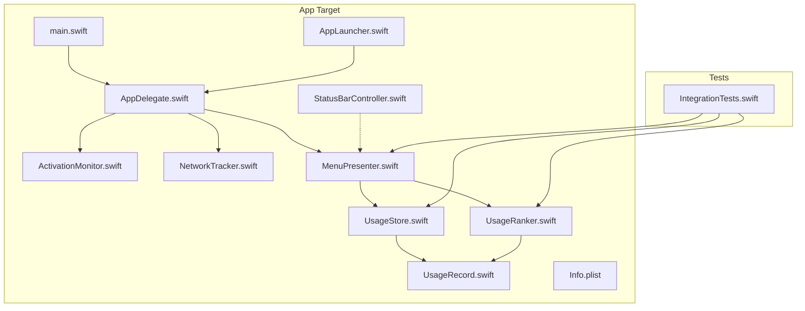

**Diagram sources**
- [iTip/main.swift:1-8](file://iTip/main.swift#L1-L8)
- [iTip/AppDelegate.swift:1-75](file://iTip/AppDelegate.swift#L1-L75)
- [iTip/ActivationMonitor.swift:1-141](file://iTip/ActivationMonitor.swift#L1-L141)
- [iTip/NetworkTracker.swift:1-143](file://iTip/NetworkTracker.swift#L1-L143)
- [iTip/StatusBarController.swift:1-68](file://iTip/StatusBarController.swift#L1-L68)
- [iTip/MenuPresenter.swift:1-233](file://iTip/MenuPresenter.swift#L1-L233)
- [iTip/AppLauncher.swift:1-40](file://iTip/AppLauncher.swift#L1-L40)
- [iTip/UsageStore.swift:1-107](file://iTip/UsageStore.swift#L1-L107)
- [iTip/UsageRecord.swift:1-33](file://iTip/UsageRecord.swift#L1-L33)
- [iTip/UsageRanker.swift:1-16](file://iTip/UsageRanker.swift#L1-L16)
- [iTip/Info.plist:1-31](file://iTip/Info.plist#L1-L31)
- [iTipTests/IntegrationTests.swift:1-129](file://iTipTests/IntegrationTests.swift#L1-L129)

**Section sources**
- [README.md:1-48](file://README.md#L1-L48)
- [iTip/Info.plist:1-31](file://iTip/Info.plist#L1-L31)

## Core Components
- Application entrypoint initializes NSApplication, sets accessory activation policy, and starts the app lifecycle.
- AppDelegate orchestrates subsystems: activation monitoring, network tracking, menu building, and Spotlight seeding.
- UsageStore persists and caches UsageRecord arrays to disk with atomic writes and change notifications.
- UsageRecord defines the persisted model with backward-compatible decoding.
- UsageRanker sorts records by recency and frequency, limiting top-N results.
- ActivationMonitor observes NSWorkspace notifications to track foreground app switches, maintains an in-memory cache, and periodically flushes to disk.
- NetworkTracker periodically samples per-process network traffic via nettop and accumulates downloads into existing records.
- MenuPresenter builds dynamic menus from store data, caches icons and URLs, and formats usage statistics.
- StatusBarController integrates with NSStatusBar, applies SF Symbols, and delegates menu updates.
- AppLauncher activates or launches applications by bundle identifier with robust error handling.

**Section sources**
- [iTip/main.swift:1-8](file://iTip/main.swift#L1-L8)
- [iTip/AppDelegate.swift:1-75](file://iTip/AppDelegate.swift#L1-L75)
- [iTip/UsageStore.swift:1-107](file://iTip/UsageStore.swift#L1-L107)
- [iTip/UsageRecord.swift:1-33](file://iTip/UsageRecord.swift#L1-L33)
- [iTip/UsageRanker.swift:1-16](file://iTip/UsageRanker.swift#L1-L16)
- [iTip/ActivationMonitor.swift:1-141](file://iTip/ActivationMonitor.swift#L1-L141)
- [iTip/NetworkTracker.swift:1-143](file://iTip/NetworkTracker.swift#L1-L143)
- [iTip/MenuPresenter.swift:1-233](file://iTip/MenuPresenter.swift#L1-L233)
- [iTip/StatusBarController.swift:1-68](file://iTip/StatusBarController.swift#L1-L68)
- [iTip/AppLauncher.swift:1-40](file://iTip/AppLauncher.swift#L1-L40)

## Architecture Overview
The app is structured around a small set of focused components communicating via protocols and notifications. The primary runtime flow begins at main.swift, delegates to AppDelegate, and coordinates monitoring, storage, ranking, and UI presentation.

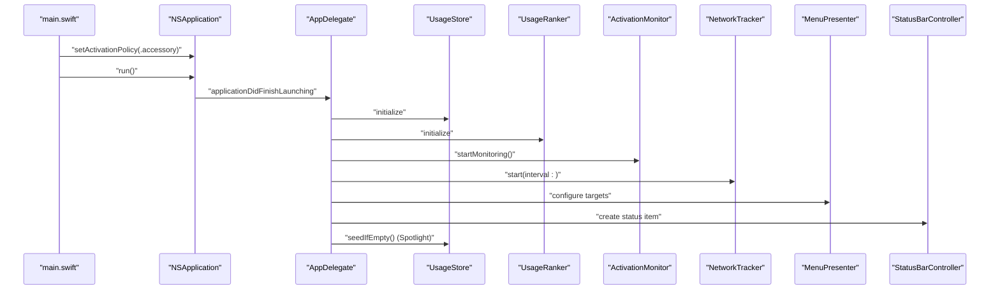

**Diagram sources**
- [iTip/main.swift:1-8](file://iTip/main.swift#L1-L8)
- [iTip/AppDelegate.swift:1-75](file://iTip/AppDelegate.swift#L1-L75)
- [iTip/ActivationMonitor.swift:1-141](file://iTip/ActivationMonitor.swift#L1-L141)
- [iTip/NetworkTracker.swift:1-143](file://iTip/NetworkTracker.swift#L1-L143)
- [iTip/MenuPresenter.swift:1-233](file://iTip/MenuPresenter.swift#L1-L233)
- [iTip/StatusBarController.swift:1-68](file://iTip/StatusBarController.swift#L1-L68)
- [iTip/UsageStore.swift:1-107](file://iTip/UsageStore.swift#L1-L107)

## Detailed Component Analysis

### ActivationMonitor
Responsibilities:
- Observes foreground application activation events.
- Maintains an in-memory cache of usage records to minimize disk I/O.
- Debounces periodic saves to reduce write frequency.
- Tracks foreground duration for the previous app and updates totals.

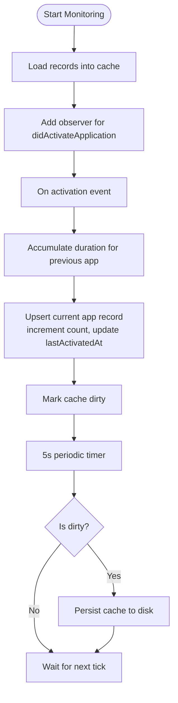

**Diagram sources**
- [iTip/ActivationMonitor.swift:1-141](file://iTip/ActivationMonitor.swift#L1-L141)

**Section sources**
- [iTip/ActivationMonitor.swift:1-141](file://iTip/ActivationMonitor.swift#L1-L141)

### NetworkTracker
Responsibilities:
- Periodically invokes nettop to sample per-process network traffic.
- Aggregates bytes per PID, maps to bundle identifiers, and accumulates into existing records.
- Persists aggregated bytes atomically and handles partial failures by re-incrementing in-memory counters.

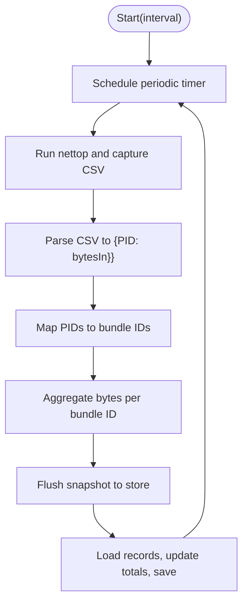

**Diagram sources**
- [iTip/NetworkTracker.swift:1-143](file://iTip/NetworkTracker.swift#L1-L143)

**Section sources**
- [iTip/NetworkTracker.swift:1-143](file://iTip/NetworkTracker.swift#L1-L143)

### MenuPresenter
Responsibilities:
- Builds a dynamic NSMenu from stored records.
- Caches app icons and URL resolutions to improve performance.
- Formats usage statistics (counts, durations, bytes, relative time).
- Removes records for missing apps and triggers asynchronous cleanup.

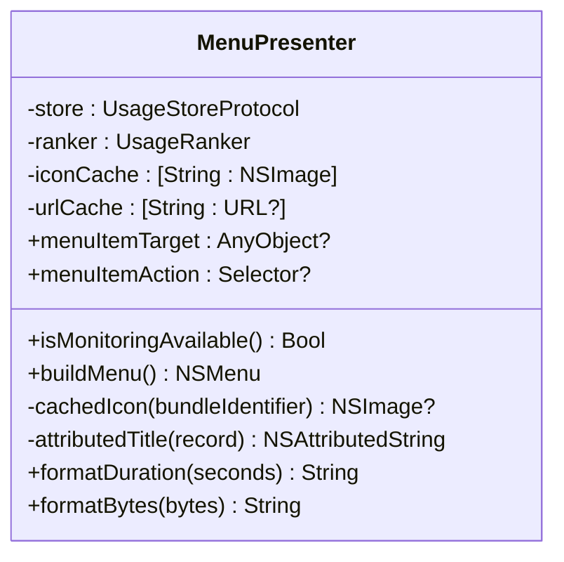

**Diagram sources**
- [iTip/MenuPresenter.swift:1-233](file://iTip/MenuPresenter.swift#L1-L233)

**Section sources**
- [iTip/MenuPresenter.swift:1-233](file://iTip/MenuPresenter.swift#L1-L233)

### UsageStore
Responsibilities:
- Provides thread-safe load/save/update operations.
- Uses a serial queue to serialize disk I/O.
- Caches loaded records and posts notifications on updates.
- Ensures atomic writes and defensive decoding.

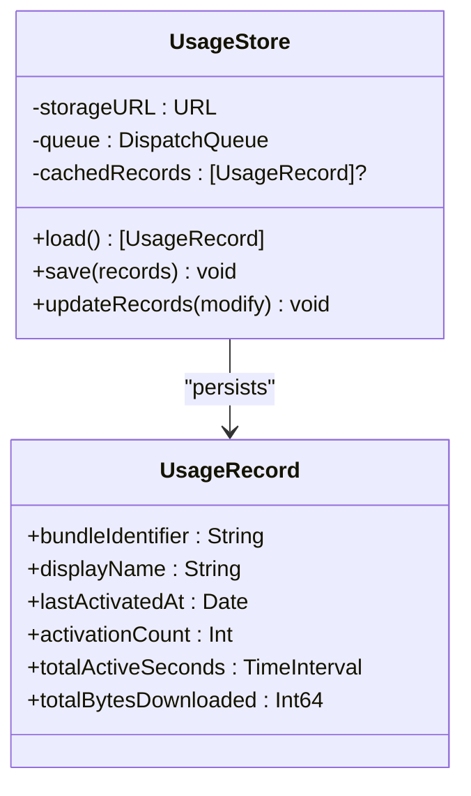

**Diagram sources**
- [iTip/UsageStore.swift:1-107](file://iTip/UsageStore.swift#L1-L107)
- [iTip/UsageRecord.swift:1-33](file://iTip/UsageRecord.swift#L1-L33)

**Section sources**
- [iTip/UsageStore.swift:1-107](file://iTip/UsageStore.swift#L1-L107)
- [iTip/UsageRecord.swift:1-33](file://iTip/UsageRecord.swift#L1-L33)

### StatusBarController
Responsibilities:
- Creates and manages the NSStatusItem with SF Symbol icon.
- Delegates menu updates to MenuPresenter and swaps items dynamically.

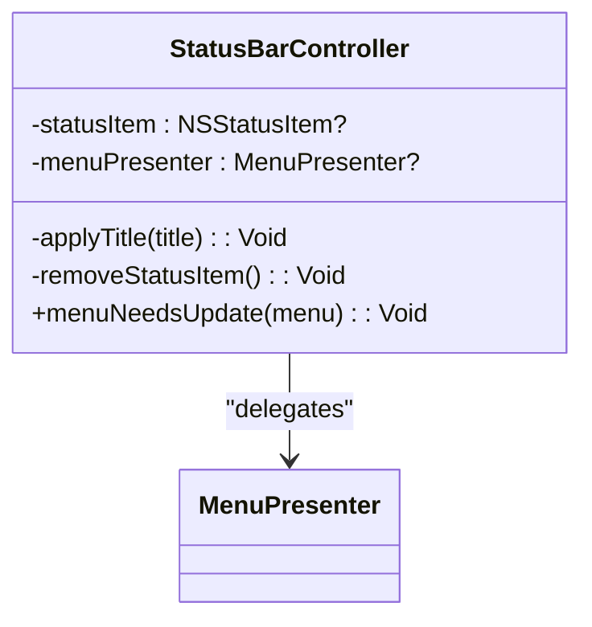

**Diagram sources**
- [iTip/StatusBarController.swift:1-68](file://iTip/StatusBarController.swift#L1-L68)

**Section sources**
- [iTip/StatusBarController.swift:1-68](file://iTip/StatusBarController.swift#L1-L68)

### AppLauncher
Responsibilities:
- Activates already-running apps or launches them by bundle identifier.
- Handles errors for missing apps and launch failures.

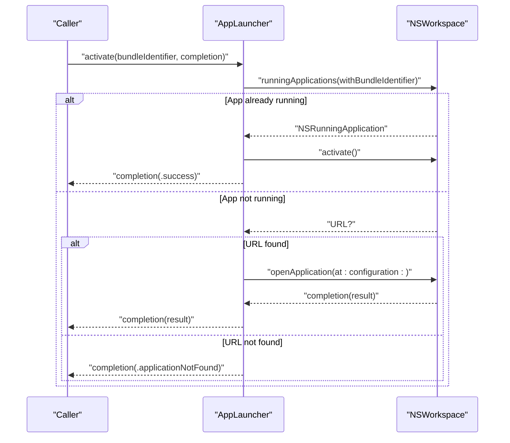

**Diagram sources**
- [iTip/AppLauncher.swift:1-40](file://iTip/AppLauncher.swift#L1-L40)

**Section sources**
- [iTip/AppLauncher.swift:1-40](file://iTip/AppLauncher.swift#L1-L40)

### IntegrationTests
Responsibilities:
- Validates end-to-end flows: activation recording, store persistence, ranking, and menu construction.
- Exercises scenarios with new and existing records, ensuring correct ordering and UI composition.

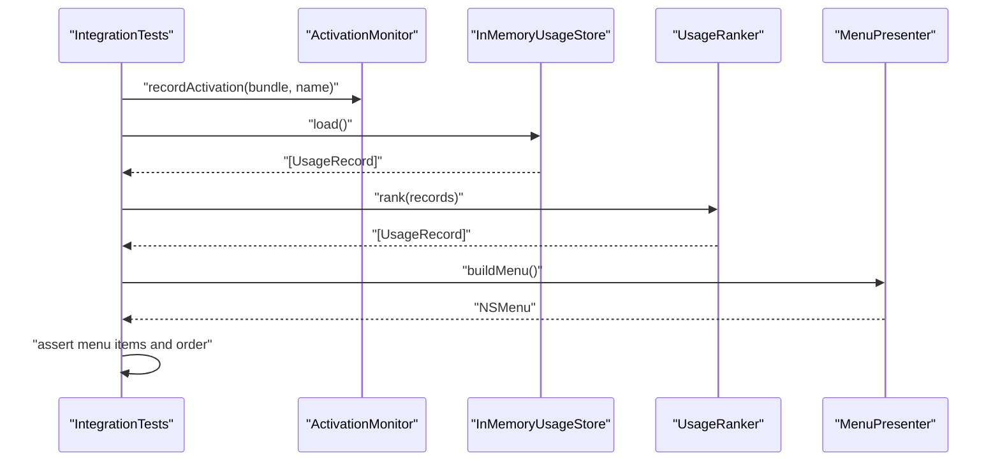

**Diagram sources**
- [iTipTests/IntegrationTests.swift:1-129](file://iTipTests/IntegrationTests.swift#L1-L129)

**Section sources**
- [iTipTests/IntegrationTests.swift:1-129](file://iTipTests/IntegrationTests.swift#L1-L129)

## Dependency Analysis
- AppDelegate depends on StatusBarController, MenuPresenter, UsageStore, UsageRanker, ActivationMonitor, and NetworkTracker.
- MenuPresenter depends on UsageStoreProtocol and UsageRanker.
- StatusBarController depends on MenuPresenter.
- AppLauncher is invoked by MenuPresenter actions.
- NetworkTracker depends on UsageStoreProtocol and NSWorkspace.
- UsageStore depends on Foundation and os.log.

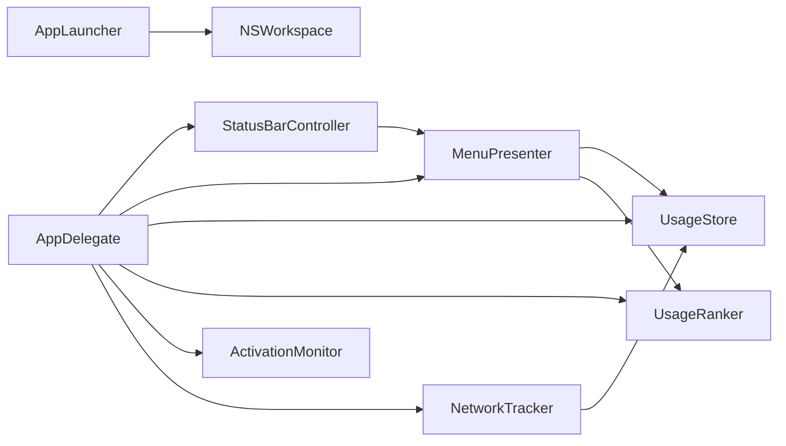

**Diagram sources**
- [iTip/AppDelegate.swift:1-75](file://iTip/AppDelegate.swift#L1-L75)
- [iTip/MenuPresenter.swift:1-233](file://iTip/MenuPresenter.swift#L1-L233)
- [iTip/StatusBarController.swift:1-68](file://iTip/StatusBarController.swift#L1-L68)
- [iTip/AppLauncher.swift:1-40](file://iTip/AppLauncher.swift#L1-L40)
- [iTip/NetworkTracker.swift:1-143](file://iTip/NetworkTracker.swift#L1-L143)
- [iTip/UsageStore.swift:1-107](file://iTip/UsageStore.swift#L1-L107)

**Section sources**
- [iTip/AppDelegate.swift:1-75](file://iTip/AppDelegate.swift#L1-L75)
- [iTip/MenuPresenter.swift:1-233](file://iTip/MenuPresenter.swift#L1-L233)
- [iTip/StatusBarController.swift:1-68](file://iTip/StatusBarController.swift#L1-L68)
- [iTip/AppLauncher.swift:1-40](file://iTip/AppLauncher.swift#L1-L40)
- [iTip/NetworkTracker.swift:1-143](file://iTip/NetworkTracker.swift#L1-L143)
- [iTip/UsageStore.swift:1-107](file://iTip/UsageStore.swift#L1-L107)

## Performance Considerations
- Disk I/O minimization:
  - ActivationMonitor caches records and flushes every 5 seconds to balance responsiveness and throughput.
  - UsageStore uses a serial queue and atomic writes to prevent corruption and reduce contention.
- UI responsiveness:
  - MenuPresenter caches icons and URL resolutions to avoid repeated filesystem and workspace lookups.
  - Menu rebuilds are performed on-demand and replace items efficiently.
- Background work:
  - NetworkTracker runs on a utility QoS queue and aggregates snapshots before persisting.
  - Spotlight seeding is dispatched asynchronously to avoid blocking launch.
- Memory footprint:
  - Prefix ranking limits displayed items to top-N.
  - Optional caches are keyed by bundle identifiers to bound growth.

[No sources needed since this section provides general guidance]

## Troubleshooting Guide
Common issues and remedies:
- App fails to launch after download:
  - Move the app to Applications and clear quarantine attributes before opening.
- Developer verification warnings:
  - Open the app via right-click → Open when prompted.
- App does not appear in menu bar:
  - Confirm monitoring availability and permissions; the menu indicates when monitoring is unavailable.
- Launch failures:
  - AppLauncher reports specific errors for missing apps or launch failures; verify bundle identifiers and app availability.

**Section sources**
- [README.md:14-40](file://README.md#L14-L40)
- [iTip/AppDelegate.swift:56-75](file://iTip/AppDelegate.swift#L56-L75)
- [iTip/AppLauncher.swift:1-40](file://iTip/AppLauncher.swift#L1-L40)

## Contribution Guidelines
- Branching and PRs:
  - Create feature branches from main and open pull requests targeting main.
  - Keep commits focused and include meaningful messages.
- Testing:
  - Add unit and integration tests covering new behavior.
  - Prefer deterministic tests with controlled dates and in-memory stores.
- Code style:
  - Use Swift naming conventions: Types PascalCase, properties camelCase, constants UPPER_SNAKE_CASE.
  - Group related logic with clear MARK comments.
  - Favor immutability and pure functions where appropriate.
- Dependencies:
  - Avoid introducing external dependencies; leverage AppKit and Foundation APIs.
- Accessibility and UX:
  - Respect template images for status bar icons.
  - Provide graceful fallbacks and user-friendly error messages.

[No sources needed since this section provides general guidance]

## Build and Deployment
- Local build:
  - Use xcodebuild with the iTip scheme and Release configuration.
  - Requires Xcode 16+ and macOS 14+.
- Packaging:
  - The CI signs and packages the app into a zip artifact suitable for distribution.
- Distribution:
  - Artifacts are uploaded and optionally released on pushes to main with a generated version tag.

**Section sources**
- [README.md:41-47](file://README.md#L41-L47)

## CI/CD Pipeline
The GitHub Actions workflow automates building, signing, packaging, and releasing:
- Environment: macOS 14 runner.
- Tool selection: Xcode 16 is selected via xcode-select.
- Build: xcodebuild with Release configuration and derivedDataPath.
- Package: codesigns the app, clears quarantine attributes, and creates a zip archive.
- Artifact: uploads the zipped app as “iTip-release”.
- Release: on main branch push, deletes any existing release with the same tag and creates a new one with metadata derived from the commit.

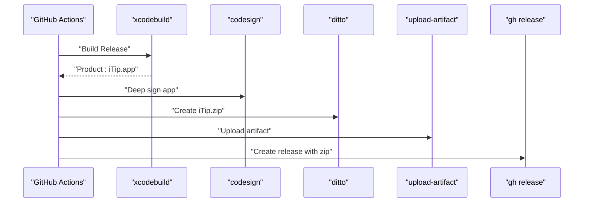

**Diagram sources**
- [.github/workflows/build.yml:1-64](file://.github/workflows/build.yml#L1-L64)

**Section sources**
- [.github/workflows/build.yml:1-64](file://.github/workflows/build.yml#L1-L64)

## Debugging and Profiling
Recommended macOS development tools:
- Instruments:
  - Use Time Profiler to identify CPU hotspots in menu building and network sampling.
  - Use Allocations and Leaks to detect memory regressions in caches and timers.
- Console and Logs:
  - Use os_log statements in UsageStore and related components to trace persistence issues.
- Xcode Debugger:
  - Set breakpoints in ActivationMonitor and NetworkTracker to inspect state transitions.
- UI Debugging:
  - Use View Debugger to inspect NSMenu and NSStatusItem rendering.
- Network Sampling:
  - Validate nettop invocation and CSV parsing in NetworkTracker by logging intermediate results.

[No sources needed since this section provides general guidance]

## Extending Functionality
Guidelines for adding features:
- New metrics:
  - Extend UsageRecord with new fields and update decoding with defaults for backward compatibility.
  - Update MenuPresenter formatting and sorting logic accordingly.
- New trackers:
  - Follow NetworkTracker’s pattern: periodic sampling, snapshot aggregation, and safe persistence with rollback on failure.
- UI enhancements:
  - Modify MenuPresenter to include new columns or actions; keep caching intact.
- Storage migrations:
  - Use UsageStore.updateRecords to evolve schema safely without breaking existing data.
- Permissions and availability:
  - Gate UI and actions behind isMonitoringAvailable checks and surface actionable messages to users.

**Section sources**
- [iTip/UsageRecord.swift:1-33](file://iTip/UsageRecord.swift#L1-L33)
- [iTip/MenuPresenter.swift:1-233](file://iTip/MenuPresenter.swift#L1-L233)
- [iTip/NetworkTracker.swift:1-143](file://iTip/NetworkTracker.swift#L1-L143)
- [iTip/UsageStore.swift:1-107](file://iTip/UsageStore.swift#L1-L107)

## Conclusion
This guide consolidates environment setup, architecture, testing, CI/CD, and development practices for iTip. By following the outlined conventions—modular components, careful persistence, responsive UI, and automated releases—you can confidently contribute features and maintain high-quality macOS applications.