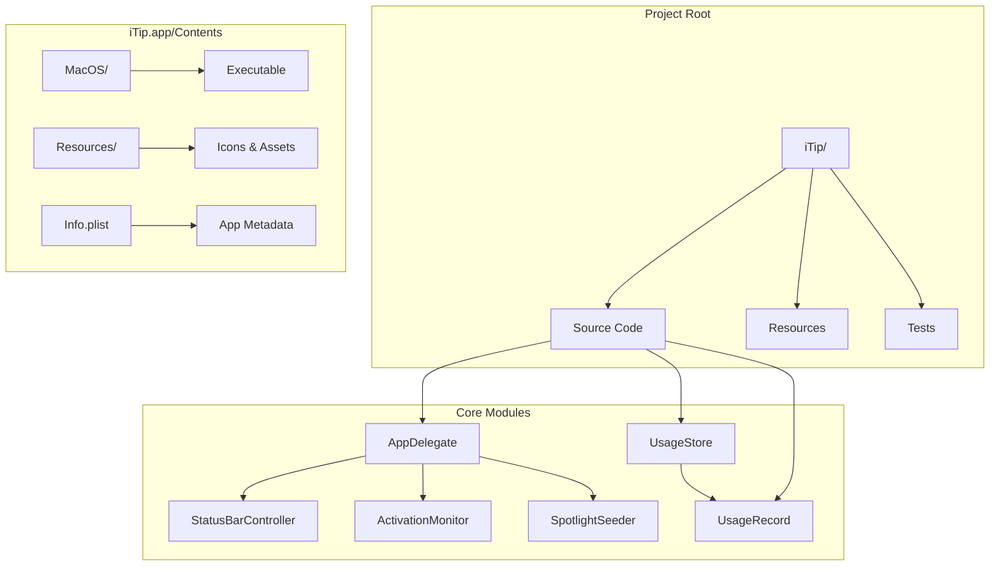
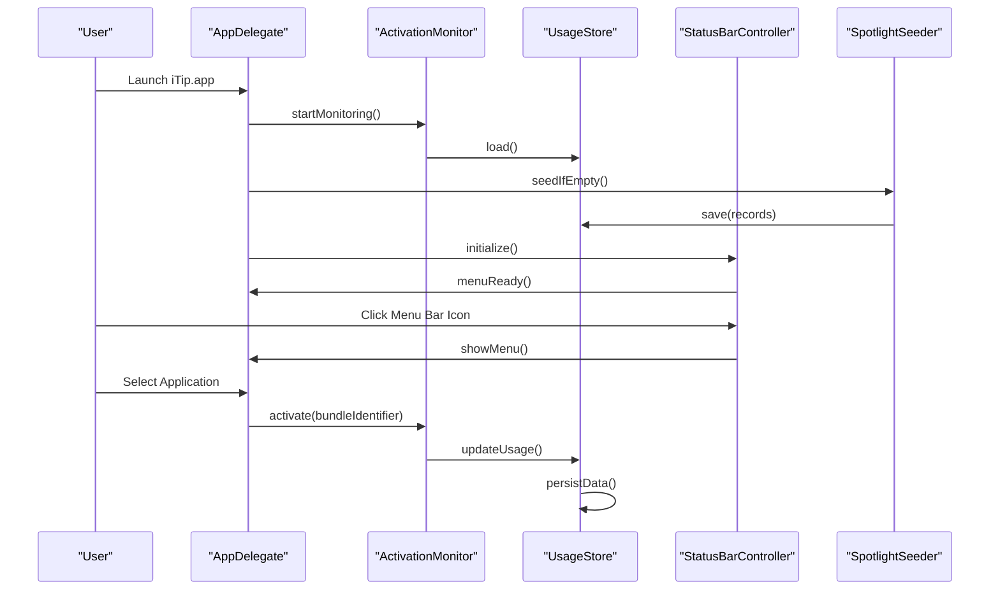

# Getting Started

<cite>
**Referenced Files in This Document**
- [README.md](file://README.md)
- [.github/workflows/build.yml](file://.github/workflows/build.yml)
- [iTip/Info.plist](file://iTip/Info.plist)
- [iTip.xcodeproj/project.pbxproj](file://iTip.xcodeproj/project.pbxproj)
- [iTip/main.swift](file://iTip/main.swift)
- [iTip/AppDelegate.swift](file://iTip/AppDelegate.swift)
- [iTip/StatusBarController.swift](file://iTip/StatusBarController.swift)
- [iTip/SpotlightSeeder.swift](file://iTip/SpotlightSeeder.swift)
- [iTip/ActivationMonitor.swift](file://iTip/ActivationMonitor.swift)
</cite>

## Table of Contents
1. [Introduction](#introduction)
2. [Project Structure](#project-structure)
3. [Core Components](#core-components)
4. [Architecture Overview](#architecture-overview)
5. [Installation and Setup](#installation-and-setup)
6. [Initial Permission Setup](#initial-permission-setup)
7. [Build Instructions](#build-instructions)
8. [Verification and Basic Testing](#verification-and-basic-testing)
9. [Troubleshooting Guide](#troubleshooting-guide)
10. [Conclusion](#conclusion)

## Introduction
iTip is a macOS menu bar application that automatically tracks your application usage habits and provides quick access to your most frequently used apps. It monitors application activations, maintains usage statistics, and integrates with Spotlight to pre-seed historical data.

## Project Structure
The project follows a standard macOS Swift application layout with a focus on menu bar integration and system-level monitoring capabilities.



**Diagram sources**
- [iTip/main.swift:1-8](file://iTip/main.swift#L1-L8)
- [iTip/AppDelegate.swift:1-75](file://iTip/AppDelegate.swift#L1-L75)
- [iTip/Info.plist:1-31](file://iTip/Info.plist#L1-L31)

**Section sources**
- [iTip/main.swift:1-8](file://iTip/main.swift#L1-L8)
- [iTip/AppDelegate.swift:1-75](file://iTip/AppDelegate.swift#L1-L75)
- [iTip/Info.plist:1-31](file://iTip/Info.plist#L1-L31)

## Core Components
The application consists of several interconnected components that work together to provide seamless menu bar functionality and system monitoring.

### Application Lifecycle Management
The application lifecycle is managed through a dedicated delegate that coordinates startup, monitoring, and shutdown procedures.

### Menu Bar Integration
The status bar controller handles menu bar icon display, menu construction, and user interaction handling.

### System Monitoring
The activation monitor tracks application activations using macOS workspace notifications and maintains usage statistics.

### Data Management
The usage store persists application usage data to disk, while the spotlight seeder pre-populates data from system Spotlight metadata.

**Section sources**
- [iTip/AppDelegate.swift:1-75](file://iTip/AppDelegate.swift#L1-L75)
- [iTip/StatusBarController.swift:1-68](file://iTip/StatusBarController.swift#L1-L68)
- [iTip/ActivationMonitor.swift:1-141](file://iTip/ActivationMonitor.swift#L1-L141)
- [iTip/SpotlightSeeder.swift:1-80](file://iTip/SpotlightSeeder.swift#L1-L80)

## Architecture Overview
The application follows a modular architecture with clear separation of concerns between UI, monitoring, and data persistence layers.



**Diagram sources**
- [iTip/AppDelegate.swift:9-34](file://iTip/AppDelegate.swift#L9-L34)
- [iTip/ActivationMonitor.swift:36-53](file://iTip/ActivationMonitor.swift#L36-L53)
- [iTip/SpotlightSeeder.swift:14-28](file://iTip/SpotlightSeeder.swift#L14-L28)
- [iTip/StatusBarController.swift:12-36](file://iTip/StatusBarController.swift#L12-L36)

## Installation and Setup

### System Requirements
- macOS 14.0 or later
- Xcode 16.0 or later

These requirements are enforced through both the project configuration and the GitHub Actions build pipeline.

### Downloading from GitHub Actions
The project provides pre-built releases through GitHub Actions. To download:

1. Navigate to the GitHub Actions workflow page
2. Select the latest successful build
3. Download the `iTip-release` artifact from the workflow artifacts

### Extracting the Double-Zipped Artifact
The downloaded artifact is a double-zipped archive requiring two extraction steps:

```bash
# Step 1: Extract the outer zip containing the inner zip
cd ~/Downloads
unzip iTip-release.zip

# Step 2: Extract the inner zip to temporary location
ditto -x -k iTip.zip /tmp/

# Step 3: Move to Applications folder (critical step)
mv /tmp/iTip.app /Applications/iTip.app
```

**Important**: The move operation is essential because macOS App Translocation prevents applications downloaded from the internet from running normally. Moving to `/Applications` removes the quarantine and allows proper execution.

### Clearing Quarantine Attributes
After moving to Applications, clear the quarantine attributes:

```bash
xattr -cr /Applications/iTip.app
```

This step removes the quarantine flag that macOS automatically applies to downloaded applications.

### Opening the Application
Launch the application using the open command:

```bash
open /Applications/iTip.app
```

**Section sources**
- [README.md:14-47](file://README.md#L14-L47)
- [.github/workflows/build.yml:14-21](file://.github/workflows/build.yml#L14-L21)
- [iTip/Info.plist:21-22](file://iTip/Info.plist#L21-L22)

## Initial Permission Setup

### macOS App Translocation Protection
When downloaded from the internet, macOS places applications in a quarantined state that prevents normal execution. The system moves these applications to a temporary location and applies security restrictions.

### Developer Warning Resolution
First-time launch may trigger a "cannot be verified" warning. To resolve:

1. Right-click the iTip icon in the menu bar
2. Select "Open" from the contextual menu
3. Confirm the warning dialog
4. The application will launch normally

This manual approval bypasses Gatekeeper's security restrictions for the specific application.

### Spotlight Integration Permissions
The application uses Spotlight metadata to pre-seed usage data. No additional permissions are required as Spotlight queries are performed internally by the system.

**Section sources**
- [README.md:36-39](file://README.md#L36-L39)

## Build Instructions

### Building from Source
The project can be built locally using xcodebuild with the following command:

```bash
xcodebuild -project iTip.xcodeproj -scheme iTip -configuration Release build
```

### Build Environment Requirements
The build process requires:
- Xcode 16.0+ selected via xcode-select
- macOS 14.0 SDK
- Swift 5.0 compiler

### Build Process Details
The GitHub Actions workflow demonstrates the complete build and packaging process:

1. Selects Xcode 16 as the active development environment
2. Builds the Release configuration with derived data output
3. Applies deep code signing for distribution
4. Removes quarantine attributes
5. Packages the application as a zip artifact

**Section sources**
- [README.md:41-47](file://README.md#L41-L47)
- [.github/workflows/build.yml:20-36](file://.github/workflows/build.yml#L20-L36)
- [iTip.xcodeproj/project.pbxproj:341-342](file://iTip.xcodeproj/project.pbxproj#L341-L342)

## Verification and Basic Testing

### Menu Bar Icon Visibility
After successful installation, verify the application is running by checking for the menu bar icon. The icon appears as a lightning bolt symbol in the macOS menu bar.

### Basic Functionality Testing
Test the core functionality by:

1. Clicking the menu bar icon to reveal the application menu
2. Verifying that recent applications appear in the menu
3. Selecting an application to test activation
4. Checking that usage statistics update after application launches

### Expected Behavior
- Menu bar icon displays immediately after launch
- Recent applications are listed with usage counts and timestamps
- Clicking an application activates it
- Usage data persists between launches

**Section sources**
- [iTip/StatusBarController.swift:22-30](file://iTip/StatusBarController.swift#L22-L30)
- [iTip/AppDelegate.swift:9-34](file://iTip/AppDelegate.swift#L9-L34)

## Troubleshooting Guide

### Common Installation Issues

#### Issue: Application Won't Launch After Download
**Symptoms**: Application opens briefly then closes, or shows "App not responding"
**Solution**: Ensure the application was moved from Downloads to Applications before launching

#### Issue: "Cannot be verified" Warning Reappears
**Symptoms**: Gatekeeper warning appears every time the application starts
**Solution**: Right-click the menu bar icon and select "Open" to approve the developer

#### Issue: Menu Bar Icon Not Visible
**Symptoms**: Application launches but no menu bar icon appears
**Solution**: Check that the application has proper permissions and is not quarantined

#### Issue: Applications Not Appearing in Menu
**Symptoms**: Menu shows empty or limited application list
**Solution**: Verify Spotlight indexing is enabled and the application has proper permissions

### Diagnostic Steps
1. Verify system requirements (macOS 14+, Xcode 16+)
2. Check that quarantine attributes were removed
3. Confirm the application is located in `/Applications`
4. Review system logs for permission-related errors
5. Test with a different user account to isolate profile-specific issues

### Permission-Related Issues
The application requires:
- Access to application activation events
- Read access to Spotlight metadata
- Write access to local storage for usage data

If any of these permissions are denied, the application may not function correctly.

**Section sources**
- [README.md:36-39](file://README.md#L36-L39)
- [iTip/ActivationMonitor.swift:36-53](file://iTip/ActivationMonitor.swift#L36-L53)
- [iTip/SpotlightSeeder.swift:14-28](file://iTip/SpotlightSeeder.swift#L14-L28)

## Conclusion
iTip provides a streamlined solution for tracking and accessing your most-used macOS applications. The installation process, while requiring careful attention to macOS security mechanisms, enables powerful functionality for application usage monitoring and quick switching. By following the outlined steps and understanding the permission requirements, users can successfully deploy and utilize iTip for enhanced productivity.

The application's architecture ensures reliable operation through proper separation of concerns, with clear pathways for monitoring, data persistence, and user interface integration. Regular updates through the GitHub Actions pipeline ensure users receive the latest features and security improvements.