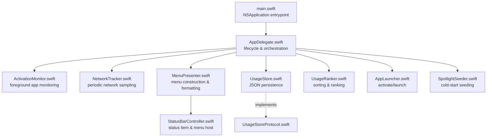
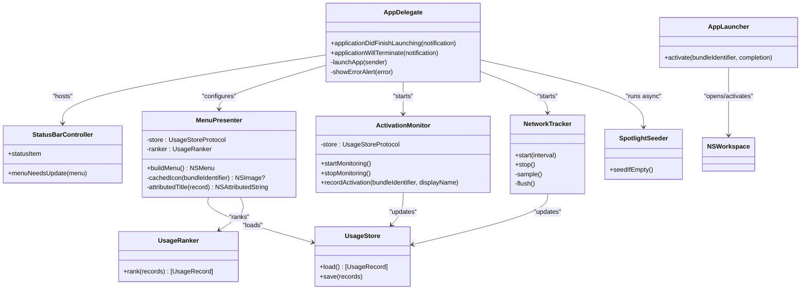
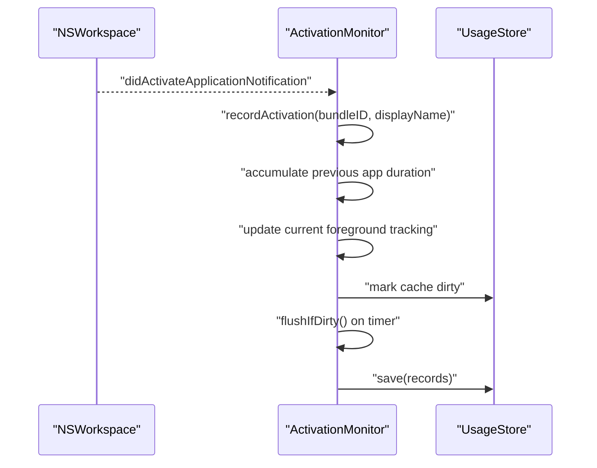
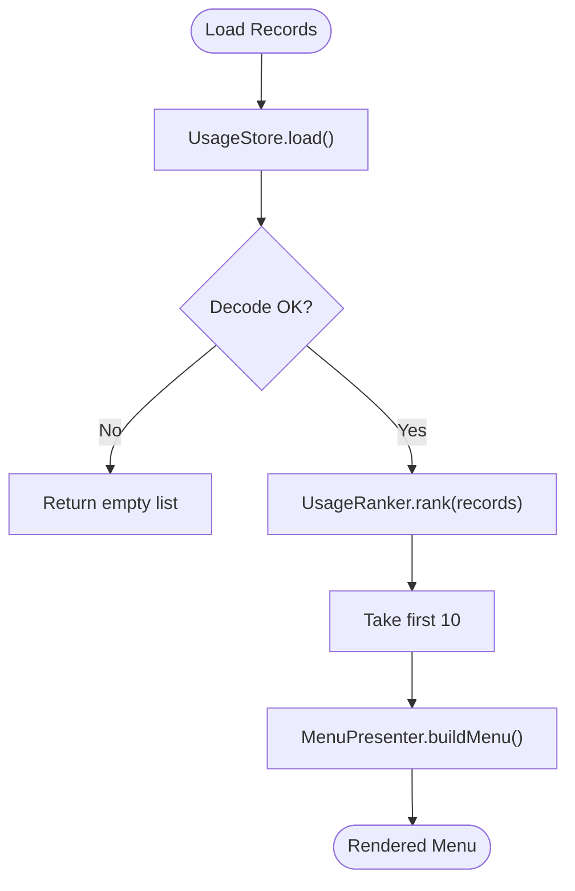
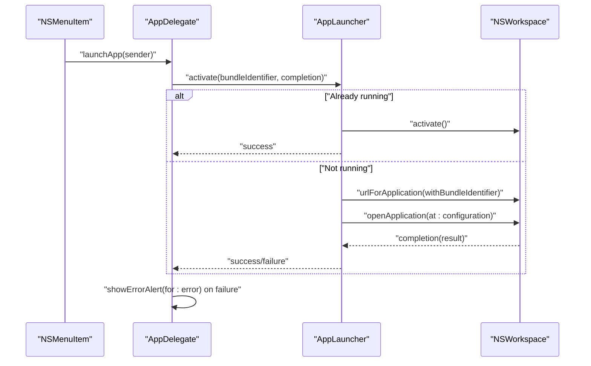
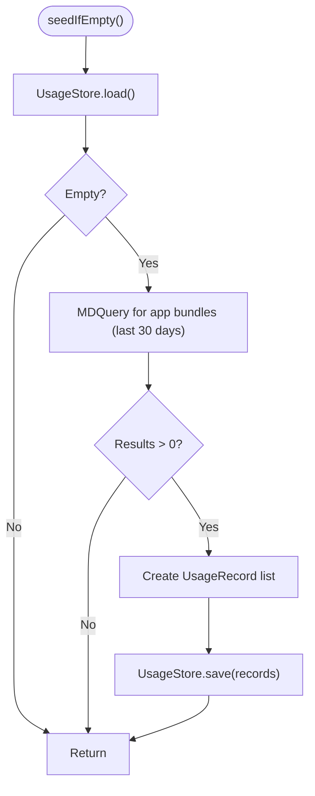
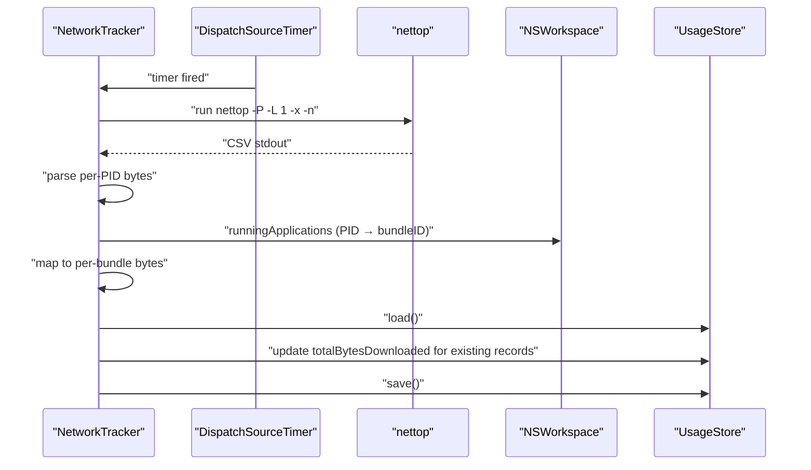
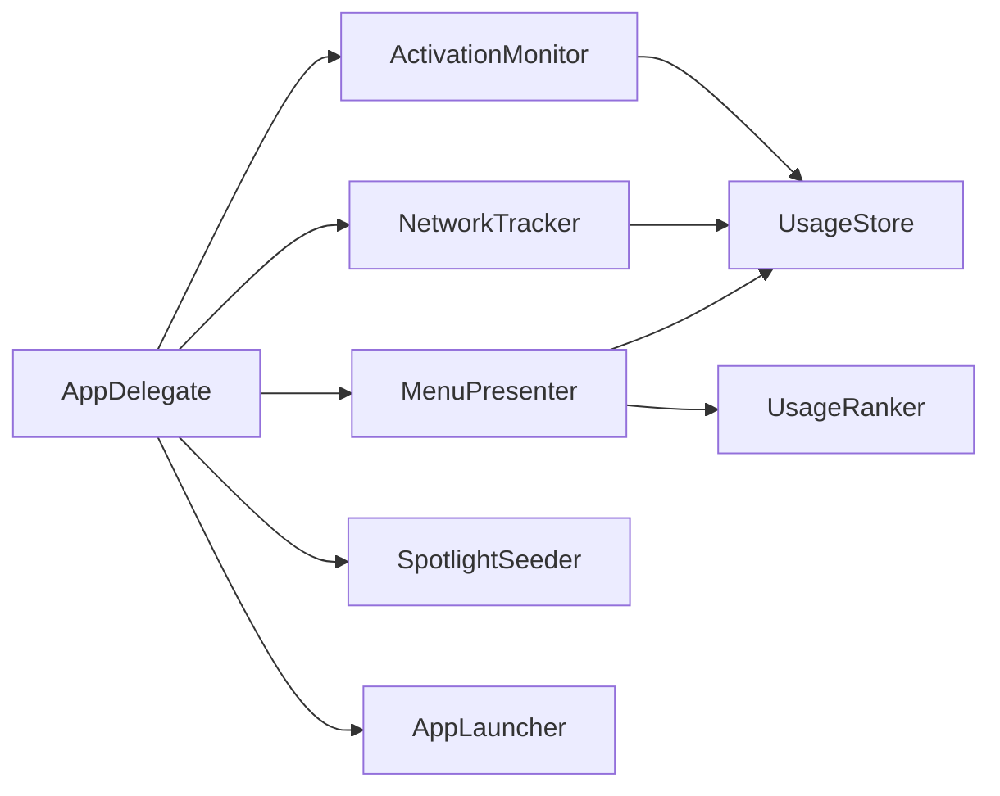

# Project Overview

<cite>
**Referenced Files in This Document**
- [README.md](file://README.md)
- [main.swift](file://iTip/main.swift)
- [AppDelegate.swift](file://iTip/AppDelegate.swift)
- [Info.plist](file://iTip/Info.plist)
- [StatusBarController.swift](file://iTip/StatusBarController.swift)
- [MenuPresenter.swift](file://iTip/MenuPresenter.swift)
- [ActivationMonitor.swift](file://iTip/ActivationMonitor.swift)
- [UsageStore.swift](file://iTip/UsageStore.swift)
- [UsageStoreProtocol.swift](file://iTip/UsageStoreProtocol.swift)
- [UsageRanker.swift](file://iTip/UsageRanker.swift)
- [UsageRecord.swift](file://iTip/UsageRecord.swift)
- [AppLauncher.swift](file://iTip/AppLauncher.swift)
- [SpotlightSeeder.swift](file://iTip/SpotlightSeeder.swift)
- [NetworkTracker.swift](file://iTip/NetworkTracker.swift)
- [IntegrationTests.swift](file://iTipTests/IntegrationTests.swift)
</cite>

## Table of Contents
1. [Introduction](#introduction)
2. [Project Structure](#project-structure)
3. [Core Components](#core-components)
4. [Architecture Overview](#architecture-overview)
5. [Detailed Component Analysis](#detailed-component-analysis)
6. [Dependency Analysis](#dependency-analysis)
7. [Performance Considerations](#performance-considerations)
8. [Troubleshooting Guide](#troubleshooting-guide)
9. [Conclusion](#conclusion)
10. [Appendices](#appendices)

## Introduction
iTip is a macOS menu bar application designed to automatically track your application usage and provide one-click access to your most frequently used apps. It integrates seamlessly with the macOS ecosystem, leveraging NSWorkspace notifications, Spotlight metadata, and AppKit UI components to deliver a fast, efficient, and privacy-conscious way to discover and launch apps.

Key capabilities:
- Real-time application activation monitoring via NSWorkspace notifications
- Usage statistics collection including activation counts, cumulative active time, and network traffic metrics
- Intelligent ranking algorithms that prioritize recency and frequency
- One-click launching and activation of applications
- Cold-start seeding from Spotlight metadata
- Automatic cleanup of uninstalled applications
- Menu bar integration using NSStatusItem and NSMenu

System requirements:
- Xcode 16+
- macOS 14+

These capabilities are implemented using Swift and AppKit, with a clean separation of concerns across monitoring, storage, ranking, presentation, and launching.

## Project Structure
The project follows a modular structure centered around a small set of cohesive components:
- Entry point initializes the NSApplication lifecycle and sets the accessory activation policy
- AppDelegate orchestrates subsystems: activation monitoring, network sampling, menu building, and Spotlight seeding
- StatusBarController renders the menu bar icon and hosts the NSMenu
- MenuPresenter builds dynamic menus, formats usage statistics, and handles user interactions
- ActivationMonitor captures foreground app activations and updates in-memory caches
- UsageStore persists and loads usage records to/from disk
- UsageRanker sorts and limits the displayed list
- AppLauncher activates or launches apps using NSWorkspace
- SpotlightSeeder pre-seeds the store on cold start using Spotlight metadata
- NetworkTracker periodically samples per-process network usage and aggregates bytes per app

**Diagram sources**
- [main.swift:1-8](file://iTip/main.swift#L1-L8)
- [AppDelegate.swift:9-34](file://iTip/AppDelegate.swift#L9-L34)
- [ActivationMonitor.swift:36-53](file://iTip/ActivationMonitor.swift#L36-L53)
- [NetworkTracker.swift:20-28](file://iTip/NetworkTracker.swift#L20-L28)
- [MenuPresenter.swift:36-112](file://iTip/MenuPresenter.swift#L36-L112)
- [StatusBarController.swift:12-36](file://iTip/StatusBarController.swift#L12-L36)
- [UsageStore.swift:24-65](file://iTip/UsageStore.swift#L24-L65)
- [UsageStoreProtocol.swift:3-6](file://iTip/UsageStoreProtocol.swift#L3-L6)
- [UsageRanker.swift:4-14](file://iTip/UsageRanker.swift#L4-L14)
- [AppLauncher.swift:11-38](file://iTip/AppLauncher.swift#L11-L38)
- [SpotlightSeeder.swift:14-28](file://iTip/SpotlightSeeder.swift#L14-L28)

**Section sources**
- [README.md:14-47](file://README.md#L14-L47)
- [Info.plist:21-28](file://iTip/Info.plist#L21-L28)
- [main.swift:1-8](file://iTip/main.swift#L1-L8)
- [AppDelegate.swift:9-34](file://iTip/AppDelegate.swift#L9-L34)

## Core Components
- Application lifecycle and menu bar integration
  - NSApplication initialization with accessory activation policy
  - NSStatusItem hosting and delegate-driven menu updates
- Real-time activation monitoring
  - NSWorkspace foreground app notifications
  - In-memory caching and periodic debounced writes
- Usage statistics and ranking
  - UsageRecord model with backward-compatible decoding
  - Sorting by last activation time and activation count
- Menu presentation and UX
  - Dynamic NSMenu construction with icons, formatted stats, and separators
  - Monospaced digits and relative time formatting
- Persistence and cold-start seeding
  - JSON-backed store with thread-safe queues
  - Spotlight metadata seeding for recent apps
- Network telemetry
  - Periodic sampling via nettop and aggregation per bundle identifier
- Launching and activation
  - NSRunningApplication activation or NSWorkspace launch with OpenConfiguration

Practical outcomes:
- Users see top 10 frequently used apps with usage counts, cumulative active time, and recent traffic
- Clicking an item activates or launches the app instantly
- On first launch, Spotlight data pre-fills the list to provide immediate value

**Section sources**
- [AppDelegate.swift:9-34](file://iTip/AppDelegate.swift#L9-L34)
- [StatusBarController.swift:12-36](file://iTip/StatusBarController.swift#L12-L36)
- [MenuPresenter.swift:36-112](file://iTip/MenuPresenter.swift#L36-L112)
- [ActivationMonitor.swift:36-64](file://iTip/ActivationMonitor.swift#L36-L64)
- [UsageStore.swift:24-65](file://iTip/UsageStore.swift#L24-L65)
- [UsageRanker.swift:4-14](file://iTip/UsageRanker.swift#L4-L14)
- [UsageRecord.swift:3-32](file://iTip/UsageRecord.swift#L3-L32)
- [AppLauncher.swift:11-38](file://iTip/AppLauncher.swift#L11-L38)
- [SpotlightSeeder.swift:14-28](file://iTip/SpotlightSeeder.swift#L14-L28)
- [NetworkTracker.swift:20-78](file://iTip/NetworkTracker.swift#L20-L78)

## Architecture Overview
The application architecture centers on a small number of focused components communicating through well-defined protocols and AppKit APIs.

**Diagram sources**
- [AppDelegate.swift:3-74](file://iTip/AppDelegate.swift#L3-L74)
- [StatusBarController.swift:3-67](file://iTip/StatusBarController.swift#L3-L67)
- [MenuPresenter.swift:3-34](file://iTip/MenuPresenter.swift#L3-L34)
- [ActivationMonitor.swift:3-34](file://iTip/ActivationMonitor.swift#L3-L34)
- [NetworkTracker.swift:6-17](file://iTip/NetworkTracker.swift#L6-L17)
- [UsageStore.swift:4-66](file://iTip/UsageStore.swift#L4-L66)
- [UsageRanker.swift:3-15](file://iTip/UsageRanker.swift#L3-L15)
- [AppLauncher.swift:8-39](file://iTip/AppLauncher.swift#L8-L39)
- [SpotlightSeeder.swift:6-28](file://iTip/SpotlightSeeder.swift#L6-L28)

## Detailed Component Analysis

### Real-time Activation Monitoring
ActivationMonitor listens for NSWorkspace foreground app activation notifications and maintains an in-memory cache of usage records. It debounces writes to disk using a periodic timer and tracks foreground duration for the previously active app. This ensures accurate cumulative active time and minimizes I/O overhead.

**Diagram sources**
- [ActivationMonitor.swift:40-64](file://iTip/ActivationMonitor.swift#L40-L64)
- [ActivationMonitor.swift:122-126](file://iTip/ActivationMonitor.swift#L122-L126)
- [UsageStore.swift:51-65](file://iTip/UsageStore.swift#L51-L65)

**Section sources**
- [ActivationMonitor.swift:36-141](file://iTip/ActivationMonitor.swift#L36-L141)
- [UsageStore.swift:24-65](file://iTip/UsageStore.swift#L24-L65)

### Usage Statistics Collection and Ranking
UsageStore persists UsageRecord arrays to a JSON file under Application Support. UsageRanker sorts records by last activation time (descending), with activation count as a tiebreaker, and limits the output to the top 10. MenuPresenter consumes these records to render the menu with icons and formatted statistics.

**Diagram sources**
- [UsageStore.swift:24-48](file://iTip/UsageStore.swift#L24-L48)
- [UsageRanker.swift:4-14](file://iTip/UsageRanker.swift#L4-L14)
- [MenuPresenter.swift:46-112](file://iTip/MenuPresenter.swift#L46-L112)

**Section sources**
- [UsageStore.swift:24-65](file://iTip/UsageStore.swift#L24-L65)
- [UsageRanker.swift:4-14](file://iTip/UsageRanker.swift#L4-L14)
- [MenuPresenter.swift:36-112](file://iTip/MenuPresenter.swift#L36-L112)
- [UsageRecord.swift:3-32](file://iTip/UsageRecord.swift#L3-L32)

### One-Click Application Launching
AppLauncher checks if an app is already running and activates it, otherwise resolves the app path via NSWorkspace and launches it with OpenConfiguration to ensure activation. Errors are surfaced to the user through an NSAlert.

**Diagram sources**
- [AppDelegate.swift:43-73](file://iTip/AppDelegate.swift#L43-L73)
- [AppLauncher.swift:11-38](file://iTip/AppLauncher.swift#L11-L38)

**Section sources**
- [AppLauncher.swift:8-39](file://iTip/AppLauncher.swift#L8-L39)
- [AppDelegate.swift:43-73](file://iTip/AppDelegate.swift#L43-L73)

### Cold-Start Seeding from Spotlight
SpotlightSeeder queries the Spotlight index for recently used application bundles and seeds the store with UsageRecord entries when the store is empty. This provides immediate value upon first launch.

**Diagram sources**
- [SpotlightSeeder.swift:14-28](file://iTip/SpotlightSeeder.swift#L14-L28)
- [SpotlightSeeder.swift:32-78](file://iTip/SpotlightSeeder.swift#L32-L78)
- [UsageStore.swift:51-65](file://iTip/UsageStore.swift#L51-L65)

**Section sources**
- [SpotlightSeeder.swift:6-79](file://iTip/SpotlightSeeder.swift#L6-L79)
- [UsageStore.swift:24-65](file://iTip/UsageStore.swift#L24-L65)

### Network Telemetry Sampling
NetworkTracker periodically runs nettop to capture per-process network input bytes, maps PIDs to bundle identifiers, accumulates bytes per app, and updates existing records in the store without creating new ones.

**Diagram sources**
- [NetworkTracker.swift:20-78](file://iTip/NetworkTracker.swift#L20-L78)
- [NetworkTracker.swift:80-141](file://iTip/NetworkTracker.swift#L80-L141)
- [UsageStore.swift:51-65](file://iTip/UsageStore.swift#L51-L65)

**Section sources**
- [NetworkTracker.swift:6-142](file://iTip/NetworkTracker.swift#L6-L142)
- [UsageStore.swift:24-65](file://iTip/UsageStore.swift#L24-L65)

## Dependency Analysis
The codebase exhibits low coupling and high cohesion:
- UsageStoreProtocol decouples persistence from consumers
- MenuPresenter depends on UsageStoreProtocol and UsageRanker
- ActivationMonitor and NetworkTracker depend on UsageStoreProtocol
- AppLauncher depends on NSWorkspace and NSRunningApplication
- SpotlightSeeder depends on UsageStoreProtocol and MDQuery/Metadata APIs

**Diagram sources**
- [AppDelegate.swift:9-34](file://iTip/AppDelegate.swift#L9-L34)
- [MenuPresenter.swift:31-34](file://iTip/MenuPresenter.swift#L31-L34)
- [ActivationMonitor.swift:30-31](file://iTip/ActivationMonitor.swift#L30-L31)
- [NetworkTracker.swift:15-16](file://iTip/NetworkTracker.swift#L15-L16)
- [SpotlightSeeder.swift:10-11](file://iTip/SpotlightSeeder.swift#L10-L11)
- [UsageStoreProtocol.swift:3-6](file://iTip/UsageStoreProtocol.swift#L3-L6)
- [UsageRanker.swift:3-15](file://iTip/UsageRanker.swift#L3-L15)
- [AppLauncher.swift:8-39](file://iTip/AppLauncher.swift#L8-L39)

**Section sources**
- [UsageStoreProtocol.swift:3-6](file://iTip/UsageStoreProtocol.swift#L3-L6)
- [MenuPresenter.swift:31-34](file://iTip/MenuPresenter.swift#L31-L34)
- [ActivationMonitor.swift:30-31](file://iTip/ActivationMonitor.swift#L30-L31)
- [NetworkTracker.swift:15-16](file://iTip/NetworkTracker.swift#L15-L16)
- [SpotlightSeeder.swift:10-11](file://iTip/SpotlightSeeder.swift#L10-L11)
- [AppLauncher.swift:8-39](file://iTip/AppLauncher.swift#L8-L39)

## Performance Considerations
- Debounced writes: ActivationMonitor flushes changes every 5 seconds to reduce disk I/O
- In-memory caching: UsageStore caches records to minimize repeated disk reads
- Background seeding: Spotlight seeding runs asynchronously after UI readiness
- Efficient parsing: NetworkTracker parses nettop output and aggregates per bundle efficiently
- UI updates: MenuPresenter rebuilds menus on demand and caches icons and URLs

Recommendations:
- Keep the store size bounded by limiting retained records (already implicitly handled by ranking top 10)
- Consider increasing the save interval for very high-activity environments
- Monitor nettop invocation frequency to balance accuracy and resource usage

[No sources needed since this section provides general guidance]

## Troubleshooting Guide
Common scenarios and resolutions:
- Application not found during launch
  - AppLauncher reports application not found when NSWorkspace cannot resolve the bundle identifier
  - Resolution: Verify the app is installed and accessible; iTip will auto-clean invalid entries
- Launch failures
  - AppLauncher surfaces underlying errors from NSWorkspace
  - Resolution: Check system permissions and app integrity
- Monitoring unavailable
  - MenuPresenter displays a warning when activation monitoring is inactive
  - Resolution: Ensure Accessibility permissions are granted to iTip
- No recent apps
  - MenuPresenter shows a disabled “No recent apps” message when the store is empty
  - Resolution: Allow some usage or rely on Spotlight seeding on first launch

**Section sources**
- [AppLauncher.swift:3-6](file://iTip/AppLauncher.swift#L3-L6)
- [AppLauncher.swift:58-73](file://iTip/AppLauncher.swift#L58-L73)
- [MenuPresenter.swift:39-44](file://iTip/MenuPresenter.swift#L39-L44)
- [MenuPresenter.swift:81-84](file://iTip/MenuPresenter.swift#L81-L84)

## Conclusion
iTip delivers a streamlined, privacy-respecting solution for discovering and launching your most-used macOS applications. Its architecture balances simplicity and performance, leveraging AppKit and system frameworks to provide a responsive menu bar experience. The modular design supports easy maintenance and future enhancements, while the integration with Spotlight and NSWorkspace ensures deep macOS ecosystem compatibility.

[No sources needed since this section summarizes without analyzing specific files]

## Appendices

### Target Audience and Use Cases
- Power users who want quick access to frequently used apps without leaving the menu bar
- Developers and analysts who benefit from cumulative usage insights and network telemetry
- Anyone seeking a lightweight, automatic application launcher integrated into macOS

Primary use cases:
- Application switching: Click an app in the menu to bring it to the foreground
- Usage discovery: Review recent activity, counts, and cumulative time
- Network awareness: Observe per-app download activity over time

[No sources needed since this section provides general guidance]

### System Requirements and Permissions
- Xcode 16+
- macOS 14+
- Accessibility permission for activation monitoring
- Optional Spotlight indexing for cold-start seeding

**Section sources**
- [README.md:47](file://README.md#L47)
- [Info.plist:21-26](file://iTip/Info.plist#L21-L26)

### Example Workflows
- Switching applications
  - Click the iTip icon → select an app → the app activates immediately
- Discovering usage
  - Open the menu → review counts, active time, and recent traffic → choose an app
- First-launch seeding
  - iTip checks Spotlight for recent apps and populates the list automatically

**Section sources**
- [AppDelegate.swift:28-33](file://iTip/AppDelegate.swift#L28-L33)
- [SpotlightSeeder.swift:14-28](file://iTip/SpotlightSeeder.swift#L14-L28)
- [MenuPresenter.swift:36-112](file://iTip/MenuPresenter.swift#L36-L112)

### Integration Notes
- NSWorkspace: Foreground app notifications, app resolution, and launching
- NSStatusItem: Persistent menu bar presence with SF Symbol icon
- Spotlight (Metadata): Cold-start seeding using kMDItemLastUsedDate and kMDItemUseCount
- nettop: Periodic per-process network sampling for download bytes

**Section sources**
- [ActivationMonitor.swift:40-46](file://iTip/ActivationMonitor.swift#L40-L46)
- [StatusBarController.swift:23-29](file://iTip/StatusBarController.swift#L23-L29)
- [SpotlightSeeder.swift:32-78](file://iTip/SpotlightSeeder.swift#L32-L78)
- [NetworkTracker.swift:80-141](file://iTip/NetworkTracker.swift#L80-L141)