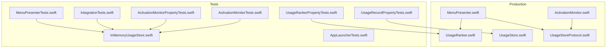
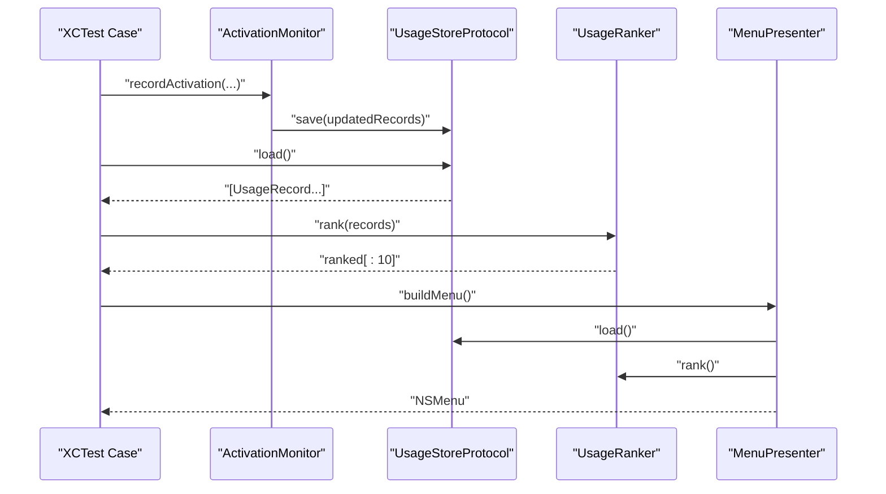
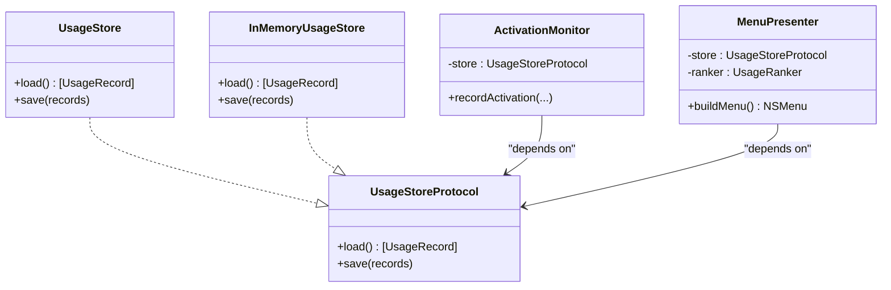

# Testing Strategy

<cite>
**Referenced Files in This Document**
- [ActivationMonitor.swift](file://iTip/ActivationMonitor.swift)
- [UsageRanker.swift](file://iTip/UsageRanker.swift)
- [UsageStore.swift](file://iTip/UsageStore.swift)
- [MenuPresenter.swift](file://iTip/MenuPresenter.swift)
- [UsageStoreProtocol.swift](file://iTip/UsageStoreProtocol.swift)
- [ActivationMonitorTests.swift](file://iTipTests/ActivationMonitorTests.swift)
- [ActivationMonitorPropertyTests.swift](file://iTipTests/ActivationMonitorPropertyTests.swift)
- [IntegrationTests.swift](file://iTipTests/IntegrationTests.swift)
- [InMemoryUsageStore.swift](file://iTipTests/InMemoryUsageStore.swift)
- [MenuPresenterTests.swift](file://iTipTests/MenuPresenterTests.swift)
- [UsageRankerPropertyTests.swift](file://iTipTests/UsageRankerPropertyTests.swift)
- [UsageRecordPropertyTests.swift](file://iTipTests/UsageRecordPropertyTests.swift)
- [AppLauncherTests.swift](file://iTipTests/AppLauncherTests.swift)
- [build.yml](file://.github/workflows/build.yml)
- [tasks.md](file://.kiro/specs/macos-menu-bar-app/tasks.md)
- [README.md](file://README.md)
</cite>

## Table of Contents
1. [Introduction](#introduction)
2. [Project Structure](#project-structure)
3. [Core Components](#core-components)
4. [Architecture Overview](#architecture-overview)
5. [Detailed Component Analysis](#detailed-component-analysis)
6. [Dependency Analysis](#dependency-analysis)
7. [Performance Considerations](#performance-considerations)
8. [Troubleshooting Guide](#troubleshooting-guide)
9. [Conclusion](#conclusion)
10. [Appendices](#appendices)

## Introduction
This document describes iTip’s quality assurance approach across unit, property-based, integration, and CI validation. It covers:
- Unit testing strategy for individual components with mocks and deterministic scenarios
- Property-based testing for data structures and algorithmic correctness
- Integration testing for end-to-end workflows and component interactions
- Automated CI pipeline and release packaging
- Coverage analysis, edge-case handling, and regression prevention
- Guidelines for writing effective tests, mocking external dependencies, and validating component interactions
- Continuous integration testing, automated deployment validation, and quality gates

## Project Structure
The repository is organized around a macOS menu bar app with a clear separation between production code and tests. The tests target the core domain logic and UI integration points, using a protocol-driven design to enable dependency injection and isolation.

**Diagram sources**
- [ActivationMonitor.swift](file://iTip/ActivationMonitor.swift)
- [UsageRanker.swift](file://iTip/UsageRanker.swift)
- [UsageStore.swift](file://iTip/UsageStore.swift)
- [MenuPresenter.swift](file://iTip/MenuPresenter.swift)
- [UsageStoreProtocol.swift](file://iTip/UsageStoreProtocol.swift)
- [ActivationMonitorTests.swift](file://iTipTests/ActivationMonitorTests.swift)
- [ActivationMonitorPropertyTests.swift](file://iTipTests/ActivationMonitorPropertyTests.swift)
- [IntegrationTests.swift](file://iTipTests/IntegrationTests.swift)
- [InMemoryUsageStore.swift](file://iTipTests/InMemoryUsageStore.swift)
- [MenuPresenterTests.swift](file://iTipTests/MenuPresenterTests.swift)
- [UsageRankerPropertyTests.swift](file://iTipTests/UsageRankerPropertyTests.swift)
- [UsageRecordPropertyTests.swift](file://iTipTests/UsageRecordPropertyTests.swift)
- [AppLauncherTests.swift](file://iTipTests/AppLauncherTests.swift)

**Section sources**
- [README.md:1-48](file://README.md#L1-L48)

## Core Components
- ActivationMonitor: Captures app activation events, updates in-memory cache, and periodically persists to the store. It filters self-activations and handles missing identifiers gracefully.
- UsageRanker: Pure sorting logic that ranks records by last activated time and activation count, capped at 10 items.
- UsageStore: Implements persistent storage with JSON serialization, caching, and safe writes.
- MenuPresenter: Builds the NSMenu from ranked records, resolves app URLs, caches icons and URLs, and removes unresolvable entries.
- UsageStoreProtocol: Enables injecting test doubles (e.g., InMemoryUsageStore) for deterministic testing.

Key testing enablers:
- Protocol-based design allows injecting test stores and deterministic date providers.
- SwiftCheck-based property tests validate universal invariants across large input spaces.
- Integration tests validate end-to-end flows with an in-memory store.

**Section sources**
- [ActivationMonitor.swift:1-141](file://iTip/ActivationMonitor.swift#L1-L141)
- [UsageRanker.swift:1-16](file://iTip/UsageRanker.swift#L1-L16)
- [UsageStore.swift:1-67](file://iTip/UsageStore.swift#L1-L67)
- [MenuPresenter.swift:1-233](file://iTip/MenuPresenter.swift#L1-L233)
- [UsageStoreProtocol.swift](file://iTip/UsageStoreProtocol.swift)

## Architecture Overview
The testing architecture leverages dependency injection and protocol abstraction to isolate components and enable deterministic scenarios. Property-based tests assert global invariants, while unit tests validate specific behaviors and edge cases. Integration tests exercise the full pipeline with an in-memory store.

**Diagram sources**
- [ActivationMonitor.swift:66-118](file://iTip/ActivationMonitor.swift#L66-L118)
- [UsageStore.swift:51-65](file://iTip/UsageStore.swift#L51-L65)
- [UsageRanker.swift:4-14](file://iTip/UsageRanker.swift#L4-L14)
- [MenuPresenter.swift:36-112](file://iTip/MenuPresenter.swift#L36-L112)
- [InMemoryUsageStore.swift:4-18](file://iTipTests/InMemoryUsageStore.swift#L4-L18)

## Detailed Component Analysis

### Unit Testing Strategy
- Isolated scenarios: Each test focuses on a single requirement or behavior, using deterministic inputs and controlled environments.
- Mocking external dependencies: Tests inject an in-memory store and a fixed date provider to eliminate flakiness.
- Edge case handling: Tests cover missing identifiers, self-filtering, and unresolvable bundle identifiers.

Examples of unit tests:
- ActivationMonitor self-filtering and fallback behavior
- New vs existing record creation and updates
- MenuPresenter empty-state and unresolvable entries
- AppLauncher error handling for unknown bundle identifiers

Guidelines:
- Prefer deterministic Date providers and in-memory stores for reproducibility.
- Validate side effects (store writes) via store inspection rather than relying on timing.
- Assert observable outcomes (menu items, store contents) rather than internal state.

**Section sources**
- [ActivationMonitorTests.swift:1-102](file://iTipTests/ActivationMonitorTests.swift#L1-L102)
- [MenuPresenterTests.swift:1-91](file://iTipTests/MenuPresenterTests.swift#L1-L91)
- [AppLauncherTests.swift:1-33](file://iTipTests/AppLauncherTests.swift#L1-L33)
- [InMemoryUsageStore.swift:1-19](file://iTipTests/InMemoryUsageStore.swift#L1-L19)

### Property-Based Testing Strategy
Property-based tests define universal invariants that must hold for all valid inputs generated by SwiftCheck. They increase confidence in correctness and surface edge cases missed by hand-written examples.

Coverage:
- UsageRecord serialization round-trip
- UsageRanker sort correctness, idempotency, and output size limits
- ActivationMonitor recordActivation behavior for existing and new records

Validation approach:
- Generate large sets of random UsageRecord lists with constraints.
- Run assertions over the entire generated space with a minimum number of successful tests.

**Section sources**
- [UsageRecordPropertyTests.swift:1-52](file://iTipTests/UsageRecordPropertyTests.swift#L1-L52)
- [UsageRankerPropertyTests.swift:1-76](file://iTipTests/UsageRankerPropertyTests.swift#L1-L76)
- [ActivationMonitorPropertyTests.swift:1-96](file://iTipTests/ActivationMonitorPropertyTests.swift#L1-L96)

### Integration Testing Methodology
End-to-end workflows validated with an in-memory store:
- Full data flow: activation → store save/load → rank → menu build
- Dynamic updates: activation updates store and menu reflects refreshed ordering
- Freshness guarantees: menu rebuild on open ensures latest data

Quality gates:
- Assertions on menu item counts, separators, and titles
- Verification of representedObject bundle identifiers
- Deterministic ordering based on timestamps and counts

**Section sources**
- [IntegrationTests.swift:1-129](file://iTipTests/IntegrationTests.swift#L1-L129)
- [InMemoryUsageStore.swift:1-19](file://iTipTests/InMemoryUsageStore.swift#L1-L19)

### Automated Testing Pipeline Integration
The CI workflow builds and packages the app on macOS runners, uploading artifacts and creating releases with version metadata derived from the commit.

Pipeline highlights:
- Selects Xcode 16, builds Release configuration, and packages iTip.app
- Codesigns and zips the app for distribution
- Uploads artifact and creates GitHub Releases with a version tag derived from commit SHA and date

Quality gates:
- Build succeeds on pull requests and main branch
- Artifacts are retained for manual verification when needed

**Section sources**
- [.github/workflows/build.yml:1-64](file://.github/workflows/build.yml#L1-L64)

## Dependency Analysis
The tests depend on the protocol-driven design to swap implementations. The following diagram shows how test doubles replace production dependencies.

**Diagram sources**
- [UsageStoreProtocol.swift](file://iTip/UsageStoreProtocol.swift)
- [UsageStore.swift:4-67](file://iTip/UsageStore.swift#L4-L67)
- [InMemoryUsageStore.swift:4-18](file://iTipTests/InMemoryUsageStore.swift#L4-L18)
- [ActivationMonitor.swift:5-34](file://iTip/ActivationMonitor.swift#L5-L34)
- [MenuPresenter.swift:3-34](file://iTip/MenuPresenter.swift#L3-L34)

**Section sources**
- [UsageStoreProtocol.swift](file://iTip/UsageStoreProtocol.swift)
- [UsageStore.swift:1-67](file://iTip/UsageStore.swift#L1-L67)
- [InMemoryUsageStore.swift:1-19](file://iTipTests/InMemoryUsageStore.swift#L1-L19)
- [ActivationMonitor.swift:1-141](file://iTip/ActivationMonitor.swift#L1-L141)
- [MenuPresenter.swift:1-233](file://iTip/MenuPresenter.swift#L1-L233)

## Performance Considerations
- In-memory caching: ActivationMonitor caches records and debounces writes to reduce I/O overhead.
- Sorting cost: UsageRanker sorts and prefixes to 10 items; property tests validate correctness under larger inputs.
- Menu building: MenuPresenter caches icons and URL resolutions to minimize repeated work.

Recommendations:
- Keep property test iteration counts balanced to avoid long test runs while maintaining coverage.
- Avoid heavy I/O in unit tests; rely on in-memory stores and deterministic time sources.
- Profile UI-heavy flows separately to prevent test suite slowdowns.

[No sources needed since this section provides general guidance]

## Troubleshooting Guide
Common issues and resolutions:
- Flaky tests due to time-sensitive assertions: Inject a fixed date provider and assert against known timestamps.
- Non-deterministic ordering: Use property-based tests to validate sort correctness across permutations.
- External dependency failures: Replace NSWorkspace and file I/O with protocol-based abstractions and test doubles.
- CI failures on macOS runner: Ensure Xcode selection and signing steps align with the workflow configuration.

Debugging tips:
- Add targeted unit tests for failing scenarios and gradually narrow down the cause.
- Use integration tests to reproduce end-to-end failures with minimal setup.
- Validate menu item counts and representedObject identifiers to confirm data flow integrity.

**Section sources**
- [ActivationMonitorTests.swift:6-15](file://iTipTests/ActivationMonitorTests.swift#L6-L15)
- [IntegrationTests.swift:9-50](file://iTipTests/IntegrationTests.swift#L9-L50)
- [.github/workflows/build.yml:20-21](file://.github/workflows/build.yml#L20-L21)

## Conclusion
iTip’s testing strategy combines protocol-driven design, deterministic test doubles, and SwiftCheck-based property tests to achieve broad correctness coverage. Unit tests validate specific behaviors and edge cases, while integration tests ensure end-to-end workflows remain intact. The CI pipeline automates build, packaging, and release creation, forming a robust quality gate for changes.

[No sources needed since this section summarizes without analyzing specific files]

## Appendices

### Test Data Management
- InMemoryUsageStore: Provides deterministic, injectable storage for unit and integration tests.
- Fixed date provider: Ensures predictable timestamps across tests.
- Known-good bundle identifiers: Used to validate menu rendering and sorting.

**Section sources**
- [InMemoryUsageStore.swift:1-19](file://iTipTests/InMemoryUsageStore.swift#L1-L19)
- [ActivationMonitorTests.swift:6-15](file://iTipTests/ActivationMonitorTests.swift#L6-L15)
- [IntegrationTests.swift:9-50](file://iTipTests/IntegrationTests.swift#L9-L50)

### Writing Effective Tests
- Focus on observable outcomes: Assert menu items, store contents, and error cases.
- Mock external systems: Use protocols and test doubles to isolate components.
- Prefer property-based tests for invariants: Validate global properties across large input spaces.
- Keep tests fast and deterministic: Avoid timers and real I/O where possible.

[No sources needed since this section provides general guidance]

### Continuous Integration and Quality Gates
- Build and package the app on macOS runners with a selected Xcode version.
- Upload artifacts and create releases with version metadata derived from the commit.
- Gate PRs and main branch pushes to ensure builds succeed.

**Section sources**
- [.github/workflows/build.yml:1-64](file://.github/workflows/build.yml#L1-L64)
- [README.md:14-34](file://README.md#L14-L34)

### Regression Prevention
- Maintain property-based tests alongside unit tests to catch specification violations early.
- Add integration tests for critical end-to-end flows to prevent UI/data pipeline regressions.
- Keep test doubles aligned with production implementations to avoid drift.

**Section sources**
- [UsageRecordPropertyTests.swift:35-50](file://iTipTests/UsageRecordPropertyTests.swift#L35-L50)
- [UsageRankerPropertyTests.swift:16-38](file://iTipTests/UsageRankerPropertyTests.swift#L16-L38)
- [IntegrationTests.swift:9-50](file://iTipTests/IntegrationTests.swift#L9-L50)